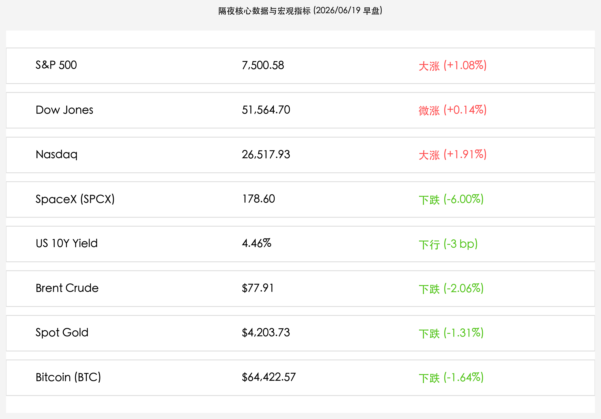

# 美伊和平备忘录落子引爆“风险偏好”：美股全线大反弹纳指狂飙1.9%，油价暴跌黄金走软，SpaceX高位盘整收跌6%

**日期：2026年06月19日 (星期五)** &nbsp; **时段：早报 (常规交易日复盘)**

> **核心摘要**：隔夜全球市场迎来历史性地缘局势转折，美伊签署和平谅解备忘录（MOU）决定结束敌对状态并重开霍尔木兹海峡，促使原油市场的地缘风险溢价瞬间崩塌，Brent原油暴跌2.06%至77.91美元。地缘危机的解除极大地提振了市场“风险偏好”，推动美股三大股指全线大反弹，纳斯达克指数狂飙1.91%。然而，美联储鹰派利率指引继续打压非股资产，现货黄金因利率走强预期下跌1.31%至4,203.73美元，比特币延续跌势收至64,422.57美元。SpaceX在经历连续大涨后遭遇获利了结，收跌6.00%报178.60美元。

## 核心行情复盘

今日隔夜美股与欧洲主要指数受地缘和平红利推动全线走高，科技成长股大幅反弹，仅资源类资产与避险资产因资金流出而承压：

*   **美股三大股指全线大幅反弹**：纳斯达克综合指数领涨 **1.91%**（上涨 496.28点），收报 **26,517.93点**，科技龙头股重夺主导地位；标普500指数收盘上涨 **1.08%**（上涨 80.48点），报 **7,500.58点**；道琼斯工业平均指数微涨 **0.14%**（上涨 72.15点），报 **51,564.70点**。
*   **SpaceX 高位盘整与获利回吐**：前期暴涨的硬科技图腾 **SpaceX (NASDAQ: SPCX)** 遭遇阶段性获利回吐，收盘下跌 **6.00%**，报 **178.60美元**。承销商（高盛、摩根士丹利等）已完全行使超额配售选择权，显示其长线结构支撑强劲，高位回调属于健康的筹码清洗。
*   **地缘溢价崩塌导致原油价格暴跌**：因美伊签署和平协定及重开霍尔木兹海峡，**Brent原油**下跌 **2.06%**，报 **$77.91/桶**；**WTI原油**下跌 **2.33%**，报 **$75.00/桶**，地缘避险资金迅速从大宗商品中撤出。
*   **鹰派美联储打压黄金与数字资产**：由于美联储沃什利率决议点阵图暗示年内仍有加息空间，美元维持强势，**现货黄金 (Spot Gold)** 收盘下跌 **1.31%**，收报 **$4,203.73/盎司**；**比特币 (BTC)** 承压下行 **1.64%**，报 **$64,422.57**。
*   **美债收益率温和下行**：**美国10年期国债收益率**下降 3 个基点至 **4.46%**，表明地缘避险资产重组与央行鹰派防线在长端国债定价上形成对冲。
*   **欧洲市场普遍收涨**：德国 DAX 40 指数上涨 **0.68%**，收报 **25,104点**；欧洲斯托克 50 指数上涨 **0.55%**，收报 **6,342点**；仅英国富时100指数 (FTSE 100) 受重仓能源与采掘股拖累，下跌 **1.04%**，收报 **10,400点**。
*   **板块表现与资金动向**：
    *   **领涨/抗跌行业**：半导体、AI软硬件、超大型科技蓝筹领涨，资金从大宗商品和防御性行业流入高成长板块。
    *   **领跌板块**：油气勘探开采、黄金采掘等资源板块跌幅居前；公用事业与日常消费品等传统防御行业在风险偏好回升中遭遇资金抽水。

## 核心解读与市场逻辑

> **美伊“和平红利”落子，风险偏好引燃权益市场**
> 
> 隔夜市场的绝对主线在于美伊两国签署和平谅解备忘录（MOU），决定终止为期110天的冲突并重开霍尔木兹海峡。这一重磅地缘政治解套，迅速消除了全球能源供应链和航运咽喉的致命尾部风险。地缘风险溢价的崩塌促使原油暴跌，而在大宗商品和防守性避险资产中盘踞的跨国套利资本开始大规模流出，重新投入到具有成长活力的美股与欧洲权益资产中，纳指狂飙近2%便是风险偏好报复性反弹的最佳写照。

> **美联储鹰派幽灵犹存，非股/无息资产承压**
> 
> 尽管“和平溢价”让股市迎来狂欢，但现货黄金和比特币等非股资产表现明显背离。其核心逻辑在于，美联储前一日公布的偏鹰点阵图（暗示年内加息一次的可能性上升）威力依然未减。新任主席凯文·沃什建立的鹰派防线对分母端起到了系统性支撑，导致美元维持强势。在无风险利率居高不下且风险资产回暖的情况下，缺乏利息回报的黄金（大跌1.31%至$4203.73）和高 Beta 的比特币首当其冲，沦为资金调仓的提款机。

> **SpaceX $180 关口蓄势：健康的筹码清洗与超额配售保驾**
> 
> SpaceX（SPCX）收跌 6.00% 回落至 178.60 美元，这主要是此前连续多日暴涨、筹码结构不稳所带来的获利了结行为。从基本面看，承销商高盛与大摩全面行使超额配售选择权（Greenshoe Option），预示着机构对于其世纪 IPO 核心主线（商业航天霸主与 Starlink 现金牛）的稳健认同。目前的盘整不仅不是牛市的终结，反而是挤出短线跟风盘、夯实 $180 底座的健康表现。

## 政策脉动

*   **美伊签署历史性和平谅解备忘录**：美国总统特朗普与伊朗总统佩泽什基安达成 60 天停火谅解备忘录，包括终止港口海军 blockade 并逐步释放霍尔木兹海峡的商业通航。虽然未来在伊朗核计划等核心议题上仍有 60 天的艰苦谈判期，但短期内将大幅释放国际海运压力，油价随之回落。
*   **美联储沃什鹰派通胀防线维持强硬**：FOMC updated dot plot 的影响继续在债市和外汇市场发酵。联储主席沃什在闭门研讨会中再次强调，地缘缓和有助于降低大宗商品对供应链通胀的冲击，但美国国内服务业和粘性通胀依旧需要保持“高利率足够长（Higher for Longer）”的防御立场，夯实了强美元基调。

## 最新机构观点

*   **高盛 (Goldman Sachs)**：**“全球正进入以AI、国防与能源基建为主的 capex-heavy（重资产开支）时代”**。高盛研究部表示，美伊地缘政治解套在短期内压低了油价，有助于缓和通胀，但在美联储坚守鹰派防线下，传统的“轻资产、低利率估值扩张”模式将发生转变。投资者应将资金向半导体、电力电网、国防工业和先进制造等具有坚实核心业务能力的板块集中。SpaceX (SPCX) 在 180 美元以下为长线耐心资本提供了极佳的逢低布局窗口。
*   **摩根士丹利 (Morgan Stanley)**：**“地缘局势好转引发资金回流科技，维持标普500年终8000点目标不变”**。大摩首席策略师认为，在分母端利率压力部分消化后，市场的重心正迅速回归企业基本面。AI 基础设施（半导体与光通信网络）依然是最清晰的增长方向，其当前的估值尚未失控。大摩建议，短期回调并非牛市终结，而是良性的重新估值，应继续持有核心科技资产与自由现金流强劲的数字基建龙头。
*   **中金公司 (CICC)**：**“外部风险缓和提振亚太成长股信心，A股/港股将展现自主安全主线韧性”**。中金公司指出，美伊停火和美股大涨有助于平抑亚太资本外流担忧。下周随着国内端午节假期休市及 5 月宏观数据密集出炉，市场将迎来国内基本面验证。在外部流动性环境边际稳定的背景下，国内政策支持力度不减的半导体国产替代、商业航天及先进工业出海企业，有望走出更具韧性的防守反击行情。

## 今日市场情绪：和平曙光与数字资产的重力拉扯

> Prompt: Surrealism style, In a serene, dreamlike ocean representing the reopened Strait of Hormuz, a majestic stone bridge arches over calm, shimmering blue waters. A colossal white merchant vessel sails smoothly under the bridge, while oil drums below leak black crude oil that dissolves into glowing green water lilies, symbolizing falling oil prices. In the sky above, a massive golden key representing the peace agreement unlocks a glowing crimson gateway, letting warm golden light flood a floating futuristic silicon city with soaring green towers. In the foreground, a giant stone sundial has its shadow cast on the sand. Beside it, a model of a SpaceX Starship rests on a launching pad, tilted slightly downward. No humans., masterpiece, high detail, intricate composition, cinematic lighting, 8k resolution

---

免责声明：内容仅供参考，不构成投资建议。
