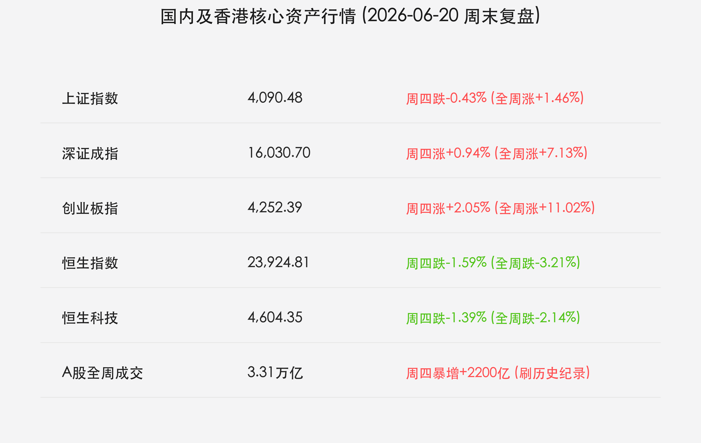
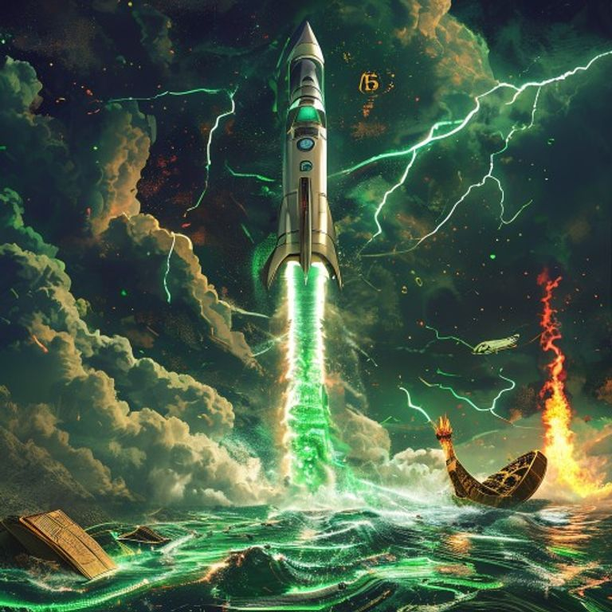

# 国内及香港市场周度复盘：A股三万亿成交铸就硬科技丰碑，外围利率风暴与地缘变局再掀波澜

**日期：2026年06月20日 (星期六)** &nbsp; **时段：下午 (国内市场周末复盘)**

> **核心摘要**：本周全球金融市场在中东地缘变局、SpaceX世纪IPO以及中国资本市场重磅改革的多重力量共振下剧烈震荡。A股在陆家嘴论坛深化科创板改革的组合拳刺激下，周四爆发 **3.31万亿元** 的史诗级成交纪录，科创50与创业板全周分别狂飙及大涨，铸就中国自主安全硬科技的估值丰碑；然而港股受外围紧缩预期拖累创年内新低。周五因美伊瑞士会谈意外取消地缘警报重燃，原油价格暴涨，而黄金与加密货币由于避险仓位踩踏与强美元压制双双重挫。

## 核心资产周度/日度表现回顾

本周（6月15日-6月19日）全球金融市场呈现极致的“冷热不均”与行情分化。国内市场在端午假期前迎来流动性史诗级井喷，而外围市场由于节假日休市以及地缘停火变卦，在非股资产中掀起资金出清风暴：

*   **A股硬科技板块傲视全球**：截至周四收盘，**上证指数**收报 **4,090.48点**，周四跌0.43%，全周累计上涨 **+1.46%**；**深证成指**收报 **16,030.70点**，周四涨0.94%，全周累计大涨 **+7.13%**；**创业板指**收报 **4,252.39点**，周四涨2.05%，全周累计狂飙 **+11.02%**，创下近年来最大单周涨幅。代表科创精锐的**科创50指数**收报 **1,911.51点**，周四暴涨 **3.84%**，创历史新高。
*   **A股成交额打破历史纪录**：周四全天沪深两市合计成交额达 **3.31万亿元**，刷新了中国股市创立以来的历史单日成交最高纪录，表明增量耐心资本与活跃资金正加速入场。
*   **港股市场深幅回调创年内新低**：受美联储沃什偏鹰态度及外资离岸流出压力打压，**恒生指数**收报 **23,924.81点**，周四跌1.59%，全周累计大跌 **-3.21%**；**恒生科技指数**收报 **4,604.35点**，周四跌1.39%，全周累计下跌 **-2.14%**。
*   **全球主要资产（截至周五收盘）**：
    *   **标普500指数**：收报 **7,500.58点**，周五休市，全周累计上涨 **+0.93%**；
    *   **纳斯达克指数**：收报 **26,517.93点**，周五休市，全周累计上涨 **+2.43%**；
    *   **SpaceX (NASDAQ: SPCX)**：作为全球硬科技图腾，收报 **178.60美元**，周五休市，全周累计大涨 **+10.97%**；
    *   **布伦特原油**：收报 **$80.04/桶**，周五大涨 **2.73%**，因周末谈判停摆地缘供应担忧复燃，收复80美元关口；
    *   **伦敦现货金**：收报 **$4,126.50/盎司**，周五暴颠 **1.84%**，全周累计下跌 **-2.12%**，避险多头筹码出现踩踏式去杠杆；
    *   **比特币 (BTC)**：收报 **$63,018.00**，周五大跌 **-2.18%**，全周累计下跌 **-0.84%**。

## 过去 48 小时重磅事件深度复盘

1.  **美伊瑞士技术磋商突发触礁，油价重回“战时溢价”**：原定于19日在瑞士卢塞恩举行的美伊停火及海峡通航第二阶段技术性会谈因以色列与黎巴嫩边境局势骤然升级而被迫取消。这使得此前因美伊签署和平谅解备忘录（MOU）而大幅剥离的地缘风险溢价卷土重来，布伦特原油在端午假期首日暴涨2.73%，大宗商品供应链重建前景再度蒙上阴影。
2.  **强美元与去杠杆双重绞杀，黄金与比特币遭“抽水”踩踏**：美联储主席沃什强硬的“Higher for Longer”利率态度令美元指数维持强势，叠加密约停摆导致的“停火套利”避险仓位多头大举撤出，缺乏回报利息的黄金遭遇资金严重“抽水”暴跌近2%；比特币同样受海外ETF净流出和63,000美元整数关口清算压力拖累震荡下行。
3.  **陆家嘴论坛新政引燃中资“硬科技估值脱锚”行情**：证监会宣布一系列旨在深化科创板改革的政策，明确支持人工智能大模型、商业航天、特种半导体等具备核心自主可控属性的硬科技企业利用第五套标准上市。这彻底理顺了国内耐心资本对分子端科技溢价的定价模型，直接造就了A股周四3.31万亿天量成交和创业板、科创50指的独立狂飙行情。

## 下周全球宏观大事预警

下周将步入6月下旬，临近月中及半年末节点，市场流动性再平衡与政策落地将迎来关键验证期：

*   **6月22日 (周一)**：**中国最新一期LPR报价公布**。在5月社融见底、外储大增以及央行外汇管理等暖风频吹的背景下，市场高度关注1年期和5年期以上LPR是否有进一步下调空间，以加速内需企稳及实体宽信用进程。
*   **6月23日 (周二)**：**全球6月制造业/服务业PMI初值发布**。欧美主要经济体将集中公布标普全球PMI数据，为验证二季度全球经济活力以及高息环境下海外衰退风险提供最直接的一手前瞻。
*   **6月25日 (周四)**：**美国5月PCE物价指数、GDP三季终值及日本CPI公布**。PCE作为美联储首选的通胀指标，其数据高低将直接决定联储主席沃什下半年的“鹰鸽倾向”，亦为全球债市分母端收益率定价一锤定音；日本CPI则将再度考量日央行在加息关口前的底牌。

## 顶级机构周末策略内参摘要

*   **中信证券**：**“3.31万亿成交划定时代底座，A股硬科技迈向估值重构主线”**。中信证券认为，本周A股市场凭借陆家嘴论坛新规，开启了脱离外围紧缩制约的自主独立行情。3.31万亿元的历史天量换手，彻底完成了科创和双创筹码的防守向进攻大转进。端午节后的短暂休整反而是长线耐心资本极佳的建仓契机，坚守人工智能算力、半导体国产替代及商业航天链条。
*   **中金公司 (CICC)**：**“服务消费复苏夯实基本面，坚守科技自主安全与离岸防波堤”**。中金公司指出，国内服务消费增速显著，端午旅游及成品油价大降有力刺激了假市内需。虽然港股受海外资金撤出压力创年内新低，但央行在上海等自贸区的离岸人民币外汇直接交易试点提供了扎实的汇率防波堤。节后建议维持杠铃配置，一端布局高ROE红利白马，另一端超配拥有关键定价权的深科技资产。
*   **高盛 (Goldman Sachs)**：**“地缘爆雷挤出避险投机水分，黄金已现性价比极高配置坑”**。高盛大宗商品团队表示，黄金跌破4130美元已经挤出了前期过度拥挤的地缘套利杠杆，在美伊谈判反复和全球央行多元化储备刚需的长期逻辑下，当前点位提供了强有力的边际安全垫。此外，地缘冲突对油价的托底有助于限制未来全球通胀的尾部风险，继续建议逢低战略超配实物黄金与SpaceX等流动性溢价硬资产。

## 今日市场情绪：狂飙的星际征途与地缘雷雨

本周全球市场情绪在 SpaceX 世纪 IPO 财富效应与地缘反转的激烈博弈中呈现出冰火交融 of 超现实张力。

> Prompt: Surrealism style. Subject: A giant futuristic silver rocket with the SpaceX logo soaring vertically into a golden starry sky, leaving a trail of glowing green silicon chip trails. Background: Below, a massive traditional Chinese dragon boat made of green circuits races on a wild river of binary code. In the distance, a dark storm cloud gathers on the left, with lightning striking cracked gold bars and a cracked Bitcoin coin, while on the right, a towering oil torch burns with bright red flames. No text, masterpiece, high detail, intricate composition, cinematic lighting, 8k resolution

---

免责声明：内容仅供参考，不构成投资建议。
