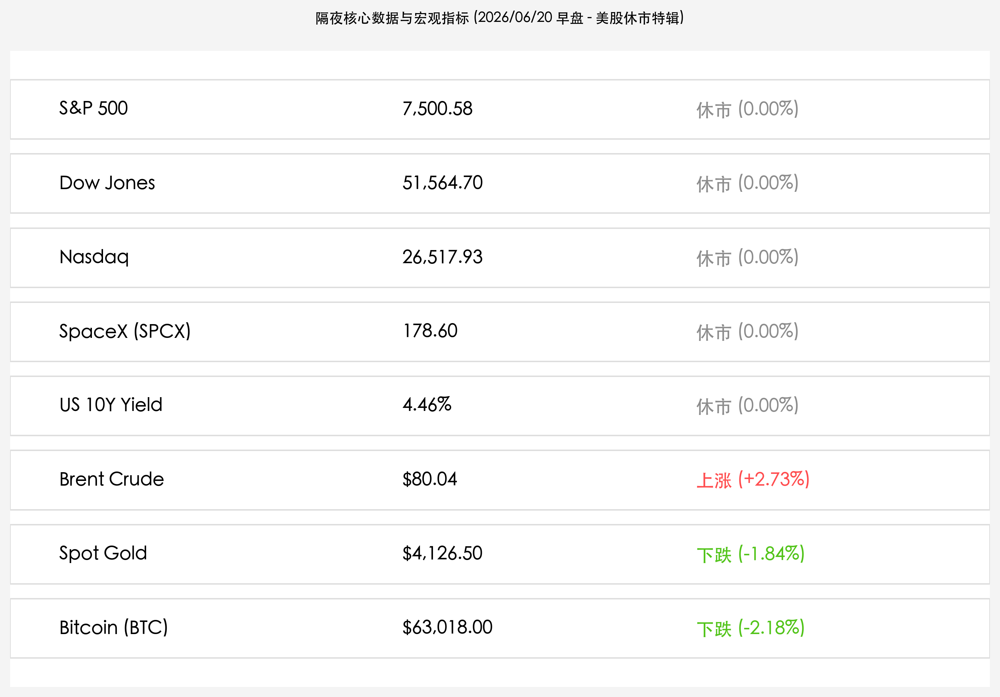
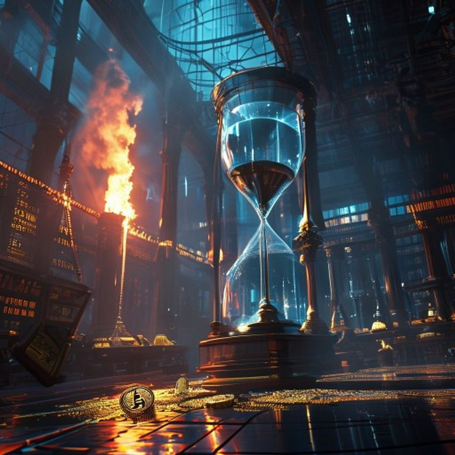

# 美股六月节休市交投清淡：地缘谈判取消引爆油价狂飙，黄金与加密资产遭遇剧烈“抽水”

**日期：2026年06月20日 (星期六)** &nbsp; **时段：早报 (常规交易日复盘)**

> **核心摘要**：隔夜全球市场因美国“六月节”联邦假期休市，整体交投偏于清淡。然而，受黎巴嫩边境冲突升级导致美伊原定于19日在瑞士卢塞恩举行的技术性和平会谈意外停摆影响，地缘供应担忧复燃，推动布伦特原油大涨2.73%重回80.04美元。与此同时，地缘谈判的遇阻引发了避险资金在非股资产内部的剧烈震荡与重新定价，伦敦现货黄金大跌1.84%至4,126.50美元，比特币受美联储鹰派情绪与资金流出双重打压下跌2.18%至63,018.00美元。美债与美股指数则全天处于休市状态。

## 核心行情复盘

今日隔夜美股休市，欧洲及国际大宗商品在美伊会谈突发触礁的背景下出现剧烈波动，原油大反弹，金市与币市则明显承压：

*   **美股三大股指与SpaceX休市**：由于美国“六月节”联邦假期，美股市场（包括 NYSE 和 NASDAQ）休市一日，三大股指与新近挂牌上市的硬科技旗舰 **SpaceX (NASDAQ: SPCX)** 均维持前一日收盘点位（标普500报 **7,500.58点**，道指报 **51,564.70点**，纳指报 **26,517.93点**，SpaceX 报 **178.60美元**）。
*   **美债收益率持平**：美国10年期国债收益率因债市休市，继续收报 **4.46%**。
*   **地缘局势突变推动油价强劲反弹**：原定于瑞士举行的美伊第二阶段和平谈判因黎巴嫩边境局势恶化意外取消，地缘供应警报再度拉响。**布伦特原油**收盘大涨 **2.73%**，报 **$80.04/桶**，重回80美元整数关口之上。
*   **避险资产踩踏导致黄金大幅走低**：受美伊谈判触礁以及强美元压制的双重夹击，前期获利的多头避险筹码发生踩踏出清。**伦敦现货黄金**收盘下跌 **1.84%**，报 **$4,126.50/盎司**。
*   **加密市场震荡下行**：受避险情绪收缩与资金抽水影响，**比特币 (BTC)** 承压下跌 **2.18%**，价格收于 **$63,018.00**，多头防线再度面临大考。
*   **欧洲市场微幅震荡**：德国 DAX 40 指数全天收涨 **0.37%**，收报 **25,196.72点**，呈现出在美股休市期间的避风港抗跌韧性。

## 核心解读与市场逻辑

> **美伊停火谈判突发受阻，原油重回“战时风险溢价”**
>
> 隔夜国际大宗商品市场的剧烈波动，源于地缘政治层面的超预期逆转。前一日因美伊签署和平谅解备忘录（MOU）重开霍尔木兹海峡而一度下行的原油价格，在瑞士技术会谈意外宣告取消后，地缘风险溢价迅速卷土重来。虽然双方仍表态保留60天的谈判窗口期，但黎巴嫩边境局势的升级让原油空头筹码迅速出逃，布伦特原油在短时间内报复性大涨2.73%，重新站上80美元大关，这反映出市场在脆弱的供应节点上仍旧遵循“战时定价”逻辑。

> **强美元与地缘杠杆出清，黄金与比特币沦为资金“提款机”**
>
> 在原油大涨的同时，黄金与比特币的双双下挫体现了非股/无息资产内部资金去杠杆的踩踏。其逻辑有二：第一，美联储前任主席沃什主导的鹰派点阵图威力仍在发酵，高企的无风险收益率与强美元让缺乏利息回报的黄金面临沉重的估值阻力；第二，美伊谈判取消导致此前堆积的“停火套利”和避险的多头仓位发生了踩踏式获利了结，资金在无美股流动性承接的情况下，从金市与币市大幅流出。比特币跌破63,000美元大关，也主要是由于海外ETF净流出和高杠杆仓位爆仓所致。

## 政策脉动

*   **美伊瑞士技术磋商因地缘摩擦升级意外取消**：原定于19日在瑞士卢塞恩比尔根山举行的美伊技术会谈宣告取消。白宫方面对外声称因副总统万斯“后勤安排问题”推迟，但外交消息指出伊朗方面因不满以色列在黎巴嫩境内的军事行动决定暂缓派遣代表团。这一政治摩擦让原本乐观的全面停火预期遭遇当头一棒，也预示着后续60天的谅解备忘录执行期将充满反复。
*   **美联储沃什强硬利率态度限制分母端改善**：在美股休市期间，债市投资者依然对美联储近期的鹰派言论保持警惕。联储决策层再次表态，即使大宗商品地缘通胀压力得到阶段性释放，核心服务业粘性依然需要维持“Higher for Longer”的利率环境，对黄金和加密资产的流动性环境构成长线压制。

## 最新机构观点

*   **高盛 (Goldman Sachs)**：**“地缘谈判触礁带来短期避险资产出清，黄金已现中线配置价值”**。高盛大宗商品研究团队表示，虽然美伊停火谈判突发受阻造成了黄金的大幅下挫，但金价回调至 4,126 美元附近已经极大地挤出了前期过度拥挤的避险投机杠杆。随着地缘局势的长期不确定性与全球央行购金需求的刚性支撑，黄金的中线配置价值正重新显现，是长线资金逢低布局的良好窗口。
*   **中信证券**：**“美股休市导致交投平淡，全球资金向高确定性防御主线集聚”**。中信证券策略团队指出，由于美股因联邦假日休市，离岸 A50 指数微跌 0.32% 尽显其作为避风港的抗跌韧性。在端午长假后，市场重心将回归国内 5 月核心经济数据的验证，预计在政策暖风与科技自主的加持下，商业航天及半导体国产替代等中报业绩确定性极高的成长赛道将继续领跑。
*   **中金公司 (CICC)**：**“地缘摩擦不改内需底座，坚守科技安全主线”**。中金公司研究团队分析，外围地缘局势虽有波折，但国内宏观政策底座在十五五“就业优先”规划及央行外汇离岸试点的保驾护航下依然稳健。建议节后布局半导体、商业航天等具有自主可控强属性的“硬科技”先锋，把握中报业绩高景气度。

## 今日市场情绪：节日静谧与外围风暴的超现实碰撞

> Prompt: Surrealism style, A majestic, completely silent trading floor on a holiday, with all overhead screens glowing in a soft, peaceful blue light showing no stock tickers, symbolizing the market closure. Floating in the middle is a giant hour glass, filled with dark glossy crude oil that leaks out at the bottom. To the left, a large scales is heavily tilted, with cracked gold bars and a cracked Bitcoin coin on it, cast under a dark shadow of a thunderstorm cloud with a single bolt of lightning. In the background, a massive towering oil torch burns with intense red flames, casting long dramatic shadows. No people., masterpiece, high detail, intricate composition, cinematic lighting, 8k resolution

---

免责声明：内容仅供参考，不构成投资建议。
