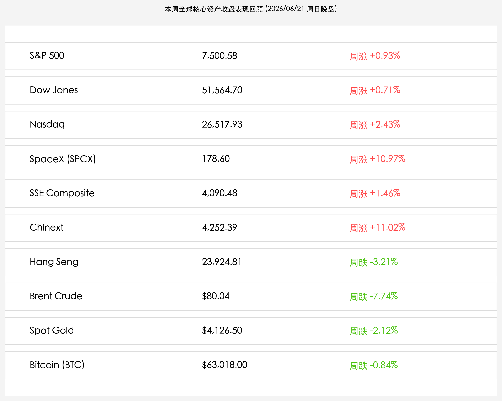

# 全球市场新周展望：美伊卢塞恩海峡谈判博弈入轨，端午后A股迎三万亿天量开局考验，LPR大考与美PCE通胀决战在即

**日期：2026年06月21日 (星期日)** &nbsp; **时段：晚报 (新周展望模式)**

> **核心摘要**：本周末全球市场瞩目的美伊第二阶段瑞士卢塞恩停火谈判在各方斡旋下重回正轨，缓解了此前周五因冲突骤起导致的油价反弹压力，海峡通航预期仍在逐步被市场消化。国内市场方面，端午节假期（6月19日-21日）正式收官，周一（6月22日）A股与港股通将同步恢复交易。在节前创下3.31万亿天量换手及科创改革红利共振后，A股硬科技估值脱锚行情能否在节后第一周延续，将成为国内投资者的核心博弈点。展望新的一周，中国新一期LPR报价落地、美国5月核心PCE通胀数据发布以及瑞士会谈通航细则签约将构成压制或释放全球分母端流动性的三大决战风口。

## 周末财经要闻终极汇总

本周全球资产收盘数据如下，各大核心资产均经历了显著的波动与筹码重组：

> **1. 美伊瑞士卢塞恩会谈惊险重开，多方外交博弈下霍尔木兹海峡通航底线预期未改**
> 
> 原定于19日在瑞士卢塞恩比尔根山举行的美伊第二阶段通航与停火监管技术会谈，因黎巴嫩边境冲突剧烈恶化遭遇紧急喊停，这刺激布伦特原油在周五报复性拉升 **2.73%** 至 **$80.04/桶**。然而在卡塔尔与巴基斯坦等斡旋国的快速穿梭外交下，伊朗代表团已于20日返抵瑞士，美方谈判代表团亦表态将在周日（21日）晚间重新抵达卢塞恩，双方重申将极力挽救60天停火谅解备忘录（MOU）框架，使得海峡通航这一“地缘和平红利”的底线预期仍得以保全。

> **2. A股端午假期结束迎来周一开盘，两市聚焦3.31万亿天量换手后的硬科技独立行情**
> 
> 国内A股市场端午节假期（6月19日（星期五）至6月21日（星期日））休市，期间港股通暂停服务。周一（6月22日）起，A股与港股通将正式恢复开市。节前最后一个交易日，证监会陆家嘴论坛深化科创板改革“连环拳”引爆两市做多热情，双创板块疯狂吸金，创下 **3.31万亿元** 的历史天量成交额。节后资金能否持续向人工智能、商业航天及先进半导体等“硬科技”主权板块靠拢，将决定下半年结构性牛市的右侧斜率。

> **3. 端午小长假服务消费彰显内需韧性，为A股节后消费与红利板块提供底部支撑**
> 
> 假期期间国内铁路出行热度及线下服务消费呈现良性重构与回暖势头，这进一步夯实了二季度内需基本面。结合原油价格全周大跌 **-7.74%** 对中下游企业原材料采购成本的松绑，端午假期的消费韧性将为节后A股传统红利蓝筹及泛消费板块提供扎实的估值防护墙。

## 新一周市场核心博弈逻辑

新的一周（06月22日-06月28日），全球资本市场将面临四个核心博弈主线：

*   **新周LPR报价落地与央行流动性平抑**：明日（6月22日）中国将公布最新一期LPR报价。鉴于6月中MLF与逆回购操作利率依然持稳，且商业银行净息差尚未获得实质空间，市场主流一致预期1年期和5年期以上LPR将分别维持在 **3.0%** 和 **3.5%** 不变。市场重点关注央行是否会通过存单工具或买断式公开市场操作发布平抑半年末结算期流动性波动的额外指引。
*   **美联储沃什时代“Higher for Longer”利率立场与5月PCE决战**：下周五将公布美国5月PCE物价指数（美联储首选通胀指标）。此前凯文·沃什（Kevin Warsh）主导的鹰派底色令市场对降息预期保持克制，10年期美债利率仍在4.55%高位整理。如果受原油周跌8%的传导，5月PCE显示通胀稳步回落，将极大地释放全球股市的估值重力；反之，若PCE数据坚挺，高息压力将迫使全球成长股继续承压。
*   **瑞士谈判最终通航签署时点与海峡运力验证**：下周二至周三是美伊瑞士会谈敲定海峡通航监管细则的关键窗口。霍尔木兹海峡是否能实现完全无阻碍通航，将直接重构三季度全球航运运价与原油供需曲线，影响全球通胀的再定价。
*   **端午节后A股三万亿天量筹码的右侧重组**：节前最后一个交易日两市放出3.31万亿的惊天换手，表明存量博弈与耐心资本在先进制造和商业航天领域完成了筹码的深层大腾挪。节后第一周市场大概率会面临短线的技术性洗盘，资金是继续维持硬科技强势还是向高股息红利蓝筹做“杠铃两端”的中庸避险，将成为市场主旋律。

## 本周重磅经济数据与会议前瞻

*   **06月22日 (周一)**：
    *   **中国最新LPR报价公布**（预期大概率按兵不动）。
    *   **端午节后A股及港股通恢复正常开市**。
*   **06月23-24日 (周二至周三)**：
    *   **美伊瑞士卢塞恩会谈实质细则谈判**（聚焦霍尔木兹海峡具体通航保障）。
    *   **加拿大、新加坡、中国香港公布最新CPI通胀率**。
*   **06月25日 (周四)**：
    *   **美国第一季度实际GDP终值、初请失业金人数、5月耐用品订单**公布。
*   **06月26日 (周五)**：
    *   **美国5月PCE物价指数（核心通胀）**公布（美联储政策前景终极试金石）。
    *   **日本东京6月CPI数据**公布。

## 头部券商/投行开盘策略点睛

*   **中信证券 (CITIC Securities)**：**“天量换手确立科创右侧买点，节后若有短线调整是最佳建仓窗口”**。中信证券认为，陆家嘴论坛科创板新规落地，本质上为新质生产力正名并提供了持久的资本溢价保障。节前3.31万亿的换手表明主力资金完成了在半导体、商业航天和自主算力链条上的建仓，节后如有技术性回抽，将是 Patience Capital（耐心资本）积极入场的良机。
*   **高盛 (Goldman Sachs)**：**“油价回吐助力美联储政策松绑，科技成长股龙头仍为超配首选”**。高盛指出，美伊瑞士谈判的惊险重启对原油价格周内大跌8%起到了支撑作用，成功抑制了全球通胀上行风险。尽管在沃什偏鹰执掌下美债利率难言速降，但通胀尾部风险的出清及SpaceX挂牌溢价的释放将支持高估值科技龙头在下周重回大升势。
*   **中金公司 (CICC)**：**“宏观数据验证内需成色，精选反内卷与核心出海龙头”**。中金分析认为，端午期间铁路客流与服务业强韧性验证了内需的结构性温和复苏。在面临下周美国PCE及国内LPR等事件时，离岸人民币防火墙将起效。建议操作上遵循“红利防守+深科技成长”的杠铃组合，坚守可以融入全球供应链的先进通信与特种电子化学品企业。
*   **海通证券 (Haitong Securities)**：**“监管规范净化投融资环境，A股先进制造已构筑扎实估值底”**。管理层整治基金押注赛道等投机乱象，有利于引导资金流向真正具有核心技术攻坚能力的制造业巨头。建议投资者无需过度担忧前期高位板块的短线分化，在右侧可逢低吸纳集成电路、商业航天与高股息能源等硬资产。

## 今日市场情绪：新周的钟鸣与硅基之龙

随着新的一周即将开启，市场情绪在卢塞恩湖畔的和平曙光与中国科技独立行情的共振中，呈现出一幅由古典静谧与科技张力交织的奇幻景象。在日暮转入新周黎明的交接时分，一条由绿红霓虹光纤编制而成的“硅基巨龙”轻盈地缠绕在瑞士卢塞恩湖畔古老的钟楼之上，其躯体中流淌的二进制代码与湖面倒映的微光交相辉映，预示着端午节后A股三万亿成交的澎湃动能即将注入全球流动性。而在远方，雪山在曙光下熠熠生辉，空中浮动的齿轮与数字代码仿佛在为即将落地的LPR报价和美国PCE通胀大考静静倒计时。在这个周日晚间，市场以最瑰丽的科技想象，屏息迎接新周钟声的敲响。

> Prompt: Surrealism style, A giant glowing Chinese dragon woven from green and red neon fiber-optic cables wrapping around a historic stone clocktower on the shore of a quiet Swiss lake. In the background, the snow-capped Swiss Alps are illuminated by a brilliant golden sunrise, with floating silver gears and glowing digital codes in the sky. No humans., masterpiece, high detail, intricate composition, cinematic lighting, 8k resolution

---

免责声明：内容仅供参考，不构成投资建议。
