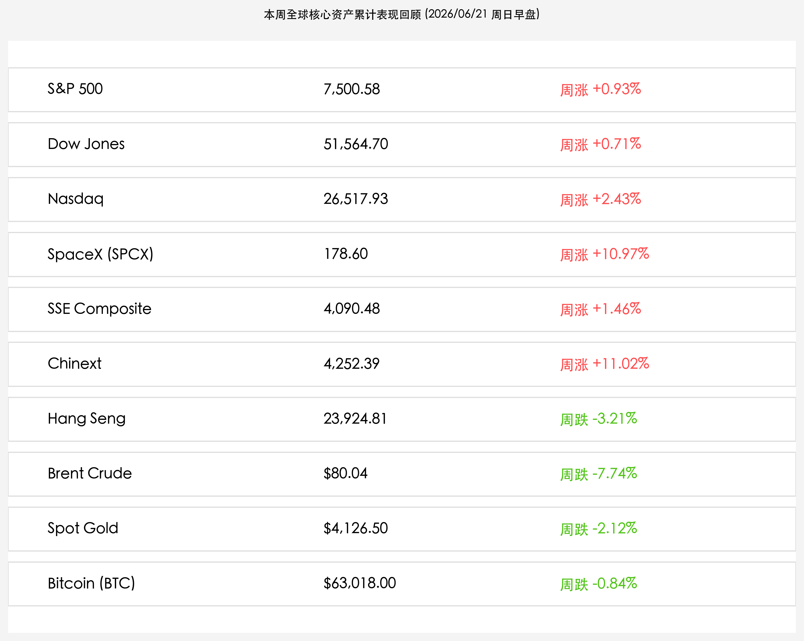
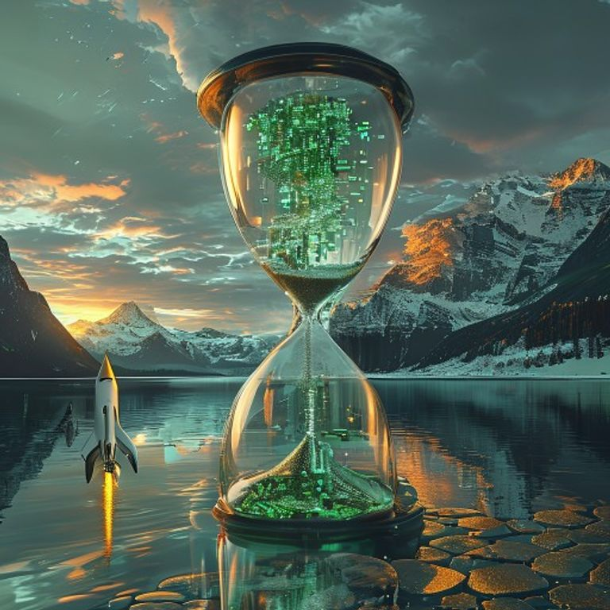

# 全球市场周报（周日晨版）：美伊卢塞恩停火谈判惊险重启，A股科创板天量狂飙树立估值标杆，下周LPR大考与通胀数据决战在即

**日期：2026年06月21日 (星期日)** &nbsp; **时段：早报 (周末复盘模式)**

> **核心摘要**：本周全球金融市场在中东停火博弈重组、SpaceX估值溢价稳固及中国资本市场深化改革的共振中呈现分化加剧的态势。虽然原定于19日在瑞士卢塞恩举行的美伊第二阶段技术性会谈因黎巴嫩地缘局势骤然恶化意外停摆，导致布伦特原油在周五报复性反弹2.73%收报$80.04/桶（全周累计跌幅收窄至-7.74%），但周末多方紧急斡旋促使谈判代表重返瑞士，有望于周日（21日）重启谈判。国内方面，陆家嘴论坛推出深化科创板改革等政策组合拳，引发了中资“硬科技估值脱锚”行情，A股无惧外围利率风暴单日创下3.31万亿的历史天量成交，创业板指全周狂飙11.02%，科创50创历史新高；而港股受外资流出拖累下跌。下周一将公布LPR报价，市场预期大概率将维持不变。

## 核心资产周度/日度表现回顾

本周（6月15日-6月19日）全球核心资产在流动性大腾挪与地缘预期拉扯中表现极端分化。国内A股受强力科创政策利好刺激上演天量独立反攻，美股主要股指在科技世纪IPO财富效应及联邦假期休市的背景下微幅攀升，而黄金、原油和加密货币等非股资产在停火预期的假动作与去杠杆压力下遭遇了宽幅震荡整理：

*   **标普 500 指数 (S&P 500)**：收报 **7,500.58点**，周五休市，全周累计上涨 **+0.93%**，于高位维持坚挺。
*   **道琼斯工业指数 (Dow Jones)**：收报 **51,564.70点**，周五休市，全周累计上涨 **+0.71%**，表现出较强的蓝筹防御属性。
*   **纳斯达克综合指数 (Nasdaq)**：收报 **26,517.93点**，周五休市，全周累计上涨 **+2.43%**，由SpaceX挂牌引燃的科技乐观情绪提供强劲支撑。
*   **SpaceX (NASDAQ: SPCX)**：收报 **178.60美元**，周五休市，作为硬科技估值新图腾，上市第二周表现抢眼，全周大涨 **+10.97%**。
*   **上证指数 (SSE Composite)**：收报 **4,090.48点**，周五因端午假期休市，全周累计上涨 **+1.46%**，成功在4000点整数关口之上构筑扎实底部。
*   **创业板指 (Chinext)**：收报 **4,252.39点**，周五因端午假期休市，全周累计狂飙 **+11.02%**，科创50全周亦暴涨创历史新高，成长龙头获增量耐心资本集中扫货。
*   **恒生指数 (Hang Seng)**：收报 **23,924.81点**，周五休市，全周累计大跌 **-3.21%**，主要承受离岸流动性压力与外资调仓挤压，表现偏弱。
*   **布伦特原油 (Brent Crude)**：收报 **$80.04/桶**，周五当日大涨 **2.73%**，受谈判延期地缘风险重估刺激收复80美元，但由于此前和平备忘录签署，全周累计仍大跌 **-7.74%**。
*   **现货黄金 (Spot Gold)**：收报 **$4,126.50/盎司**，周五大跌 **-1.84%**，全周累计下跌 **-2.12%**，受强美元与地缘备忘录套利盘去杠杆踩踏双重打压。
*   **比特币 (Bitcoin)**：收报 **$63,018.00/枚**，周五大跌 **-2.18%**，全周累计微跌 **-0.84%**，于63,000美元整数关口展开多空拉锯。

## 过去 48 小时重磅事件深度复盘

> **1. 美伊瑞士停火谈判触礁后迎来惊险转机：多方斡旋力求在周日重启**
> 
> 原定于19日在瑞士卢塞恩比尔根山举行的美伊第二阶段技术性磋商（细化通航与停火监管机制），因黎巴嫩边境以军与真主党爆发惨烈武装冲突（造成以军4人死亡及以方随后的大规模空袭）意外宣布推后，美国副总统万斯临时取消了飞往瑞士的行程。这一意外“地缘警报”导致布伦特原油在周五大涨2.73%重回80美元。然而过去24小时局势峰回路转，在卡塔尔和巴基斯坦等中介国的极速斡旋下，伊朗谈判代表团已于20日启程奔赴瑞士，而美国白宫方面也表态万斯副总统最快可能在21日（周日）晚间重新抵达卢塞恩。双方重申保留60天谅解备忘录（MOU）的核心框架，意在极力挽救来之不易的和平红利，使得市场对于海峡重开的底线预期仍未破灭。

> **2. 陆家嘴论坛科创重磅改革组合拳落地，A股上演3.31万亿历史成交惊天大戏**
> 
> 在上周召开的陆家嘴论坛上，证监会等监管机构打出支持新质生产力发展的政策“连环画”，包括明确支持人工智能、特种半导体、商业航天等深科技与自主安全核心企业以更加包容的估值体系和“第五套上市标准”加速登陆科创板。这一政策重塑了国内耐心资本和机构资金的科技风险偏好，直接引爆了双创和科创50板块。周四两市在端午假期前夕创下3.31万亿元的历史天量成交额，科创50暴涨3.84%创出历史新高，标志着中资资产正摆脱外围高息的估值重力束缚，以科技主权为底座走向全面脱锚与重构。

> **3. 偏鹰基调与和平备忘录假动作共震，金市与币市多头筹码惨遭踩踏**
> 
> 在原油大涨的另一面，黄金与比特币在过去48小时出现了显著的多头出清。其逻辑在于：一方面，美联储前任主席沃什主导的“Higher for Longer”利率立场对无息资产形成中线重力挤压，强美元指数居高不下；另一方面，美伊会谈周五因地缘冲突取消，引发了此前大举涌入黄金和加密资产的“地缘套利”和避险投机杠杆仓位发生剧烈踩踏式撤出。黄金由高位下挫至4,126.50美元，比特币失守63,000美元大关，均是在美股假期流动性低迷时被空头资金剧烈“抽水”的表现。

## 下周全球宏观大事预警

下周将进入6月下旬与半年末结算的敏感交水期，全球宏观及利率博弈将面临三场硬仗：

1.  **6月22日 (周一) LPR报价落地**：中国最新一期LPR报价将在明日公布。鉴于6月中旬MLF/逆回购利率依然锚定稳定，且商业银行净息差承压态势尚未实质性扭转，市场主流一致预期6月1年期和5年期以上LPR报价将大概率维持 **3.0%** 和 **3.5%** 不变，市场更多关注央行近期关于存单大额工具等利率平抑机制的指引。
2.  **6月25日 (周四) 美国5月PCE物价指数与GDP三季终值公布**：作为美联储最看重的核心通胀指标，本次PCE的强弱将直接锤炼联储主席沃什下半年的“硬派成色”。在原油全周大跌8%之后，大宗通胀的边际回落能否传导至核心PCE，将是债市收益率分母端能否下行的核心博弈。
3.  **美伊瑞士卢塞恩会谈的最终签署时点与海峡通航验证**：下周二至周三将是谈判代表在瑞士就霍尔木兹海峡重开进行实质通航细则博弈的关键窗口。通航是否能顺利实现，直接决定了全球航运运价与原油价格在第三季度的基本面走向。

## 顶级机构周末策略内参摘要

*   **中信证券**：**“天量换手划定科创安全底座，端午后短暂休整即是黄金建仓期”**。中信证券分析，陆家嘴论坛为硬科技产业提供了最核心的资本溢价定价保障。本周A股3.31万亿的历史天量成交，意味着存量和增量资金在先进半导体、商业航天和自主算力链条上完成了深度建仓与筹码转移。端午节后如有短线技术性回调，将是长线耐心资本逢低布局“硬科技”龙头的极佳右侧买点。
*   **中金公司 (CICC)**：**“服务消费活力夯实内需底座，港股回调后已具备防波堤支撑”**。中金公司指出，端午小长假期间国内铁路出行与服务消费呈现强劲韧性，而原油价格全周大跌也为企业中下游采购成本松绑。虽然港股因外资离岸撤回重挫创年内新低，但上海离岸人民币试点提供了强有力的防火墙。建议在节后采用“红利防守+新质生产力”的杠铃配置，坚守具备底层安全资产的深科技标的。
*   **高盛 (Goldman Sachs)**：**“实物黄金挤出地缘套利杠杆，大宗回调助力美股金发女孩行情”**。高盛大宗商品团队认为，现货黄金重挫至4130美元附近已经将多余的投机溢价出清，在美伊瑞士谈判博弈反复及全球央行多元化配置的长期基座下，黄金再度呈现中线配置的绝对吸引力。此外，原油周跌幅近8%有力限制了通胀尾部风险，将支持美股科技龙头在下周重回大升势。

## 今日市场情绪：瑞士湖畔的微澜与星河破晓

今日市场情绪在瑞士卢塞恩会谈惊险重开与SpaceX世纪IPO大涨的碰撞下，展现出极具现代工业张力与古典静谧共融的超现实隐喻。

> Prompt: Surrealism style, Subject: A giant, semi-transparent hourglass floating over a calm Swiss lake with snow-capped Alps in the background. Inside the hourglass, green microchips flow downwards and dissolve into glowing silver fish at the bottom. On the left shore, a dark storm cloud casts a shadow on cracked golden scales. On the right shore, a bright golden sunrise illuminates a futuristic silver SpaceX rocket ascending into the sky. No text., masterpiece, high detail, intricate composition, cinematic lighting, 8k resolution

---

免责声明：内容仅供参考，不构成投资建议。
