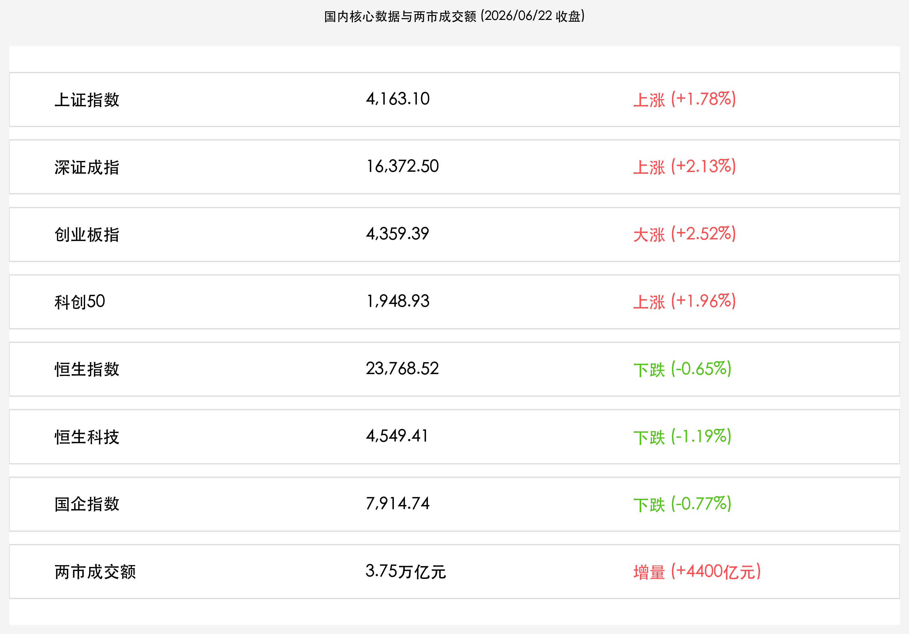

# A股放量大爆发深指大涨超2%，3.75万亿天量成交再创历史第二高峰，大金融全线飙升，港股科网承压走低

**日期：2026年06月22日 (星期一)** &nbsp; **时段：晚报 (常规交易日复盘)**

> **核心摘要**：端午假期后首个交易日，A股市场多空交投热度极速狂飙，沪深两市全天成交额达 **3.75万亿元**，创下A股历史第二高的天量纪录。在今日公布的6月LPR报价维持不变的宏观稳健基调下，非银金融（券商、保险）板块全线爆发掀起涨停潮，推升沪指大涨 **1.78%**，深证成指与创业板指均大涨超 **2.0%**；与之共震的是，前期拥挤的AI硬件科技高位分化回落，资金高低切换明显。而港股则在外围流动性隐忧下高开低走，恒指收跌 **0.65%** 创下新低调整，科网股整体承压，展现出境内外市场估值的双轨分化。

## 核心行情复盘

今日 A 股与港股主要指数呈现出极致的量能爆发与风格分化。A 股在大金融板块的强力拉升下放量暴涨，多只蓝筹及券商股封板，而港股则继续受到外部紧缩货币环境的阴霾笼罩，震荡下行。

*   **A股主要指数放量大涨**：上证指数收盘大涨 **1.78%**（上涨 72.62点），收报 **4,163.10点**；深证成指大涨 **2.13%**（上涨 341.80点），收报 **16,372.50点**；创业板指大涨 **2.52%**（上涨 107.00点），收报 **4,359.39点**。代表硬科技的**科创50指数**亦上涨 **1.96%**（上涨 37.42点），收报 **1,948.93点**，盘中宽幅震荡。
*   **成交额创下历史第二高位**：沪深两市全天合计成交额达 **3.75万亿元**，较假期前最后一个交易日（3.31万亿元）再度暴增 **4,400亿元**，场外资金在端午节后集中涌入。
*   **港股主要指数集体承压走低**：恒生指数收盘下跌 **0.65%**（下跌 156.29点），收报 **23,768.52点**；恒生科技指数下跌 **1.19%**（下跌 54.94点），收报 **4,549.41点**；国企指数下跌 **0.77%**（下跌 61.30点），收报 **7,914.74点**。
*   **行业板块呈现剧烈切换**：
    *   **领涨板块（大金融与上游周期）**：**非银金融（券商、保险）** 领涨全场，中信建投、广发证券、新华保险等多只行业龙头封死涨停，形成强烈的做多共识；此外，培育钻石、有色金属和化工板块表现强劲。
    *   **领跌板块（前期高位科技）**：前期强势的**半导体设备、AI算力硬件**等板块在早盘冲高后发生获利盘回吐，部分热门个股跌幅超 5%，资金高低切换意图显著。

## 核心解读与市场逻辑

> **LPR报价“按兵不动”构筑稳健政策底座，呵护银行息差同时指明高质量信贷导向**
> 
> 今日央行授权公布的6月LPR（1年期3.0%，5年期3.5%）维持原样，完全符合市场理性预期。在前期存款利率调整与银行净息差收缩的极限拉扯下，LPR维持稳定有利于稳定商业银行资产负债表，为即将到来的年中结算期提供流动性安全垫。政策的定力释放出宏观调控“固本培元”的政策底牌，极大增强了场内资金对国内经济良性修复的信心，成为今日大金融板块爆发的逻辑起点。

> **3.75万亿成交再创天量，非银金融起舞见证“耐心资本”与“交易资金”的右侧共鸣**
> 
> 两市创纪录的 3.75 万亿换手说明端午假期积压的交易需求迎来集中爆发。非银金融板块（券商、保险）天量走强通常是牛市中场的风向标，显示出场外增量资本（如中长期险资及公募建仓）正在寻找低估值、高流动性的蓝筹资产作为筹码垫。而前期过于拥挤的半导体设备及AI算力在此关口高位分化，资金完成了一次完美的“防守与进攻”筹码腾挪，使大盘的抗风险弹性显著改善。

> **外部高利率压力未消与香港5年期国债期货上市，港股底部筑底等待流动性右侧拐点**
> 
> 恒指今日高开低走收跌0.65%，科网巨头阿里巴巴、腾讯整体承压，主要仍受到美联储鹰派官员关于“通胀粘性与维持高利率”表态的流动性抽水。但在下跌中，香港启动5年期人民币国债期货以及上海自贸区离岸人民币交易试点的利好逐步发酵，外资利用国债进行风险对冲的渠道全面铺平，将中长期锁定人民币国债的配置红利。港股当前的震荡更像是外部货币紧缩末期最后的压力测试。

## 政策脉动

*   **中国6月LPR按兵不动，体现稳健调控主基调**：中国人民银行授权全国银行间同业拆借中心公布，2026年6月22日贷款市场报价利率（LPR）为：1年期LPR为 **3.0%**，5年期以上LPR为 **3.5%**，均与上月持平。这表明管理层在平抑流动性波动与引导金融机构支持实体经济质效之间，维持了精确平衡。
*   **国务院介绍利用外资“固稳促优”新规**：商务部、国家发展改革委、财政部在国新办发布会上，联合介绍了利用外资“固稳促优”的最新政策红利，涉及扩大高技术制造业外资准入、优化外资企业税收支持等，这为跨境资金流向高端装备及绿色能源等先进制造业扫平了制度障碍。
*   **港美联动金融开放深化，人民币国债期货重磅上市**：香港证监会宣布将正式启动5年期人民币国债期货交易，此举获得两地监管层全力支持。配合首批离岸人民币外汇在上海自贸区试点交易的落地，跨境主权资产定价话语权与风险对冲工具包进一步完善，人民币国际化护城河再次拓宽。

## 最新机构观点

*   **中信证券 (CITIC Securities)**：**“3.75万亿天量见证大盘进入主升浪，大金融爆发为科技主线洗盘构筑安全垫”**。中信证券分析，端午假期后两市大爆发，成交额飙升至3.75万亿的历史第二高，主要是因为LPR报价稳定以及外资“固稳促优”预期吸引了活跃长线资金的入场。券商和保险的集体涨停是极具风向标意义的牛市信号，建议关注低估值金融红利作为防御，同时半导体的技术洗盘是极为珍贵的右侧黄金建仓点。
*   **中金公司 (CICC)**：**“5年期人民币国债期货开启离岸新篇章，长期看好中资银行与高股息大金融”**。中金公司指出，香港推出国债期货以及上海首批离岸外汇交易的顺利进行，是推动资本项下人民币国际化的里程碑事件。中资大型银行作为离岸清算与风险对冲的核心渠道，将显著受益于这一增量市场。操作上建议维持“杠铃策略”，以低估值大金融为底座，适度参与高端算力硬件的超跌反弹。
*   **高盛 (Goldman Sachs)**：**“境内外估值双轨分化持续，港股科技龙头在流动性阵痛中已具备极致性价比”**。高盛指出，虽然恒生指数在外围高利率和科技股获利回吐压制下收跌0.65%，但香港人民币国债期货的上市为跨国套利资金提供了完美的避险通道。当前恒指科网龙头已跌入历史极低估值区间，在下半年度外围流动性拐点明确前，当前的压制反倒为多头策略提供了难得的左侧便宜筹码。

## 今日市场情绪：大金融天量护航与双轨博弈

随着新周首日收盘，市场情绪在两市3.75万亿成交的惊人放量下被彻底点燃。在由无数流光溢彩的绿色芯片与蜿蜒光纤编织成的“科创门廊”上，一条威严的黄金巨龙腾空而起，用强健的身躯紧紧缠绕着散发着数据火花的门柱，代表着A股成交量直冲云霄与科创板的高位回吐；而在门廊的左侧，一尊冷峻的石碑上停歇着一头由纯银打造的机械隼鸟，其略显黯淡的金属羽翼代表着港股科技板块在外围流动性压制下的收敛调整。在门廊中央的正上方天际，一轮代表“贷款市场报价利率（LPR）”的巨大金色圆环高悬于空，散发出沉稳而温暖的光辉，将整片海域的震荡平抑在合理的波动底座之上。两股冷暖色调的博弈力量在超现实主义的画布上相互辉映，精准刻画出了大金融天量保驾护航之下，A股硬科技洗盘与港股离岸资产的底部共舞。

> Prompt: Surrealism style, A giant golden dragon coiling around a massive futuristic archway made of green glowing silicon circuits, symbolizing the A-share market's rise on massive volume. On the left side, a smaller silver falcon representing Hong Kong tech stocks rests on a stone pillar. In the center, a large glowing golden ring representing the Loan Prime Rate hangs steadily in the sky, casting a calm and stable light over the landscape. Background: A serene digital sky with soft green binary data streams flowing like rain. No text., masterpiece, high detail, intricate composition, cinematic lighting, 8k resolution

---

免责声明：内容仅供参考，不构成投资建议。
