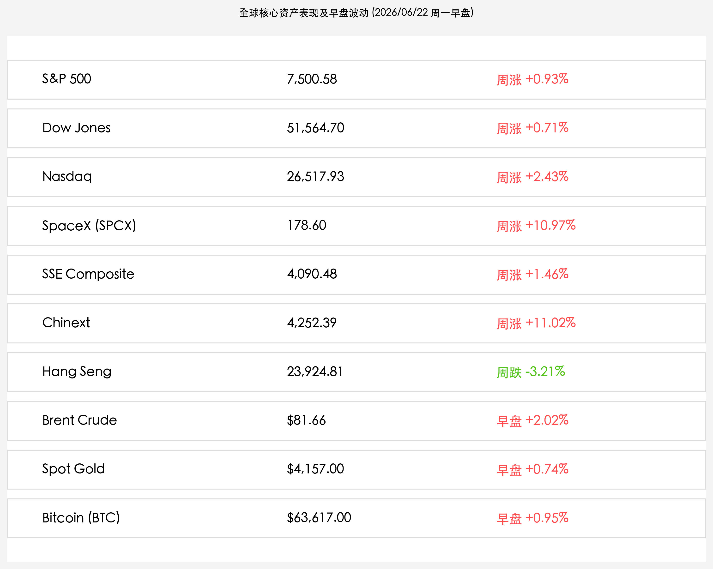

# 全球市场新周展望：美伊瑞士会谈再生波折油价高开，中国6月LPR按兵不动，端午后A股迎三万亿天量开盘考检

**日期：2026年06月22日 (星期一)** &nbsp; **时段：早报 (新周展望模式)**

> **核心摘要**：本周一开盘前夕，全球市场情绪因美伊瑞士卢塞恩会谈突生变数而趋于谨慎。受美方强硬言论影响，美伊首轮会谈在陷入短暂僵局后遭遇抗议性停摆，刺激周一早盘布伦特原油期货高开拉升超2%并触及$82.30/桶。国内市场方面，中国人民银行今早公布6月LPR报价，1年期与5年期以上品种均维持不变，符合市场主流预期。今日A股与港股通在端午假期结束后正式开市，面对节前创下的3.31万亿历史成交天量，科创主线能否在震荡洗盘中延续强韧上行，将是本周国内资金关注的核心博弈焦点。

## 周末财经要闻终极汇总

今日早盘全球核心资产表现及最新变动如下：

> **1. 美伊瑞士首轮会谈因美国强硬表态陷入僵局，地缘博弈再起刺激周一早盘油价金价齐涨**
> 
> 原定于瑞士卢塞恩湖畔比尔根山举行的美伊高级别谈判于21日开启，但因美方代表在核能及地区局势上的强硬言论，引发伊朗谈判代表抗议，伊朗代表团一度暂停谈判并拒绝重返会场。目前卡塔尔与巴基斯坦等中介国仍在紧张斡旋。地缘停火红利预期受阻，刺激周一早盘国际油价与金价大幅走高，布伦特原油一度飙升2%至 **$82.30/桶**，随后整理于 **$81.66/桶**；伦敦现货黄金受避险资金推动涨至 **$4,157.00/盎司**。比特币早盘亦温和回升至 **$63,617.00/枚**。

> **2. 中国6月LPR报价按兵不动，1年期与5年期以上利率分别维持在3.0%和3.5%**
> 
> 中国人民银行授权全国银行间同业拆借中心于今日（6月22日）9:15公布最新一期LPR报价，1年期LPR为 **3.0%**，5年期以上LPR为 **3.5%**，报价与上月持平。鉴于本月MLF操作利率持稳，且商业银行面临净息差收窄与防范资产负债表收缩的双重挤压，LPR维持不变完全符合主流预期，显示出国内央行稳健的政策定力及对半年末流动性的平抑导向。

> **3. 端午假期休市结束，两市聚焦A股节前3.31万亿成交筹码的右侧重组**
> 
> A股端午假期（6月19日至21日）正式收官，今日迎来节后首个交易日。由于节前在陆家嘴论坛科创改革利好刺激下，两市单日创下 **3.31万亿元** 的史诗级天量换手，半导体、商业航天等“硬科技”板块吸金严重，全周创业板指暴涨 **+11.02%**，科创50指数也刷新历史新高。节后第一周资金能否持续向自主成长板块靠拢，抑或向红利避险资产分流，将直接决定三季度市场反弹的右侧结构。

## 新一周市场核心博弈逻辑

新的一周（06月22日-06月28日），全球资本市场将围绕以下三大核心主线展开博弈：

*   **美伊地缘博弈深度拉锯与全球分母端通胀传导**：卢塞恩湖畔的谈判风波使得“霍尔木兹海峡重开”的确定性受损。如果调解方无法在2-3天内促成谈判重回正轨，原油的大幅高开将迅速推高全球大宗商品定价。在美联储沃什鹰派基调之下，通胀隐忧的复燃将令美债利率居高不下，对高估值成长股构成短期压制。
*   **A股节后天量筹码清洗与流动性对冲**：LPR报价落地后，市场将视线转移至央行是否会在本周结算期内追加买断式回购或流动性操作以平抑资金面。节前3.31万亿天量换手意味着多空筹码在科创板块完成了重组，本周大概率面临局部的获利盘洗盘，硬科技龙头的调整幅度将直接测试耐心资本的承接力度。
*   **美国5月PCE通胀大考与美股估值重力测试**：本周五将发布美国5月PCE（个人消费支出）物价指数。在沃什利率立场保持鹰派的背景下，PCE数据的强弱是验证美股分母端重力能否解除的“终极判决”。

## 本周重磅经济数据与会议前瞻

*   **06月22日 (周一)**：
    *   **中国最新LPR报价公布**（1年期3.0%，5年期以上3.5%，均维持不变）。
    *   **端午节后A股及港股通恢复正常开市**。
*   **06月23-24日 (周二至周三)**：
    *   **美伊瑞士卢塞恩谈判走向**（关注卡塔尔、巴基斯坦斡旋下双方是否能重回谈判桌）。
    *   **加拿大、新加坡、中国香港公布最新CPI通胀率**。
*   **06月25日 (周四)**：
    *   **美国第一季度实际GDP终值、初请失业金人数、5月耐用品订单**公布。
*   **06月26日 (周五)**：
    *   **美国5月PCE物价指数（核心通胀）**公布。
    *   **日本东京6月CPI数据**公布。

## 头部券商/投行开盘策略点睛

*   **中信证券 (CITIC Securities)**：**“LPR持平符合息差底线，坚守硬科技调整即是黄金建仓期”**。中信证券认为，6月LPR按兵不动旨在维护商业银行合理息差空间，不影响国内流动性的稳健态势。节前3.31万亿的历史天量换手基本锁定了科创右侧的筹码安全垫，如有受外围地缘局势和周末博弈风波影响的短期技术性低开或回踩，将是耐心资本极佳的建仓契机。
*   **高盛 (Goldman Sachs)**：**“地缘博弈反复推高油价金价，避险防御性配置需适度提升”**。高盛指出，美伊瑞士卢塞恩会谈遭遇停摆使得原油大跌的红利边际受挫，周一早盘原油和金价的拉升反映了资金的防御冲动。若谈判代表在卡塔尔斡旋下未能迅速复会，大宗商品和贵金属将成为对抗降息推迟风险的最佳防御盾牌。
*   **中金公司 (CICC)**：**“杠铃策略优势依然突出，深科技成长与高股息红利均衡配置”**。中金分析，LPR维持不变反映了政策的定力，结合端午消费彰显内需成色，A股面临的外资流动性冲击相对可控。操作上建议继续秉持杠铃配置，以核心半导体、通信自主链条等先进成长为矛，以高股息蓝筹、上游红利资产为盾，以此对冲美伊卢塞恩谈判和美国PCE通胀的不确定性。

## 今日市场情绪：瑞士湖畔的棋局与飞鹰

随着新周开盘，市场情绪因卢塞恩湖畔的谈判风云及中国LPR报价公布而呈现出复杂的多空博弈。

> Prompt: Surrealism style, Subject: A giant, semi-transparent chessboard floating over the serene Lake Lucerne, surrounded by snow-capped Swiss Alps. On the chessboard, a silver eagle and a black falcon are facing each other, while a bright green thread weaves between the chess pieces to prevent them from falling. In the background, a golden ring representing the Loan Prime Rate glows in the morning sky. No humans. No text., masterpiece, high detail, intricate composition, cinematic lighting, 8k resolution

---

免责声明：内容仅供参考，不构成投资建议。
