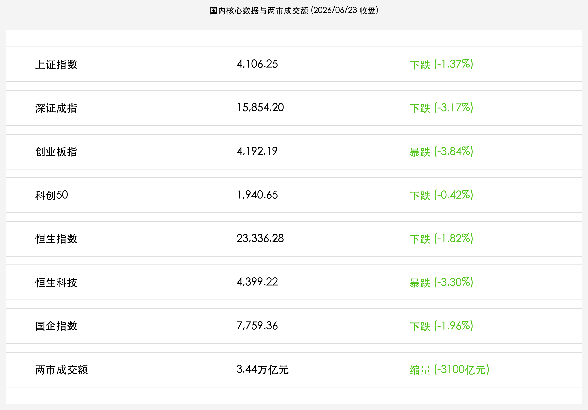

# 韩国股市暴跌触发熔断，A股遭遇估值剧烈洗牌，医药板块逆势掀涨停潮，金融法首审强监管定调

**日期：2026年06月23日 (星期二)** &nbsp; **时段：晚报 (常规交易日复盘)**

> **核心摘要**：今日全球科技股遭遇集中获利回吐压力，韩国股市因监管点名杠杆ETF引发恐慌大跌近10%并触发熔断，拖累亚太市场情绪。A股与港股震荡走弱，创业板指大跌3.84%，前期拥挤的芯片、商业航天和CPO板块遭遇剧烈洗牌；然而，医药生物板块受回购潮 and 行业创新周期支撑逆势爆发掀起涨停潮。《金融法（草案）》今日首度提请全国人大常委会审议，强化金融全面监管，为大盘夯实法治化和防风险底座。

## 核心行情复盘

今日境内外市场呈现显著的分化与调整态势。受美股纳指重挫与周边市场大幅波动的传导，A股与港股科技成长板块遭遇重挫，但大金融板块以及医药防御方向表现出较强韧性。

*   **上证指数**：收报 **4,106.25点**，下跌 **1.37%**。
*   **深证成指**：收报 **15,854.20点**，下跌 **3.17%**。
*   **创业板指**：收报 **4,192.19点**，大跌 **3.84%**。
*   **科创50指数**：收报 **1,940.65点**，下跌 **0.42%**。
*   **恒生指数**：收报 **23,336.28点**，下跌 **1.82%**。
*   **恒生科技指数**：收报 **4,399.22点**，大跌 **3.30%**。
*   **国企指数**：收报 **7,759.36点**，下跌 **1.96%**。
*   **沪深两市全天成交额**：收报 **3.44万亿元**，较前一交易日缩量约 **3,100亿元**。

> **行业板块表现**：**医药生物板块** 今日迎来全面爆发，创新药及中药子板块掀起涨停潮，回购增持潮与基本面修复预期点燃了低位资金的承接情绪；银行与非银金融等大红利板块整体抗跌。相比之下，有色金属（包括工业金属与能源金属）领跌两市，半导体、光伏、商业航天、CPO等前期热门的科技算力板块均出现大幅回调。

## 核心解读与市场逻辑

> **韩国股市雪崩熔断折射科技估值重力，亚太半导体主线联动走弱**
> 
> 周二亚太市场的最强震源来自韩国。韩国综合指数（KOSPI）因存储芯片巨头三星电子、SK海力士杠杆ETF被监管严厉批评，引发量化资金与散户的恐慌性踩踏，盘中大跌超8%触发熔断，最终收跌9.99%。这与隔夜美股纳指大跌1.32%、SpaceX闪崩13.44%的高位获利回吐逻辑一脉相承。高估值的软硬科技板块在季末资金调仓窗口期面临分母端（美债收益率仍居于4.50%高位）与筹码端的多重测试，引发资金在亚太各市场进行剧烈的高低切换。

> **医药生物板块逆势掀涨停潮，高低切换中“防守翡翠盾”成型**
> 
> 在大盘主流方向遭遇抛售的背景下，医药生物（尤其是创新药板块）逆市掀起汹涌的涨停热潮。一方面，创新药产业周期在海内外重磅临床进展及出海授权推动下持续向上；另一方面，二季度以来医药板块迎来密集的上市公司回购和高管增持，展现了极高的估值性价比。在芯片和AI主线短期筹码拥挤、面临全球洗牌的情况下，低估值的医药与红利板块起到了极佳 of the market 资金承接盘作用。

## 政策脉动

*   **《金融法（草案）》首提审议，构建金融全面合规长效机制**：十四届全国人大常委会第二十三次会议今日首次审议《金融法（草案）》。草案明确提出“强监管、防风险、促高质量发展”，将所有金融活动纳入监管。这是金融领域具有统领性、基础性的立法，预计将长期利好大金融板块规范治理，为长期机构资金入市提供坚实法律保障。
*   **消保监管联络会议召开，强化投资者个人信息与产品规范**：金融监管总局联合人民银行、证监会召开了第四次金融消保与投资者保护监管联络员会议，强调跨部门协同共治，推进金融产品营销规范和个人信息保护。
*   **央行逆回购加量对冲，维护季末流动性稳定**：中国人民银行今日开展了5,245亿元7天期逆回购操作，中标利率持平于1.40%，以抚平季末商业银行流动性缺口，支持大盘资金面平稳过度。

## 最新机构观点

*   **中信证券 (CITIC)**：**“金融立法利好长效合规，硬科技细分关注 PCIe 慢通胀环节”**。中信证券策略团队认为，首次提请审议 of the 《金融法》对大金融板块的合规治理及长期资本注入具有里程碑意义。虽然市场短期遭遇全球科技退潮影响，但投资者不必悲观。建议关注AI芯片产业链中具备“慢通胀”特征、技术壁垒高且不易受短期情绪扰动的核心环节，如PCIe Switch等国产配套机会。
*   **中金公司 (CICC)**：**“关注季末调仓换股敏感期，布局医药与高股息红利方向”**。中金分析指出，两市成交额虽回落至3.44万亿，但依然处于牛市级别的超高流动性区间。目前正值半年末调仓换股的敏感节点，前期过度拥挤 of the 硬科技和周期板块释放风险，有助于行情右侧健康发展。建议当前加大对基本面筑底、回购力度大且受政策扶持的医药创新药板块，以及高股息红利股的配置。

## 今日市场情绪：红色退潮与翡翠之盾

随着韩国股市熔断与全球半导体泡沫的高位重置，A股在急剧的高低切换中展现了顽强的本土保护机制。创纪录的医药生物大爆发，正像一块翡翠巨盾般，保护着震荡中的万亿资本。

> Prompt: Surrealism style, A gigantic glass capsule glowing with emerald botanical energy stands firm on a dark, rocky shore. A massive tidal wave composed of cascading red K-line charts crashes violently against the capsule but is repelled by its glow. In the background, a colossal stone gateway representing the 'Financial Law' stands tall under a dark sky, casting a warm golden protective barrier. In the distance, a melting silicon circuit board representing the tech selloff sinks into the sea, emitting green sparks. No humans. No text., masterpiece, high detail, intricate composition, cinematic lighting, 8k resolution

---

免责声明：内容仅供参考，不构成投资建议。
