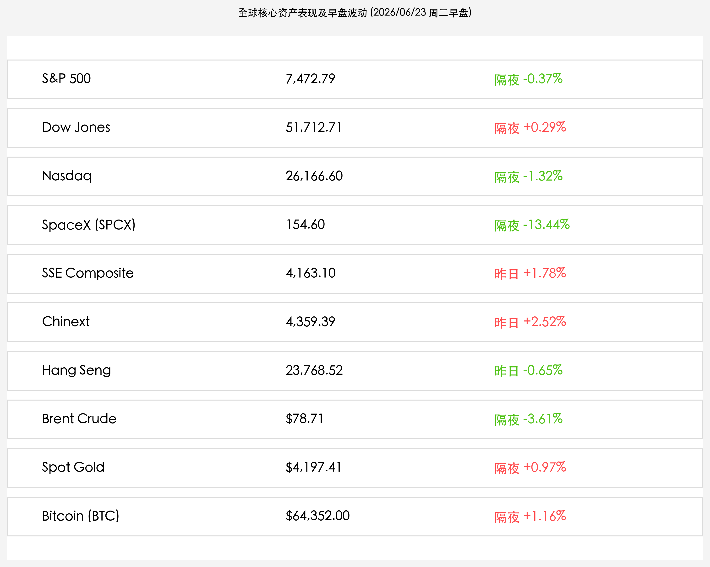

# 美伊停火谈判获重大突破油价大跌，美股休整纳指跌超1.3%，SpaceX闪崩13%高位退潮

**日期：2026年06月23日 (星期二)** &nbsp; **时段：早报 (常规交易日复盘)**

> **核心摘要**：昨日，美伊瑞士卢塞恩会谈在卡塔尔和巴基斯坦的斡旋下取得突破性进展，双方制定了60日内达成协议的路线图并建立航运安全通道，美国财政部发放60日临时伊朗石油销售许可。受此提振，国际原油价格大跌逾3.6%至$78.71/桶，平息了地缘供应担忧。然而，原油的退潮与美债收益率攀升至4.50%的鹰派预期形成对冲，美股隔夜分化整理，纳指在科技股获利回吐压力下重挫1.32%，前期暴涨的SpaceX (SPCX) 遭遇多重负面消息袭击高位闪崩13.44%。今日A股与港股在昨日创纪录的天量爆发后，面临高位震荡与分化重组考验。

## 核心行情复盘

周一（6月22日），国际资产市场在政治面与公司面双重变局下呈现剧烈震荡。美伊停火谈判的意外突破推动油价大幅回落，而美债收益率的攀升以及硬科技龙头的高位暴跌则令成长股面临去估值重力。

*   **标普500指数**：收报 **7,472.79点**，下跌 **0.37%**。
*   **道琼斯工业平均指数**：收报 **51,712.71点**，上涨 **0.29%**。
*   **纳斯达克综合指数**：收报 **26,166.60点**，下跌 **1.32%**。
*   **SpaceX (SPCX)**：收报 **154.60美元**，暴跌 **13.44%**。
*   **布伦特原油**：收报 **$78.71/桶**，下跌 **3.61%**。
*   **伦敦现货黄金**：收报 **$4,197.41/盎司**，上涨 **0.97%**。
*   **比特币 (BTC)**：收报 **$64,352.00**，上涨 **1.16%**。
*   **美国10年期国债收益率**：收报 **4.507%**，较前一交易日继续攀升。
*   **上证指数**（昨日收盘）：收报 **4,163.10点**，大涨 **1.78%**。
*   **创业板指**（昨日收盘）：收报 **4,359.39点**，大涨 **2.52%**。
*   **恒生指数**（昨日收盘）：收报 **23,768.52点**，下跌 **0.65%**。

> **板块表现分析**：美股周一行业分化严重。**大宗商品及防守型蓝筹**表现强劲，推动道琼斯指数小幅收高；然而**科技股权重**遭遇沉重抛压，Alphabet和亚马逊等巨头领跌纳斯达克。最受瞩目的硬科技新股 **SpaceX (SPCX)** 高位闪崩 **13.44%**，不仅触发了硬科技的跟风回吐，也令AI算力等拥挤赛道的资金流出意愿增强。

## 核心解读与市场逻辑

> **美伊谈判超预期进展与临时原油销售许可解封，油价剥离地缘溢价退潮**
> 
> 原定瑞士进行的谈判在几经折腾后终于取得实质成果。双方不仅锁定了60天的谈判时间表以重塑霍尔木兹海峡的安保通道，更得到了美国财政部对伊朗石化产品销售的60天临时赦免牌照。这一极具实质意义的解封举措迅速消退了上周因黎巴嫩地缘冲突所累积的原油“战时溢价”，布伦特原油重挫超3.6%回落至$78.71/桶。随着原油大跌，此前因通胀隐忧复燃而承受巨大分母端压力的估值引力获得部分释放。

> **多重利空袭扰下SpaceX高位闪崩13.44%，引发美股科技主线估值引力测试**
> 
> 新晋上市的航天及AI霸主SpaceX (SPCX) 在昨日出现创纪录的单日暴跌。其主因包括：一是前期狂飙至225美元高点后的猛烈获利抛售；二是公司计划发行 senior unsecured notes 以偿还包括与马斯克旗下xAI挂钩的200亿美元过桥贷款，引发债信稀释隐忧；三是MSCI下调其ESG评级至行业落后者。这一急剧高位回调不仅令该股一度失守155美元关口，也迅速传导至整个纳指的权重科技股（如Alphabet、亚马逊），促使资金在通胀预期顽固（美债收益率升至4.50%）的背景下，加速向避险价值蓝筹切换。

> **3.75万亿天量资金余波荡漾，A股与港股聚焦高低切换后的第二波承接**
> 
> 昨天A股创下历史第二高位成交额，非银金融的全线涨停激活了牛市预期，而高位半导体与科技股则遭遇获利回吐。在隔夜美股纳指重挫、SpaceX闪崩的外围背景下，今日境内外科技成长股开盘必将面临一定的估值压力测试。这提供了一个黄金观察窗口：在昨日天量换手后，获利清洗后的科创龙头是否能在低位吸引耐心资本与长期机构资金的二次入场，是判定大盘行情右侧健康程度的核心依据。

<h2>政策脉动</h2>

*   **美伊谈判路线图出炉，美国临时豁免伊朗石油制裁**：在卡塔尔和巴基斯坦的居中撮合下，美伊代表在瑞士卢塞恩达成最新备忘录，承诺在60天内敲定霍尔木兹海峡货轮通行安全，美财政部随后发放60天期限的伊朗化工及原油出口临时牌照。
*   **美债收益率再度冲击4.50%高位，联储鹰派预期限制估值反弹**：尽管油价暴跌有助于压低未来的通胀预期，但由于美国第一季度实际GDP终值及PCE数据公布在即，市场依然担心沃什领导下的美联储维持高利率的定力，美债10年期收益率在债市交投中攀升至4.507%。

## 最新机构观点

*   **摩根士丹利 (Morgan Stanley)**：**“SpaceX高位退潮是市场流动性紧绷的标志，关注科技重力释放”**。大摩策略团队指出，SpaceX因为债券融资与估值饱受质疑而大跌，象征着前期过热的科创板块估值正面临美债利率维持4.50%高位的“重力测试”。在沃什版鹰派美联储不会急于降息的情况下，投资者应当警惕集中度过高的动量股，并在第三季度初进行均衡化防御配置。
*   **高盛 (Goldman Sachs)**：**“地缘大宗商品溢价虽然退散，但全球能源基本面依然偏紧”**。高盛大宗商品分析师认为，60天的临时豁免极大地平息了近期的原油断供恐慌，导致油价快速跌破80美元关口。但是，中东海域通航的最终协议细节尚未落地，且三季度正值出行旺季，油价在跌破$78后将具备较强的物理需求承接，大宗商品仍是应对中长期粘性通胀的良好盾牌。
*   **摩根大通 (JPMorgan)**：**“科技巨头的利润支撑仍在，大金融是这轮高低切换的安全垫”**。小摩研报分析，虽然纳斯达克在周一因大型科技股及SpaceX的拖累大跌超1.3%，但美国经济二季度成长仍有韧性，科技龙头企业的财报基本面没有恶化。在资金由于美债利率攀升而流出高估值成长股时，大金融及中上游周期股的红利特质形成了完美的资金承接垫。

## 今日市场情绪：和平之羽与坠落之星

随着美伊谈判路线图的发布与SpaceX的巨幅回调，全球市场呈现出“避险资产大换仓”与“硬科技高位重置”的交叠情绪。

> Prompt: Surrealism style, Subject: A peaceful white dove made of glowing blue water vapor carrying a 60-day digital key flies over the calm blue Strait of Hormuz, as the dark oil sea level drops. In the starry sky above, a futuristic silver rocket ship descends, casting red sparks towards a dark mountain ridge. In the background, three floating neon rings representing U.S. stock indices (one golden and ascending, two green-blue and descending) glow behind the clouds. No humans. No text., masterpiece, high detail, intricate composition, cinematic lighting, 8k resolution

---

免责声明：内容仅供参考，不构成投资建议。
