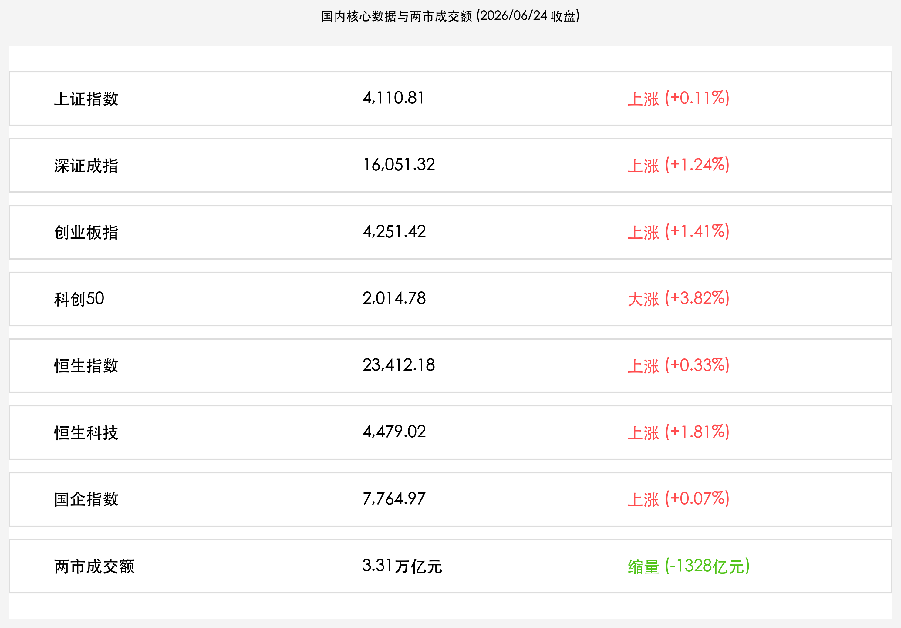
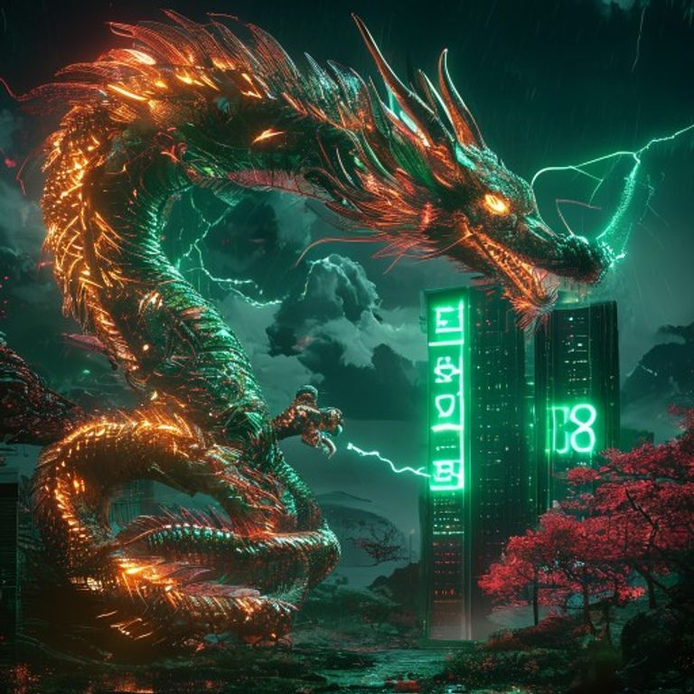

# 芯暴突袭后迎来科技修复，科创50暴涨3.82%领跑，半导体与先进封装掀涨停潮，央行大额逆回购护航流动性

**日期：2026年06月24日 (星期三)** &nbsp; **时段：晚报 (常规交易日复盘)**

> **核心摘要**：今日A股与港股在昨日剧烈洗牌后迎来显著修复，科技成长风格全线爆发。科创50指数大涨3.82%刷新历史新高，半导体产业链（先进封装、存储芯片、HBM）领涨，长电科技等个股涨停，华虹宏力、中芯国际盘中创出新高；创业板指与深成指亦分别上涨1.41%和1.24%。然而，全市场超4000只个股下跌，黄白线撕裂凸显结构性特征。央行今日净投放2422亿元逆回购，有效抚平季末流动性波动。

## 核心行情复盘

今日境内外市场呈现显著的分化与反弹态势。在周边市场震荡余波渐消后，A股与港股科技成长板块迎来强劲修复，特别是科创板与恒生科技指数领涨全场，展现出极强的内生动能。

*   **上证指数**：收报 **4,110.81点**，上涨 **0.11%**。
*   **深证成指**：收报 **16,051.32点**，上涨 **1.24%**。
*   **创业板指**：收报 **4,251.42点**，上涨 **1.41%**。
*   **科创50指数**：收报 **2,014.78点**，大涨 **3.82%**。
*   **恒生指数**：收报 **23,412.18点**，上涨 **0.33%**。
*   **恒生科技指数**：收报 **4,479.02点**，上涨 **1.81%**。
*   **国企指数**：收报 **7,764.97点**，上涨 **0.07%**。
*   **沪深两市全天成交额**：收报 **3.31万亿元**，较前一交易日缩量约 **1,328亿元**。

> **行业板块表现**：今日**半导体产业链**领涨两市，先进封装、存储芯片、高带宽内存（HBM）及PCB概念板块表现极其强势。长电科技、药明康德等个股封涨停，华虹宏力、中芯国际盘中创出新高；有色金属（锂矿等）和CXO（医药研发外包）板块亦涨幅居前。与之相比，影视院线、煤炭、旅游及景区、商贸零售及部分非银金融板块表现低迷，呈现高低切换的防御走势。

## 核心解读与市场逻辑

> **外围半导体风暴过境，国内自主可控与先进封装迎来报复性反弹**
> 
> 昨日韩国股市大跌及美股美光科技走弱引发了全球芯片估值的大洗牌，但在今日，国内资金迅速借道科创板进行承接。以先进封装（Chiplet）、高带宽内存（HBM）以及半导体设备为代表的硬科技主线全线爆发。科创50指数单日大涨3.82%创下历史新高，显示出国内耐心资本对“自主可控”及“算力硬件”高景气度的坚定信心。长电科技、中芯国际等龙头的亮眼表现，表明产业核心竞争力在外部冲击下反而凝聚了更强的买盘共识。

> **全市场黄白线极致撕裂，超4000只个股下跌揭示结构性牛市真相**
> 
> 尽管宽基指数集体收红、科创板狂飙，但今日全市场却有超4000只个股下跌，呈现出典型的“指数大涨，个股普跌”的结构性分化。这反映了季末资金在极高的成交水位下，正向高壁垒、高确定性的头部科技蓝筹及景气赛道（如半导体设备、CXO、锂矿）集中，而缺乏业绩支撑或处于周期下行阶段的边缘板块则被动失血。对于投资者而言，目前行情已从“普涨”过渡到以业绩和行业地位为锚点的“精准持股”阶段。

## 政策脉动

*   **央行大额逆回购操作，单日实现净投放2422亿元**：中国人民银行今日开展了6625亿元7天期逆回购操作，中标利率持平于1.40%。鉴于今日有4203亿元逆回购到期，央行单日实现净投放2422亿元，有效对冲了季末缴税与跨季资金面波动，展现了监管层平抑流动性波动、呵护资本市场稳健运行的明确态度。

## 最新机构观点

*   **国信证券 (Guosen Securities)**：**“先进医疗器械与AI医疗有望共筑新一轮增长曲线”**。国信证券策略团队认为，当前医药医疗行业处于“政策压力出清、创新产品放量、国产升级与出海并行”的阶段，估值性价比优势依然突出。随着半导体算力在生物医药领域的深度应用，AI医疗与CXO（研发外包）正迎来新一轮的技术跃迁和订单回暖，可作为组合中兼具成长性与防守属性的优选配置。
*   **中原证券 (Central China Securities)**：**“关注具备出口与新能源双动能龙头，布局智能驾驶与人形机器人”**。中原证券分析指出，硬科技赛道目前内部轮动加快，建议在半导体硬件大涨之后，适度关注具备新能源和出口双重动能的高端制造龙头。特别是人形机器人、液冷服务器配套以及智能汽车零部件等细分领域，这些方向在前期洗牌后，估值更具弹性。
*   **中金公司 (CICC)**：**“把握高低切换节奏，重点布局先进制造与红利防御资产”**。中金公司指出，两市3.31万亿的成交虽然略有缩量，但整体流动性依旧极其充裕。在外部美联储政策前景不确定以及韩国股市熔断之后，国内硬科技的突围显示出独立的内生韧性。建议投资者采取“哑铃型”配置策略，一方面坚守半导体先进封装、国产算力等核心进攻方向，另一方面增配高股息的大金融与公用事业作为防御底座。

## 今日市场情绪：芯片之火与科技突围

全球半导体风暴过后，国内硬科技产业展现出顽强的自生力量。科创板芯片龙头全线爆发，宛如在暗夜的服务器矩阵中，一条由光纤与微芯片织就的金色巨龙在雷电交加中腾空而起，用绿色的科技护盾庇护着万亿资本安全突围。

> Prompt: Surrealism style, A majestic golden dragon made of glowing microchips and emerald fiber optic cables coiled around a towering server gate, deflecting a storm of dark red digital lightning. In the background, a giant green neon sign displaying '+3.82%' shines brightly in the dark sky, casting a protective green shield over a quiet valley of silicon trees. No humans. No text., masterpiece, high detail, intricate composition, cinematic lighting, 8k resolution

---

免责声明：内容仅供参考，不构成投资建议。
