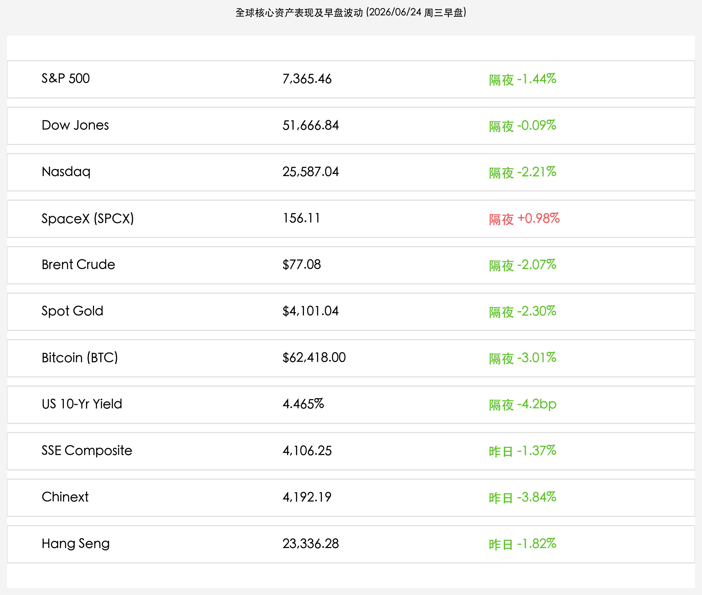
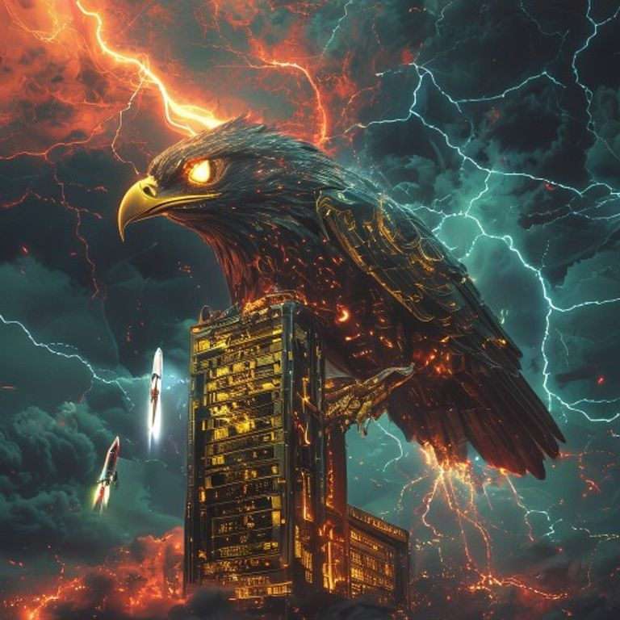

# 美联储新主席“强鹰”定调无指引，芯片风暴突袭纳指重挫2.21%，SpaceX反弹翻红，金价暴跌创近期新低

**日期：2026年06月24日 (星期三)** &nbsp; **时段：早报 (常规交易日复盘)**

> **核心摘要**：昨日，美联储新任主席凯文·沃什以鹰派立场主导市场情绪，不仅在首次FOMC会议后拒绝提供未来的利率指引，更成立工作组着手评估通胀和沟通框架，引发美债收益率高位震荡，美元走强。受此施压，现货黄金暴跌2.30%退守$4,101/盎司大关，比特币下跌超3%下探至$62,418。同时，美光科技暴跌与海力士HBM4减产隐忧引爆半导体风暴，费城半导体指数重挫7.87%，拖累纳指深跌2.21%。在科技股惨遭血洗的背景下，前几日暴跌的SpaceX (SPCX) 在IPO发行价附近迎来抄底买盘，逆势反弹0.98%收报156.11美元。今日A股与港股在昨日遭遇剧烈估值洗牌后，继续承受全球科技成长板块退潮带来的外围压力测试。

## 核心行情复盘

周二（6月23日），国际资产市场在货币政策强鹰转向与半导体行业估值踩踏的双重打击下全线重挫。大宗商品、加密货币与高成长股遭遇集中抛售，唯有部分大飞机、太空新股在暴跌后呈现抵抗性护盘。

*   **标普500指数**：收报 **7,365.46点**，下跌 **1.44%**。
*   **道琼斯工业平均指数**：收报 **51,666.84点**，下跌 **0.09%**。
*   **纳斯达克综合指数**：收报 **25,587.04点**，下跌 **2.21%**。
*   **SpaceX (SPCX)**：收报 **156.11美元**，上涨 **0.98%**。
*   **布伦特原油**：收报 **$77.08/桶**，下跌 **2.07%**。
*   **伦敦现货黄金**：收报 **$4,101.04/盎司**，下跌 **2.30%**。
*   **比特币 (BTC)**：收报 **$62,418.00**，下跌 **3.01%**。
*   **美国10年期国债收益率**：收报 **4.465%**，较前一交易日有所回落。
*   **上证指数**（昨日收盘）：收报 **4,106.25点**，下跌 **1.37%**。
*   **创业板指**（昨日收盘）：收报 **4,192.19点**，大跌 **3.84%**。
*   **恒生指数**（昨日收盘）：收报 **23,336.28点**，下跌 **1.82%**。

> **板块表现分析**：美股周二呈现极端的行业撕裂。受美光科技暴跌及SK海力士HBM4产量调整传闻打击，**半导体板块**沦为重灾区，费城半导体指数狂泻 **7.87%**；特斯拉受抛压大跌超 **5%**，拖累成长股与新能源车板块全线走弱。相比之下，避险资金流向传统价值与防守蓝筹，道琼斯指数跌幅仅 **0.09%**。特别值得关注的是，新股 **SpaceX (SPCX)** 盘中探底后顽强反弹 **0.98%** 收于 **156.11美元**，暂时守稳发行价，显现出一定的低位抄底动量。

## 核心解读与市场逻辑

> **美联储新掌门打破利率惯例，强鹰定调重塑无指引格局，黄金避险溢价大幅被动修正**
> 
> 凯文·沃什出任主席后的强鹰作派令全球债券与商品市场措手不及。在首次FOMC会议后，沃什打破了以往提供明晰年度利率展望的惯例，明确拒绝向市场做出任何利率预期指引，并将工作重心直接转向评估和改革美联储的沟通与通胀管理框架。这让市场预期未来的高利率环境将维持更长时间。伴随美伊谈判达成60天临时协议的红利消褪，黄金本就承压的避险溢价在大涨后迎来被动回踩，金价遭遇单日大跌，现货黄金一度暴跌超2.30%逼近$4,100/盎司关口。

> **半导体风暴闪崩芯片主线，AI硬件高景气疑虑引爆估值踩踏**
> 
> 周二美股最核心的重灾区是半导体。费城半导体指数惊人地重挫了7.87%。暴跌导火索是存储巨头美光科技大幅走弱，同时SK海力士被指调整HBM4的生产节奏以平抑短期过剩，引发量化模型和长线资本对整个AI核心硬件供应链景气度见顶的担忧。这与韩国股市周二熔断下跌9.99%的灾难性盘面达成了跨洋共振，亚太与美股半导体行业联动走弱，大量拥挤在AI算力与芯片封装细分赛道的散户筹码加速出逃，纳指跌超570点。

> **SpaceX宽幅震荡最终守稳150元关口，多空在红筹新股低位激烈拉锯**
> 
> 在全球硬科技狂泻的黑天暗地中，SpaceX (SPCX) 的走势显示出一定的抗震特质。虽然该股在上演三连跌并在周二盘中一度跌破150美元的IPO定价，但低位买盘在此关口附近大量涌现，完成对冲，最终推动股价以+0.98%收盘，报156.11美元。这说明在美债收益率顽固高企、韩国市场发生系统性杠杆踩踏的极端环境下，龙头硬科技在宽幅洗筹后依然获得了核心长期耐心资本的被动承接，接下来该股是否能重新站稳均线将成为判断新股与AI产业链情绪的重要风向标。

## 政策脉动

*   **美联储沃什强推管理改革，收紧宏观流动性底座**：美联储主席凯文·沃什宣布成立沟通、资产负债表与通胀框架五个改革小组，打破以往年度展望利率路径的政策连贯性，向市场投下“高利率常态化”政策阴影。
*   **韩国金融局严查违规杠杆ETF，倒逼跨境投机资金回流**：受周二韩国KOSPI指数遭遇崩跌熔断的后续余波波及，韩国金融监管局表示将联合交易所对科技类高杠杆衍生金融产品进行穿透式审查，重击亚太科技动量盘的杠杆存量，加速美日韩跨境套利资金出逃。

## 最新机构观点

*   **中金公司 (CICC)**：**“沃什新政给全球流动性投下变量，大金融防守逻辑凸显”**。中金海外策略团队表示，美联储新主席不按常理出牌的沟通改革，打破了全球降息周期的政策惯性。在强美元与强美债收益率的双重虹吸下，离岸流动性整体承压，这亦是引发亚太市场震荡的部分背景。在当前时点下，建议国内投资者应加大对高股息红利板块以及刚通过全国人大《金融法（草案）》审议的大金融规范板块的防守配置。
*   **高盛 (Goldman Sachs)**：**“费城半导体大跌并非基本面变天，而是估值在利率高原期的自然收缩”**。高盛半导体研究团队认为，费半暴跌7.87%与HBM4供给疑虑有关，但这仅属于季度级别的生产性优化和库存节奏调整，AI大算力集群的基础建设物理需求并未出现实质性逆转。在大规模回吐后，英伟达、美光以及商业航天新贵SpaceX等核心资产已经具备更高的边际安全垫。
*   **中信证券 (CITIC)**：**“关注外围避险情绪向国内医药和红利资产的溢出效应”**。中信策略指出，半导体风暴与黄金重创导致全球风险偏好急剧降温。在此格局下，A股和港股在经过周二大跌洗牌后，资金的高低切换逻辑可能更加坚决。昨日A股医药生物板块的涨停潮表明市场主力资金正在积极寻找高安全边际和有产业基本面回购支撑的防御性品种，今日国内医药、红利板块的抗跌韧性仍然值得高看一线。

## 今日市场情绪：鹰爪碎晶与孤舟残星

全球半导体风暴与美联储“强鹰”政策对市场造成了毁灭性的冲击。在鹰派美联储打破常规的强力干涉下，科技产业的估值结晶碎裂；然而，在风暴肆虐的夜空深处，SpaceX等硬科技新星仍在低空顽强闪烁，留下一抹不灭的希望红光。

> Prompt: Surrealism style, Subject: A giant mechanical eagle with glowing golden eyes perched atop a high-tech obsidian server tower, its talons crushing a melting golden circuit board. In the background, a massive storm of red digital lightning bolts rips through a dark, cloudy sky. In the distance, a small silver rocket ship is launching into a tiny patch of clear blue sky, carrying a glowing green spark of hope. No humans. No text., masterpiece, high detail, intricate composition, cinematic lighting, 8k resolution

---

免责声明：内容仅供参考，不构成投资建议。
