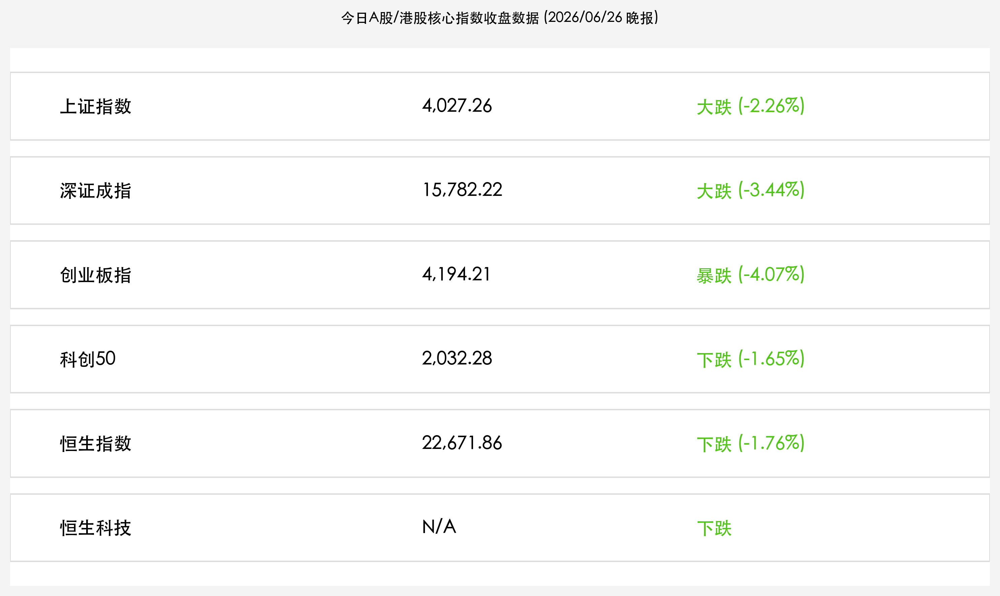

# 半年末多杀多：外部冲击与高位获利共振引爆A股暴跌，创业板重挫4%港股恒指失守22700点，机构呼吁盈利验证主导下半年慢牛

**日期：2026年06月26日 (星期五)** &nbsp; **时段：晚报 (常规交易日复盘)**

> **核心摘要**：2026年最后一个交易周的收官日，A股市场遭遇年内最大单日普跌之一，三大指数全线深度下挫。创业板指暴跌 **4.07%**，深证成指大跌 **3.44%**，上证指数跌穿 4050 点报收 **4,027.26点**。全市场超 4600 只个股下跌，成交额 3.58 万亿元较前一日缩量，呈现典型的"缩量恐慌性下跌"特征。驱动本次大跌的三重共振逻辑清晰：隔夜美股科技股大幅回调引爆全球风险偏好骤降、半年末公私募基金集中结算兑现高位利润，以及前期"二八分化"行情积累的极端拥挤度遭遇多杀多反噬。港股同步深度承压，恒生指数下跌 **1.76%** 失守 22700 点。头部机构普遍认为，此次回调属于健康洗盘，下半年将进入盈利驱动的"结构性慢牛"阶段。

## 核心行情复盘

今日境内外市场全线走弱，A 股科技成长板块首当其冲，港股同步深度回调，市场情绪从上周的亢奋迅速切换至悲观恐慌。

*   **上证指数**：收报 **4,027.26点**，大跌 **2.26%**，失守 4050 点整数关口，成交额 **3.58万亿元**（较前一日缩量），显示下跌为恐慌性踩踏而非主动放量。
*   **深证成指**：收报 **15,782.22点**，大跌 **3.44%**，创近一周最大单日跌幅。
*   **创业板指**：收报 **4,194.21点**，暴跌 **4.07%**，为科技成长板块重灾区，盘中最低触及 4169 点。
*   **科创50指数**：收报 **2,032.28点**，下跌 **1.65%**，凭借较为扎实的基本面支撑相对抗跌，但仍录得明显跌幅。
*   **恒生指数**：收报 **22,671.86点**，下跌 **1.76%**（下跌 405.05点），失守 22700 点，随 A 股同步大幅回撤。
*   **恒生科技指数**：与 A 股科技板块高度联动，显著承压回落。
*   **个股全面溃败**：全市场超 **4600 只个股下跌**，仅约 790 只个股上涨，跌幅超 5% 的个股逾 1200 只，市场宽度极度收窄。
*   **板块高低切换极度鲜明**：
    *   **领跌板块（科技成长全线崩溃）**：通信设备（光通信、CPO）、计算机、有色金属、电力设备、电子（AI 算力链）跌幅居前，前期最强主线板块成为今日重灾区，多杀多效应触目惊心。
    *   **逆势抗跌（防御红利）**：建筑材料、农林牧渔板块逆势收涨，国防军工及房地产获得少量主力资金流入，体现防御切换迹象。

## 核心解读与市场逻辑

> **三重共振：外部冲击 × 半年末结算 × 极端拥挤，科技板块多杀多触发踩踏**
>
> 今日的暴跌是三股力量同时作用的必然结果。第一重，隔夜美股大型科技股（尤其是 AI 算力链相关标的）出现显著回调，全球市场对 AI 资本开支的 ROI（投资回报率）质疑声再起，引发亚太科技股连锁恐慌，日韩市场同步走弱，直接拉低 A 股科技板块的风险偏好。第二重，今日为 2026 年上半年最后一个交易日（6 月 30 日为结算日，26 日为流动性收紧的实质节点），公募、私募基金面临半年末业绩考核压力，主动锁定前期高额账面收益，抛售前期大牛股是机构管理人的普遍理性选择。第三重，此前创业板指年内累计涨幅超 50%，CPO、光通信、AI 算力等细分赛道个股短期涨幅动辄翻倍，筹码极度拥挤。当外部冲击触发第一波恐慌卖盘后，高仓位的量化策略和趋势止损单被集中触发，引发典型的多杀多踩踏——这是技术性下跌的自我强化机制。

> **缩量是关键信号：主动换手而非资金弃场**
>
> 尽管跌幅触目惊心，但全天成交额 3.58 万亿元较前一日 3.31 万亿元仅小幅增加，并未出现成交额大幅放大的"恐慌式出逃"。这一特征表明，今日的下跌是高位拥挤筹码的集中轮换，而非散户或外资的大规模弃场。机构资金在跌停板附近实际上存在一定程度的逢低承接——建材、农牧、国防等板块获资金流入即为佐证。缩量下跌在技术形态上往往预示着调整的阶段性尾声，而非熊市开端。

> **半年末效应在即将结束：下半年盈利驱动的"慢牛"逻辑未变**
>
> 以中信证券、中金公司为代表的头部机构观点高度一致：此次调整是"高位估值消化"的必要过程，而非行情终结。下半年 A 股进入"盈利驱动"的新阶段，届时上市公司中报业绩（7-8 月披露）将成为市场的核心定价锚。国产算力链、AI 应用落地、半导体自主可控等景气赛道的业绩兑现，将为此前估值先行的行情提供坚实的基本面支撑。7 月初随着半年末资金压力消退，市场流动性有望迎来快速修复。

## 政策脉动

*   **证监会科创板新规持续发酵**：上周陆家嘴论坛期间，证监会宣布将科创板第五套标准适用范围扩展至 AI 大模型、量子科技、具身智能等核心硬科技领域，政策红利对科创板的长期估值支撑逻辑未变。今日下跌是技术性回调，不构成对该政策方向的否定。
*   **央行季末流动性护航**：人民银行持续通过大额逆回购向市场注入流动性，有效抑制半年末资金紧张局面恶化。离岸人民币汇率 (USD/CNH) 保持相对平稳，体现跨境资金流入的基本面支撑未发生根本性变化。

## 最新机构观点

*   **中信证券**：**"K型思维主导下半年，'AI+能化'杠铃结构应对波动"**。中信证券认为，今日下跌是 A 股从"建造AI"叙事向"适应AI+盈利验证"叙事切换的必经阵痛。建议投资者以 K 型思维（强者恒强+弱者加速出清）重新审视持仓，进攻端坚守国产算力链、云平台及 CCL/半导体设备等核心景气细分；稳健端配置有色、化工、电力设备等能化领域，以及展望 2026-2027 年处于风险周期尾部的银行板块。短期波动不改中期方向。
*   **中金公司**：**"国际秩序重构×产业创新共振逻辑未动摇，局部高估值需警惕脆弱性"**。中金公司重申，驱动本轮中国资产重估的两大核心逻辑——国际秩序重构与中国产业创新加速——并未因本次回调而改变。但同时提示，当前市场估值整体合理但局部高估现象显著，下半年需防范行情在高位的脆弱性与风险集中暴露，建议投资者对估值明显透支基本面的标的进行适当减配，迎接中报业绩的正式检验。
*   **高盛**：**"盈利驱动阶段正式开启，AI/出海/反内卷三引擎加速盈利增速"**。高盛维持对中国股市的整体建设性看法，强调 2026 年 A 股已正式进入盈利驱动的新阶段。AI 基础设施、"出海"战略的加速落地，以及"反内卷"政策推动的行业集中度提升，是企业盈利增速显著提速的三大核心引擎。高盛在近期个股层面对 AI 算力链、高端制造及电网设备方向持续增持，传递出对核心景气赛道长期看好的明确信号。

## 今日市场情绪：风暴过境，慢牛蓄势

> Prompt: Surrealism style. A massive golden dragon, built from glowing green circuit boards and silicon wafers, is curling downward from a stormy sky made of red falling K-line candlesticks. Its body is partially dissolving into green data particles. In the foreground, a colossal ancient scale is tilting heavily: the left pan bears a glowing AI server tower, now sinking under the weight of a pile of coins labeled 'Half-Year Settlement'. The right pan holds a small seedling of green bamboo, stubbornly growing upward. In the background, the silhouette of the Shanghai skyline is visible through dark storm clouds, with a single beam of golden light breaking through. No humans., masterpiece, high detail, intricate composition, cinematic lighting, 8k resolution

---

免责声明：内容仅供参考，不构成投资建议。
