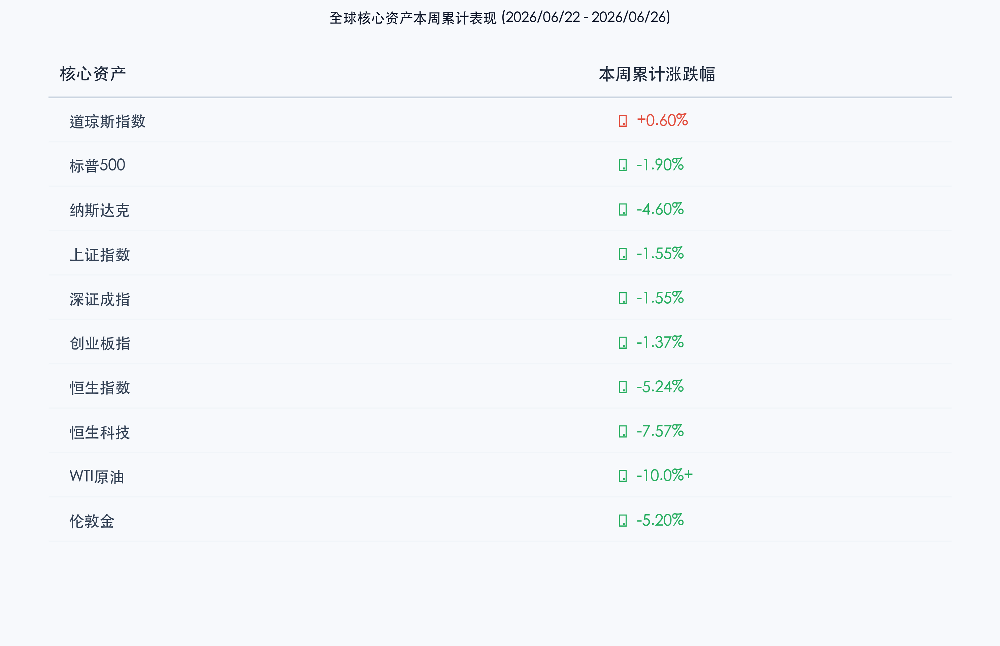

# 全球市场周度大盘点：AI估值质疑引爆科技“清算周”，纳指恒指深度下挫，原油三年首破70大关，传统道指独撑防御防线

**日期：2026年06月27日 (星期六)** &nbsp; **时段：晚报 (周末复盘模式)**

> **核心摘要**：本周（6月22日-26日）全球资本市场迎来年内最剧烈的筹码重组。受美股AI基建高额资本开支（Capex）投资回报周期遭受广泛质疑影响，半导体板块遭遇高位获利盘的“清算式”砸盘，费城半导体指数单日重挫超5%，拖累纳指全周大跌 **4.60%**，标普500连跌五日录得 **1.90%** 周跌幅。亚洲市场未能幸免，恒生指数全周重挫 **5.24%** 创一年多来新低，恒生科技指数重击 **7.57%**。相比之下，避险资金向传统防御板块靠拢，道琼斯指数本周逆势上涨 **0.60%** 续刷历史新高。大宗商品领域，美伊卢塞恩会谈预期改善叠加增产隐忧，WTI原油单周暴跌逾10%跌穿 **70美元/桶**；伦敦黄金在鹰派降息预期下承压跌超 **5%**。

## 核心资产周度/日度表现回顾

本周全球资产呈现极端的强弱切换。以AI硬件和高成长科技为首的资产遭遇剧烈估值踩踏，而具有现金流和分红优势的传统防御资产则扮演了避风港。

*   **道琼斯指数**：收报 **51,876.11点**，本周累计上涨 **0.60%**。科技风暴肆虐中，资金加速流向传统工业、消费及公用事业等防御性蓝筹，道指周中创下 52,655.66 点的历史新高。
*   **标普500指数**：收报 **7,354.02点**，本周累计下跌 **1.90%**。周五录得微跌 0.05%，但全周呈现一波三折的连跌走势。
*   **纳斯达克指数**：收报 **25,297.62点**，本周累计下跌 **4.60%**。AI 泡沫质疑叠加存储芯片产业链巨震，纳指本周遭遇重创。
*   **上证指数**：收报 **4,027.26点**，本周累计下跌 **1.55%**。周五大跌 2.26% 吞没前期涨幅，科创50则凭借扎实的基本面相对抗跌（全周跌幅窄于主板）。本周 A 股虽有调整，但累计成交额达 17.73 万亿元创历史单周新高，多空换手极度猛烈。
*   **恒生指数**：收报 **22,671.86点**，本周累计暴跌 **5.24%**；**恒生科技指数**收报 **4,255.59点**，周跌幅达 **7.57%**。港股本周点位双双创出近一年多来新低，受制于外围科技股情绪拖累及中概股解禁压力。
*   **WTI原油**：收报 **69.23美元/桶**，本周累计暴跌 **10%以上**，自3月以来首次失守 70 美元大关。
*   **伦敦现货金**：收报约 **4,032美元/盎司**，本周累计下跌约 **5.20%**，跌破 4100 美元后回测 4000 美元大关。
*   **比特币 (BTC)**：收报 **59,893美元**，本周震荡回落，面临 60,000 美元整数防线失守考验。

## 过去 48 小时重磅事件深度复盘

> **AI 泡沫还是良性洗盘？华尔街对科技巨头 Capex 展开大辩论**
> 
> 过去 48 小时全球最核心的博弈点在于“AI 算力基建的估值清算”。本周以美光科技、安森美为代表的半导体企业虽交出不错的财报或业绩预告，但市场焦点已悄然从“缺芯”转向“算力 ROI 校验”。高盛、红杉资本等机构在周五前夕相继发出研报质疑：云厂商在 GPU 等算力基建上每年数百亿美元的 Capex，何时能在软件或应用端转化成相应的营收增长？这种情绪在周五彻底爆发，引发量化止损盘涌出，致使费半指数暴跌超 5%，西部数据、希捷等存储龙头跌幅均超 10%。这表明资金已告别对 AI 硬件的盲目追捧，开始严苛检验企业盈利的确定性。

> **黑天鹅落幕：油价跌破 70 美元改变全球通胀与货币政策方程**
> 
> 国际原油期货在本周最后两个交易日加速崩盘，WTI 原油跌穿 70 美元/桶，布伦特原油大跌至 71.99 美元/桶，创下近期最大单周跌幅。导致油价破位下行的动力有两个：一方面，美伊在瑞士卢塞恩的停火谈判达成新一阶段谅解备忘录（MOU），霍尔木兹海峡运输通道的安全底线得到保全，油价的“海峡封锁溢价”退潮；另一方面，市场对 OPEC+ 在第三季度后自愿减产逐步取消的担忧加剧。油价大跌直接促使美债收益率（10Y美债收益率降至 4.369%）和通胀预期同步回落，为美联储第三季度的降息决策提供了极佳的宏观窗口。

> **半年末结算效应放大波动，A 股创历史天量交易完成筹码换手**
> 
> 国内市场本周最大特征是“天量换手与多杀多”。全周 17.73 万亿元的成交额创历史纪录，显示资金分歧极大。周五 A 股科技板块（光通信、CPO、计算机软件）的暴跌，主要由于临近半年末结算日，公募与量化等机构面临资金回笼与半年度业绩排名的双重制约，倾向于锁定二季度在硬科技赛道累积的丰厚浮盈。这种“机构踩踏”在缩量状态下被自我强化。多数机构研报指出，这种由资金面博弈引起的短期大跌往往是筹码深度清洗的过程，中报业绩期（7-8月）随着基本面的验证，硬科技板块的震荡中枢有望再度上移。

## 下周全球宏观大事预警

1.  **美国 5 月核心 PCE 物价指数（分母端决战）**：下周五将公布美国核心 PCE 数据。油价的大幅回落是否能在 PCE 数据中有所体现，将直接影响美联储对于 7-9 月降息幅度的定调。
2.  **美伊卢塞恩会谈协议签署（地缘红利确认）**：下周二双方谈判代表团将在瑞士卢塞恩进行最后框架协议的文本签署。若正式达成通航安全保障，国际油价可能在 70 美元下方寻求新的中枢。
3.  **国内 6 月官方 PMI 数据发布（分子端验证）**：国家统计局将发布 6 月制造业及非制造业 PMI 数据。市场正急切寻找国内经济内生动能企稳的宏观数据支撑，以作为半年末后资金重回成长板块的催化剂。

## 顶级机构周末策略内参摘要

*   **高盛（Goldman Sachs）**：**“芯片泡沫正待消化，向高现金流云厂商战略转移”**。高盛在最新的周末内参中警示，半导体股的交易拥挤度在周五大跌前已达到历史分位数的 98%，属于“不可持续的非理性繁荣”。其建议下半年投资者应坚决调整仓位：将半导体芯片的超配部分换仓至微软、亚马逊等 SaaS 和云服务巨头。这批巨头拥有最宽广的护城河和强劲的自由现金流，能够对冲半导体硬科技的库存及周期波动。
*   **摩根士丹利（Morgan Stanley）**：**“寻找高壁垒防御壁垒：存储与先进封装”**。大摩对硬科技的态度相对温和。其指出虽然美股半导体板块剧烈震荡，但 AI 对先进制程、先进封装（如 CoWoS）以及新型 HBM 存储芯片的需求仍处于物理供不应求阶段。策略上应避开逻辑芯片，在调整中寻找先进测试设备与全球存储巨头在 70-80 美元区间的低吸机会。
*   **中信证券**：**“高低切换渐入尾声，7月流动性冰释后红利与硬科技将并存”**。中信证券认为本周 A 股的大幅洗牌是典型的“半年末流动性收缩”引起的非理性调整。7 月首周随着季末考核结束，银行及社会资金将重新回流，红利板块的抗跌属性将让渡于中报高增长的“硬科技”硬核资产，建议趁回调布局国产算力及半导体设备龙头。

## 今日市场情绪：风暴洗礼，灯塔守望

> Prompt: Surrealism style. A monolithic black silicon pyramid representing technology is tilting under stormy dark clouds, its crystalline apex emitting faint cracks of green light. A colossal tidal wave made of crimson financial candlesticks and cascading semiconductor wafers is crashing in the background. In the foreground, a dark ocean of black oil is churning, carrying rusted cogs. On a sturdy cliff in the center, a beacon lighthouse shaped like a classic columns monument stands firm, casting a warm red light that pierces the heavy sea mist. No humans., masterpiece, high detail, intricate composition, cinematic lighting, 8k resolution

---

免责声明：内容仅供参考，不构成投资建议。
