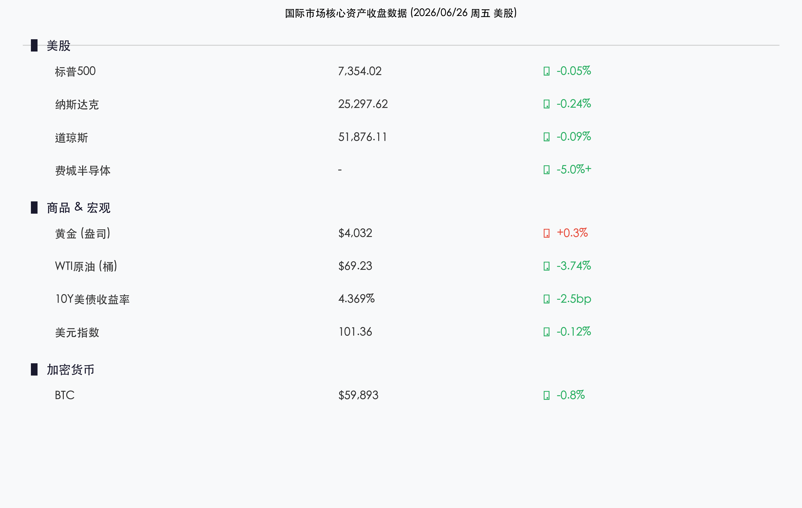

# 半导体风暴席卷华尔街：费城半导体指数单日暴跌逾5%，美三大指数连跌五日，高盛建议从芯片股转向云巨头，油价三年来首破70美元

**日期：2026年06月27日 (星期六)** &nbsp; **时段：早报 (周五美股收盘复盘)**

> **核心摘要**：美股周五（6月26日）收盘，三大指数小幅收跌，标普500已连续五日下跌，创近期最长连跌记录。表面平静的指数背后，半导体板块遭遇年内最大单日暴跌——费城半导体指数跌幅超5%，安森美、西部数据、希捷等芯片及存储股跌幅超10%。宏观面，WTI原油首度跌破70美元大关，布伦特油价同步大跌逾4%，美元指数走弱至101.36，黄金在4000美元附近震荡企稳。加密货币市场，比特币收于59,893美元。机构层面，高盛率先喊话"卖芯片换云巨头"，摩根士丹利聚焦先进封装，美国银行则逆势上调存储芯片目标价，三大行观点形成明显分歧。

## 核心行情复盘

周五美股整体呈现"表面平静、内部剧烈分化"的格局。大盘指数跌幅轻微，但半导体板块遭遇一场真正意义上的"清洗"，资金大幅从芯片股转向微软、苹果等大盘软件科技股。

*   **标普500指数**：收报 **7,354.02点**，小幅下跌 **0.05%**，年内上涨势头遭遇考验，已连续五日下跌。
*   **纳斯达克综合指数**：收报 **25,297.62点**，下跌 **0.24%**，科技权重拖累显著。
*   **道琼斯工业平均指数**：收报 **51,876.11点**，下跌 **0.09%**，防御类蓝筹相对抗跌。
*   **费城半导体指数**：单日暴跌逾 **5%**，成为全周最大"黑天鹅"，个股屠杀惨烈：安森美半导体（ON）创2020年以来最大单日跌幅；西部数据、希捷科技、闪迪跌幅均超 **10%**。

**大宗商品与宏观资产：**

*   **黄金（伦敦现货）**：约 **4,032美元/盎司**，于4000美元关口止跌企稳，日内小幅反弹，受益于美元走软及避险买盘。
*   **WTI原油**：大跌 **3.74%**，收于 **69.23美元/桶**，自3月以来首度跌破70美元整数关口；**布伦特原油**跌 **4.34%** 至 **71.99美元/桶**，油价全面下行成为全周最大宏观事件。
*   **10年期美债收益率**：收于 **4.369%**（下行约2.5bp），债市走强反映市场对经济放缓的定价与避险需求升温。
*   **美元指数（DXY）**：收报 **101.36**，小幅走弱约0.12%，人民币等非美货币获得喘息空间。
*   **比特币（BTC）**：收报约 **59,893美元**，在关键支撑位震荡，加密市场情绪谨慎。

## 核心解读与市场逻辑

> **芯片板块的"估值清算日"：三重压力共振下的结构性溃败**
>
> 周五半导体板块的暴跌并非偶然，而是三股力量同时触发的结果。**第一重**，前期涨幅过大、交易极度拥挤——费城半导体指数年内最高曾涨逾60%，部分存储及AI算力相关个股涨幅更达数倍，止盈压力已积聚至临界点。**第二重**，市场对AI基础设施高资本开支（Capex）能否快速转化为盈利的质疑持续发酵——云厂商的Capex创历史新高，但市场开始计算"每1美元算力投入能产生多少美元营收"，答案令部分投资者信心动摇。**第三重**，量化策略的同质化效应将下跌放大：当核心止损位被触穿，程序化卖单的连锁触发将跌幅从5%瞬间推向10%+。

> **油价破70：地缘缓和与供应增加的双重叙事**
>
> WTI原油首度跌破70美元，背后是中东地缘政治局势出现明显缓和信号，以及市场对OPEC+增产预期的定价。能源价格大幅回落具有"双刃剑"效应：一方面是通胀压力的天然对冲，有望为美联储提供降息操作空间；另一方面，能源股的大幅走弱也拖累了大盘，使标普500在芯片+能源的双重压力下难以企稳。10年期美债收益率的同步下行（4.369%），反映了市场对经济放缓的隐忧已悄然加深——这是美债与美股罕见出现的"同向避险"信号。

## 政策脉动

*   **美联储立场观察**：本周美联储多位官员发表鹰派表态，强调在通胀可持续回落至2%目标前不轻易降息。油价大跌理论上有利于压制CPI，但核心服务通胀的粘性问题仍是美联储的核心忧虑。市场对2026年降息次数的预期本周明显收窄。
*   **贸易赤字扩大**：美国5月商品贸易逆差数据大幅超预期扩大，进口需求强劲但出口疲弱，引发市场对美国经济"需求外溢"的关注，也为美元走弱提供了基本面支撑。

## 最新机构观点

*   **高盛（Goldman Sachs）**：**"减持芯片、增持云巨头"**。高盛指出，半导体板块当前估值已充分定价甚至过度定价了AI的长期盈利前景，交易拥挤度已处极端水平。建议投资者将芯片仓位向亚马逊（AWS）、微软（Azure）、Meta等云计算平台转移——这些平台是算力需求的**最终承接方**，其业绩能见度更高，且不受半导体供需周期波动的直接冲击。逻辑核心：从"卖铲子的"切换到"用铲子挖金子的"。
*   **摩根士丹利（Morgan Stanley）**：**"回调健康，聚焦先进封装与中国AI芯片"**。摩根士丹利认为本次下跌是"过于拥挤的AI概念股的健康出清"，并不动摇AI长期投资主线。其重点看好两条差异化主线：一是技术壁垒极高的**先进封装赛道**（CoWoS、SoIC等），供给弹性低、需求确定性强；二是受益于国内替代政策加速的**中国国产AI芯片**生态，认为该方向的成长性被市场低估。
*   **美国银行（BofA）**：**"逆市看多存储，目标价再上调"**。美银在恐慌下跌中维持逆向判断：AI存储芯片的需求密度是传统芯片的3-4倍，供需结构性失衡至少延续至2027年底。趁恐慌下跌逆势上调美光科技等存储巨头目标价，认为这是长期买入窗口而非卖出信号。

## 今日市场情绪：暗夜孤光，守望曙明

> Prompt: A lone ancient lighthouse stands on a jagged silicon chip cliff, its beam sweeping through a stormy night sky filled with swirling red candlestick charts and falling semiconductor wafers. The sea below churns with crashing waves made of circuit board patterns. In the storm clouds, ghostly shapes of chip blueprints dissolve and reform. A tiny green seedling grows from a crack in the cliff face, stubbornly defying the chaos. Far on the horizon, a faint golden glow pulses — the silhouette of a cloud data center city. No humans. Cinematic, surrealism., masterpiece, high detail, intricate composition, cinematic lighting, 8k resolution

---

免责声明：内容仅供参考，不构成投资建议。
