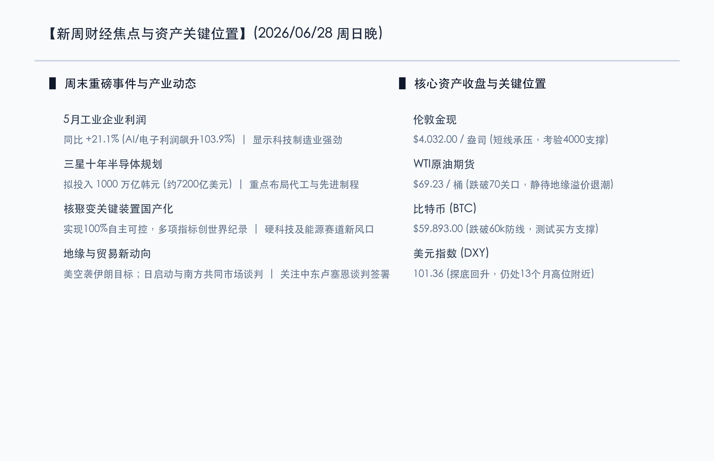
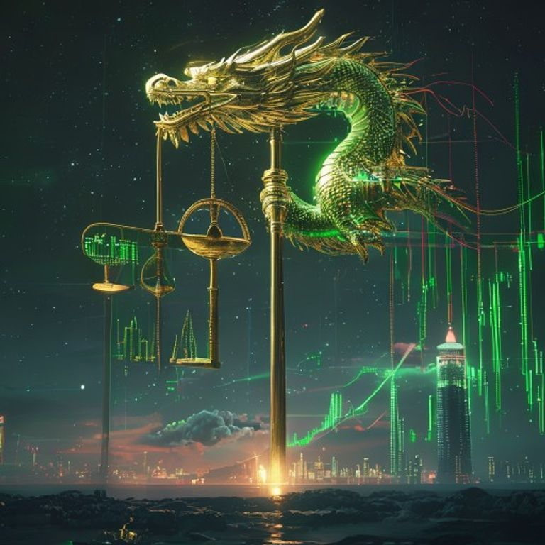

# 新周展望：非农提前与独立日假期休市双重考验，油价破70重估通胀天平，三星千万亿投资力撑半导体复苏

**日期：2026年06月28日 (星期日)** &nbsp; **时段：晚报 (新周展望模式)**

> **核心摘要**：本周末全球市场消息面多空交织，国内硬科技与国际地缘局势均迎来重大催化。国内方面，5月工业企业利润同比增长21.1%，其中AI及电子通信利润飙升超103%，显示出科技制造的极强韧性，同时核聚变关键主机设施实现核心技术100%国产化，为新质生产力赛道注入强心剂。国际方面，由于7月4日美国独立日假期，美股将于周五休市，万众瞩目的6月非农就业报告破例提前至周四公布。下周一启动的欧洲央行年度中央银行论坛上，美联储及多国央行行长将同台发声。此外，随着WTI原油跌穿70美元关口、半导体“7月涨价潮”拉开序幕，以及三星1000万亿韩元半导体布局规划的出炉，新的一周将上演“降息预期与分子端产业突破”的激烈对决。

## 周末财经要闻终极汇总

周末期间，全球经济政策及重点产业领域爆发了多项重磅消息。以下是新一周开盘前核心资产点位及宏观焦点：

### 1. 5月工业企业利润稳健，AI与电子制造板块利润翻倍
> **事件原因与核心解读**：国家统计局发布的最新数据显示，5月份全国规模以上工业企业利润同比增长21.1%，延续稳步增长态势。值得注意的是，受全球人工智能（AI）投资热潮及消费电子回暖驱动，计算机、通信和其他电子设备制造业利润同比暴增103.9%，成为拉动工业利润增长的核心引擎。然而，中下游传统制造板块利润依然面临国内消费复苏偏弱的挤压，呈现出明显的结构性分化。这表明资金正进一步向硬科技和高端制造集中。

### 2. 三星公布1000万亿韩元十年投资规划，抢占本土芯片制造高地
> **市场洞察**：三星集团宣布将在未来十年内，在韩国本土投资1000万亿韩元（约合7200亿美元），重点建设晶圆代工与先进制程基地。这一超大规模投资计划旨在应对美欧等国半导体本土化趋势，并夺回在高性能计算（HPC）及先进存储（HBM）领域的主导权。半导体巨头的持续性资本开支将对全球设备与材料供应链形成强力托底，与华尔街近期对AI拥挤度的担忧形成多空博弈。

### 3. 国家核聚变大装置核心技术100%国产化，硬科技政策与技术共振
> **核心解读**：国家重大科技基础设施“聚变堆主机关键系统综合研究设施”取得重大突破。其环向场磁体成功制备并验收，高温超导中心螺管线圈磁体完成了满工况参数测试，多项核心技术指标刷新世界纪录并实现100%国产化。核聚变作为新质生产力的终极能源赛道，其产业链有望在政策面、资本面及技术突破的共振下成为下半年硬科技板块的崭新风口。

### 4. 国际地缘局势错综复杂：美空袭伊朗目标，美伊卢塞恩谈判迎决战
> **事件原因**：美军在周六对伊朗境内的军事目标实施空袭，导致地缘局势骤然紧绷。然而，据外交渠道透露，美伊关于霍尔木兹海峡运输通道的安全保障谈判并未破裂，预计仍将在本周末于瑞士卢塞恩进行最后框架协议的闭门签署。这令下周的油价走势极具不确定性——地缘局势的升级恐引致溢价回升，而若卢塞恩会谈顺利达成通航安全备忘录，则将压制溢价，促使原油在70美元下方继续寻底。

## 新一周市场核心博弈逻辑

> **博弈点 A：非农提前发布与独立日假期休市，交易流动性面临“降息大决战”**
> 
> 由于7月4日（周五）为美国独立日假期，美股将于周五全天休市。因此，6月非农就业报告将被破例提前至周四（7月2日）晚间发布。目前，全球投资者高度关注美国就业市场是否进一步降温（市场预测新增非农就业人数为11.3万左右，失业率为4.3%）。在美元指数升至13个月高点、分母端利率承压的背景下，若非农数据录得温和增长，将为美联储在第三季度的降息决策扫清道路，激活美股及新兴市场的流动性；反之，若数据超预期强劲，则将加剧周中的资产抛售波动。

> **博弈点 B：油价跌破70美元与大宗商品定价重估，通胀降温 vs 衰退隐忧**
> 
> WTI原油期货跌破70美元关口是近期宏观天平倾斜的最深远信号。原油价格走低有助于直接压低主要经济体的CPI中枢，为央行打开降息空间；但与此同时，油价暴跌在周期性行业与能源板块中引发了对全球原油需求放缓及衰退的担忧。新的一周，大宗商品、美元指数与黄金之间将进行循环重估，关注伦敦金在4000美元大关附近的支撑力度，以及大宗定价重组对无风险资产流向的改变。

## 本周重磅经济数据与会议前瞻

*   **周二（6月30日）**：
    *   **中国 6 月官方制造业 PMI**：这是研判国内二季度末经济复苏斜率的核心数据，市场密切关注在季末维稳后其能否重返50荣枯线上方。
    *   **欧洲央行年度 Sintra 央行论坛**：欧央行行长拉加德将主持会议。美联储官员及欧英日央行行长将在此释放关于下半年货币政策的最新前瞻风向。
*   **周三（7月1日）**：
    *   **港股因香港特区成立纪念日休市一日**，北向资金通道将出现临时微调。
    *   **美国 6 月 ADP 就业人数（“小非农”）与 6 月 ISM 制造业 PMI** 密集发布，是周四非农的重要前哨战。
*   **周四（7月2日）**：
    *   **美国 6 月非农就业报告与失业率公布**：核心宏观指标，对美联储货币政策轨迹拥有决定性定价权。
*   **周五（7月3日）**：
    *   **美股及美债市场因独立日假期全天休市**，全球金融流动性预计将在周四提前出现收缩与休整。

## 头部券商/投行开盘策略点睛

*   **高盛（Goldman Sachs）**：**“半导体估值拥挤度高企，建议战术性向高自由现金流SaaS与云巨头换仓”**。高盛在最新策略中指出，目前半导体行业的交易拥挤度已接近历史分位数上限。建议在下半年将部分半导体硬科技仓位，战术性调整至微软、亚马逊等拥有极宽阔壁垒及强劲现金流的云巨头，以规避短期硬科技硬件链条的去库存震荡。
*   **摩根士丹利（Morgan Stanley）**：**“坚守高壁垒核心环节：关注存储与先进封装的低吸机会”**。大摩对科技股的看法相对乐观，指出尽管费城半导体指数由于高额Capex ROI讨论而剧烈波动，但全球先进制程、先进封装（如CoWoS）及高性能存储芯片（HBM）的物理性供不应求仍在持续。回调后应积极布局先进测试设备与存储龙头。
*   **中信证券**：**“跨季流动性回暖，聚焦核聚变与半导体‘涨价潮’中报主线”**。中信证券认为，本周A股的洗盘属于典型的半年末流动性收缩引起的非理性调整。7月首周随着季末资金平稳跨季，流动性有望显著回暖。本周末核聚变国产化重大突破，叠加半导体“7月涨价潮”拉开序幕，建议在开盘后对前期调整幅度较大的算力链、先进封装以及新质生产力方向进行分批吸纳。

## 今日市场情绪：金钥执衡，龙鹰合鸣

> Prompt: Surrealism style, A giant golden key and a silver balance scale floating in a twilight starry sky. In the background, a massive screen shows glowing green and red circuitry and rising financial charts. In the sky, a Chinese dragon made of green laser code and an American eagle made of golden fiber optics face a bright digital lighthouse. No humans., masterpiece, high detail, intricate composition, cinematic lighting, 8k resolution

---

免责声明：内容仅供参考，不构成投资建议。
