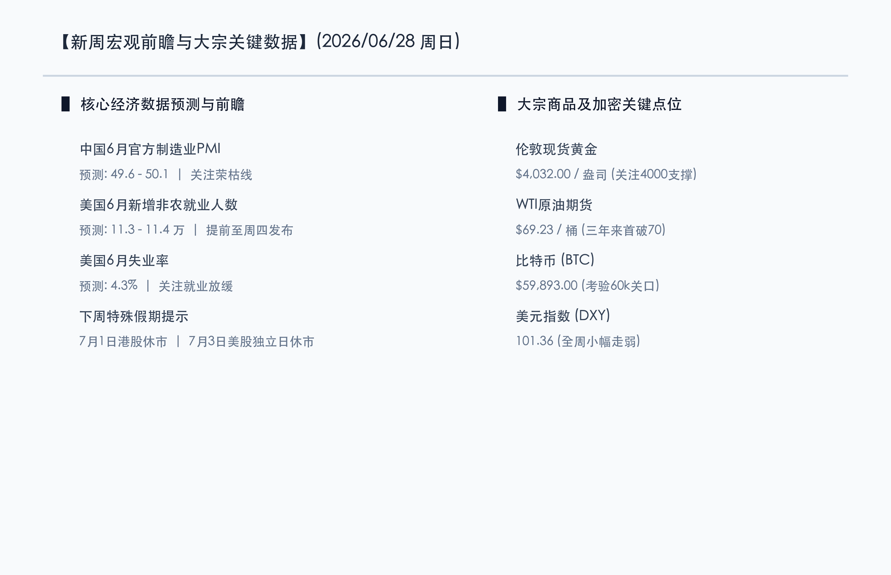

# 新周展望：非农提前携手欧央行大考来袭，半导体“7月涨价潮”与核聚变国产化突破，油价破70重估宏观天平

**日期：2026年06月28日 (星期日)** &nbsp; **时段：早报 (新周展望模式)**

> **核心摘要**：本周末全球市场消息面多空交织，国内硬科技与国际地缘局势均迎来重大催化。国内方面，国家级核聚变主机综合设施实现核心技术100%国产化，为万亿能化与硬科技赛道注入强心剂；下周二官方制造业 PMI 报价将正式出炉，季末维稳流动性下市场静待基本面拐点。国际方面，由于7月4日美国独立日假期，美股及金融市场将于周五休市，万众瞩目的 6 月非农就业报告破例提前至周四公布。下周一启动的欧洲央行年度中央银行论坛上，美联储及欧英央行行长将同台发声。同时，随着 WTI 原油跌穿 70 美元大关、半导体“7 亿涨价潮”在下周一拉开序幕，以及三星 1000 万亿韩元半导体布局计划的公布，新的一周将演绎“分母端降息预期与分子端产业突破”的终极对决。

## 周末财经要闻终极汇总

周末期间，全球经济政策及重点产业领域爆发了多项重磅消息。以下是新一周开盘前核心资产点位及宏观焦点：

### 1. 国家核聚变大装置核心技术100%国产化，硬科技政策与技术共振
国家重大科技基础设施“聚变堆主机关键系统综合研究设施”本周末取得重大突破。其环向场磁体成功制备并验收，高温超导中心螺管线圈磁体完成了满工况参数测试，多项核心技术指标刷新世界纪录并实现 100% 国产化。核聚变作为新质生产力的终极能源赛道，其产业链有望在政策面、资本面及技术突破的共振下成为下半年硬科技板块的崭新风口。

### 2. 国际地缘政治“过山车”：美空袭伊朗境内目标，美伊谈判周末迎卢塞恩决战
中东局势在周末再度紧绷。美国在周六针对伊朗境内的军事目标实施了空袭，引发市场对地缘不稳定性及霍尔木兹海峡运输通道安全红利可能遭回吐的担忧。然而，据外交管道透露，双方的技术性及通航安全保障谈判并未完全中断，预计仍于本周末在瑞士卢塞恩进行闭门博弈。下周二（6月30日）是否能如期完成框架协议文本签署，将是原油价格在 70 美元下方重新寻底的决定性催化剂。

### 3. 半导体“7月涨价潮”来袭，三星1000万亿韩元十年投资砸向本土芯片制造
全球半导体产业链在周末释放明确的复苏回暖信号。村田、英飞凌、德州仪器等十余家全球头部半导体巨头已明确通知客户，自下周一（6月29日）起正式开启新一轮全线提价。此外，三星集团计划在下周一正式公布一项金额高达 1000 万亿韩元（约合 7200 亿美元）的十年本土投资大盘，重点布局晶圆代工与先进制程。产业的资本开支与提价信号，正与华尔街对 AI 芯片估值拥挤度的担忧产生激烈对决。

## 新一周市场核心博弈逻辑

> **博弈点 A：非农提前发布与独立日假期休市，交易流动性面临“鹰派加息”预期大考**
> 
> 由于 7 月 4 日（周五）为美国独立日假期，美股将于周五休市。因此，美股交易员的“期末考”——6 月非农就业报告将被破例提前至周四发布。在当前美联储鹰派官员（如卡什卡里）甚至警告可能需升息一次的背景下，如果非农就业新增人数超出预期的 11.3 万，或者失业率低于 4.3%，全球金融资产分母端利率将继续承压。提前到周四发布的重磅数据，预计将加剧周中大盘的波动性。

> **博弈点 B：油价跌破 70 美元的宏观效应传导，通胀降温 vs 衰退担忧**
> 
> WTI 原油首度跌破 70 美元关口是近期最深远的宏观重塑。对于各大央行而言，原油等大宗商品的下行为压制 CPI 提供了天然动力，有望打开下半年的降息空间。但另一方面，油价暴跌在周期性行业与大盘权重中也引发了对全球原油需求放缓及衰退的担忧。大宗商品的定价重组如何改变全球无风险资产的流向，将是下周开盘后大宗商品、美元指数与黄金之间循环定价的关键。

## 本周重磅经济数据与会议前瞻

*   **周二（6月30日）**：
    *   **中国 6 月官方制造业 PMI**：这是判断国内二季度经济复苏斜率的核心高频数据，市场正密切关注其能否在季末资金维稳后成功重返 50 荣枯线。
    *   **欧洲央行 Sintra 央行论坛开幕**：拉加德将主持讨论。美联储主席沃什（Kevin Warsh）的同台发声将被市场用“放大镜”解读。
*   **周三（7月1日）**：
    *   **港股因香港特区成立纪念日休市一日**，北向资金通道将出现临时调整。
    *   **美国 6 月 ADP 就业人数（“小非农”）与 6 月 ISM 制造业 PMI** 密集发布，是周四非农的重要前哨战。
*   **周四（7月2日）**：
    *   **美国 6 月非农就业报告与失业率公布**：核心宏观指标，对美联储 7-9 月货币政策轨迹拥有决定性定价权。
*   **周五（7月3日）**：
    *   **美股及美债市场因独立日假期提前于周五全天休市**，全球金融流动性预计将在周四提前出现收缩与休整。

## 头部券商/投行开盘策略点睛

*   **中信证券**：**“季末流动性跨越在即，中报业绩期硬科技聚焦核聚变与算力”**。中信证券分析，本周末核聚变关键系统的国产化重大突破，叠加半导体“7月涨价潮”拉开序幕，为硬科技板块提供了新的分子端业绩支撑。随着跨季资金平稳渡过，7 月初流动性有望显著回暖，建议在开盘后对前期调整幅度较大的算力链、先进封装以及新质生产力方向（聚变能、高温超导）进行防御性分批低吸，中报业绩的披露将成为行情的主升浪催化剂。
*   **中金公司**：**“利率决战周前瞻，关注红利资产对冲与打新收益重估”**。中金公司指出，下周由于央行论坛与美国非农的共振，分母端利率压力仍是悬在成长股头上的利剑。在这种背景下，具备分红确定性优势的红利板块（如石油石化、银行、电力）依然是极好的底仓防御品种。对于 A 类账户，建议关注下半年的稳健打新策略。
*   **摩根大通（J.P. Morgan）**：**“估值消化不改牛市中枢，上调标普500至7800点”**。摩根大通在周末最新研究中反击了“AI 芯片见顶论”。小摩认为，尽管费城半导体指数由于交易拥挤和 Capex ROI 的探讨出现大幅洗牌，但 2026 年美国企业级盈利的增长预期依然强劲。其坚定上调标普 500 至 7800 点，坚信当前的估值消化是慢牛中途的良性调整，回调即是低吸机会。

## 今日市场情绪：沙漏流金，龙盘核聚

> Prompt: Surrealism style. A colossal, half-hidden hourglass floats in a twilight sky. Its upper bulb is woven from silicon wafers and green circuit grids, pouring down golden data numbers representing employment data. Below, an ancient Greek marble temple stands on a cliff. In front of it, a stone monument is carved with a red number '70' next to oil barrels and a tilted balance scale. In the background, a Chinese dragon made of energy curls around a high-tech nuclear fusion reactor. The night sky is illuminated by distant fireworks. No humans., masterpiece, high detail, intricate composition, cinematic lighting, 8k resolution

---

免责声明：内容仅供参考，不构成投资建议。
