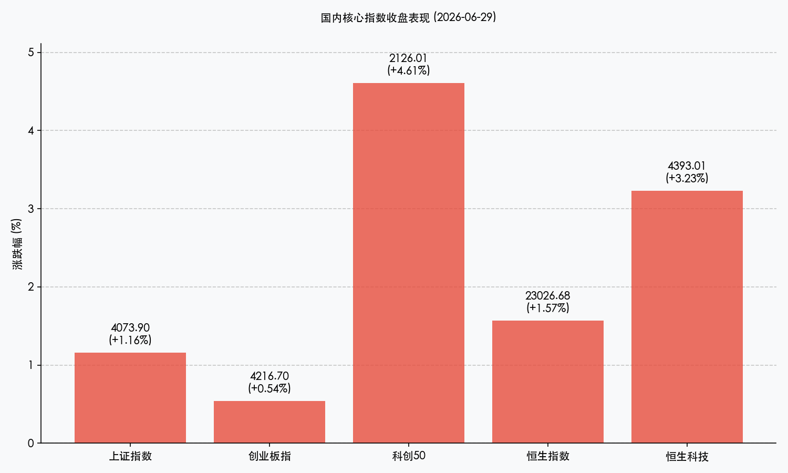

# 探底回升再演V形奇迹，科创50暴涨4.61%领跑，创新药与半导体筑牢硬科技长城

**日期：2026年06月29日 (星期一)** &nbsp; **时段：晚报 (常规交易日复盘)**

> **核心摘要**：今日A股与港股在早盘震荡探底后，午后上演了惊心动魄的“V形”大修复行情，科技与医药双星闪耀。科创50指数单日暴涨4.61%领涨宽基指数，创新药板块因国家医保目录初审名单落地及药企出海合作利好而大面积爆发（板块指数涨超6%），半导体上游材料及设备板块也受到巨额资本规划与国产替代预期的强烈共振。资金面上，央行大额流动性投放有效熨平季末跨季资金面波动。

## 核心行情复盘

今日境内外市场呈现显著的探底回升态势。在早盘低开下探后，随着医药与半导体两大硬核主线的集体走强，买盘力量迅速集结，推动两市主要宽基指数震荡上行，最终全线收红。

*   **上证指数**：收报 **4073.90点**，上涨 **1.16%**。
*   **深证成指**：收报 **15812.87点**，上涨 **0.19%**。
*   **创业板指**：收报 **4216.70点**，上涨 **0.54%**。
*   **科创50指数**：收报 **2126.01点**，大涨 **4.61%**。
*   **恒生指数**：收报 **23026.68点**，上涨 **1.57%**。
*   **恒生科技指数**：收报 **4393.01点**，大涨 **3.23%**。
*   **国企指数**：收报 **7605.34点**，上涨 **1.94%**。
*   **全市场成交额**：沪深北三市合计成交约 **3.54万亿元**，资金交投依然极为活跃。

> **行业板块表现**：今日**创新药**与**半导体设备及材料**板块成为绝对的市场龙头。创新药板块指数整体涨幅超过6%，多只龙头股封涨停，主要催化来自于医保及商保目录初审名单的公示。半导体设备及材料板块也表现强劲，主因是国产替代逻辑的持续强化与三星等海外巨头巨额投资规划的行业托底效应。相反，前期拥挤度较高的“AI生命线”板块（如光纤光缆、CPO概念、光模块等）今日出现大面积技术性回调，市场呈现出显著的高低切换特征。

## 核心解读与市场逻辑

> **医保初审红利落地，创新药板块迎来价值重估与信心重塑**
> 
> 今日创新药板块迎来爆发式大涨，直接触发点是国家医保局公示了2026年医保及商保目录初审名单，共有557个药品通过。这向市场释放了政策持续鼓励药企临床创新和商业化落地的明确信号。叠加近期多家药企海外授权（License-out）项目相继落地，提振了资本对中国医药“研发实力+国际化空间”的认可。机构普遍认为，医药板块前期调整充分，当前处于“基本面向上、估值向下”的极度背离状态，政策利好的落地促成了估值修复的强烈共识。

> **半导体巨头资本开支与自主替代共振，上游核心供应链韧性凸显**
> 
> 在三星公布1000万亿韩元半导体布局规划及国内半导体上游国产替代需求增强的背景下，资金迅速流入半导体设备、材料及先进封装等细分领域。尽管外围科技行业因估值拥挤发生波动，但国内“自主可控”主线的硬逻辑对买盘形成了坚实支撑。特别是在科创板新规支持核心硬科技企业IPO的政策呵护下，科创50指数单日录得4.61%的惊人涨幅，显示出耐心资本对核心硬科技供应链长期发展的信心。

> **跨季流动性平稳过渡，高低切换引领市场主线健康轮动**
> 
> 临近半年末考核（MPA等）节点，市场资金面虽有小幅波动，但今日A股的探底回升表明市场已对流动性担忧进行了充分释放。随着高位科技板块（CPO、光模块）的拥挤度出清，资金有序流向医药等低估值板块。这种健康的板块轮动和筹码调仓，不仅防范了单一赛道过度泡沫化，也为下半年中报业绩检验期（7-8月）的到来打下了稳固的资金与估值基础。

## 政策脉动

*   **人民银行大额逆回购熨平半年末资金面**：中国人民银行于6月29日开展了1575亿元7天期逆回购及3000亿元隔夜逆回购操作，通过精准投放流动性，呵护半年末资金面平稳度过，维护金融市场流动性合理充裕。
*   **特别国债支持消费品以旧换新**：国家发改委下达第三批超长期特别国债资金，支持消费品以旧换新工作。该财政政策的直接落地，有望进一步刺激国内终端消费需求，提振相关零售及大消费板块的企业盈利预期。

## 最新机构观点

*   **中信证券**：**“跨季流动性回暖，聚焦中报业绩与新质生产力主线”**。中信证券策略团队认为，近期A股的探底与修复属于典型的半年末流动性收缩引起的非理性波动。随着7月跨季资金面的平稳过渡，市场流动性有望显著回暖。下半年市场将正式由估值扩张转向盈利驱动，建议密切关注7-8月中报业绩披露情况，重点布局先进封装、算力链、半导体设备等高景气赛道，以及核聚变等硬科技代表的新质生产力方向。
*   **中金公司**：**“把握高低切换节奏，布局低估值医药与半导体核心资产”**。中金公司指出，今日科创板与医药的大反弹验证了资金的高低切换趋势。在外部美联储降息预期反复、全球科技股局部高估的背景下，国内硬科技的突围显示出独立的内生韧性。建议投资者继续采取哑铃型配置，一方面坚守半导体国产化、先进封装等具备壁垒的硬核科技资产，另一方面向处于估值底部的创新药与医疗器械进行防御性布局。
*   **高盛**：**“A股迈入盈利驱动新阶段，看好创新药出海与先进制程软硬件”**。高盛重申对中国资产的建设性看法，表示2026年A股市场正稳步由单纯的估值拉动走向企业盈利兑现期。AI基础设施的规模化落地、政策支持的硬科技“反内卷”推动以及生物医药等行业的出海，是企业利润增长的三大动力。高盛近期在个股层面对创新药和半导体上游等具备全球竞争力的方向表示了高度关注与加仓动作。

## 今日市场情绪：山回谷转，药石回天

今日市场在探底后强势回升，科技与医药两大支柱撑起反弹空间，展现出顽强的突围韧性。

> Prompt: Surrealism style, A giant V-shaped valley of silver silicon circuits. On the left side of the valley, a glowing crystal test tube filled with glowing green liquid (representing innovation drugs) rises up, surrounded by golden laurels. On the right side, a massive mechanical arm is building a shiny microchip gate. In the background, a warm golden sun of liquidity rises from a dark mountain range made of financial charts, casting a bright green light (+4.61%) across the valley. No humans., masterpiece, high detail, intricate composition, cinematic lighting, 8k resolution

---

免责声明：内容仅供参考，不构成投资建议。
