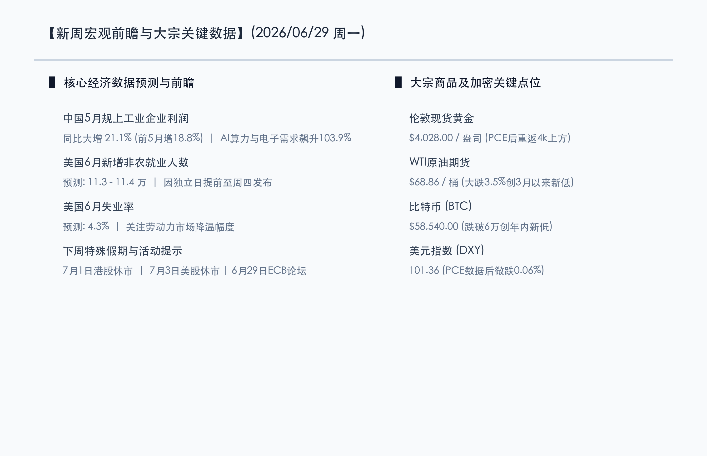
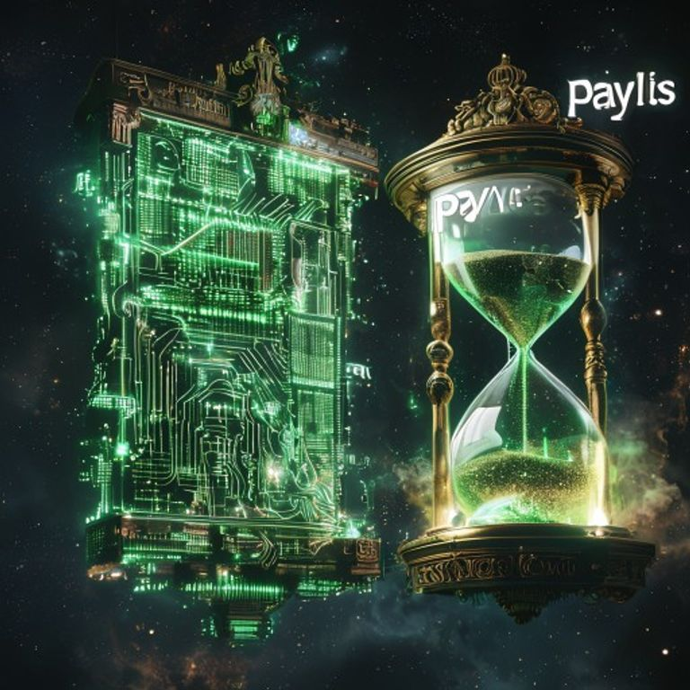

# 新周展望：OpenAI延期IPO打压科技情绪，五月工业利润高增见证制造韧性，央行论坛与非农超级周震撼来袭

**日期：2026年06月29日 (星期一)** &nbsp; **时段：早报 (新周展望模式)**

> **核心摘要**：本周末全球财经局势冷热交织。国际方面，由于担心AI高估值与重置资本开支回报率，叠加OpenAI倾向于将IPO推迟至2027年，全球科技与半导体板块情绪整体承压，市场静待下周美联储与多国央行在Sintra论坛上的集体发声。同时，本周因独立日假期，美国非农就业报告提前至周四发布，构成“超重量级”博弈节点。国内方面，国家统计局公布前5月规上工业利润同比增长18.8%，其中AI算力及电子通信利润飙升103.9%，凸显高技术制造韧性。黄金在PCE数据后重回4000点大关上方，而WTI原油跌破69美元，显示大宗商品及利率的二次定价已经展开。

## 周末财经要闻终极汇总

周末期间，全球经济政策及重点产业领域爆发了多项重磅消息。以下是新一周开盘前核心资产点位及宏观焦点：

### 1. 规上工业企业利润强增21.1%，高技术制造与AI产业利润飙涨103.9%
> **核心解读**：国家统计局6月27日公布的数据显示，今年1至5月份，全国规模以上工业企业实现利润总额同比增长18.8%，其中5月份单月利润同比增长21.1%，呈现稳健扩张势头。分行业看，受人工智能算力需求爆发式增长和消费电子景气度周期性回暖的双重驱动，计算机、通信和其他电子设备制造业利润同比暴增103.9%。相比之下，部分传统制造业由于国内需求恢复偏缓仍面临一定压力。这一结构性分化说明，国内实体经济正加速向高端制造与硬科技新质生产力集中，为科技板块提供坚实的分子端业绩支撑。

### 2. OpenAI或推迟IPO至2027年，AI高估值遭遇“降温重置”
> **事件原因与市场洞察**：根据华尔街及硅谷最新消息，OpenAI在6月初提交保密S-1招股书后，目前倾向于将IPO延迟至2027年。导致其推迟的主要原因在于6月上旬SpaceX上市后股价遭遇了剧烈波动，令财务顾问对超大型科技独角兽在当前高位市场的直接上市前景持谨慎态度。同时，CEO奥特曼追求的1万亿美元估值目标在当前“AI数据中心建设高成本、回报周期长”的质疑下难以实现。CFO Friar正致力于稳定现金流并探讨ChatGPT内嵌广告等新型变现手段。这一消息在周末引发了对AI泡沫及拥挤估值的二次评估，给此前狂热的费城半导体板块戴上了情绪紧箍咒。

### 3. 三星公布1000万亿韩元本土芯片大布局规划
> **行业动态**：三星集团计划于周一（6月29日）正式对外公布在韩国本土高达1000万亿韩元（约合7200亿美元）的十年投资规划，重点押注晶圆代工与先进制程研发，并加速HBM（高带宽内存）和先进封装产业落地。此举旨在对抗美欧日半导体链本土化趋势，并夺回在英伟达算力供应链中的高份额。超大规模的长期资本开支有利于对全球半导体材料与设备端形成长线底部支持，并抗衡短期AI拥挤度带来的技术性抛压。

## 新一周市场核心博弈逻辑

> **博弈点 A：央行论坛与“非农超级周”携手，流动性与鹰派加息的最终博弈**
> 
> 上周五美国公布的5月PCE物价指数同比上涨4.07%，核心PCE同比上涨3.41%，数据依然显现出较强的粘性，并未给降息预期带来明确的助推。本周，美联储、欧洲央行及英格兰银行的决策者们将在葡萄牙Sintra举办的央行论坛上同台发声，这成为市场窥探三季度政策路径的重要窗口。由于周五（7月3日）为美国独立日假期休市，全球交易员瞩目的6月非农就业报告（预测新增11.3 - 11.4万）将破例提前至周四（7月2日）公布。超级周的重磅数据与密集讲话，将直接决定美债收益率4.37%附近的走势，对高估值成长股构成关键考验。

> **博弈点 B：黄金重回4000点与油价跌破69美元的宏观天平**
> 
> WTI原油期货在上周五大跌3.5%至68.86美元/桶，三年来首次有效跌破70美元整数大关，主要受到全球原油需求放缓担忧及美伊地缘谈判预期影响。与此同时，现货黄金在PCE数据出炉后重回4028.00美元/盎司，展现出强劲的避险买盘和抗通胀支撑。大宗商品内部的这种分化说明，市场在交易经济放缓（压低油价）的同时，也在防御利率风险（抬升金价）。新的一周大宗商品市场的定价再平衡，将进一步向美元指数（目前101.36）和美债收益率传导。

## 本周重磅经济数据与会议前瞻

*   **周一（6月29日）**：
    *   **欧洲央行 Sintra 论坛开幕**：拉加德等央行官员发表演讲。
    *   **三星1000万亿韩元半导体布局规划发布**。
*   **周二（6月30日）**：
    *   **中国 6 月官方制造业 PMI**：市场密切关注其能否在季末资金维稳后成功重返 50 荣枯线。
    *   **美国 6 月 CB 消费者信心指数**、**欧元区 6 月 CPI 闪估值**。
*   **周三（7月1日）**：
    *   **港股因香港特区成立纪念日休市一日**，北向资金暂停。
    *   **美国 6 月 ADP 就业人数（“小非农”）**、**美国 6 月 ISM 制造业 PMI**。
*   **周四（7月2日）**：
    *   **美国 6 月非农就业报告与失业率公布**（因休市提前一日发布）：决定三季度降息预期的关键高频数据。
*   **周五（7月3日）**：
    *   **美股及美债市场因独立日假期全天休市**。

## 头部券商/投行开盘策略点睛

*   **中信证券**：**“工业利润验证制造韧性，聚焦业绩高增科技龙头”**。中信证券认为，5月规上工业利润尤其是电子设备制造业103.9%的增幅，充分验证了国内硬科技与AI算力供应链的内生性高增长。虽然美股科技板块重估对A股成长股有一定心理压力，但国产替代与新质生产力逻辑非常硬朗。随着半年末流动性平稳跨过，建议开盘后逢低布局业绩确定性高的算力芯片、高温超导以及高技术制造业龙头。
*   **中金公司**：**“关注利率超级周压力，红利资产仍具防御价值”**。中金公司指出，本周美国非农提前发布和央行论坛交织，分母端美债利率的潜在上行压力依然压制着成长股。在估值消化期间，高分红、高确定性的防御红利板块（如石油石化、银行、电力）依然是优选底仓，可有效对冲海外市场波动。
*   **摩根大通（J.P. Morgan）**：**“AI估值回调是良性洗盘，关注下半场盈利驱动”**。摩根大通分析，OpenAI IPO的潜在延期和估值重置属于牛市中途的估值消化，并非AI产业趋势的终结。虽然半导体板块短期面临洗牌，但这有利于出清交易拥挤度。下半年科技股行情将由“故事叙事”向“中报业绩盈利验证”的下半场过渡，回调即是优质核心资产的低吸机会。

## 今日市场情绪：芯片天平，新周引信

> Prompt: Surrealism style, A colossal scale floats in a dark starry night sky. The left pan holds glowing green semiconductor chips and circuit grids, while the right pan holds a golden hourglass pouring down sand. In the background, a clock face ticking towards the word 'PAYROLLS' is projected on a nebula. A Chinese dragon made of glowing green energy and circuit paths wraps around the scale., masterpiece, high detail, intricate composition, cinematic lighting, 8k resolution

---

免责声明：内容仅供参考，不构成投资建议。
