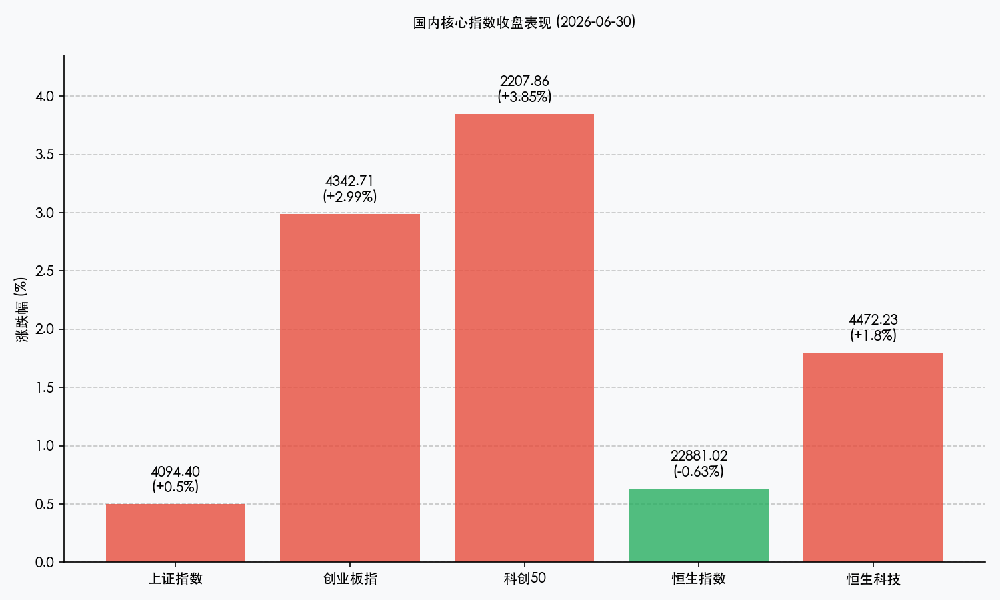

# 半年报红利与芯片狂潮共振，科创50创历史新高，国常会AI加力引领科技大主线

**日期：2026年06月30日 (星期二)** &nbsp; **时段：晚报 (常规交易日复盘)**

> **核心摘要**：今日是2026年上半年A股收官之日，三大指数集体收涨，全天震荡走强，科创50指数暴涨3.85%并创下历史新高。盘面上，半导体芯片产业链全线爆发，算力硬件、CPO及机器人板块涨幅居前。政策端，国常会明确提出要加力推进人工智能创新突破，加快关键技术攻关与超大规模智算集群建设，对科技板块构成长期利好。全天两市交投活跃，成交额达3.29万亿元。

## 核心行情复盘

今日境内外市场呈现分化但科技股领涨的态势。在科技成长板块强势爆发的推动下，境内主要宽基指数震荡上行，科创板和创业板领跑两市，上证指数也温和收涨。港股市场则呈现分化，恒生科技指数跟随A股走强，但大金融等权重板块拖累恒指小幅收跌。

*   **上证指数**：收报 **4094.40点**，上涨 **0.50%**。
*   **深证成指**：收报 **16205.56点**，上涨 **2.48%**。
*   **创业板指**：收报 **4342.71点**，上涨 **2.99%**。
*   **科创50指数**：收报 **2207.86点**，大涨 **3.85%**。
*   **恒生指数**：收报 **22881.02点**，下跌 **0.63%**。
*   **恒生科技指数**：收报 **4472.23点**，上涨 **1.80%**。
*   **国企指数**：收报 **7558.30点**，下跌 **0.62%**。
*   **全市场成交额**：沪深北三市合计成交约 **3.29万亿元**，交投依然维持在历史极高水平。

> **行业板块表现**：今日**科技成长**是绝对的主线龙头。**半导体芯片产业链**（模拟芯片、功率半导体、半导体设备、晶圆代工等）全线爆发，多只细分龙头盘中封涨停，主力资金净流入芯片概念近400亿元。**算力硬件**（光模块、CPO）、**数据中心**及**机器人概念**也大幅上涨。相比之下，大消费板块表现低迷，**白酒**、**医药商业**等跌幅居前；**银行**、**保险**、**贵金属**等权重避险板块也出现技术性回调，市场呈现出显著的“弃守为攻”特征。

## 核心解读与市场逻辑

> **国常会AI新规加力支持，算力集群建设与数据供给构筑科技底座**
> 
> 今日科技股，尤其是AI算力和芯片板块的大爆发，核心催化剂来自国务院常务会议的最新定调。会议明确提出要加力推进人工智能创新突破，加快关键技术攻关和超大规模智算集群建设，强化高质量数据供给。政策从国家战略层面为人工智能及算力基建扫清障碍，极大提振了资金对AI产业商业化落地的长期信心，吸引主力资金深度介入。

> **主力资金重仓流入，半导体国产替代与业绩成色共振走强**
> 
> 在上半年收官之战中，半导体概念获主力资金净流入近400亿元。这一方面源于美联储政策利率预期变化及国际半导体巨头资本开支计划的行业托底效应；另一方面，国内半导体设备和晶圆代工自主可控的推进已从“概念期”步入“业绩兑现期”。随着7月中报预告期临近，资金正围绕高壁垒、高景气、有业绩支撑的先进半导体设备及材料龙头进行集中重仓配置，科创50指数创下历史新高正是耐心资本对科技主线共识的体现。

> **上半年收官红利释出，市场重回结构性慢牛轨道**
> 
> 回顾2026年上半年，A股市场呈现了极致的结构性分化。科创50指数上半年大涨超64%，创业板指上涨超35%，展现出“科技成长”是本轮市场的最核心驱动力。今日两市以放量大涨迎接上半年收官，显示出经历前期的波动出清后，市场资金信心明显回暖，前期避险的银行、保险资金向成长板块转移。随着6月制造业PMI重返扩张区间，经济基本面见底回升也为下半年A股的“业绩牛”提供了有力的宏观支撑。

## 政策脉动

*   **制造业PMI重返扩张区间**：国家统计局公布的6月份制造业PMI为50.3%，环比明显回升并重新站上荣枯线。PMI重返扩张区间释放出国内制造业景气度企稳反弹的明确信号，提振了全市场对于下半年宏观经济复苏进程的信心。
*   **国常会加力支持人工智能与超大智算集群**：国务院常务会议明确部署加力推进人工智能创新突破，加快关键技术攻关与超大规模智算集群建设，强化高质量数据供给。此举标志着人工智能作为新质生产力核心引擎的战略地位得到进一步巩固。

## 最新机构观点

*   **中信证券**：**“资产配置重心转移，构建‘AI+能化’进攻与稳健杠铃结构”**。中信证券策略团队认为，2026年下半年市场配置的重心将从“交易流动性宽松”转向对“通胀周期与盈利周期上行”的确定性。由于AI交易正在从“建造AI”向“适应AI”阶段过渡，核心在于发挥内在比较优势。建议投资者以“K型分化”思维看待市场，构建“AI+能化”的进攻与稳健杠铃结构，并密切关注 CPI-PPI 剪刀差对企业利润的正面传导。
*   **中金公司**：**“中国资产重估逻辑稳固，策略倾向‘稳进致远’”**。中金公司指出，国际秩序重构与国内产业创新（如AI算力与半导体自主可控）的共振，是本轮中国资产价值重估的核心驱动力。预计2026年全A（非金融）企业盈利增速在10%左右。鉴于市场处于健康慢牛轨道，在策略上更应倾向于“稳进致远”，当下市场的“稳”要好于“快”。配置上建议重点关注有景气度支撑的半导体、先进封装以及供需结构向好的核心成长资产。

## 今日市场情绪：芯片狂潮，金龙破空

今日市场以上半年收官的放量大涨完成完美交卷。科技狂潮席卷两市，科创50创下历史新高，表现出市场对下半年科技突围前景的强烈憧憬。

> Prompt: Surrealism style, Subject: A colossal dragon woven from glowing emerald semiconductor circuits and fiber optic cables, soaring upwards into a starry sky. Background: In the background, a warm golden sun rises over a valley of silver silicon forest, casting a brilliant green light of new records and growth. Futuristic server towers stand like towering lighthouses. No humans. No text., masterpiece, high detail, intricate composition, cinematic lighting, 8k resolution

---

免责声明：内容仅供参考，不构成投资建议。
