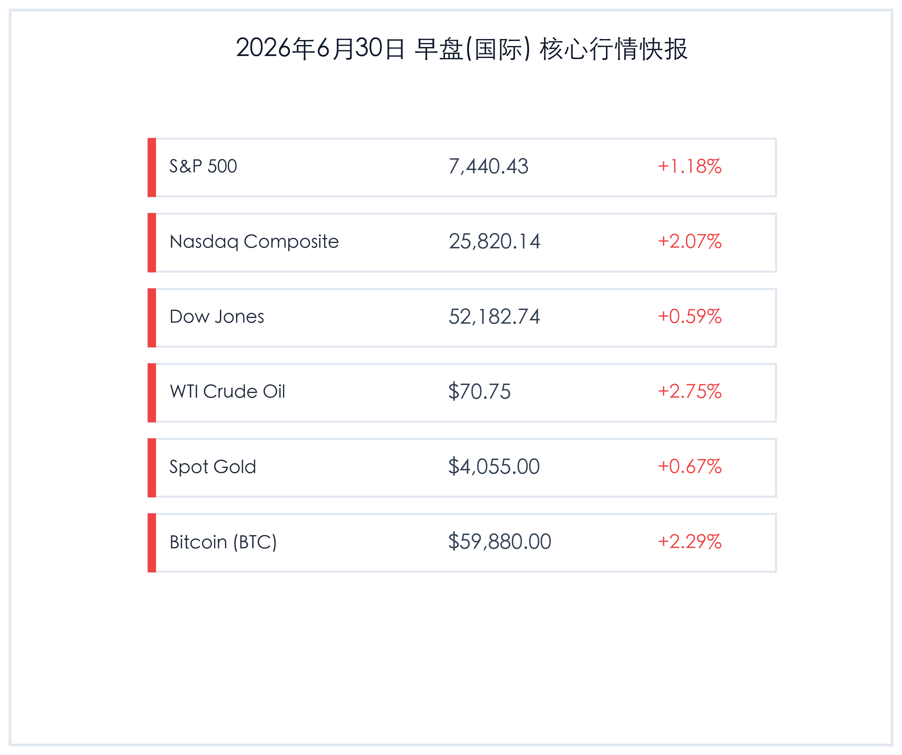

# 早报：美股强劲反弹终结五连阴，美联储独立性获高院力挺，央行创新工具“示量隐价”平滑流动性

**日期：2026年06月30日 (星期二)** &nbsp; **时段：早报 (常规交易日模式)**

> **核心摘要**：隔夜海外市场迎来强劲反弹，美股三大股指全面收高，纳指领涨2.07%，终结连续五日的下跌行情。科技与AI板块重现活力，且美伊重回谈判桌缓和地缘焦虑，油价温和回升，黄金继续站稳4000点关口。同时，美国最高法院力挺美联储独立性，政策不确定性降低。国内方面，央行首次推出“示量隐价”的隔夜逆回购工具平滑季末流动性，而监管层继续重拳整治误导性信披，市场进入基本面与政策重估的新阶段。

## 核心行情复盘

隔夜全球核心资产表现强劲，科技股领涨，大宗商品及加密货币多数回升：

*   **标普500指数 (S&P 500)**：收盘 **7,440.43点**，上涨 **86.41点**，涨幅 **+1.18%**。
*   **纳斯达克综合指数 (Nasdaq)**：收盘 **25,820.14点**，上涨 **522.53点**，涨幅 **+2.07%**。
*   **道琼斯工业平均指数 (Dow Jones)**：收盘 **52,182.74点**，上涨 **306.63点**，涨幅 **+0.59%**，创下收盘历史新高。
*   **WTI原油期货**：收盘 **70.75美元/桶**，上涨 **1.89美元**，涨幅 **+2.75%**。
*   **伦敦现货黄金**：收盘 **4,055.00美元/盎司**，上涨 **27.00美元**，涨幅 **+0.67%**。
*   **比特币 (BTC)**：收盘 **59,880.00美元**，上涨 **1340.00美元**，涨幅 **+2.29%**。
*   **美元指数 (DXY)**：收报 **101.20**，跌幅 **-0.16%**。
*   **美国10年期国债收益率**：收报 **4.38%**，微升 **1 bp**（0.01个百分点）。

### 行业板块表现
*   **领涨行业**：科技、半导体与互联网板块。英伟达、微软等AI概念股强劲反弹，Alphabet正式作为道琼斯工业平均指数成分股首发亮相（替代Verizon），带动科技板块情绪快速修复。
*   **领跌行业**：传统公用事业、电信服务板块。由于科技股虹吸效应，加上Alphabet权重调整，传统电信板块走势相对偏弱。

## 核心解读与市场逻辑

> ### 1. 科技股大反弹与Alphabet“道指首秀”
> **事件原因与市场洞察**：美股科技股与AI板块隔夜强劲攀升，纳指大涨超2%。在经历了连续五天的获利回吐后，资金重新回流硬科技与算力基础设施板块。此外，Alphabet正式取代Verizon成为道指成分股，标志着传统电信巨头在基准指数中权重的衰退以及科技巨头主导地位的进一步巩固。地缘政治方面，美伊重新开启谈判的消息，虽然短期利好地缘情绪，但也由于霍尔木兹海峡冲突概率下降导致大宗商品逻辑微调，WTI原油在前期超跌后收复70美元关口。

> ### 2. 美国最高法院裁决力挺美联储独立性
> **政策与宏观逻辑**：美国最高法院以5比4的投票结果，做出了维护美联储独立性的关键裁决，判定总统目前不能随意免除美联储理事丽莎·库克（Lisa Cook）的职务。这一判决重申了美联储“因故免职”的保护机制，防止货币政策受到行政权力的过度干预。此举有效降低了华尔街对于美联储未来政策独立性受损的担忧，为美债市场和美元指数注入了“稳定剂”，10年期美债收益率在4.38%附近保持平稳。

## 政策脉动

> ### 1. 中国央行创新首发“示量隐价”隔夜逆回购
> **货币政策工具创新**：6月29日，中国人民银行首次开展了隔夜逆回购操作，向市场注入300 billion元流动性。引人瞩目的是，央行并未公开披露此次隔夜逆回购的利率。分析人士指出，这种“示量隐价”（显示数量、隐去价格）的举措属于重大货币政策工具创新，旨在精准调节跨月及跨季度的短期资金面波动，防止市场利率过度震荡，同时避免向市场传递过强的降息或加息利率信号，有助于完善央行短期利率走廊建设。

> ### 2. 证监会Hebei Bureau重拳打击误导性信披
> **行业监管动态**：巨力索具（Juli Sling）因在商业航天业务信息披露中存在误导性陈述，收到证监会河北监管局的行政处罚事先告知书，拟被罚款950万元。这一案例表明监管部门对“蹭热点”、“概念炒作”的信披违法行为保持零容忍高压态势，引导资金回归基本面投资，推动A股估值重构。

## 最新机构观点

*   **高盛 (Goldman Sachs)**：**“盈利驱动而非估值泡沫，Q2季报是核心催化剂”**。高盛认为，美股的本轮上涨是由实打实的盈利增长支撑，而非单纯的估值扩张。即将拉开帷幕的第二季度财报季将是验证AI基础设施及能源相关利润成长性的关键窗口。短期回调提供了良好的买点，维持对科技龙头的超配建议。
*   **摩根士丹利 (Morgan Stanley)**：**“淡化宏观利率波动，深挖微观企业基本面”**。大摩指出，鉴于美联储独立性风波平息和非农数据前夕，分母端国债利率对市场的边际扰动正在减弱。投资者应从追踪宏观货币政策转向深挖“微观”机会，聚焦于行业龙头公司中报的现金流和基本面分化。
*   **中金公司 (CICC)**：**“AI行情正向全产业链扩散，警惕部分海外市场杠杆风险”**。中金公司研究显示，AI赛道的投资热潮正在从单纯的软件及大模型向下游电力基础设施及上游“卖铲人”（设备与材料）扩散。同时，需要注意部分杠杆率过高市场的潜在波动（如韩国股市杠杆虽未达极值但依然处于高位），投资策略上需保持分散度。
*   **中信证券 (CITIC Securities)**：**“季末资金跨年平稳，三季度震荡中把握重构机遇”**。中信证券认为，央行创新的隔夜逆回购工具确保了季末流动性的平稳。尽管三季度初市场可能面临估值重构带来的震荡和频繁洗盘，但政策基调和结构优化大趋势未变，建议重点关注信披规范、具备业绩确定性的先进制造和红利底仓。

## 今日市场情绪：鹰飞浪静，算力重光

> Prompt: Surrealism style, A majestic glowing green fiber-optic eagle soaring high into a clear morning sky above a quiet harbor, carrying a golden olive branch. Below, a massive stone clock tower shows the text 'FED' glowing softly. In the background, a massive screen displays a sharp upward green curve and a glowing Alphabet logo. No text. No humans., masterpiece, high detail, intricate composition, cinematic lighting, 8k resolution

---

免责声明：内容仅供参考，不构成投资建议。
