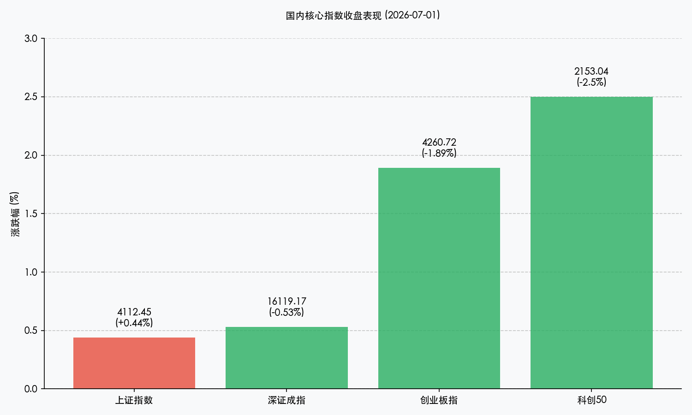

# 险资券商掀起红色风暴，科技硬资产剧烈回吐，A股三点六万亿天量再现“跷跷板”

**日期：2026年07月01日 (星期三)** &nbsp; **时段：晚报 (常规交易日复盘)**

> **核心摘要**：今日A股市场呈现极端分化的“跷跷板”格局。在保险（大涨7.09%）和证券（大涨4.84%）等大金融板块的强势拉升下，上证指数收涨0.44%并站稳4100点上方；然而，前期涨幅较大的半导体、通信设备等科技板块集体回调，拖累创业板指收跌1.89%，科创50重挫2.50%。今日两市成交总额放出3.66万亿元历史天量，显示资金避险与弃守为攻的博弈异常剧烈。此外，港股因香港特区成立纪念日休市一天。

## 核心行情复盘

今日境内外市场走势显著分化，大金融与防御板块强劲撑盘，而高估值科技成长板块出现明显调整。上证指数震荡收高，但深成指、创业板指及科创50均走弱。港股全天休市。

*   **上证指数**：收报 **4112.45点**，上涨 **+0.44%**。
*   **深证成指**：收报 **16119.17点**，下跌 **-0.53%**。
*   **创业板指**：收报 **4260.72点**，下跌 **-1.89%**。
*   **科创50指数**：收报 **2153.04点**，大跌 **-2.50%**。
*   **恒生指数**：休市。
*   **恒生科技指数**：休市。
*   **全市场成交额**：沪深北三市合计成交约 **3.66万亿元**，较前一交易日显著放量 **3862亿元**，交投处于极度亢奋状态。

> **行业板块表现**：今日行业板块呈现极端的“跷跷板”效应。**大金融板块**强势爆发，成为撑盘绝对主力，保险板块录得 **7.09%** 的惊人涨幅，证券板块大涨 **4.84%**，多只行业龙头强势封板。此外，前期表现低迷的**农林牧渔**等传统防御板块全线大涨，掀起涨停潮。与此形成鲜明对比的是，此前累计涨幅巨大的**科技成长板块**遭遇剧烈获利回吐，元件、半导体、通信设备等板块领跌，千元高价股整体出现明显调整。

## 核心解读与市场逻辑

> **大金融板块史诗级大涨，政策预期与防御避险需求共振**
> 
> 今日大金融板块（尤其是保险与证券）成为全场焦点，其暴涨既是资金在科技高位回调时的避险选择，也是受政策红利预期的强力催化。即将于7月6日（下周一）正式施行的A股交易新规明确优化了基金收盘交易机制并扩展了盘后固定价格交易，对证券等中介机构构成实质性利好。此外，估值极低、分红稳定的保险龙头在此节点吸引了大量耐心资本与防守型资金的配置，完成了市场风格的剧烈切换。

> **科技成长板块剧烈杀跌，中报窗口期临近引发估值清洗**
> 
> 创业板指与科创50的深度调整，本质上属于中报预告期临近前的“估值挤水分”。半导体、算力硬件等科技主线前期积累了极其丰厚的获利盘，寒武纪等部分科技龙头因短期股价涨幅过大发布股票交易风险提示公告，直接点燃了获利盘的兑现情绪。市场资金对科技股中报业绩成色的检验变得更为苛刻，部分无业绩支撑的纯概念股出逃明显，促使筹码向具备高确定性业绩的成长股收敛。

> **两市成交创3.66万亿天量，港股休市放大A股内资博弈**
> 
> 7月1日为香港特别行政区成立纪念日，港股休市一天，沪深港通（北向及南向交易）暂停服务。由于没有外资/离岸资金的流入流出扰动，今日A股市场的3.66万亿天量成交完全由内资主力主导。在缺乏外部增量资金缓冲的背景下，内资在“金融蓝筹”与“科技成长”之间的筹码交换和存量博弈更加剧烈，将资金的“跷跷板”效应推向了极致。

## 政策脉动

*   **A股交易新规下周一（7月6日）正式施行**：该规则涉及优化基金收盘交易机制、扩展盘后固定价格交易方式适用品种，以及调整主板风险警示股票涨跌幅限制等。新规的落地不仅有利于提升市场流动性效率，还对券商、指数基金等中介机构带来业务增长预期。
*   **香港特区成立纪念日港股休市**：2026年7月1日（周三）港股休市，沪深港通暂停交易，7月2日（周四）起恢复正常。在此期间，境内两市在没有外资通道干扰的情况下放量成交，由内资主导了跨季度的筹码再平衡。

## 最新机构观点

*   **中信证券**：**“交易新规重构市场生态，风格再平衡正在发生”**。中信证券策略团队认为，即将于7月6日实施的交易新规有利于优化盘后流动性，降低市场非理性波动。当前市场放量拉升金融、杀跌科技，属于典型的中报披露前夕的风格再平衡，建议短期向具有高股息、低估值属性的红利蓝筹偏斜。
*   **中金公司**：**“耐心资本主导资金重组，科技板块回调即是布局良机”**。中金公司策略团队认为，3.66万亿的天量成交说明市场交投情绪依然处于牛市阶段。科技板块的下跌并非逻辑逆转，而是中报披露期前夕的估值挤水分。随着流动性保持宽裕，回调将为下半年业绩优秀的半导体、AI基础设施龙头提供更好的上车机会。
*   **申万宏源**：**“跷跷板效应体现防御诉求，农林牧渔与金融具备防守反击特征”**。申万宏源表示，千元高价股的回调显示出短期市场对高估值溢价的容忍度下降。农林牧渔板块的集体涨停潮和大金融的护盘，体现了场内资金在季末节点对绝对收益的强烈防御诉求，预计市场将在大盘点位震荡中完成筹码换手。

## 今日市场情绪：险资强袭，跷跷板重构平衡

> Prompt: Surrealism style, Subject: A massive golden scale standing in a dreamlike digital desert. On one side of the scale, a heavy glowing red shield representing security and insurance is firmly grounded. On the other side of the scale, a futuristic green satellite made of semiconductor circuits is floating high and light. Background: In the background, a vast starry night sky shows a rising red line on a giant virtual display, contrasting with falling green circuit patterns. No humans. No text., masterpiece, high detail, intricate composition, cinematic lighting, 8k resolution

---

免责声明：内容仅供参考，不构成投资建议。
