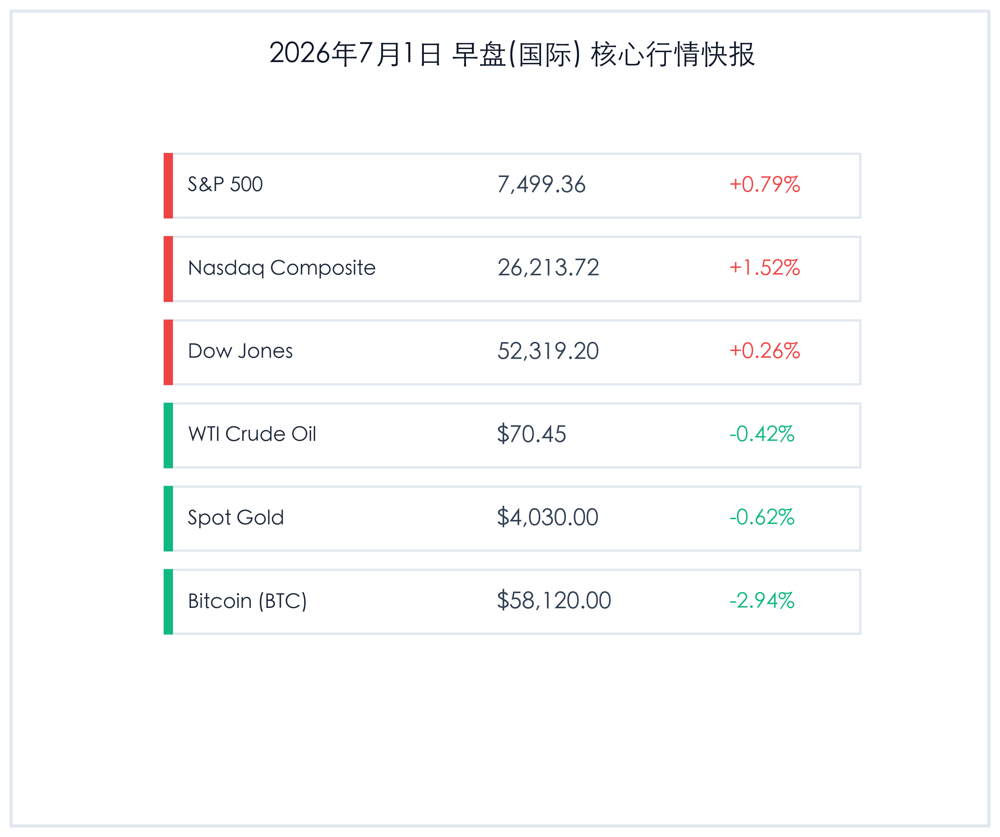

# 早报：美股第二季度强势收官纳指大涨1.5%，中国制造业PMI重回扩张，央行加码逆回购

**日期：2026年07月01日 (星期三)** &nbsp; **时段：早报 (常规交易日模式)**

> **核心摘要**：隔夜海外市场强劲收官第二季度，纳指大涨1.52%领涨三大股指，科技与AI板块重新获得资金青睐。受美联储“更高更久”利率预期影响，美元与美债收益率温和上升，黄金下探至4030美元关口，比特币跌至58000美元上方。国内方面，6月制造业PMI回升至50.3重回扩张区间，央行连续开展大额隔夜逆回购以平滑季末流动性，市场在供求回暖与政策呵护中迎来新一季度。

## 核心行情复盘

隔夜全球核心资产多数走高，科技股全线反弹，而大宗商品及加密货币承压收跌：

*   **标普500指数 (S&P 500)**：收盘 **7,499.36点**，上涨 **58.93点**，涨幅 **+0.79%**。
*   **纳斯达克综合指数 (Nasdaq)**：收盘 **26,213.72点**，上涨 **393.58点**，涨幅 **+1.52%**。
*   **道琼斯工业平均指数 (Dow Jones)**：收盘 **52,319.20点**，上涨 **136.46点**，涨幅 **+0.26%**。
*   **WTI原油期货**：收盘 **70.45美元/桶**，下跌 **0.30美元**，跌幅 **-0.42%**。
*   **伦敦现货黄金**：收盘 **4,030.00美元/盎司**，下跌 **25.00美元**，跌幅 **-0.62%**。
*   **比特币 (BTC)**：收盘 **58,120.00美元**，下跌 **1760.00美元**，跌幅 **-2.94%**。
*   **美元指数 (DXY)**：收报 **101.13**，微跌 **-0.07%**。
*   **美国10年期国债收益率**：收报 **4.42%**，上涨 **4 bp**（0.04个百分点）。

### 行业板块表现
*   **领涨行业**：科技、半导体与软件板块。随着第二季度最后一个交易日的结束，投资者对人工智能（AI）基础设施和计算需求的乐观情绪持续，科技巨头普遍走高，半导体板块领涨。
*   **领跌行业**：能源与大宗商品相关板块。受国际油价及金价下行拖累，油气勘探和黄金开采个股表现疲软。

## 核心解读与市场逻辑

> ### 1. 美股科技龙头领涨 Q2 强势收官
> **事件原因与市场洞察**：周二是2026年第二季度的最后一个交易日。美股尤其是纳斯达克综合指数大涨1.52%，主要得益于AI计算和硬科技估值复苏。投资者在季末重新配置资产，硬科技和半导体板块获得大量资金流入。另一方面，由于市场对美联储维持“高利率更久”的预期，非收益资产如黄金、比特币等高波动性与无息资产持续承压，黄金在季度末创下了较差的季度表现，比特币跌回58,000美元附近。

> ### 2. 美联储政策立场与“高利率更久”信号
> **宏观与政策逻辑**：尽管近期通胀有所放缓，但美联储在六月会议上维持3.50%-3.75%利率的同时，最新经济预测显示官员们对通胀粘性依然保持警惕，并暗示可能需要在更长时间内维持较高利率以彻底击退通胀。这推动10年期美债收益率上升4个基点至4.42%，对金价和非美元货币构成一定压制。

## 政策脉动

> ### 1. 中国制造业 PMI 重回扩张区间
> **宏观经济数据**：中国国家统计局发布的6月份制造业PMI为50.3，较上月回升0.3个百分点，时隔数月重新站稳在50的荣枯线之上，显示国内制造业景气度有所回暖。非制造业PMI亦微升至50.2，基建和高端制造的稳步推进对经济企稳起到了重要支撑作用。

> ### 2. 人行连续开展隔夜逆回购注入流动性
> **货币政策工具操作**：为应对跨半年度、跨季末的短期流动性波动，中国人民银行连续开展隔夜逆回购操作，单日注入600 billion元流动性。市场交易员反馈其实际利率维持在1.25%左右。这种精准、微调的利率走廊调控手段，既保证了银行间市场流动性整体平稳，又未向市场释放过强的“降息”信号，体现了货币政策“防震荡、稳预期”的政策取向。

## 最新机构观点

*   **高盛 (Goldman Sachs)**：**“季度末重新配置资金，建议聚焦高确定性科技股”**。高盛研究部指出，在季末资金再平衡结束后，市场焦点将迅速转向即将开启的二季度财报季。尽管宏观利率高企可能压制整体估值扩张，但具有强劲自由现金流的科技巨头将继续扮演资金“避风港”角色。
*   **摩根士丹利 (Morgan Stanley)**：**“利率上行周期延长，大宗商品与高杠杆资产需谨慎”**。大摩指出，美联储的“更高更久”立场意味着无风险利率在三季度仍将维持高位，这将继续对黄金和加密货币等资产形成估值压力。短期内建议规避高杠杆的周期性行业，转向防御性红利资产。
*   **中金公司 (CICC)**：**“中国经济景气度筑底回升，关注中报业绩确定性”**。中金公司认为，6月PMI重回扩张区间是一个积极的宏观信号，表明前期政策效应正逐步显现。随着半年报窗口临近，A股和港股将由估值驱动过渡到业绩验证期，建议关注受益于出海及设备更新的高端制造和硬科技板块。

## 今日市场情绪：清晖鸣鸮，蓄势谋新

> Prompt: Surrealism style, A majestic clockwork owl with glowing emerald eyes perched on a branch of a golden tree made of semiconductor circuits. In the background, a massive digital screen displays a sharp upward green curve and a glowing 'Q2' emblem. Below, a small golden scale is slightly tilted with a few gold bars sliding off into a shadow. No text, no humans., masterpiece, high detail, intricate composition, cinematic lighting, 8k resolution

---

免责声明：内容仅供参考，不构成投资建议。
