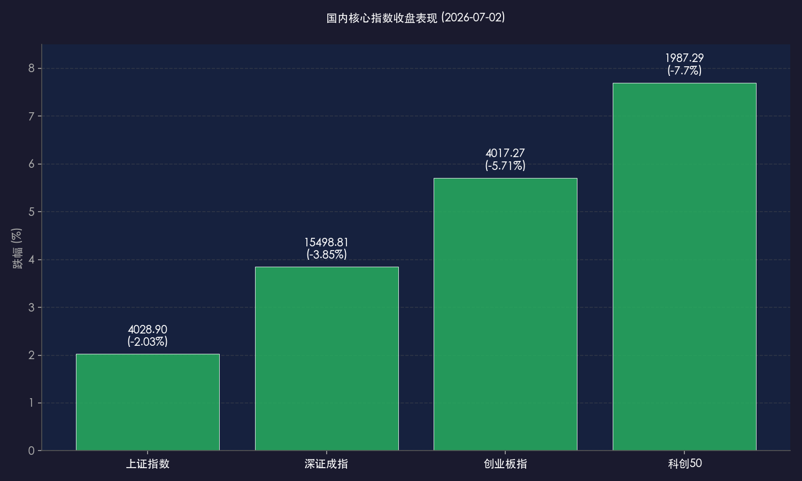

# 科技叙事遭遇"暗物质"冲击，黑色星期四重创创业板，A股价值防御全面切换

**日期：2026年07月02日 (星期四)** &nbsp; **时段：晚报 (常规交易日复盘)**

> **核心摘要**：今日A股遭遇重大冲击，创业板指重挫5.71%、科创50暴跌7.70%，全市场上演"黑色星期四"。导火索是美股隔夜Meta宣布出售过剩算力，引发全球市场对"AI算力叙事"的根本性质疑，恐慌情绪经由费城半导体指数大跌6%+快速传导至A股半导体及算力板块。与此同时，资金迅速切换至贵金属、创新药、公用事业等防御性板块，港股恒生指数逆市上涨0.76%，展现出较强的抗跌韧性。上证指数跌破4100点关口，重回4028点区域。

## 核心行情复盘

今日国内市场呈现剧烈的结构性分化：以半导体、算力硬件为代表的科技成长赛道集体崩塌，而贵金属、创新药、公用事业等防御板块逆势走强，港股整体表现远优于A股。

*   **上证指数**：收报 **4028.90点**，下跌 **-2.03%**（-83.55点）。
*   **深证成指**：收报 **15498.81点**，下跌 **-3.85%**。
*   **创业板指**：收报 **4017.27点**，重挫 **-5.71%**。
*   **科创50指数**：收报 **1987.29点**，暴跌 **-7.70%**，跌破2000点整数关口。
*   **恒生指数**：收报 **23055.03点**，逆势上涨 **+0.76%**（+174.01点）。
*   **恒生科技指数**：收报 **4454.28点**，微跌 **-0.40%**（-17.95点）。
*   **全市场成交额**：沪深北三市合计成交约 **3.47万亿元**，较前一交易日（3.66万亿元）小幅缩量约1900亿元，显示部分资金在恐慌中选择观望。

> **行业板块表现**：今日板块分化达到极端。**领跌板块**以科技硬件产业链为主——半导体设备、存储芯片、算力硬件（CPO等）、通信设备遭遇近乎无差别的集中抛售，北方华创、澜起科技、中微公司等行业权重股跌幅显著，多只龙头盘中触发跌停板；**领涨板块**方面，贵金属板块强势拉升（招金黄金、山金国际、赤峰黄金多只封板），创新药、工程机械、公用事业及高分红蓝筹股吸引资金避险，呈现出明显的"杀高切低"与"科技→价值"的风格轮动特征。

## 核心解读与市场逻辑

> **"Meta出售算力"事件的蝴蝶效应：AI叙事的第一次真正考验**
>
> 7月2日大跌的直接导火索，是Meta宣布组建云计算业务、向外部客户出售"过剩"AI算力的消息。这一信息的核心杀伤力不在于Meta本身的业务变化，而在于它戳破了市场自2024年以来构建的一个核心信仰——**AI算力是绝对稀缺资源**。一旦科技巨头开始出售算力，市场便不得不重新审视：资本开支（Capex）周期是否已见顶？数据中心建设的边际回报率是否正在下滑？这一根本性质疑触发了费城半导体指数隔夜大跌逾6%，形成系统性恐慌，并经由韩国、日本市场快速传导至A股，最终造成今日的剧烈杀跌。

> **A股科技板块的内部脆弱性：拥挤交易的流动性反噬**
>
> 外部催化只是"引线"，A股科技板块内部的高度拥挤才是"火药桶"。进入2026年，AI算力、半导体等赛道年内涨幅已相当可观，市场交易拥挤度（换手率、持仓集中度）持续处于历史高位。在流动性如此紧绷的情况下，任何一个超预期的负面信号都可能触发雪崩式的获利了结与止损离场，形成"价格下跌→强制平仓→进一步下跌"的负反馈循环。今日科创50近8%的跌幅，正是这一机制的充分体现。

> **港股的相对韧性：反映了什么？**
>
> 值得关注的是，港股恒生指数今日逆势上涨0.76%，恒生科技仅微跌0.40%。这背后有几个逻辑：①港股科技股（腾讯、阿里等互联网巨头）与AI算力硬件的直接相关性低于A股；②港股中医药、汽车、消费板块表现强势，吸收了流出科技的资金；③离岸市场对人民币汇率（当日中间价6.8088）及央行宽松预期更为敏感。港股的抗跌表现，在一定程度上说明此次冲击是对A股**特定赛道过度拥挤的定向释放**，而非整体市场趋势的逆转。

## 政策脉动

> **央行：2885亿元逆回购护盘流动性，货币政策框架加速转型**
>
> 中国人民银行于今日（7月2日）以固定利率、数量招标方式开展了**2885亿元7天期逆回购操作**，全额满足一级交易商需求，持续维护市场流动性合理充裕。值得关注的是，自6月下旬以来，央行加快推进货币政策框架转型：6月29日正式落地**隔夜逆回购操作**（3000亿元），该举措被市场解读为完善利率走廊、向价格型调控转型的关键步骤，有助于进一步压缩短端利率波动空间，强化货币政策的精准传导。当日人民币兑美元中间价报**6.8088**，汇率维持稳定。

> **ST股新规7月6日施行：提升定价效率，减少炒作空间**
>
> 监管层持续优化交易制度，沪深主板风险警示股票（ST股）涨跌幅限制将于**7月6日（本周一）**起由5%调整为10%，旨在提升市场定价效率，引导资金更好地识别风险。此举与前期出台的新股上市定价改革、盘后固定价格交易优化等措施一脉相承，监管方向是打击纯概念炒作、引导长期价值投资。

## 最新机构观点

*   **中金公司**：认为A股市场正式进入中报披露窗口期，具备业绩确定性的公司将获得更强的市场定价权。中金指出，"此前高位科技赛道的震荡整理与风格轮动已处于尾声"，建议投资者将视角从"炒主题"切换至"选业绩"，在AI产业链中精挑细选**已实现商业落地、具备中报利润支撑**的环节，如AI应用软件、机器人本体等相对估值合理的方向。

*   **高盛**：尽管短期面临情绪波动，高盛对2026年全年中国股市仍维持**超配**建议。高盛策略师强调，科技公司的盈利增长依然是推动下半年全球股市上行的核心驱动力，并特别看好AI基础设施、电力基础设施及超大规模云服务商（Hyperscalers）等方向——这些领域的长期资本开支逻辑并未因Meta的战术性调整而改变。

*   **博时基金/兴业证券**：均发表研报指出，不应将Meta出售算力的商业行为直接等同于"AI算力过剩"。其核心论点是：AI推理（Inference）需求仍在爆发式增长，Meta此举更像是**通过商业化变现覆盖前期巨额Capex**，而非放弃算力布局。当前A股科技板块的下跌，是一次**阶段性的风格再平衡**，而非科技牛市逻辑的终结，建议在恐慌中关注估值已回归合理区间的优质算力与半导体个股。

## 今日市场情绪：恐慌性清洗

> Prompt: A colossal silicon golem built from stacked GPU chips stands in a storm of falling green candlestick bars, its body cracking and glowing circuits flickering out one by one. In the background, a massive server rack shaped like a crumbling temple collapses in slow motion, while a lone phoenix made of golden light—representing value-style stocks—rises from the ruins below. The sky is split: one side dark with storm clouds labeled 'AI Bubble?', the other glowing amber with dawn light.

---

*免责声明：内容仅供参考，不构成投资建议。*
