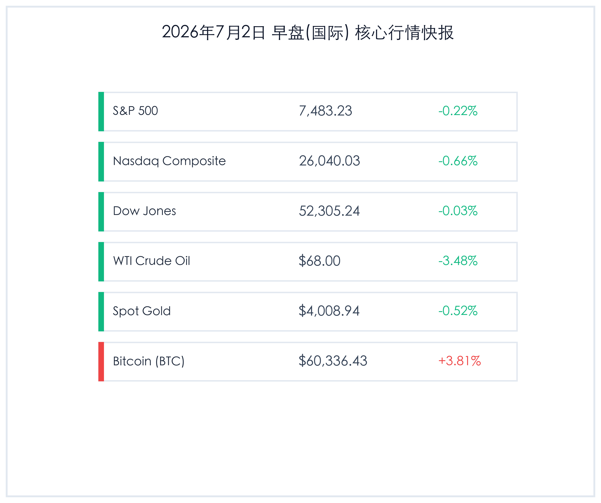

# 早报：美股高位回落纳指跌0.66%，WTI原油大跌近3.5%，中国首部《境外投资条例》正式施行

**日期：2026年07月02日 (星期四)** &nbsp; **时段：早报 (常规交易日模式)**

> **核心摘要**：隔夜海外市场在高位迎来盘整，受半导体与科技股季末获利回吐及ISM制造业PMI略逊预期拖累，纳指收跌0.66%，标普500小幅回调。由于中东停火协议达成促使油价暴跌，WTI原油重挫近3.5%失守68美元大关，极大地缓解了通胀担忧。比特币在下探至21个月低点后强力反弹，重回60,000美元上方。国内方面，备受瞩目的中国首部《境外投资条例》于昨日正式实施，将出海半导体与AI等敏感领域纳入生命全周期强监管，外汇与资本流动监管双双筑起防波堤。

## 核心行情复盘

隔夜全球核心资产多数走弱，科技股高位盘整，而原油、黄金均震荡收跌，比特币展现出极强的探底回升走势：

*   **标普500指数 (S&P 500)**：收盘 **7,483.23点**，下跌 **16.13点**，涨幅 **-0.22%**。
*   **纳斯达克综合指数 (Nasdaq)**：收盘 **26,040.03点**，下跌 **173.69点**，涨幅 **-0.66%**。
*   **道琼斯工业平均指数 (Dow Jones)**：收盘 **52,305.24点**，下跌 **13.96点**，涨幅 **-0.03%**。
*   **WTI原油期货**：收盘 **68.00美元/桶**，下跌 **2.45美元**，涨幅 **-3.48%**。
*   **伦敦现货黄金**：收盘 **4,008.94美元/盎司**，下跌 **21.06美元**，涨幅 **-0.52%**。
*   **比特币 (BTC)**：收盘 **60,336.43美元**，上涨 **2216.43美元**，涨幅 **+3.81%**。
*   **美元指数 (DXY)**：收报 **101.33**，上涨 **+0.20%**。
*   **美国10年期国债收益率**：收报 **4.47%**，上涨 **5 bp**。

### 行业板块表现
*   **领涨行业**：加密货币及区块链概念股、公用事业板块。比特币的大幅反弹带动了矿商和加密概念股逆势走强，而在美股大盘疲弱时，避险防御性公用事业板块受到青睐。
*   **领跌行业**：半导体与硬件、能源板块。半导体等前期高歌猛进的AI龙头板块面临较大的盈利回吐压力；油价大跌则直接重挫了埃克森美孚等跨国能源巨头的股价。

## 核心解读与市场逻辑

> ### 1. 美股科技股高位获利了结，ISM数据微幅降温
> **事件原因与市场洞察**：周三美股主要指数震荡整理，特别是科技股为主的纳斯达克指数下跌0.66%，主要源于半导体及算力板块在创下历史新高后，面临季末/季初的仓位重组和获利了结压力。此外，6月美国ISM制造业PMI录得53.3%，略低于市场预期的53.8%和前值的54.0%，虽然反映出美国制造业连续六个月处于扩张区间，但景气回升步伐开始放缓，进一步压制了大盘估值扩张。

> ### 2. 停火预期促油价暴跌，比特币探底强力回弹
> **宏观与资产逻辑**：大宗商品市场迎来剧烈震荡。受地缘停火协议达成的利好预期驱动，WTI原油期货单日暴跌3.48%至68.00美元/桶，创下近期单日最大跌幅。能源成本的下降在短期内减轻了通胀焦虑，使得ISM物价支付指数大降9.1个百分点至73.0%。在此环境下，美债10年期收益率仍攀升5个基点至4.47%。令人瞩目的是，加密货币市场在日内下探至57,950美元的21个月低点后，随着避险情绪减弱和抄底买盘迅速涌入，在晚间发起强劲反弹，收复60,000美元大关并报收60,336.43美元，表现出极强的反弹韧性。

## 政策脉动

> ### 1. 中国首部《境外投资条例》正式施行，强化AI与半导体出海监管
> **宏观经济与产业政策**：自7月1日起，由国务院颁布的我国首部《境外投资条例》（国务院令第837号）正式生效施行。这标志着中资境外投资正式迈入高层级“全生命周期监管”时代。该条例首次将人工智能、半导体、动力电池以及新能源汽车等关键敏感性出海领域划归国家安全审查重点，对境外主体的穿透式合规审查及违法惩处力度均实现了跨越式升级。

> ### 2. 央行加强汇率指导，人民币中间价偏强凸显稳定意图
> **货币与监管政策**：在美联储“更高更久”利率基调和美元指数反弹至101.33的背景下，中国人民银行昨日将美元/人民币中间价设定为6.8067，显著强于市场平均预期，展示了强烈的稳定人民币汇率信号。同时，中国证监会（CSRC）已命令限制境内投资者通过跨境衍生品通道变相进入全球市场。这套外汇防御及跨境资本流控组合拳，充分表明了监管部门在复杂多变的外部利差环境下，全力呵护国内资本流动平稳和汇率稳定的政策取向。

## 最新机构观点

*   **高盛 (Goldman Sachs)**：**“科技股的温和回调提供了再建仓的契机”**。高盛全球市场部指出，尽管制造业PMI回落且指数短期盘整，但全球AI基础设施及硬科技资本支出的强劲基本面没有改变。在即将到来的二季度财报季之前，科技股的仓位微调是健康的，优质科技股的短期低点依然是中长线资金 durable 的良性买点。
*   **摩根士丹利 (Morgan Stanley)**：**“地缘局势缓解缓解通胀，但高利率制约估值上限”**。大摩分析师表示，原油暴跌虽然极大地释放了输入性通胀压力，但美债收益率攀升至4.47%显示，联储维持高利率的基调仍是市场的主线逻辑。这限制了无息资产（如黄金）及高风险高波动资产（如科技成长股）的整体估值天花板，后市大宗商品宽幅震荡概率较高。
*   **中金公司 (CICC)**：**“首部《境外投资条例》引导规范化出海，合规为首要基石”**。中金研究部表示，出海已经成为国内高精尖产业的第二增长曲线。随着条例的施行，合规成本将会上升，对缺乏海外法务及穿透合规能力的中小企业构成挑战，但对于深耕海外市场、具备完善出海架构的行业龙头而言，行业门槛的抬高反而巩固了其长期出海的竞争优势。

## 今日市场情绪：清晖鸣鸮，衡定风波

> Prompt: Surrealism style, A majestic white stone owl with glowing green semiconductor eyes perched on a branch of a silicon circuit tree, holding a golden scale where a glowing microchip balances against a falling black oil barrel. In the background, a storm of red lightning is clearing up to reveal a calm, starry night sky with a rising green phoenix. No human visible., masterpiece, high detail, intricate composition, cinematic lighting, 8k resolution

---

免责声明：内容仅供参考，不构成投资建议。
