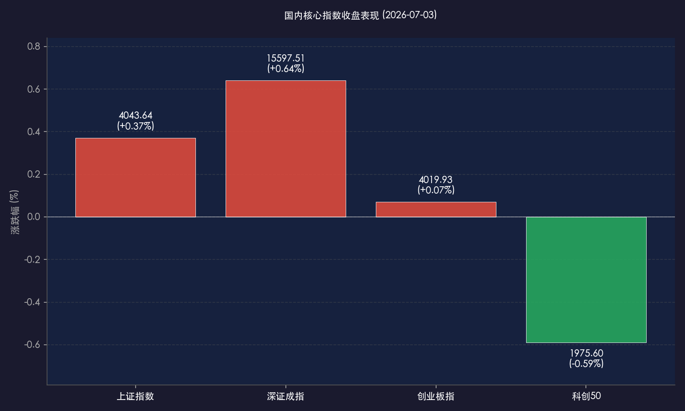
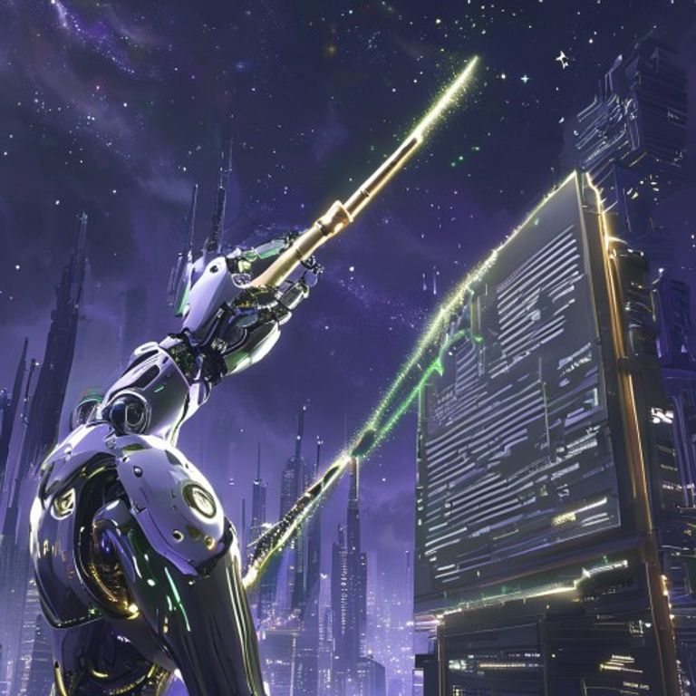

# 宇树科技IPO注册获批引爆具身智能，机器人概念掀涨停潮，A股价值成长迎核心分化

**日期：2026年07月03日 (星期五)** &nbsp; **时段：晚报 (常规交易日复盘)**

> **核心摘要**：今日A股与港股主要指数集体收涨，全全上演探底拉升的收官行情。板块方面呈现剧烈分化，机器人概念股在宇树科技科创板IPO注册获批以及特斯拉Optimus人形机器人量产提速的重磅催化下全线爆发，掀起涨停潮。与此形成对比的是，半导体材料板块震荡下挫，科创50指数微跌0.59%。央行开展630亿元逆回购，实现净回笼，人民币兑美元中间价调升41个基点报6.8047，整体资金面维持合理充裕，市场逐步从前期的恐慌情绪中重回基本面支撑的轨道。

## 核心行情复盘

今日国内市场震荡走高，沪深两市超3800只个股上涨，科技板块呈现结构性大分化，人形机器人及智能制造概念极度强势，而半导体硬件赛道则延续整理，港股涨幅领先。

*   **上证指数**：收报 **4043.64点**，上涨 **+0.37%**（+14.74点）。
*   **深证成指**：收报 **15597.51点**，上涨 **+0.64%**（+98.70点）。
*   **创业板指**：收报 **4019.93点**，上涨 **+0.07%**（+2.66点）。
*   **科创50指数**：收报 **1975.60点**，下跌 **-0.59%**（-11.69点）。
*   **恒生指数**：收报 **23350.03点**，上涨 **+1.28%**（+295.00点）。
*   **恒生科技指数**：收报 **4499.00点**，上涨 **+1.00%**（+44.72点）。
*   **全市场成交额**：沪深两市全天成交额约为 **3.18万亿元**，较前一交易日（3.47万亿元）缩量约2900亿元，反映出在大跌后市场情绪有所平复，资金操作趋向谨慎。

> **行业板块表现**：今日市场热点高度聚焦在**机器人概念**板块，多只龙头个股掀起涨停潮，成为全市场最强的吸金主线。此外，贵金属板块延续强势，电网设备、航天军工等防御及硬科技板块走强。**领跌板块**方面，半导体材料及部分芯片设计个股出现震荡下挫，科技硬件产业内部呈现“机器人强、半导体弱”的显性风格分化。

## 核心解读与市场逻辑

> **宇树科技科创板IPO获批：人形机器人“新锚点”确立**
>
> 证监会正式同意宇树科技首次公开发行股票并在科创板上市的注册申请，拟募集资金42.02亿元。作为全球人形机器人的领军企业之一，宇树科技成功登陆科创板，填补了A股在纯正人形机器人整机标的上的空白。市场普遍预期，这一标志性事件将为国产人形机器人产业链确立全新的估值体系，并引导二级市场资金从“虚概念炒作”向“有核心硬件及整机量产能力”的龙头个股收敛。

> **特斯拉Optimus量产提速与博览会开幕：产业进入交付与制造落地期**
>
> 近期马斯克透露弗里蒙特工厂Optimus机器人产线最新进展，预期7月底至8月将正式启动首批人形机器人的量产，且上调了产能目标。同时，7月2日至4日举办的上海具身智能博览会，优必选、智元等头部厂商密集发布新品，将具身智能产业链的曝光度推向年内最高潮。人形机器人行业正从“故事阶段”加速向“制造与交付阶段”过渡，硬件端核心零部件（如灵巧手、伺服电机、减速器）的产能落地和订单交付成为股价上涨的坚实支撑。

> **科技赛道的大分化：避险资产与新制造的共振**
>
> 在经历昨日由美股传导而来的“AI算力泡沫质疑”重挫后，今日市场并未出现恐慌蔓延，而是迅速完成内部风格切换。资金流出拥挤的半导体设备和材料板块，一方面流向了具有强烈宏观确定性与量产提速预期的机器人板块，另一方面继续驻留于贵金属及公用事业等防御板块。这表明市场在震荡中正以更务实的态度重新定价中国制造业升级逻辑，即“能落地、能出口、有订单”的高端制造正取代纯AI算力概念。

## 政策脉动

> **央行：逆回购操作缩量回笼，货币框架转轨期精细调控**
>
> 中国人民银行今日（7月3日）以固定利率、数量招标方式开展了**630亿元7天期逆回购操作**，利率维持在**1.40%**不变。鉴于今日有2315亿元7天期逆回购到期，公开市场实现了净回笼1685亿元。在经历6月底和季末的流动性宽幅投放后，央行开始通过逆回购适度缩量回收多余资金，进一步展示了央行利用“隔夜逆回购 + 7天逆回购”工具箱实施精细化“削峰填谷”的能力，强化向价格型货币政策框架转型的调控信号。

> **人民币汇率稳中有进，中间价调升创阶段新高**
>
> 今日人民币兑美元汇率中间价报**6.8047**，较前一交易日调升41个基点，体现出人民币汇率整体稳健和双向波动的韧性。由于美联储政策转向预期升温，以及国内经济和高端制造业基本面稳固，离岸及在岸人民币资产对海外资金吸引力回升，这也为港股的走强提供了强有力的汇率支持。

## 最新机构观点

*   **中信证券**：宇树科技的成功IPO标志着中国人形机器人产业正式进入证券化和规模化发展的新阶段，将重塑整个具身智能板块的估值模型。建议关注核心零部件领域中，技术壁垒高、已切入海外及头部主机厂供应链、国产化率有望率先突破的减速器和高精度传感器供应商。

*   **摩根士丹利**：人形机器人正迎来属于它的“特斯拉Model 3时刻”。根据最新的供应链调研，国产机器人核心零部件的整体国产化率已突破75%，中国供应链的成本优势和制造规模将成为全球市场不可忽视的力量，大幅上调了2026年中国市场人形机器人的出货量预期。

*   **兴业证券**：2026年被确立为人形机器人的商业量产元年。当前板块的爆发体现了硬件迭代与商业订单落地共振的投资逻辑。建议投资者从前期的题材博弈转向对企业核心技术专利和量产订单订单量的实地考察，重点配置具备长期竞争力的高弹性整机和核心关节标的，防范部分无实质业务的纯概念炒作股票的估值回撤。

## 今日市场情绪：智能觉醒与价值归航

> Prompt: Surrealism style, A futuristic robotic arm made of glowing circuits and silver silicon, holding a delicate golden calligraphy brush, painting a rising green line onto a massive plaque of the STAR Market. In the background, swirling silver gears and majestic skyscrapers built from stacked CPU chips stand under a dark violet sky filled with twinkling stars. No humans., masterpiece, high detail, intricate composition, cinematic lighting, 8k resolution

---

*免责声明：内容仅供参考，不构成投资建议。*
