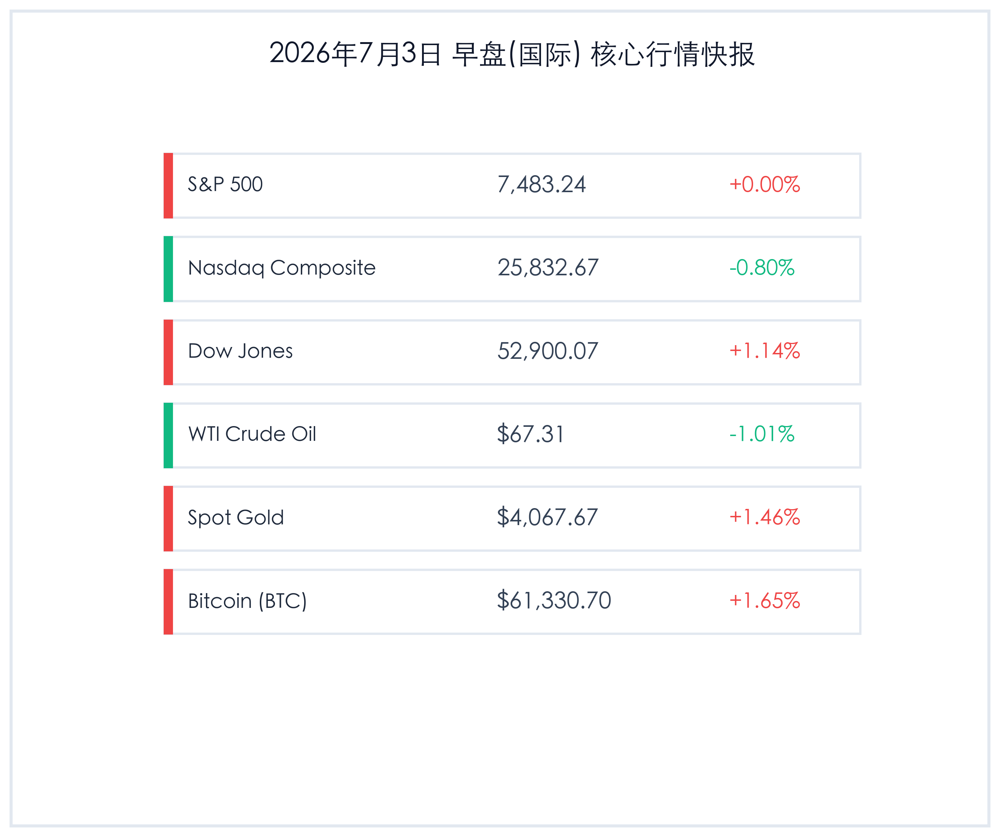

# 早报：美股高位分化道指新高，非农爆冷助推降息预期，黄金比特币携手反弹

**日期：2026年07月03日 (星期五)** &nbsp; **时段：早报 (常规交易日模式)**

> **核心摘要**：美国6月非农新增就业仅5.7万人远逊预期，且前两月数据大幅下调，创下近期最差表现，显著强化了市场对美联储9月降息的预期。受此影响，隔夜海外市场高位分化，资金从高估值半导体板块向传统价值股和防守板块轮动，道指在蓝筹股带领下飙升1.14%创出收盘新高，而纳指受芯片与AI龙头股季末回调压制收跌0.80%。美元指数暴跌近0.7%失守101关口，美债收益率下行，刺激黄金价格强劲反弹近1.5%，比特币亦收复61,000美元大关。国内方面，国务院境外投资新规正式施行，“算电协同”政策加速落地，为高水平合规出海和AI算力基础保驾护航。

## 核心行情复盘

隔夜全球核心资产走势分化，科技股高位盘整回吐，传统蓝筹板块强势崛起，黄金与比特币受弱美元支撑携手走强：

*   **标普500指数 (S&P 500)**：收盘 **7,483.24点**，上涨 **0.01点**，涨幅 **+0.00%**。
*   **纳斯达克综合指数 (Nasdaq)**：收盘 **25,832.67点**，下跌 **207.36点**，涨幅 **-0.80%**。
*   **道琼斯工业平均指数 (Dow Jones)**：收盘 **52,900.07点**，上涨 **594.83点**，涨幅 **+1.14%**。
*   **WTI原油期货**：收盘 **67.31美元/桶**，下跌 **0.69美元**，涨幅 **-1.01%**。
*   **伦敦现货黄金**：收盘 **4,067.67美元/盎司**，上涨 **58.73美元**，涨幅 **+1.46%**。
*   **比特币 (BTC)**：收盘 **61,330.70美元**，上涨 **994.27美元**，涨幅 **+1.65%**。
*   **美元指数 (DXY)**：收报 **100.63**，下跌 **-0.69%**。
*   **美国10年期国债收益率**：收报 **4.46%**，下跌 **1 bp**。

### 行业板块表现
*   **领涨行业**：金融、工业、公用事业及加密货币概念股。弱非农数据强化了美联储降息预期，金融与重工业板块受到资金流入支撑；美元指数跌破101大关也推动了黄金及数字资产走强，带动相关矿商和概念股逆势反弹。
*   **领跌行业**：半导体与算力硬件、能源板块。半导体板块在季度末后面临集中获利了结与仓位调配压力；地缘缓和及全球需求担忧致原油继续收跌，拖累大型跨国能源企业表现。

## 核心解读与市场逻辑

> ### 1. 非农爆冷强化降息预期，道指受避险及降息逻辑推动创历史新高
> **事件原因与市场洞察**：周四美国劳工统计局公布的6月非农数据极度疲软，新增就业仅为5.7万人，远低于市场预期，且前两个月数据累计大幅下调7.4万人。尽管失业率因劳动参与率下降微跌至4.2%，但就业市场的快速冷却是美联储无法忽视的硬着陆风险。这使得市场对9月份美联储启动降息的概率预期大幅上升。受此逻辑推动，对利率敏感的传统工业、金融以及防守型公用事业板块吸引了大量资金避险，推动偏重蓝筹的道指飙升1.14%创出收盘历史新高；而标普500在科技与价值股的分化拉锯中最终几乎平收。

> ### 2. 科技股高位承受回吐压力，弱美元刺激无息资产共振大涨
> **宏观与资产逻辑**：以科技股为主的纳斯达克指数大幅下跌0.80%，反映出在创下历史新高后，科技与半导体龙头股在季度初面临重组配置的获利回吐压力。然而，劳动力市场的疲软打击了美元走势，美元指数（DXY）重挫0.69%至100.63，创近期新低。伴随着美元走弱与10年期国债收益率的下滑，黄金作为防守性资产的吸引力急剧攀升，伦敦金现货单日飙升1.46%至4,067.67美元/盎司。同时，比特币也借助流动性宽松预期在60,000美元下方探底回升，最终收复61,330.70美元，表现出极强的反弹动能。此外，美国股市在周五（7月3日）因独立日假期提前休市，市场交投也呈现了典型的假日前仓位规避特点。

## 政策脉动

> ### 1. 国务院境外投资新规落地与中美农产品对等降税框架推进
> **宏观经济与产业政策**：自7月1日起，《国务院关于对外投资的规定》正式施行，推动我国企业境外投资进入规范化、法治化轨道，通过全生命周期合规监管支持出海企业防范地缘风险。与此同时，商务部近日释放积极信号，中美双方已原则同意将相关农产品纳入对等降税框架安排，有望提振双边农产品贸易；中英第15次经贸联委会（JETCO）也在伦敦成功举行，凸显出中方积极主动吸引外资、扩大高水平对外开放的政策决心。

> ### 2. “算电协同”被纳入“十五五”规划，解决AI时代电网瓶颈
> **能源与技术政策**：随着AI大模型对电力需求的爆发式增长，“算电协同”已被明确纳入国家“十五五”规划纲要。相关政策旨在打通绿色能源与西部算力中心的瓶颈，加速推动算力负荷与新型电力系统的深度融合。这不仅有助于优化国内算力基础设施布局，还能为高能耗的AI产业提供长远、稳定的绿色电力保障，实现资源的高效跨区配置。

## 最新机构观点

*   **摩根大通 (J.P. Morgan)**：**“非农降温吹响降息前奏，防守型蓝筹股价值凸显”**。小摩策略师指出，非农的爆冷进一步佐证了劳动力市场“降温”已成定局。在美联储政策转向确定性增强的背景下，高估值科技股短期由于估值偏高存在轮动回吐压力，而基本面扎实、分红稳定的防守型传统蓝筹股将迎来极佳的资金配置窗口。
*   **高盛 (Goldman Sachs)**：**“黄金与比特币已转入弱美元上升通道”**。高盛大宗商品研究部门认为，美元指数失守101是黄金和数字资产新一轮反弹的关键催化剂。随着降息预期升温和美债实际收益率走低，黄金的抗通胀与防守属性将继续吸引央行与长线资金流入，黄金及比特币等高弹性资产后市震荡上行的趋势已经确立。
*   **中金公司 (CICC)**：**“算电协同打破算力天花板，看好绿电+算力双轮驱动企业”**。中金研究部表示，AI发展的尽头是电力。“算电协同”上升到国家战略高度，不仅解决了东部电力紧张与西部算力富余的矛盾，还将为拥有绿电资源和先进算力管理能力的龙头企业提供长期产业红利，推动算力产业链由粗放型建设转向绿色高效运营。

## 今日市场情绪：传统重夺秤杆，弱美元助推复苏

> Prompt: Surrealism style, A majestic golden scale in a dreamlike digital forest, where one side holds a heavy glowing gear representing traditional value stocks rising towards a bright golden sun, and the other side holds a cracked semiconductor microchip descending into green data streams. In the background, a gentle rain of dollar bills is clearing up to reveal a giant glowing pocket watch displaying a rate cut countdown, while a rising golden phoenix soars into the sky. No humans., masterpiece, high detail, intricate composition, cinematic lighting, 8k resolution

---

免责声明：内容仅供参考，不构成投资建议。
