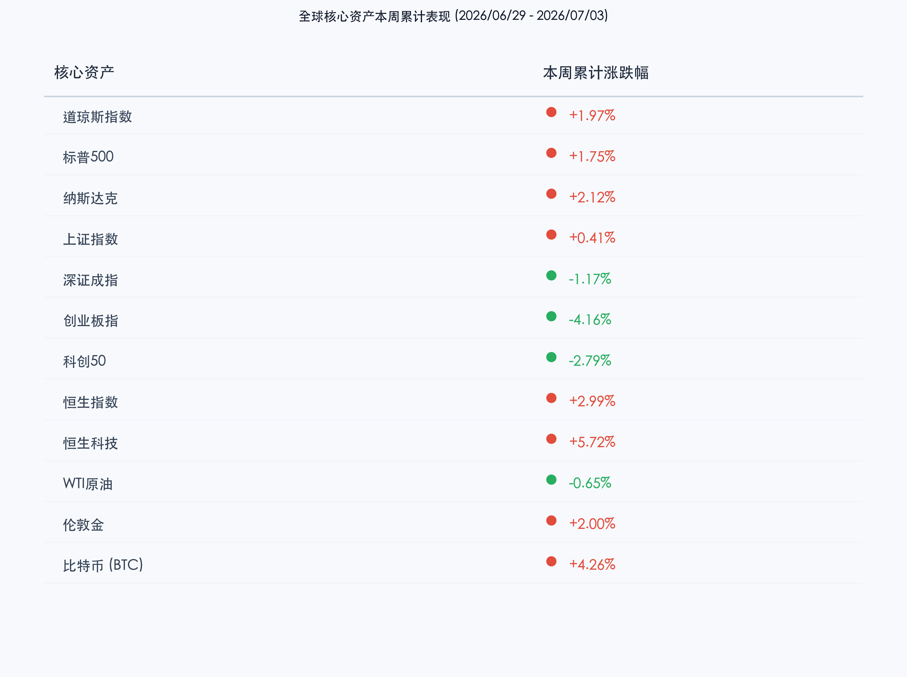

# 机器人IPO点燃具身智能大爆发，非农遇冷强化降息预期，全球市场迎来结构性大洗牌

**日期：2026年07月04日 (星期六)** &nbsp; **时段：晚报 (周末复盘模式)**

> **核心摘要**：本推全球资本市场演绎极端的强弱切换。A股迎来“具身智能第一股”宇树科技科创板IPO注册获批的重磅催化，机器人板块掀起涨停潮，然而在AI算力泡沫及高位芯片股获利回吐压力下，科技硬件出现剧烈分化。外围市场方面，美国6月非农就业数据大幅不及预期（仅增5.7万），强力提振降息预期，推动美股道指创历史收盘新高，美股周五休市前三大股指全周集体收涨。港股表现亮眼，恒生科技指数单周飙升超5.7%，领跑全球主要市场。

## 核心资产周度/日度表现回顾

本周全球资产经历了一轮显著的分化走势。降息预期的迅速升温给全球风险资产注入了流动性信心，但AI硬科技板块的交易拥挤与高估值质疑仍是压制科技指数的核心因素。

*   **道琼斯指数**：周五因独立日假期休市。周四收报 **52,900.07点**，当日上涨 **+1.14%**，全周累计上涨 **+1.97%**。在非农数据走弱强化降息预期的背景下，资金流入传统工业与防守蓝筹，道指逆势创下历史新高。
*   **标普500指数**：周五休市。周四收报 **7,483.24点**，当日变动 **0.00%**，全周累计上涨 **+1.75%**。
*   **纳斯达克指数**：周五休市。周四收报 **25,832.67点**，当日下跌 **-0.80%**，全周累计上涨 **+2.12%**。半导体及AI硬件产业链在连续飙升后出现局部高位调整，限制了指数的单日表现。
*   **上证指数**：周五收报 **4,043.64点**，单日上涨 **+0.37%**，全周累计上涨 **+0.41%**。A股在红利板块抗跌与机器人题材大爆发下，沪指表现出极强的韧性，实现探底回升。
*   **深证成指**：周五收报 **15,597.51点**，单日上涨 **+0.64%**，全周累计下跌 **-1.17%**。
*   **创业板指**：周五收报 **4,019.93点**，单日上涨 **+0.07%**，全周累计下跌 **-4.16%**。科技成长赛道的高低切换导致创业板指全周承压。
*   **科创50指数**：周五收报 **1,975.60点**，单日下跌 **-0.59%**，全周累计下跌 **-2.79%**。
*   **恒生指数**：周五收报 **23,350.03点**，单日上涨 **+1.28%**，全周累计上涨 **+2.99%**。港股在人民币汇率企稳及外围资金回流的支撑下表现强劲。
*   **恒生科技指数**：周五收报 **4,499.00点**，单日上涨 **+1.00%**，全周累计上涨 **+5.72%**，领涨全球主要指数。
*   **WTI原油**：周五收报 **68.78美元/桶**，单日上涨 **+0.16%**，全周累计下跌 **-0.65%**。地缘政治局势缓和，霍尔木兹海峡恢复顺畅通航，避险溢价进一步消退。
*   **伦敦金**：周五收报约 **4,181.00美元/盎司**，单日大幅上涨 **+1.10%**，全周累计上涨 **+2.00%**。非农爆冷拖累美元与美债收益率走低，避险及降息博弈资金全力推升金价。
*   **比特币 (BTC)**：周五收报约 **61,800.00美元**，单日上涨 **+1.15%**，全周累计上涨 **+4.26%**。资金流动性改善预期令加密资产本周顺利守稳60,000美元大关。

## 过去 48 小时重磅事件深度复盘

> **宇树科技科创板IPO获批：机器人板块掀起“产业化元年”涨停潮**
>
> 证监会于本周末前正式同意宇树科技科创板IPO注册申请。拟募资42.02亿元的宇树科技作为国内人形机器人领域的明星独角兽，其成功上市填补了A股市场在具身智能整机标的上的空白，这也成为点燃机器人板块疯狂大涨的直接导火索。配合特斯拉Optimus产线量产提速与上海具身智能博览会的召开，市场已经开始从单纯的概念炒作向零部件交付与整机量产的实绩过渡。板块内掀起罕见的涨停潮，资金正积极在科技硬件内部进行“高低切换”，从高位算力向性价比更高的机器人零部件企业倾斜。

> **非农数据惨淡“爆冷”：加息警报解除，美联储降息通道或将开启**
>
> 过去48小时内，全球最核心的宏观变动来自美国劳工部公布的6月非农就业数据。数据显示，美国6月新增非农就业人数仅为 **5.7万**，远低于市场预期。失业率的微幅上升与新增就业人数的断崖式下跌，让华尔街对于美联储“长期维持高利率”的忧虑瞬间消散，市场对今年三季度降息的期望值飙升。这也是推动周四美股道指创出历史新高的核心动能，但与此同时，半导体板块等由于前期估值透支，依然在大盘上涨的氛围中表现分化，反映出机构对于经济衰退阴影下的业绩确定性更为警惕。

> **首部“人形机器人伴侣”倡议书与拟人化AI监管：安全与伦理提上日程**
>
> 针对近期市面上各类高拟真度“人形机器人伴侣”和AI互动智能体密集面市，中国人形机器人百人会与机械工业联合会于周末联合发布倡议书，呼吁全行业防范伦理与安全风险，坚持科技向善。同时，市场传出多款头部AI陪聊产品的智能体功能正迎来下线调整。这一动向与即将于7月15日正式施行的《人工智能拟人化互动服务管理暂行办法》紧密相关。这标志着具身智能与人工智能产业在经历无序狂奔后，政策端正快速介入，建立起伦理安全红线，引导行业进入合规化发展轨道。

## 下周全球宏观大事预警

1.  **A股修订版交易新规7月6日（下周一）正式实施**：这是下周国内市场最关键的制度制度变化。主要调整包括：主板风险警示股票（ST、*ST股）涨跌幅放宽至10%；基金尾盘三分钟集合竞价机制优化；盘后固定价格交易适用范围扩大等。制度红利落地初期，投资者应密切关注高风险警示板块的波动，以及大市值ETF的资金流动特征。
2.  **美国6月就业数据的消化与美联储官员表态**：由于下周无美联储议息会议和关键CPI数据（6月CPI定于7月14日公布），市场将主要在震荡中继续消化非农数据的衰退意味。多位美联储官员下周的公开讲话将成为刺探降息时点的重要风向标。
3.  **国内“十五五”规划政策细化落地**：随着发改委及国务院关于美丽中国与循环经济两个“十五五”规划的出台，下周预计各部委及地方政府将有配套落地细则。绿色电力、环保装备、资源再利用板块的订单预期有望在政策催化下逐步明朗。

## 顶级机构周末策略内参摘要

*   **中信证券**：**“K型分化与平衡：以‘新杠铃’策略应对成长切换”**。中信证券在其最新的周末策略研报中指出，当前市场不应盲目遵循单一的牛熊逻辑，而应以“K型思维”看待板块分化。科技硬件板块的资金高低切换已接近尾声。在7月季末考核结束、流动性回归的背景下，建议采用新杠铃配置：一端以确定性极高的AI算力、国产机器人及先进制程设备作为成长进攻，另一端以稳定现金流、高股息的红利板块作为防御底仓。
*   **高盛（Goldman Sachs）**：**“非农降温夯实降息预期，从算力上游向SaaS和应用侧过渡”**。高盛维持对美股的建设性态度。由于非农就业数据疲软降低了分母端压力，降息步伐有望加快。但鉴于半导体上游资本开支的ROI（投资回报率）争议未息，高盛建议策略性地将部分半导体上游算力配置调整至具备强现金流特征的软件服务（SaaS）及具身智能终端标的。
*   **中金公司**：**“估值回归与基本面牵引：聚焦中报业绩确认期”**。中金公司指出，7月A股将正式进入中报业绩预告与披露的密集期。在全球地缘冲突消退（油价回落、黄金震荡）和降息预期明朗的宏观环境下，市场的驱动力将彻底转为“业绩兑现度”。建议投资者避开估值过高、业绩无实质支撑的题材股，重点关注受交易新规利好的大市值核心资产以及订单开始落地的机器人产业链细分龙头。

## 今日市场情绪：智能觉醒与博弈共振

> Prompt: Surrealism style, A futuristic chrome robotic figure sitting at a majestic chessboard made of marble and gold, under a starry midnight sky. On the chessboard, some pieces are shaped like golden coins and others are green microchips. The robot is lifting a golden knight piece with precision. In the background, a giant glowing red neon K-line graph ascends into the clouds, reflecting on the sea below. No humans., masterpiece, high detail, intricate composition, cinematic lighting, 8k resolution

---

*免责声明：内容仅供参考，不构成投资建议。*
