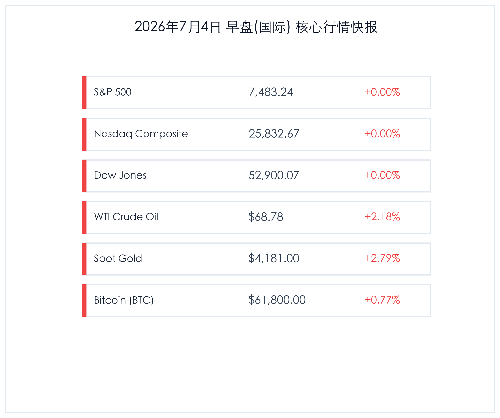

# 早报：美股因独立日休市，非农爆冷持续发酵，黄金原油比特币共振大涨

**日期：2026年07月04日 (星期六)** &nbsp; **时段：早报 (常规交易日模式)**

> **核心摘要**：因美国独立日假期，隔夜美股及美债市场休市。然而，此前公布的极度疲软的美国6月非农数据继续在国际市场发酵，显著升温的降息预期推动非美市场及商品走强。伦敦现货黄金大幅反弹2.79%突破4180美元，WTI原油亦重返68.78美元，比特币稳步攀升收复61,800美元。国内方面，国家发改委下达200亿超长期特别国债支持设备更新，且6月服务业PMI维持扩张，为实体经济与企业转型提供坚实的政策与基本面支撑。

## 核心行情复盘

隔夜全球主要资产交易平淡，受美股休市影响，美指及美债收益率持平，但黄金、原油与加密货币受降息预期发酵推动表现强势：

*   **标普500指数 (S&P 500)**：收盘 **7,483.24点**，上涨 **0.00点**，涨幅 **+0.00%** (因独立日休市)。
*   **纳斯达克综合指数 (Nasdaq)**：收盘 **25,832.67点**，上涨 **0.00点**，涨幅 **+0.00%** (因独立日休市)。
*   **道琼斯工业平均指数 (Dow Jones)**：收盘 **52,900.07点**，上涨 **0.00点**，涨幅 **+0.00%** (因独立日休市)。
*   **WTI原油期货**：收盘 **68.78美元/桶**，上涨 **1.47美元**，涨幅 **+2.18%**。
*   **伦敦现货黄金**：收盘 **4,181.00美元/盎司**，上涨 **113.33美元**，涨幅 **+2.79%**。
*   **比特币 (BTC)**：收盘 **61,800.00美元**，上涨 **469.30美元**，涨幅 **+0.77%**。
*   **美元指数 (DXY)**：收报 **100.85**，上涨 **0.22点**，涨幅 **+0.22%**。
*   **美国10年期国债收益率**：收报 **4.46%**，上涨 **0 bp**，涨幅 **0.00%** (因独立日休市)。

### 行业板块表现
*   **领涨行业**：黄金采掘与贵金属、加密货币概念板块、欧洲及亚太公用事业与防守板块。黄金与比特币受美元走低和降息预期提振，相关上市公司在海外市场表现活跃；亚太与欧洲主要市场在美股休市期间表现平稳，防守型蓝筹板块小幅领涨。
*   **领跌行业**：能源与部分半导体硬件板块出现获利回吐。尽管油价反弹，但欧洲大型能源企业股受需求担忧压制表现分化；亚太半导体板块在面临季度初的资金调配下出现微幅调整。

## 核心解读与市场逻辑

> ### 1. 独立日休市交投平淡，非农余波助推商品与数字资产共振走强
> **事件原因与市场洞察**：周五美国金融市场因独立日假期休市，整体交投清淡。然而，周四非农就业数据的极度疲软（仅录得5.7万人，前值大幅下修）所引发的政策转向预期仍在海外市场和商品市场中继续发酵。市场对于美联储9月份降息的信心空前增强，这直接刺激了对利率高度敏感的黄金和比特币反弹。伦敦现货黄金单日暴涨2.79%，顺利跨过4180美元关口；比特币亦从先前的回吐压力中企稳，重回61,800美元上方，反映出流动性宽松预期对资产估值的修复效应。

> ### 2. 霍尔木兹海峡地缘博弈持续，原油价格触底反弹
> **宏观与资产逻辑**：尽管市场对于全球经济放缓存在顾虑，但地缘政治的溢价支撑力依旧显著。围绕霍尔木兹海峡通航费的博弈虽无激化迹象，但其带给原油供应链的不确定性为油价提供了牢固的基础。叠加弱美元以及美联储流动性好转预期，WTI原油隔夜反弹2.18%至68.78美元/桶。这表明原油在65美元附近已构筑起强有力的底部防线，短期价格仍将在供需关系与地缘溢价之间维持宽幅震荡。

## 政策脉动

> ### 1. 中美同意扩大农产品贸易并推进对等降税框架
> **宏观经济与产业政策**：商务部最新披露，中美双方经过多轮务实沟通，就扩大双边农产品贸易设立了明确引导性目标，并原则上同意将相关农产品纳入对等降税框架安排。此项机制不仅可以大幅度降低我国畜牧业及食品加工业的原材料进口成本，平抑输入性通胀压力，也释放出两国经贸合作阶段性回暖的积极信号，为相关跨国航运与贸易企业增添信心。

> ### 2. 国家发改委2000亿超长期特别国债全面下达，强力支持设备更新
> **财政与产业政策**：国家发展改革委宣布，2026年用于支持大规模设备更新和消费品以旧换新的2000亿元超长期特别国债资金已全部下达完毕。该项政策红利正加速渗透到工业、交通等实体制造领域，通过直接资金补助平补企业技改成本，可有效对冲三季度制造业投资增速的放缓压力，直接拉动国内对高端装备、绿色电力管理系统等领域的资本性支出。

## 最新机构观点

*   **中金公司 (CICC)**：**“超长期国债加速落地，看好设备更新主线与大件消费复苏”**。中金宏观团队指出，2000亿特别国债全部下达，体现了财政支持实体经济的效率与决心。政策资金的到位将有力提振三季度国内工业技改投资。建议重点布局智能制造、绿色电网设备以及直接受益于消费品以旧换新的汽车、家电行业龙头。
*   **高盛 (Goldman Sachs)**：**“非农疲软强化流动性拐点，维持黄金年内超配评级”**。高盛大宗商品研究团队表示，虽然美股假期休市阻断了市场短线波动，但非农就业走弱所揭示的美国经济降温趋势无法扭转。降息周期的临近使得黄金等零票息资产吸引力只增不减。预计美元指数中枢将逐渐下行，维持伦敦现货黄金4200美元以上的年内目标点位。
*   **摩根士丹利 (Morgan Stanley)**：**“中美农产品贸易破冰释放缓和信号，利好双边供应链稳定”**。大摩策略分析师表示，中美两国推进农产品对等降税，是双边关系局部回暖的积极表现。虽然全面关税磨损难以短时间消除，但阶段性的农产品进口成本下调，将切实缓解全球粮食与饲料生产巨头的盈利压力，利好港口运输及跨境物流板块。

## 今日市场情绪：静水流深，金凤展翅

> Prompt: Surrealism style, A majestic glass hourglass standing in the middle of a calm, flat digital ocean under a twilight sky. Inside the upper bulb of the hourglass, a miniature golden eagle is slowly folding its wings, while from the bottom bulb, a brilliant golden phoenix is soaring upwards. In the background, soft red fireworks shaped like rising percentage signs and glowing green and red candlesticks illuminate the horizon. No humans., masterpiece, high detail, intricate composition, cinematic lighting, 8k resolution

---

免责声明：内容仅供参考，不构成投资建议。
