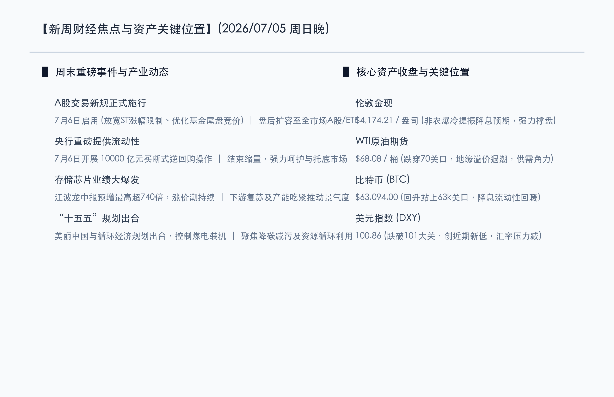

# 新周展望：万亿逆回购重磅护盘，交易新规正式鸣枪，存储龙头爆表业绩拉开中报序幕

**日期：2026年07月05日 (星期日)** &nbsp; **时段：晚报 (新周展望模式)**

> **核心摘要**：本周末国内政策端与资金端迎来密集利好。中国人民银行宣布将于7月6日开展10000亿元3个月期买断式逆回购操作，释放超预期流动性呵护信号；同时，A股筹备已久的交易新规（ST涨跌幅调整、盘后交易扩容、基金尾盘集合竞价）周一正式落地，将深度重塑市场微观结构。产业方面，江波龙等存储芯片龙头中报业绩预增超740倍，预示着半导体中报“业绩验证”主线强势开启。结合外围美联储降息预期升温，新的一周A股及全球市场将迎来流动性与基本面共振的双重催化。

## 周末财经要闻终极汇总

周末期间，国内宏观资金面、交易机制以及核心科技产业均发生重大边际变化，为新一周的市场博弈定下了积极基调。

### 1. 央行打出万亿逆回购大招，结束缩量回笼进入全面呵护
> **事件原因与核心解读**：中国人民银行宣布将于7月6日启动10000亿元的3个月期买断式逆回购操作，此举打破了此前连续数月缩量资金回笼的常态。在二季度末跨季资金面偏紧、交易新规落地初期的关键时刻，央行开展如此大手笔的流动性投放，直接体现了监管层对金融体系平稳运行的全力呵护。此举不仅有助于平抑短端资金成本，更为下半年降准降息操作打开了预期空间，对A股及国债市场是极其坚实的底层支撑。

### 2. A股三大交易新规周一鸣枪，开启制度优化与理性交易新时代
> **市场洞察**：沪深北三大交易所联合发布的新版交易规则将于7月6日（周一）起正式实施。其核心调整涵盖：主板ST/*ST股单日涨跌幅放宽至10%以提升出清效率；盘后固定价格交易扩容至全市场A股及ETF；沪市基金收盘最后三分钟引入集合竞价且不可撤单。新规落地后，尾盘操纵行为将受到强力抑制，大市值核心资产的尾盘流动性与定价机制将进一步优化，但ST板块的波动将明显放大，市场生态正朝着“高波动垃圾股出清、大容量价值股受益”的理性方向加速演进。

### 3. 半导体存储业绩逆天暴增，涨价潮逻辑在中报得到实质验证
> **核心解读**：行业龙头江波龙发布中报业绩预告，净利润同比预增最高超过740倍，暴增数据彻底引爆半导体与存储板块的预期。这一方面得益于下游人工智能服务器及消费电子回暖对高容量存储的刚性需求，另一方面则因供给端先进制程产能受限触发的“7月涨价潮”。除了江波龙外，佰维存储、兆易创新等产业链标的的中报关注度也骤然升温。这表明，半导体行业的投资主线已经正式从前期的“PPT故事”过渡到“真金白银的利润兑现”阶段。

### 4. “十五五”两大规划重磅印发，绿色电力与循环经济迎订单催化
> **事件原因与市场洞察**：国务院和国家发改委分别印发了《美丽中国建设“十五五”规划》与《循环经济发展“十五五”规划》。规划中明确提出要协同推进降碳减污，合理控制煤电装机规模，同时大力发展废旧装备循环再利用。作为引领未来五年绿色发展的顶层设计，相关配套细则下周预计将密集落地，为环保装备、风光储能、智能配电网以及资源再回收细分行业提供持续的实质性订单支撑。

## 新一周市场核心博弈逻辑

> **博弈点 A：万亿增量资金注入，股债汇三市场如何分流定价？**
>
> 央行此次万亿买断式逆回购的期限为3个月，覆盖了整个三季度的流动性需求。在人民币离岸汇率（USD/CNH）本周大幅企稳升值至6.7850水平的背景下，国内外的利差压力正显著减轻。流动性注入后，市场博弈的焦点在于：资金是继续涌入防御性质 of 超长期特别国债，还是选择顺应中报业绩期回流超跌的成长板块？机构普遍预期，债市收益率或将在高位震荡平稳，而A股将直接受益于短期风险偏好回升。

> **博弈点 B：交易机制变更第一周，ST板块与ETF将上演怎样的“微观筹码重构”？**
>
> 新交易新规的实施意味着高频与量化资金需要重写交易策略。尤其是主板风险警示股票涨跌幅限制翻倍至10%后，相关股票的“一字板”被动锁死现象将减少，但博弈的惨烈程度将呈指数级增加。同时，盘后固定价格交易对ETF的全面覆盖，将使大量指数套利资金和中长期机构调仓在收盘后有序消化，从而减少对日内正常交易时段的冲击。第一周的市场波动将主要体现为多空双方对新规则“适应期”的筹码测试。

> **博弈点 C：美联储纪要前的“降息定价”消化期，黄金与比特币是否延续强势？**
>
> 美国6月非农意外“爆冷”后，市场已在隔夜商品盘中基本消化了9月降息的概率。下周三美联储公布的6月会议纪要，将揭示美联储内部对于劳动力市场走软的深层担忧。在10年期美债收益率跌至4.48%、美元指数失守101大关的趋势下，零票息的现货黄金（4174.21美元）和数字黄金比特币（63094.00美元）是否能借风起航、一举突破前期高位平台，将成为全球风险资产流动性的晴雨表。

## 本周重磅经济数据与会议前瞻

*   **周一（7月6日）**：
    *   **A股三大交易新规正式施行**（市场生态与微观结构重塑）。
    *   **央行开展 10000 亿元买断式逆回购操作**（3个月期，重磅注水护盘）。
*   **周二（7月7日）**：
    *   **北约安卡拉首脑峰会召开（至7月8日）**，密切跟踪港口地缘局势的新动态。
*   **周三（7月8日）**：
    *   **美联储 6 月货币政策会议纪要**（北京时间7月9日凌晨02:00公布）：剖析美联储降息天平倾斜的核心会议细节。
*   **周五（7月10日）**：
    *   **中国 6 月 CPI、PPI 通胀数据**：研判二季度国内需求内生动能和价格传导的权威宏观指标。

## 头部券商/投行开盘策略点睛

*   **中信证券 (CITIC)**：**“增量呵护夯实底部，中报季首选硬科技业绩链”**。中信证券周末策略指出，央行大手笔逆回购打消了跨季流动性担忧，A股下行空间被彻底封死。在交易新规实施与中报业绩预告密集披露期，市场风格的高低切换将更加坚决。建议投资者放弃高估值的纯题材概念，将仓位聚焦至中报业绩有强支撑的超跌高景气硬科技方向，如半导体存储器、先进制程材料以及订单确定性强的具身智能硬件链。
*   **中金公司 (CICC)**：**“关注新规平稳过渡，把握业绩兑现度的‘K型分化’”**。中金公司认为，新规落地首周市场微观结构重构可能带来局部震荡，但整体利好中长期价值投资。随着中报预告开启，分子端业绩确认成为选股的唯一金标准。在大宗商品地缘溢价退潮的背景下，建议超配具备高壁垒、高现金流的红利底仓，并逢低吸纳基本面触底反弹的消费电子和半导体封测链条。
*   **高盛 (Goldman Sachs)**：**“流动性边际转折确立，看好新兴市场红利重估”**。高盛亚洲团队最新报告指出，美联储降息概率的上行将引导全球套利资金向新兴市场分流。结合中国央行万印逆回购的积极表态和人民币汇率的强劲升值，中国A股资产的估值性价比进一步凸显，尤其是盘后固定价格交易扩容将极大吸引海外大资金的平稳流入，高盛维持对中国大市值核心资产的超配建议。

## 今日市场情绪：万川归海，光耀硅基

> Prompt: Surrealism style, A colossal digital gateway made of glowing green and gold circuits, opening to release a tidal wave of golden coins and green light. In the background, a massive glowing semiconductor wafer shines like a new sun in a twilight starry sky. No humans., masterpiece, high detail, intricate composition, cinematic lighting, 8k resolution

---

*免责声明：内容仅供参考，不构成投资建议。*
