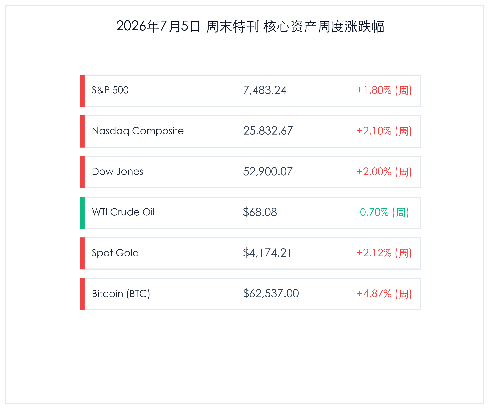

# 周末特刊：全球降息交易共振发酵，美股周度全线上涨，金价与比特币触底回升

**日期：2026年07月05日 (星期日)** &nbsp; **时段：周末特刊 (周末复盘模式)**

> **核心摘要**：本周全球金融市场呈现显著的“降息交易”共振。受美国公布的极度疲软的6月非农数据（仅录得5.7万人）影响，美联储9月降息预期强劲升温。虽周五因独立日假期美股休市，但美股全周仍录得强劲涨幅，标普500、纳指与道指分别周涨1.8%、2.1%与2.0%。与此同时，大宗商品与数字资产迎来触底回升，伦敦金周涨2.12%重回4174美元上方，比特币则反弹收复62500美元（周涨4.87%）。国内市场方面，7月6日起将施行包括ST股涨跌幅放宽至10%在内的多项交易新规，且中信、中金等顶级券商指出，7月A股将正式步入中报业绩验证期，配置核心正逐步转向“业绩确定性”。

## 核心资产周度/日度表现回顾

本周全球核心资产在降息交易的提振下全线上扬，除原油因地缘溢价回落微跌外，主要股指、黄金与加密货币均表现亮眼：

*   **标普500指数 (S&P 500)**：收盘 **7,483.24点**，周五单日 **休市 (0.00%)**，全周累计 **+1.80%**。
*   **纳斯达克综合指数 (Nasdaq)**：收盘 **25,832.67点**，周五单日 **休市 (0.00%)**，全周累计 **+2.10%**。
*   **道琼斯工业平均指数 (Dow Jones)**：收盘 **52,900.07点**，周五单日 **休市 (0.00%)**，全周累计 **+2.00%**。
*   **WTI原油期货**：收盘 **68.08美元/桶**，周五单日 **-1.02%**，全周累计 **-0.70%**。
*   **伦敦现货黄金**：收盘 **4,174.21美元/盎司**，周五单日 **-0.16%**，全周累计 **+2.12%**。
*   **比特币 (BTC)**：收盘 **62,537.00美元**，周末单日 **+0.87%**，全周累计 **+4.87%**。
*   **FTSE中国A50指数**：收盘 **15,125.23点**，周五单日 **+0.57%**，全周累计 **-1.18%**。
*   **美元离岸人民币 (USD/CNH)**：收盘 **6.7851**，周五单日 **-0.15%** (离岸人民币升值)，全周累计 **-0.29%** (全周升值约200点)。
*   **美国10年期国债收益率**：收盘 **4.48%**，周五单日 **休市 (0 bp)**，全周累计 **-2 bp**。

## 过去 48 小时重磅事件深度复盘

> ### 1. 美国6月非农意外爆冷，降息路径重回“主视线”
> **事件原因与市场洞察**：本周四美国劳工部公布的6月非农就业数据录得仅增加5.7万人，较市场普遍预期的11万人接近“腰斩”，且前两个月的数据合计下修了7.4万人。尽管失业率小幅回落至4.2%，但极度疲软的新增就业证明了高利率下实体经济的脆弱性。这导致市场对美联储9月启动降息的信心被彻底点燃。由于周五独立日假期的交投冷清，降息预期得以在商品与加密货币市场中充分沉淀并共振，推动黄金稳稳守住4170美元大关，比特币也顺理成章地重返62000美元上方。

> ### 2. 独立日休市提供“冷静期”，原油随地缘溢价微降
> **宏观与资产逻辑**：尽管美债与美股在周五进入休市，商品市场依然表现平稳。围绕中东地缘政经博弈的“战争溢价”随着美伊达成的局部谅解备忘录继续消退，油轮在霍尔木兹海峡的流动趋于正常。WTI原油在隔夜电子盘中承压于每桶68美元附近，周跌幅0.70%。这表明在降息周期未正式落地前，商品定价的主逻辑正在从地缘溢价回归到全球总需求放缓的基本面验证上。

> ### 3. A股交易新规正式落定，7月6日起重塑交易生态
> **监管与市场机制**：沪深北三大交易所宣布，多项提升定价效率的交易新规将于7月6日（周一）正式实施。其中最核心的变化包括：主板ST/*ST股票单日涨跌幅限制由5%调整为10%；盘后固定价格交易扩容至全市场A股及ETF；沪市ETF/LOF/REITs尾盘竞价规则由连续竞价改为收盘集合竞价。这些制度优化旨在加快低效题材股的出清、平抑市场尾盘异常波动，对长期价值投资资金形成利好，但也将加剧ST板块等垃圾股的业绩兑现出清压力。

## 下周全球宏观大事预警

*   **美联储6月会议纪要（周三 7月8日）**：在经历超级非农爆冷后，本次会议纪要对于评估美联储内部“鸽鹰”两派关于通胀黏性与劳动力走弱的讨论显得至关重要，市场将寻找政策转向的更确凿措辞。
*   **中国6月通胀数据（周五 7月10日）**：中国国家统计局将公布最新的CPI和PPI数据，中报验证窗口期前夕，该数据能为市场研判国内总需求回暖提供宏观坐标。
*   **新西兰联储议息与欧洲央行政策账目**：下周Reserve Bank of New Zealand将召开货币政策会议；同时，欧洲央行（ECB）亦将公布6月货币政策会议纪要，向全球揭示非美央行跟随性降息的节奏。
*   **北约安卡拉首脑峰会（7月7日-8日）**：地缘政治局势的边际变化仍可能在避险情绪、军工国防与大宗商品市场激起涟漪。

## 顶级机构周末策略内参摘要

*   **中信证券 (CITIC)**：**“A股步入中报验证期，配置核心高低切换至‘业绩确定性’”**。中信团队认为，下半年伊始，随着中报进入密集披露期，市场的主导逻辑将从前期的“炒预期”向“验业绩”彻底转变。在前期高位AI硬件题材估值较为拥挤的情况下，建议寻找中报业绩有强支撑的超跌高景气细分赛道（如半导体设备与材料、AI终端精密零部件），并警惕纯题材炒作的业绩“爆雷”风险。
*   **高盛 (Goldman Sachs)**：**“大宗商品周期进入新阶段，维持黄金超配评级”**。高盛大宗商品策略团队指出，尽管短期存在地缘政治不确定性释放带来的油价调整，但美联储年内开启降息已是大概率事件。作为零票息的战略防守资产，黄金将持续受益于美元中枢下行与全球央行的刚性购金需求，高盛继续维持黄金年内每盎司4900美元的乐观目标。
*   **摩根士丹利 (Morgan Stanley)**：**“美股高Capex景气度不减，但须防范信贷端的‘脆弱 momentum’”**。大摩在下半年展望中表示，AI带来的资本开支热潮在盈利端仍是巨大支柱，但需要关注长期高利率下高负债企业的展期压力，以及地缘引起的能源供应成本波动。建议在防御板块（如高股息公用事业、基础消费）与科技成长间建立更为均衡的组合。

## 今日市场情绪：金凤展翅，暗香浮动

> Prompt: Surrealism style, A colossal glowing golden hourglass stands on a calm reflective digital ocean. In the upper bulb, green laser lines weave a massive map of the world. In the bottom bulb, a brilliant glowing golden phoenix is spreading its wings and rising towards the twilight sky. In the background, soft red fireworks shaped like rising percentage signs illuminate the horizon. No humans., masterpiece, high detail, intricate composition, cinematic lighting, 8k resolution

---

免责声明：内容仅供参考，不构成投资建议。
