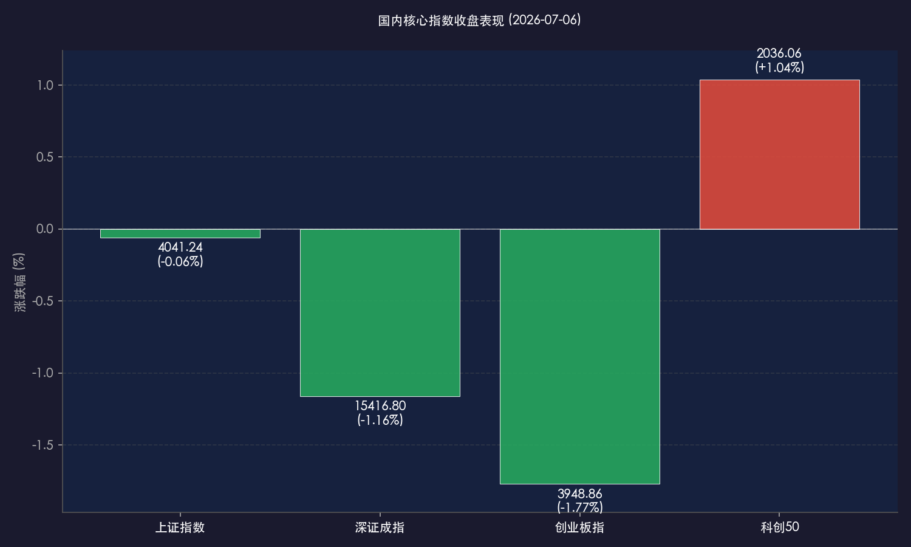

# 交易新规首发落地成交额破3万亿，科创50深V反弹逆势收涨，A股结构化博弈加剧

**日期：2026年07月06日 (星期一)** &nbsp; **时段：晚报 (常规交易日复盘)**

> **核心摘要**：今日是沪深北交易所新版《交易规则》正式实施首日，两市交投极度活跃，成交额突破 **3.11万亿元** 创历史高位。A股三大指数全天震荡分化，虽集体收跌（上证指数跌0.06%，深证成指跌1.16%，创业板指跌1.77%），但科创50指数全天呈现“深V”大反转，最终逆势上涨 **1.04%**。盘面上，半导体芯片、创新药等科创板块午后强势拉升，ST板块因涨跌幅放宽至10%大面积活跃，但白酒、新能源等传统成长板块拖累指数。港股主要指数集体上涨，恒生指数收涨1.14%，科网股表现强劲。

## 核心行情复盘

今日境内外市场呈现震荡分化但局部活跃的态势。在交易新规首日落地的催化下，全市场换手充分。科创板在半导体国产替代与创新药估值修复带领下逆势反弹，而传统成长股则拖累深成指与创业板指下挫。港股市场则在大金融与大型科网股（快手大涨近8%）的强劲支撑下，恒生指数与恒生科技指数均录得上涨。

*   **上证指数**：收报 **4041.24点**，微跌 **0.06%**。
*   **深证成指**：收报 **15416.80点**，下跌 **1.16%**。
*   **创业板指**：收报 **3948.86点**，下跌 **1.77%**。
*   **科创50指数**：收报 **2036.06点**，逆势上涨 **1.04%**。
*   **恒生指数**：收报 **23616.32点**，上涨 **1.14%**。
*   **恒生科技指数**：收报 **4541.23点**，上涨 **0.94%**。
*   **富时中国 A50 期货**：盘中最高触及 **15001.00点**，上涨约 **0.77%**。
*   **全市场成交额**：沪深北三市今日成交总额录得 **3.11万亿元**，资金交易活跃度空前。
*   **资金动向与个股比例**：沪深两市上涨个股 **1817只**，下跌个股 **3278只**，平盘个股 **101只**。非新股中共有 **73只** 个股涨停，**53只** 个股跌停。主力资金净流出约 **872.93亿元**，而南向资金净买入达 **150亿港元**。

> **行业板块表现**：今日板块呈现强烈的结构分化。**煤炭**、**银行**、**航海装备**等大市值红利板块表现稳健，主力护盘迹象明显；主板风险警示板块（**ST、*ST股**）由于涨跌幅限制由5%放宽至10%，首日交易极度活跃，多只个股盘中触及涨停；午后**半导体芯片**（模拟芯片、功率器件等）与**创新药**板块快速探底回升，带领科创50实现“深V”翻红。相反，**玻璃纤维**、**稀土**、**金属新材料**等周期板块跌幅居前；**光模块（CPO）**概念全天走低，传统新能源与消费板块也拖累创业板震荡下行。

## 核心解读与市场逻辑

> **交易新规落地平抑异常波动，ST板块与盘后固定交易扩容激活市场流动性**
> 
> 今天是沪深北三大交易所同步修订的新版《交易规则》落地实施首日。本次新规最为瞩目的变化在于：盘后固定价格交易范围扩展至全部A股与ETF；主板ST/*ST股票的日内涨跌幅限制从5%拓宽到10%，实现了与主板普通股票规则的统一；同时基金收盘阶段的交易方式从连续竞价统一优化为集合竞价。
> 
> 新规落地首日，两市成交额爆量至 3.11 万亿元。主板ST股在涨幅拓宽至10%后表现活跃，显示资金对于制度重塑初期的题材炒作依然具有高敏感度；而盘后固定价格交易的全市场化，则极大地满足了机构投资者对大额订单的交易需求，平抑了盘中对股票价格的瞬间冲击。整体而言，新规的实施提升了市场定价效率，并有望在中长期引导绩差题材股加速出清。

> **科创50深V大反弹，半导体国产替代与创新药估值修复构筑核心防线**
> 
> 在三大指数全天震荡收跌的背景下，科创50指数展现出了卓越的抗跌韧性。早盘科创50一度跟随大盘下挫，跌幅曾深达3%以上，但午后随着半导体设计、晶圆代工以及创新药板块的强力拉升，指数最终逆势收红。这显示在降息交易发酵的宏观背景下，科技创新板块依然是弹性最高、耐受度最强的硬核主线。随着中报业绩大考的临近，市场资金在急跌中主动配置具有国产替代逻辑和基本面筑底反弹的科创龙头，为全天市场守住了最重要的科技阵地。

## 政策脉动

*   **央行开展大规模买断式逆回购**：中国人民银行今日开展了10000亿元3个月期买断式逆回购操作，向市场注入中长期流动性。此举对于平抑季末及月初流动性波动、保障银行体系流动性合理充裕具有积极作用，也为交易新规首日市场的平稳运行提供了稳健的资金面保障。
*   **交易所优化基金收盘交易规则**：上交所统一实施基金收盘阶段集合竞价（14:57-15:00），不仅使收盘价产生更加透明合理，还大幅压降了尾盘恶意控盘行为的发生概率，有利于促进ETF等配置型工具的长期健康发展。

## 最新机构观点

*   **中信证券 (CITIC)**：**“加息叙事向降息修正，紧扣宽基流动性与业绩主线”**。中信证券指出，美联储降息周期的临近（由疲软的非农就业数据所致）将极大地缓解A股宽基ETF的流出压力。随着叙事回摆，资金正从高估值AI拥挤赛道向部分有业绩支撑的非AI板块转移。建议以“杠铃结构”进攻与稳健并重，重点关注中报业绩具有强确定性的板块。
*   **中金公司 (CICC)**：**“七月迈入中报验证期，配置核心回归业绩成色”**。中金公司指出，7月A股将正式进入中报业绩预告与披露的强验证期，市场的主导逻辑将重归基本面定价。超配电子硬件、通信设备、基础化工、电力设备等行业，同时中长期建议逢低布局历经下行周期后正式迎来拐点的农产品板块（如油脂、棉花等）。

## 今日市场情绪：新规首航，浴火深V

今日A股在新规首日经历了波澜壮阔的巨量换手与多空博弈。科创50指数在盘中大跌3%的阴霾下实现深V反弹，个人和机构资金在震荡中完成了充分博弈，彰显出硬科技板块在政策落地与基本面支撑下的强劲韧性。

> Prompt: Surrealism style, Subject: A magnificent golden mechanical scale stands on a platform of glowing green microchips. On one side of the scale, a large emerald semiconductor chip rises into the air, emitting a bright green laser light. On the other side, several red crystal spheres representing traditional market indices slip downward. Background: In the background, a massive digital storm of glowing data points and neon line charts is dissipating under a rising golden sun. No humans. No text., masterpiece, high detail, intricate composition, cinematic lighting, 8k resolution

---

免责声明：内容仅供参考，不构成投资建议。
