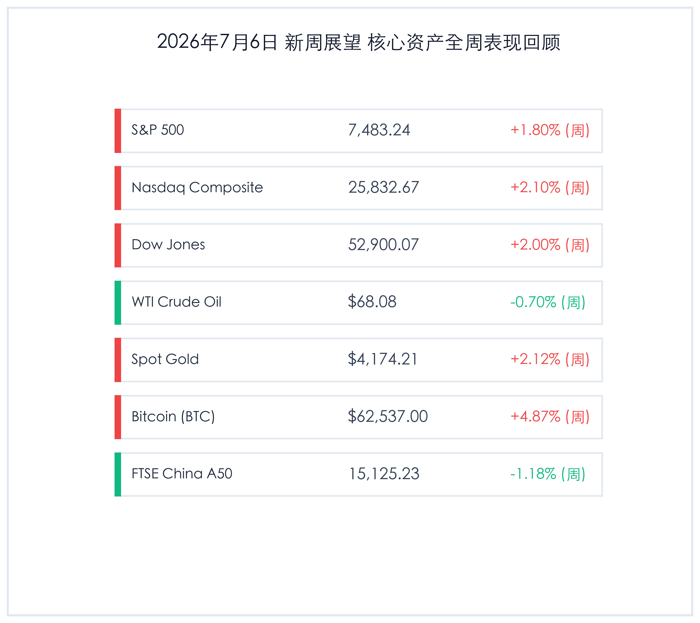

# 新周展望：降息交易共振发酵，A股三大新规落地，市场博弈进入验证期

**日期：2026年07月06日 (星期一)** &nbsp; **时段：新周展望 (周一早间)**

> **核心摘要**：随着上周美国极度疲软的6月非农数据公布，美联储9月降息预期强劲升温，全球金融市场呈现显著的“降息交易”共振。虽然周五美股因独立日假期休市，但美股全周录得强劲涨幅。本周，市场核心博弈将围绕周三美联储会议纪要、周四中国6月通胀数据展开。国内方面，今日（7月6日）起沪深北三大交易所正式实施包括ST股涨跌幅限制放宽至10%在内的多项交易新规，重塑市场交易生态。顶级机构指出，7月A股将正式步入中报业绩验证期，配置核心正逐步转向“业绩确定性”。

## 周末财经要闻终极汇总

*   **美国6月非农意外爆冷，降息路径重回“主视线”**：美国劳工部公布的6月非农就业仅增加 **5.7万人**，较市场预期的11万人近乎腰斩，失业率维持在 **4.2%** 的相对低位，但高利率对实体经济的压制显现。数据公布后，市场对美联储9月降息的概率预期大幅飙升，全球资产迎来“降息交易”的共振反弹。
*   **A股多项交易新规今日起实施，重塑交易生态**：沪深北交易所宣布，多项提升交易效率的规则于7月6日正式落地。核心包括：主板ST/*ST股票涨跌幅限制由5%调整为 **10%**；盘后固定价格交易扩容至全市场A股及ETF；沪市ETF/LOF/REITs尾盘竞价规则由连续竞价改为收盘集合竞价。这些制度有利于加快绩差题材股的出清并平抑尾盘异常波动。
*   **OPEC+部长级会议受瞩目，油价在博弈中寻底**：大宗商品市场重点关注本周召开的OPEC+会议。投资者聚焦于 voluntary cut（自愿减产）的回归日程安排，以及部分超额生产国（如伊拉克和哈萨克斯坦）的减产补偿承诺进度。
*   **日本6月短观调查信心改善，日元创39年新低**：日本央行发布的6月Tankan调查显示，大型制造业景气指数升至 **+22**，主要得益于AI硬件、非铁金属及先进制造设备的爆发式需求。然而，日元兑美元跌破 **162** 关口，创下近39年新低，引发日本央行货币政策加速收紧的讨论。

## 新一周市场核心博弈逻辑

> **“降息交易”的硬币两面**：非农数据的严重爆冷虽然为美联储开启降息周期扫清了主要障碍，但其背后劳动力市场的迅速降温同样折射出美国经济存在“硬着陆”的隐忧。短期内，市场将继续以“坏消息即好消息”来交易流动性宽松，但中期需要警惕基本面走弱对企业盈利的冲击。
> **A股垃圾股加速出清与定价效率提升**：ST股单日涨跌幅放宽至10%将显著加大垃圾股 of A股的日内波动和出清速度。盘后固定价格交易的普及将为机构提供大额交易通道，减少日内价格冲击；尾盘集合竞价则有利于平抑尾盘恶意控盘行为。两项规则相辅相成，预示着资金将加速流出绩差板块，向具备业绩支撑的龙头资产集中。

## 本周重磅经济数据与会议前瞻

*   **7月6日（周一）**：美国6月ISM服务业PMI、S&P全球服务业PMI终值（验证美国服务业扩张势头）；美联储理事沃勒（Christopher Waller）发表讲话。
*   **7月8日（周三）**：**美联储公布6月货币政策会议纪要**（市场将从中研判联储官员关于降息时点和就业走势的内部分歧）。
*   **7月9日（周四）**：**中国6月CPI/PPI通胀数据**（提供国内内需恢复以及工业品价格波动的关键宏观坐标）。

## 头部券商/投行开盘策略点睛

*   **中信证券 (CITIC)**：**配置重心高低切换，紧扣“业绩确定性”**。中信团队认为，7月A股市场将正式进入中报业绩的强验证期，市场的主导逻辑将彻底从前期的题材炒作向业绩兑现转变。建议回避前期估值拥挤的纯题材概念，重点关注中报业绩有强支撑的超跌高景气赛道（如半导体设备与材料、AI终端核心零部件）。
*   **高盛 (Goldman Sachs)**：**降息周期锚定，建议持续超配黄金**。高盛大宗商品策略团队指出，尽管短期受制于地缘局势 and 油价调整，但美联储下半年启动降息已成定局。作为零票息的战略防御资产，黄金将深度受益于全球流动性宽松和央行去美元化的刚性需求，高盛维持年内4900美元/盎司的黄金目标价。
*   **摩根士丹利 (Morgan Stanley)**：**AI产业链的高 Capex 景气延续，需防范高负债风险**。大摩表示，AI基础设施建设带来的庞大资本开支依然是支撑科技股核心盈利的支柱。但随着高利率维持时间拉长，必须警惕信贷端高负债企业展期压力，在投资组合中应适当搭配高股息公用事业等防御板块。

## 行情速递：新周开盘核心资产状态

在降息交易的提振下，全球核心资产在上周五及周末呈现整体偏强态势。由于上周五独立日假期的交投清淡，当前市场价格主要反映了非农爆冷后的预期重塑：

*   **标普500指数 (S&P 500)**：收盘 **7,483.24点**，全周累计 **+1.80%**。
*   **纳斯达克综合指数 (Nasdaq)**：收盘 **25,832.67点**，全周累计 **+2.10%**。
*   **道琼斯工业平均指数 (Dow Jones)**：收盘 **52,900.07点**，全周累计 **+2.00%**。
*   **WTI原油期货**：收盘 **68.08美元/桶**，全周累计 **-0.70%**。
*   **伦敦现货黄金**：收盘 **4,174.21美元/盎司**，全周累计 **+2.12%**。
*   **比特币 (BTC)**：收盘 **62,537.00美元**，全周累计 **+4.87%**。
*   **FTSE中国A50指数**：收盘 **15,125.23点**，全周累计 **-1.18%**。

## 今日市场情绪：指针重塑，晨曦微露

随着美国降息周期的临近和A股交易新规的实施，市场主旋律展现出以“制度重塑与流动性改善”为导向的防御性复苏和新的一周对方向的选择。

> Prompt: Surrealism style, Subject: A colossal mechanical compass made of glowing emerald circuits and golden gears floats above a serene, reflective digital ocean. Background: In the background, a warm golden sunrise breaks through soft red storm clouds, casting beams of green light. Floating digital numbers and currency symbols rise into the sky like sparks. No humans. No text., masterpiece, high detail, intricate composition, cinematic lighting, 8k resolution

---

免责声明：内容仅供参考，不构成投资建议。
