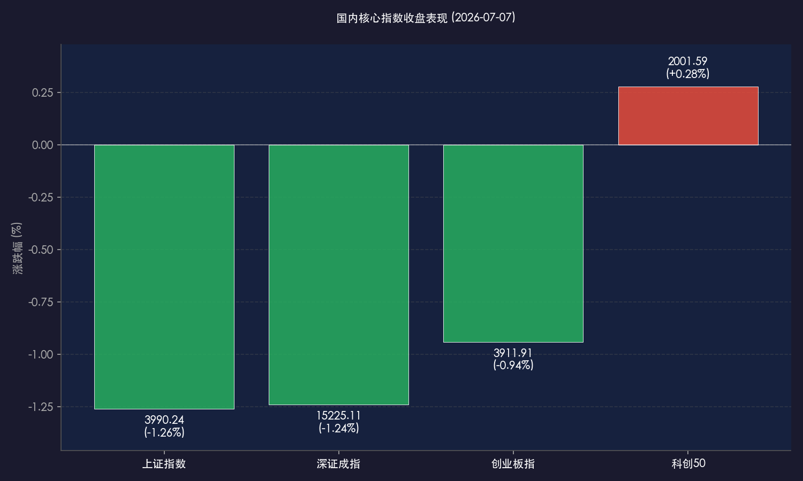
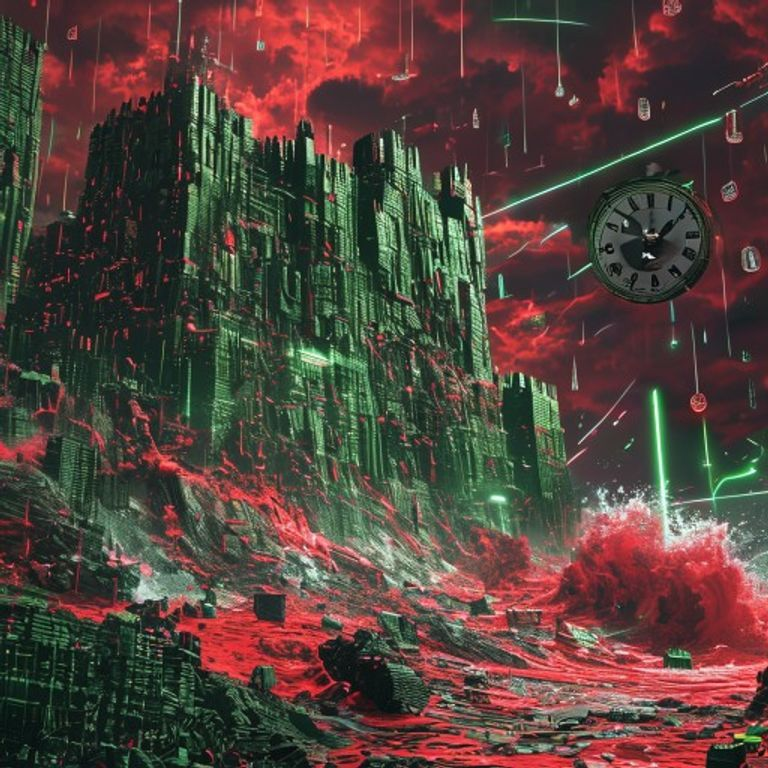

# 外围惊雷引发KOSPI熔断，A股缩量整理失守4000点，科创50独秀逆势飘红

**日期：2026年07月07日 (星期二)** &nbsp; **时段：晚报 (常规交易日复盘)**

> **核心摘要**：今日外围市场风云突变，韩国股市（KOSPI）因盘中重挫超8%触发年内第六次熔断，拖累亚太周边市场走低。A股三大指数震荡下行，上证指数失守4000点整数关口收跌1.26%，深证成指与创业板指亦双双收跌。全市场成交额萎缩至2.59万亿元，个股普跌。然而，科创50指数展现出极强的硬科技防御韧性，在华为“韬定律”V2发布的利好催化下，半导体产业链逆势爆发，带领科创50逆势上涨0.28%。

## 核心行情复盘

今日境内外市场呈现震荡回调与结构分化的格局。受周边市场暴跌及熔断的恐慌情绪传导，A股三大指数全天低开低走，全市场下跌个股近4800只。但在半导体自主可控和硬科技赛道的强力支撑下，科创板逆势翻红。港股市场亦受拖累集体收跌，其中快手因大股东腾讯减持大跌超12%。

*   **上证指数**：收报 **3990.24点**，下跌 **1.26%**。
*   **深证成指**：收报 **15225.11点**，下跌 **1.24%**。
*   **创业板指**：收报 **3911.91点**，下跌 **0.94%**。
*   **科创50指数**：收报 **2001.59点**，逆势上涨 **0.28%**。
*   **恒生指数**：收报 **23496.89点**，下跌 **0.51%**。
*   **恒生科技指数**：收报 **4507.04点**，下跌 **0.75%**。
*   **富时中国 A50 期货**：收报 **14951点**，下跌 **0.58%**。
*   **全市场成交额**：沪深两市今日成交总额录得 **2.59万亿元**，较前一交易日缩量约 **5200亿元**，场内观望情绪转浓。
*   **资金动向与个股比例**：沪深两市上涨个股 **693只**，下跌个股 **4797只**。全天主力资金净流出约 **667.64亿元**。南向资金在港股震荡中成交净买入 **4.98亿港元**，港股全日成交额录得 **3197.11亿港元**。

> **行业板块表现**：今日市场呈现强烈的科技独秀与普跌特征。**半导体产业链**（半导体设备、先进封装、硅片、GPU等细分）全天强势领涨，成为震荡中唯一的亮点；游戏、网络游戏及通信设备板块亦表现相对活跃。相反，**贵金属**、**石油化工**、**非银金融**、**生物医药**等板块跌幅居前，创新药板块冲高回落，市场避险与业绩验证诉求强烈。

## 核心解读与市场逻辑

> **周边市场大幅震荡，韩国KOSPI熔断引发外围科技股普跌**
> 
> 今日周边市场出现剧烈波动，尤其是韩国综合股价指数（KOSPI）因盘中大跌超8%触发熔断机制暂停交易，成为本年度第六次触发熔断。尽管三星电子发布了极其亮眼的Q2业绩预告（营业利润增长超18倍），但在前期市场对于AI和硬件增长预期过高、获利回吐压力显现的背景下，出现了典型的“利好兑现变利空”走势，导致三星及SK海力士双双暴跌约10%。这股科技股调整的情绪波及了日本股市等亚太周边市场，也对A股早盘的震荡走势造成了一定拖累。

> **科创50逆势飘红，华为“韬定律”V2版催化半导体硬科技防御力**
> 
> 在大盘缩量调整、近4800只个股下跌的严峻态势下，科创50指数展现出极强的韧性，终盘逆势上涨0.28%。其核心驱动力来自于华为日前发布的《面向多层级电子系统的时间缩微理论》（“韬定律”）V2版本，对逻辑折叠、混合键合等五大落地技术的明确和催化，极大地振奋了国内半导体产业链的情绪。在全市场成交额萎缩至2.59万亿、存量博弈加剧的环境下，资金主动向有明确政策导向、产业周期筑底反弹、且具备真实订单兑现能力的半导体设备、硅片及先进封装龙头板块集中，使得硬科技成为A股震荡中最坚固的防御防线。

## 政策脉动

*   **华为发布“韬定律”V2指引半导体技术落地**：华为于7月3日发布的“韬定律”V2版本，明确了芯片多层级电子系统时间缩微的一系列底层落地技术，为国内硬科技和国产替代产业链提供了明确的技术演进路线，成为近期科技板块最核心的政策与技术催化剂。
*   **A股新规实施次日交易运行平稳**：A股交易新规正式实施进入第二天，盘后固定价格交易的扩围与主板ST股票涨跌幅限制的拓宽继续平稳运行，逐步提升定价效率，市场逐步适应制度优化带来的新交易常态。

## 最新机构观点

*   **中信证券 (CITIC)**：**“风格面临再平衡，资金高切低倾向显现”**。中信证券建议在当前节点采取哑铃型配置。在科技硬件板块高波动和季末考核后，资金出现阶段性的“高切低”特征。建议一端关注有业绩支撑的硬科技细分龙头，另一端以消费板块中供给侧反转的农业（养殖）及高红利板块作为安全垫。
*   **中金公司 (CICC)**：**“聚焦中报业绩验证，半导体与AI基础设施仍是核心”**。中金公司指出，7月 A 股将正式进入中报业绩预告与披露的密集期。在存量博弈和缩量震荡中，市场驱动力正由前期的情绪炒作回归到真实的业绩兑现。超配电子硬件、通信设备等高景气行业，并看好AI产业链等基础设施方向。
*   **华泰证券 (HUATAI)**：**“短期警惕估值拥挤度，红利仍是重要安全垫”**。华泰证券策略认为，科技板块短期面临估值拥挤度与外部波动的双重考验。在市场宽度可能回升的拉锯期中，建议以红利低波资产作为安全垫，同时重点聚焦半导体设备、存储、MLCC等有实质业绩改善预期的硬科技品种。

## 今日市场情绪：外围惊雷，科创独秀

今日市场呈现了外围地缘与半导体龙头获利回吐所带来的“惊雷”效应，韩国KOSPI的暴跌触发熔断，向全球展示了前期估值透支后“利好出尽”的冲击力。而在国内，华为“韬定律”V2的底层指引为半导体设备与先进封装注入了实质底气，使得科创50成为惊雷风暴中屹立不倒的硬核长城。红绿交织、缩量拉锯，标志着中报业绩验证的大考已然开幕。

> Prompt: Surrealism style, A massive, glowing green fortress wall constructed from advanced semiconductor wafers and microchips stands resiliently against a crashing tidal wave of red liquid and falling market index symbols under a stormy crimson sky. In the far background, a large mechanical clock representing the Korean market (KOSPI) is cracking and tilting into a dark whirlpool, while green laser beams from the fortress stabilize the ground. No humans. No text.

---

免责声明：内容仅供参考，不构成投资建议。
