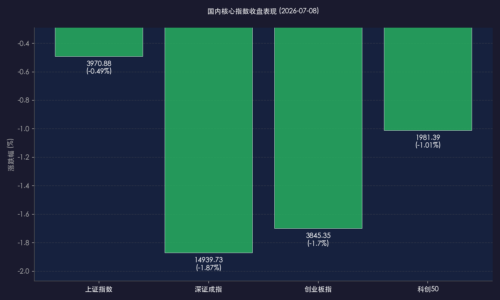

# 央行提振政策催化港股红筹暴涨，A股冲高回落科创调整，算力设备与AI逆势吸金

**日期：2026年07月08日 (星期三)** &nbsp; **时段：晚报 (常规交易日复盘)**

> **核心摘要**：今日境内外市场呈现极端的结构分化，港股市场受中国人民银行宣布继续提高香港资产配置比例的利好刺激迎来史诗级暴涨，恒生科技指数飙升逾5%，互联网科技巨头与解禁日智谱科技集体拉升。相比之下，A股三大指数全天冲高回落，受新能源、机器人等成长板块回调拖累集体收跌，上证指数跌0.49%收于3970点上方。全市场成交额维持在2.56万亿元，算力租赁与通信基础设施逆势吸金，资金高低切换特征显著。

## 核心行情复盘

今日境内外市场呈现两极分化的极致行情。港股走出独立大涨行情，南向资金大举扫货；A股受高位成长赛道资金撤离影响，午后震荡下挫。全市场个股跌多涨少，成交额依然保持在2.5万亿上方的高位水平。

*   **上证指数**：收报 **3970.88点**，下跌 **0.49%**。
*   **深证成指**：收报 **14939.73点**，下跌 **1.87%**。
*   **创业板指**：收报 **3845.35点**，下跌 **1.70%**。
*   **科创50指数**：收报 **1981.39点**，下跌 **1.01%**。
*   **恒生指数**：收报 **24199.46点**，大幅上涨 **2.99%**。
*   **恒生科技指数**：收报 **4733.48点**，史诗级暴涨 **5.02%**。
*   **富时中国 A50 期货**：收报 **15133.32点**，上涨 **0.10%**。
*   **全市场成交额**：沪深两市今日成交总额录得 **2.56万亿元**，较前一交易日微幅缩量 **300亿元**，整体成交依然充裕。
*   **资金动向与个股比例**：沪深两市上涨个股 **1533只**，下跌个股 **3532只**。全天主力资金大举调仓。南向资金全天大额净流入，净买入额超 **80亿港元**，延续了本周以来连续流入港股的态势。

> **行业板块表现**：今日市场板块轮动极快。**算力租赁、AI服务器、通信设备及信息安全**板块全天逆势大涨，中际旭创、紫光股份、浪潮信息等核心龙头获主力资金巨额净流入。黄金股与煤炭等红利防御板块亦表现抗跌。而在领跌端，**机器人概念（人形机器人）**、**锂电池/新能源**及**有色金属**板块跌幅居前，多只前期强势股出现封死跌停的情况，半导体板块午后亦遭遇逢高套现压力。

## 核心解读与市场逻辑

> **人行香港峰会表态重磅催化，国家外汇储备增配香港资产引爆港股科技**
> 
> 今日港股市场的史诗级爆发是人行行长在“香港固定收益及货币峰会”上的表态带来的直接结果。行长明确表态支持香港作为国际金融中心的建设，并宣布国家外汇储备将继续提高在香港的资产配置比例。这一重磅利好被市场视为内资流动性的强力背书，直接引爆了对政策敏感的港股科技板块。此外，近期美股及韩国半导体板块的回调使得部分全球资金在此节点选择“避险与高切低”，港股科技股（腾讯、阿里、美团等）因其极低的估值和改善的基本面成为这波资金的最佳流向。同时，首个大额解禁日的智谱科技在机构长期持股承诺及投行看好的多重支撑下低开高走、暴涨近20%，极大地提振了场内对于AI核心资产的信心。

> **A股宽幅震荡冲高回落，高位题材股获利踩踏促成“高低切换”大洗牌**
> 
> 与港股的普涨不同，A股今日呈现明显的冲高回落态势。早盘受TMT算力租赁和AI服务器行情的带动，大盘一度震荡上行，但午后以人形机器人、锂电池为代表的成长题材板块遭遇主力资金的剧烈砸盘，多只个股触及跌停，引发了局部的恐慌盘涌出。主力资金在成长和电子半导体板块（净流出超170亿元）逢高兑现的倾向非常明显。虽然算力设备（如中际旭创等） and 网络安全板块逆势吸金，但也难以完全对冲高位新能源与机器人板块的砸盘压力。这表明在二季度财报大考来临之际，市场正经历剧烈的筹码出清与风格再平衡，资金从“纯预期炒作的高位题材”向“具备高业绩兑现度”的算力硬件基建和低估值避险资产转移。

## 政策脉动

*   **中国人民银行支持香港金融中心，外汇储备增配港币资产**：中国人民银行行长在香港固定收益及货币峰会上重磅发声，明确表示将持续加大外汇储备在香港的资产配置，以实际行动捍卫香港国际金融中心地位，这也直接构成了今日港股资产独立大涨的资金面最强支撑。
*   **算力新型基建迎政策加码**：多部门近期出台将算力基础设施全面纳入新型重点基建的指导意见，配合专项债发行及产业补贴的发放，为算力租赁、AI服务器等硬件基建板块提供了极强的主体政策底。

## 最新机构观点

*   **瑞银财富管理 (UBS)**：**“算力是AI唯一的‘卖铲人’，坚持防御与硬件双主线”**。瑞银分析师认为，科技硬件与半导体的回调只是一次健康的去泡沫过程。在AI估值拥拥挤度有所缓和的当下，应精选在数据中心、算力租赁等有实质性订单确认的“卖铲人”领域，同时搭配电力和能源等防御性资产。
*   **中原证券 (CENTRAL CHINA)**：**“二季报验证期重视业绩兑现，配置倾向哑铃策略”**。中原证券指出，进入7月，市场主导逻辑全面转向半年报的基本面验证。鉴于题材股波动加剧且轮动极快，投资者应采取均衡的“哑铃型”配置，一端关注硬科技中能兑现利润的AI算力及设备，另一端以煤炭、黄金等红利周期品作为投资垫。
*   **摩根大通 (JPMorgan)**：**“港股科技资产低估值优势显现，资金轮动将持续回补”**。小摩大中华区研究部表示，在中国监管层对香港金融市场的流动性背书下，港股的系统性折价正在加速修复。特别是在美股科技股短期见顶回撤的拉锯期，资金向具有高盈利增速、稳定现金流及估值洼地特征的中国港股科技龙头切换是必然趋势。

## 今日市场情绪：A股分化，港股突围

今日市场在央行的政策春风下上演了一出冰与火之歌。港股市场在外汇储备增配的巨额利好下破浪突围，恒指与恒科指红旗招展，全球资金在此避风港中疯狂抱团；而A股市场则在二季报大考前夕，因高位锂电与机器人的获利回吐而惊险下挫。这种“东边日出西边雨”的局面，反映了验证期内场内资金对于高确定性业绩与低估值避险的极致追求。

> Prompt: Surrealism style, Subject: A grand golden bridge of data streams connects two futuristic floating islands. Background: In the background, the left island representing China A-share market is shrouded in red mist with falling red neon circuit leaves, while the right island representing Hong Kong market is basking in brilliant green light under a rising sun, with glowing green crystal towers and ascending digital numbers. A flock of glowing white paper birds flies from the left island to the right island. No humans. No text., masterpiece, high detail, intricate composition, cinematic lighting, 8k resolution

---

免责声明：内容仅供参考，不构成投资建议。
