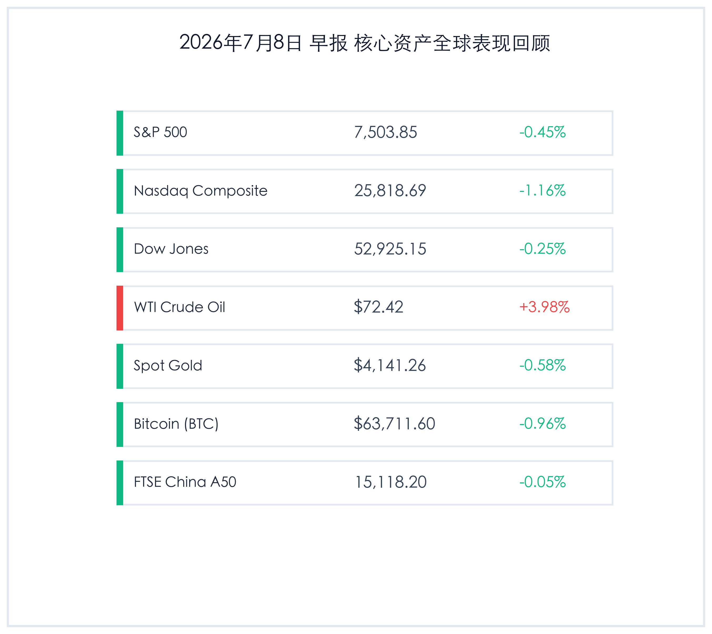
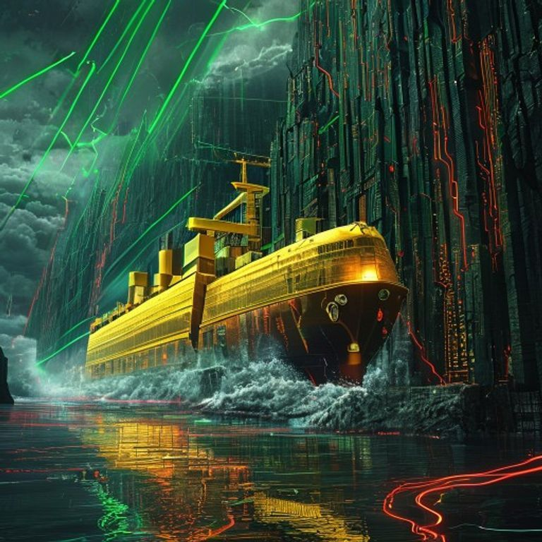

# 美股芯片巨头利好出尽遭抛售，避险情绪升温，霍尔木兹海峡惊雷推升油价

**日期：2026年07月08日 (星期三)** &nbsp; **时段：早报 (常规交易日复盘)**

> **核心摘要**：昨日（7月7日）三星电子公布创纪录的Q2初步财报，但由于营收略低于部分分析师高预期，触发芯片与AI基础设施板块“利好出尽”的获利了结，纳指收跌1.16%。与此同时，中东地缘局势骤然紧张，一艘卡塔尔LNG运输船在霍尔木兹海峡附近遭弹袭，引发能源供应链恐慌，WTI原油飙升近4%。全球市场避险情绪重燃，金价、比特币及富时A50均温和整理。顶级机构认为，当前市场正步入中报业绩与宏观数据的交织验证期，建议防范AI高估值拥挤度并关注能源防线。

## 核心行情复盘

昨日全球核心资产呈现回调分化特征，主要受芯片股获利了结与霍尔木兹海峡地缘政治风波的双重影响。美股科技板块显著承压，而能源板块受油价飙升提振逆势走强。

*   **标普500指数 (S&P 500)**：收报 **7,503.85点**，下跌 **0.45%**。
*   **纳斯达克综合指数 (Nasdaq)**：收报 **25,818.69点**，下跌 **1.16%**。
*   **道琼斯工业平均指数 (Dow Jones)**：收报 **52,925.15点**，下跌 **0.25%**。
*   **WTI原油期货**：收报 **72.42美元/桶**，大涨 **3.98%**。
*   **伦敦现货黄金**：收报 **4,141.26美元/盎司**，下跌 **0.58%**。
*   **比特币 (BTC)**：收报 **63,711.60美元**，下跌 **0.96%**。
*   **富时中国 A50 指数**：收报 **15,118.20点**，微跌 **0.05%**。

> **行业板块表现**：科技与能源板块呈现极端的两极分化。**半导体及芯片硬件**板块全天领跌，受三星及SK海力士获利回吐情绪传导，英伟达、AMD等权重股普遍回撤；而受中东局势突变刺激，**能源与油气开采**板块全天领涨，埃克森美孚、雪佛龙等能源巨头受到买盘追捧。此外，公用事业及日常消费品等传统防御性板块表现相对平稳。

## 核心解读与市场逻辑

> **三星利润暴增18倍难掩营收瑕疵，AI基建交易现“利好兑现”踩踏**
> 
> 三星电子公布的第二季度初步营业利润飙升至89.4万亿韩元，这标志着芯片业务（尤其是高性能 HBM 及 DRAM 存储）利润录得同比近19倍的爆发式增长。然而，其合并销售额录得171万亿韩元，微幅低于部分分析师此前的最乐观预期。在AI基建估值交易已极度拥挤的背景下，这一细微瑕疵引发了敏感资金的警觉，引发了科技板块整体性获利回吐。半导体设备、芯片代工及算力龙头股票的大幅回撤，构成了昨日美股下跌的主要动能。

> **霍尔木兹海峡地缘危机突发，卡塔尔LNG船遇袭重塑原油溢价**
> 
> 昨日地缘局势的突变对能源市场产生了强烈冲击。一艘卡塔尔LNG运输船在霍尔木兹海峡附近被抛射物击中的消息瞬间引燃了供应链担忧。霍尔木兹海峡作为全球最关键的能源海上咽喉，其地缘冲突的任何升级都会被市场迅速转译为原油的风险溢价，推动WTI油价飙升近4%。能源价格的上涨虽然对油气开采板块有利，但同时也加剧了宏观层面对“二次通胀”和美联储政策利率高企时间的担忧。

## 政策脉动

*   **纽约联储通胀调查提供宏观坐标**：纽约联储最新发布的1年期通胀预期调查数据保持稳定，结合前期爆冷至5.7万的6月非农就业数据，市场主流共识仍倾向于美联储在年内保留降息通道，但近期能源价格的大幅波动为后续降息门槛增添了变数。
*   **SpaceX纳入纳指100生效**：SpaceX (SPCX) 正式加入纳斯达克100指数，引发全球被动指数基金在尾盘进行了密集的调仓操作，指数成分股的洗牌效应导致尾盘科技股波动性进一步放大。

## 最新机构观点

*   **高盛 (Goldman Sachs)**：**“把握高壁垒防线，看好 HALO 概念龙头”**。高盛策略团队指出，尽管二季度财报初期半导体板块出现震荡，但这属于健康的挤估值表现。目前建议采取“HALO（重资产、低淘汰率）”配置原则，精选估值合理、重资本壁垒极高的基建、能源及防务龙头，此类资产具备更强的主动定价权与抗波动属性。
*   **摩根士丹利 (Morgan Stanley)**：**“市场宽度面临再平衡，重视被动配置契机”**。大摩分析师认为，科技硬件的拥挤度下降并非产业周期的终结，而是板块间进行广度再平衡的契机。大摩建议逐步向交通运输、大消费及生物科技等受益于流动性宽松的板块配置，并关注SpaceX等巨头入指后的指数权重效应。
*   **摩根大通 (JPMorgan)**：**“能源危机是短期扰动，防御性配置不可或缺”**。小摩大宗商品团队提醒，虽然长期看好黄金在降息周期中的对冲价值，但短期必须警惕霍尔木兹海峡等地缘危机的蔓延风险。若油价因海峡冲突进一步站稳75美元上方，可能迫使美联储在政策考量上更为谨慎，因此投资组合中应维持油气与黄金资产的防守性暴露。

## 今日市场情绪：芯片退潮，海峡惊雷

今日市场呈现出明显的利好兑现与避险踩踏特征。一方面，三星史诗级利润因营收微瑕遭遇强力获利了结，显示科技股多头在业绩验证期的紧绷情绪；另一方面，霍尔木兹海峡的惊雷重击能源通道，油价飙升打乱了市场的平静。在防守与避险交织中，全球资产迎来了中报季第一波冷风。

> Prompt: Surrealism style, Subject: A massive glowing golden oil tanker navigating through a narrow strait made of towering, cracked computer server racks and motherboard cliffs under a dark stormy sky. Background: In the background, green laser beams representing rising oil prices shoot up from the water, while red neon circuit patterns flow down the motherboard cliffs like lava. No humans. No text., masterpiece, high detail, intricate composition, cinematic lighting, 8k resolution

---

免责声明：内容仅供参考，不构成投资建议。
