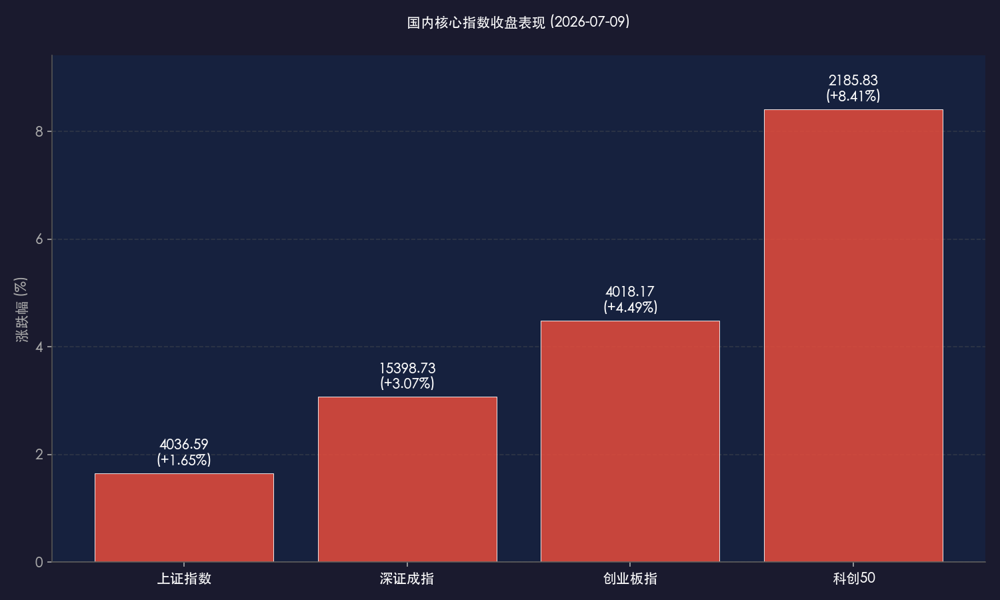

# 长鑫科技IPO掀起芯片股狂飙，科创50暴涨超8%创年内纪录，成交量爆量近3万亿

**日期：2026年07月09日 (星期四)** &nbsp; **时段：晚报 (常规交易日复盘)**

> **核心摘要**：今日境内外市场呈现显著的分化行情。A股受长鑫科技科创板IPO披露和全球先进制程涨价预期双重催化，半导体芯片产业链全线爆发，科创50指数单日录得 **8.41%** 的史诗级涨幅，两市成交额爆量放大至 **2.91万亿元**。而港股受航空、内房及黄金板块疲软拖累走弱，恒生指数收跌 **0.70%**。全天主力资金大幅加仓科技板块，市场做多情绪极度高涨，呈现由半导体核心资产引领的高强度结构性反攻。

## 核心行情复盘

今日A股三大指数全天震荡回升，科创板更是走出历史级别的暴涨行情，两市成交量出现极其显著的放量。港股则整体震荡走弱，与A股科技成长股的狂欢形成分化。

*   **上证指数**：收报 **4036.59点**，上涨 **1.65%**。
*   **深证成指**：收报 **15398.73点**，上涨 **3.07%**。
*   **创业板指**：收报 **4018.17点**，上涨 **4.49%**。
*   **科创50指数**：收报 **2185.83点**，暴涨 **8.41%**。
*   **恒生指数**：收报 **24030.18点**，下跌 **0.70%**。
*   **恒生科技指数**：收报 **4733.95点**（较昨日收盘微涨 **0.01%**）。
*   **富时中国 A50 期货**：收报 **15588.83点**，大涨 **3.01%**。
*   **全市场成交额**：沪深两市今日成交总额录得 **2.91万亿元**，较前一交易日放量 **3502亿元**，交投极其活跃。
*   **资金动向与个股比例**：芯片概念板块获主力资金净流入约 **753.67亿元**，存储芯片获净流入约 **344.9亿元**，5G概念获净流入约 **340.45亿元**。全天主力资金呈现向科技赛道集中抱团的态势。

> **行业板块表现**：今日科技成长板块占据绝对主导地位。**半导体及芯片、存储芯片、电子化学品、元件、算力硬件/CPO/PCB概念**全天暴涨，中芯国际股价创下历史新高，多只核心龙头股封死涨停或涨超10%。跌幅居前的板块主要包括**锂矿等能源金属**（融捷股份跌停）、**煤炭开采、旅游及酒店、钢铁**等传统周期或消费板块。

## 核心解读与市场逻辑

> **长鑫科技科创板IPO与晶圆价格上涨预期双重利好，点燃半导体产业链价值重估**
> 
> 今日A股科技板块的史诗级爆发是由多重基本面催化共振的结果。最直接的导火索是国内DRAM存储龙头长鑫科技正式披露科创板上市招股意向书，并定于7月16日开启申购。作为国产存储芯片的标杆企业，长鑫科技的IPO极大地提振了市场对整个国产存储与半导体产业链未来发展的信心和估值天花板。此外，全球半导体巨头台积电及三星电子等近期纷纷传出调涨先进制程价格的消息，这强化了市场对于全球半导体正在进入新一轮“超级周期”的预判。叠加下半年AI算力需求持续维持高景气度，双重利好引爆了高确定性、强订单支撑的芯片、先进制程设备、材料和先进封装等细分领域。

> **两市爆量近3万亿，资金呈现“高低切换”与结构性抱团科技龙头的特征**
> 
> 全天成交量飙升至近2.91万亿元的水平，显示增量资金和前期观望资金正在加速入场。在半年报业绩预警与披露的敏感期，市场资金对于“纯概念炒作”的高位题材股（如部分前期强势但无业绩支撑的个股）进行了坚决的出清，进而转为向基本面扎实、三季度订单能见度高的科技龙头抱团。资金从其他亚太市场流向具备极高性价比和强国产替代逻辑的“中国AI价值链”。尽管传统周期品如煤炭、钢铁和部分消费板块出现小幅回调，但这种“有舍有得”的健康轮动，促成了今日科创板与创业板指数的强势井喷。

## 政策脉动

*   **金融全力支持科技创新与国产替代**：央行等监管部门近期再次强调，将运用多种货币政策工具，加大对科技创新、先进制程设备、关键零部件国产化等领域的信贷支持与直接融资保障，这为半导体等新质生产力产业提供了充足的政策暖风和资金底座。
*   **科创板优质企业上市节奏优化**：长鑫科技的快速推行体现了政策端对于科创板“支持硬科技、鼓励自主可控”定位的切实落地，科创板上市机制的畅通也为高成长硬科技资产提供了更宽广的退出通道。

## 最新机构观点

*   **中信证券 (CITIC Securities)**：**“半导体设备需求持续强劲，看好全球晶圆制造设备扩张周期”**。中信证券分析师认为，在全球晶圆制造设备（WFE）需求回升的驱动下，预计2026年和2027年全球WFE市场规模将分别同比增长26%和35%。建议投资者重点关注下游客户资本开支指引及扩产计划相关的设备与关键材料厂商。
*   **华泰证券 (Huatai Securities)**：**“先进制程与先进封装带来持续增量，关注玻璃基板替代潜力”**。华泰证券指出，随着AI高景气的发展，HBM与先进封装对高带宽、大容量传输提出了极高要求。看好AI产业链下玻璃基板在AI/HPC封装及光电互连等领域的应用潜力，并建议积极布局具备强技术储备的国产替代企业。
*   **中金公司 (CICC)**：**“新质生产力正改变A股底层逻辑，具备形成‘慢牛’的基本面条件”**。中金公司指出，国内经济转型和新质生产力的加速崛起，正在系统性提高科技龙头的盈利能力与估值体系。短期市场的剧烈洗牌后，业绩兑现度高、符合国产替代政策的核心资产将成为未来市场中长线资金流入的主要方向，具备形成“有底无顶”慢牛的产业条件。

## 今日市场情绪：科技井喷，多头狂欢

今日市场情绪在芯片半导体股的疯狂暴涨下彻底被点燃。科创50指数单日大涨超8%，创下年内最大单日涨幅，两市全天成交量近3万亿，表明多头情绪正在主导行情，市场在经历了前期的防御高低切换后，终于迎来了以科技龙头股为核心的系统性估值修复。这种气势如虹的井喷，让场外资金在“硬科技、国产替代”的宏大叙事中产生了强烈的多头共振。

> Prompt: Cyberpunk style, Subject: A massive, glowing microchip shaped like an ancient temple stands in the center, pulsing with vibrant gold and red light. In the background, towering futuristic skyscrapers with neon signs showing surging stock tickers are reflecting on wet city streets. No humans. No text., masterpiece, high detail, intricate composition, cinematic lighting, 8k resolution

---

免责声明：内容仅供参考，不构成投资建议。
