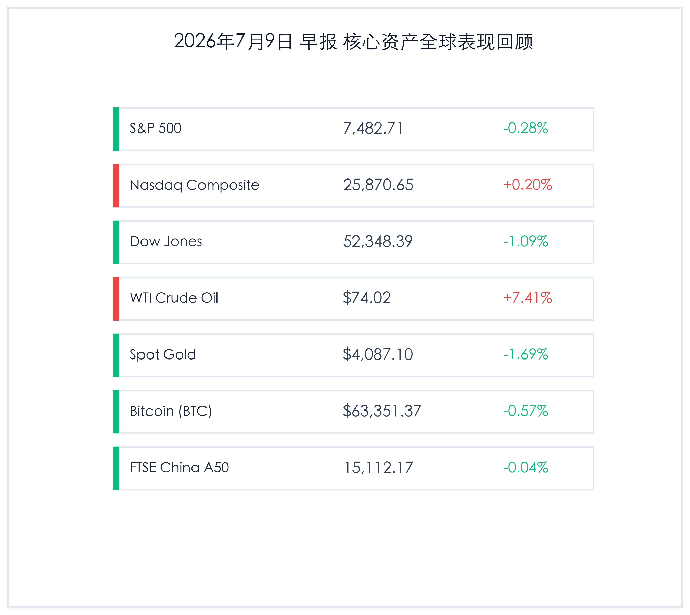
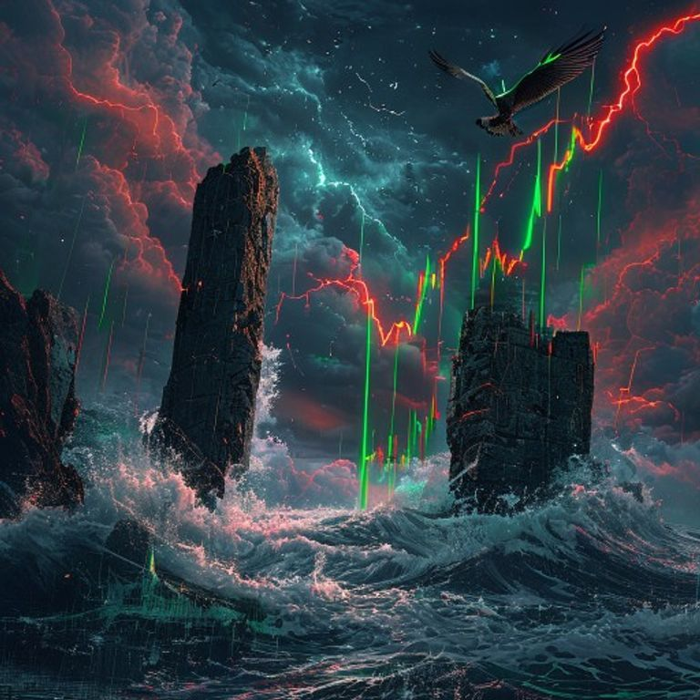

# 美伊停火终结地缘局势骤然升级，原油暴涨逾7%，美股剧烈震荡纳指顽强收红

**日期：2026年07月09日 (星期四)** &nbsp; **时段：早报 (常规交易日复盘)**

> **核心摘要**：昨日（7月8日），中东局势突发剧震，美国总统特朗普宣告美伊停火“结束”，随后美军对伊朗在霍尔木兹海峡袭击商业航运的行为展开报复性打击，并取消了伊朗原油销售的豁免。这一地缘冲击引爆原油市场，WTI原油狂飙7.41%升至74美元上方。地缘局势恶化叠加美联储6月FOMC会议纪要的偏鹰派表态，使得美股剧烈震荡，道琼斯指数大跌1.09%。然而纳斯达克指数表现顽强，在尾盘多头回补下逆势微涨0.20%。全球避险情绪回升，但黄金受通胀担忧拖累大跌1.69%，比特币温和整理。

## 核心行情复盘

昨日全球核心资产受特朗普宣告美伊停火结束的地缘政治风波冲击，呈现剧烈震荡和分化特征。原油因供应中断预期暴力拉升，而美股大盘及黄金、加密资产则普遍承压。

*   **标普500指数 (S&P 500)**：收报 **7,482.71点**，下跌 **0.28%**。
*   **纳斯达克综合指数 (Nasdaq)**：收报 **25,870.65点**，上涨 **0.20%**。
*   **道琼斯工业平均指数 (Dow Jones)**：收报 **52,348.39点**，下跌 **1.09%**。
*   **WTI原油期货**：收报 **74.02美元/桶**，大涨 **7.41%**。
*   **伦敦现货黄金**：收报 **4,087.10美元/盎司**，下跌 **1.69%**。
*   **比特币 (BTC)**：收报 **63,351.37**，下跌 **0.57%**。
*   **富时中国 A50 指数**：收报 **15,112.17点**，微跌 **0.04%**。

> **行业板块表现**：在中东地缘危机升级和美国取消伊朗原油豁免的背景下，**能源与勘探开采**板块全天一骑绝尘，埃克森美孚、雪佛龙等能源巨头受到买盘强烈追捧。公用事业及传统防御性板块微幅收涨。而在下跌端，由于美债收益率攀升及三星二季度财报未能满足最乐观预期的余波发酵，**半导体与科技硬件**板块继续承受压力。苹果（-0.37%）、英伟达（-1.70%）、亚马逊（-1.70%）等算力与硬件权重均出现不同程度回撤，IBM因业绩利空因素大跌3.30%。

## 核心解读与市场逻辑

> **特朗普宣告美伊停火终结，中东地缘危机升级重塑原油溢价**
> 
> 昨日地缘局势的恶化对全球供应链及大宗商品市场带来了海啸般的冲击。在多起商业轮船于霍尔木兹海峡受袭后，美国总统特朗普公开表示停火结束，随后美军对伊朗目标进行了 retaliatory strikes，并全面取消了伊朗原油交易的豁免权。霍尔木兹海峡作为全球最关键的石油和液化天然气大动脉，其封锁风险飙升使得原油风险溢价急剧放大，WTI原油狂飙7.41%至74美元上方。油价的大幅飙升虽然在短期内直接利好石油板块，但也引发了全球市场对能源危机再现的深刻担忧。

> **油价飙升重燃通胀预期，美联储鹰派纪要施压黄金与高估值资产**
> 
> 尽管地缘动荡通常对避险资产有利，但昨日黄金却走出逆势深跌行情（大跌1.69%），主要源于地缘冲突带来的原油飙升正在转化为“二次通胀”的强烈预期。与此同时，昨日公布的美联储6月FOMC会议纪要态度偏鹰，显示美联储官员对通胀降温的粘性仍存担忧。油价飙涨与鹰派纪要的叠加，重塑了市场对于下半年降息空间的预期，美债收益率上升迫使无息资产黄金遭遇明显的资金回吐。然而，纳指在经历早盘探底后在部分AI基建龙头多头买盘的支撑下顽强收红，显示科技股韧性依旧，但分化加剧。

## 政策脉动

*   **美国取消伊朗原油出口豁免**：白宫及美国财政部宣布，为回应针对霍尔木兹海峡商业航运的袭击，正式取消此前对部分国家进口伊朗原油的临时豁免。这标志着全球石油供给端将面临约数十万桶/日的实质性缩减，地缘能源博弈进入白热化阶段。
*   **美联储纪要释放谨慎降息信号**：美联储公布的6月FOMC会议纪要强调，在确信通胀可持续回归2%目标之前，过快降息可能破坏此前抑通胀的成果。地缘油价危机进一步抬高了降息的政治和宏观门槛。

## 最新机构观点

*   **高盛 (Goldman Sachs)**：**“地缘供给冲击重现，大宗商品仍是最佳对冲壁垒”**。高盛策略团队分析指出，在特朗普停火终结宣示后，全球供应链的物理中断风险正在兑现。建议在配置中维持对原油、天然气等核心能源和大宗商品的超配，以对冲股票估值和通胀的双重风险，同时防范科技股在财报季初期的拥挤度风险。
*   **摩根士丹利 (Morgan Stanley)**：**“市场聚焦二次通胀风险，关注纳指内部分化与现金流防御”**。大摩策略师指出，昨日纳指依靠少数AI硬件多头顽强收涨，但大盘的宽度明显收窄。如果地缘政治导致的油价飙升持续，美联储的降息门槛将继续被抬高，高成长性但无实质盈利的题材科技股将遭受估值杀伤，应更加注重配置具备强劲现金流的算力基础设施龙头。
*   **摩根大通 (JPMorgan)**：**“黄金中长期逻辑未变，短期需避开政策利率预期的重新定位”**。小摩大宗商品研究部门表示，黄金昨日因油价飙升加剧的美债利率预期走高而深幅回调，这属于交易层面的止盈踩踏。中长期而言，地缘风险长期化和全球法币信用稀释依然是黄金走强的基石，但短期建议投资者在利率前景明朗前，在能源与避险金属间实施哑铃配比。

## 今日市场情绪：中东惊雷，油价突围

今日全球市场被美伊停火终结的惊雷彻底震醒。在一片避险风声鹤唳中，原油供给生命线受到威胁，多头在原油市场掀起波澜；而美股及黄金市场则被迫在二次通胀预期和地缘暴风雨中剧烈颠簸。虽然科技股在尾盘凭借资金的坚韧韧性顽强收红，但这场地缘与通胀的双重考验，无疑已为中报季抹上了一层浓重的不确定性阴霾。

> Prompt: Surrealism style, Subject: A colossal stone gate of a narrow shipping strait is cracked open, with surging black oil waves crashing against it under a dark stormy sky. Background: In the background, red neon lightning bolts shaped like stock chart candles strike down from the clouds, while a sleek mechanical falcon made of green laser light rises from the turbulent sea, soaring towards a clearing patch of starry night sky. No humans. No text., masterpiece, high detail, intricate composition, cinematic lighting, 8k resolution

---

免责声明：内容仅供参考，不构成投资建议。
