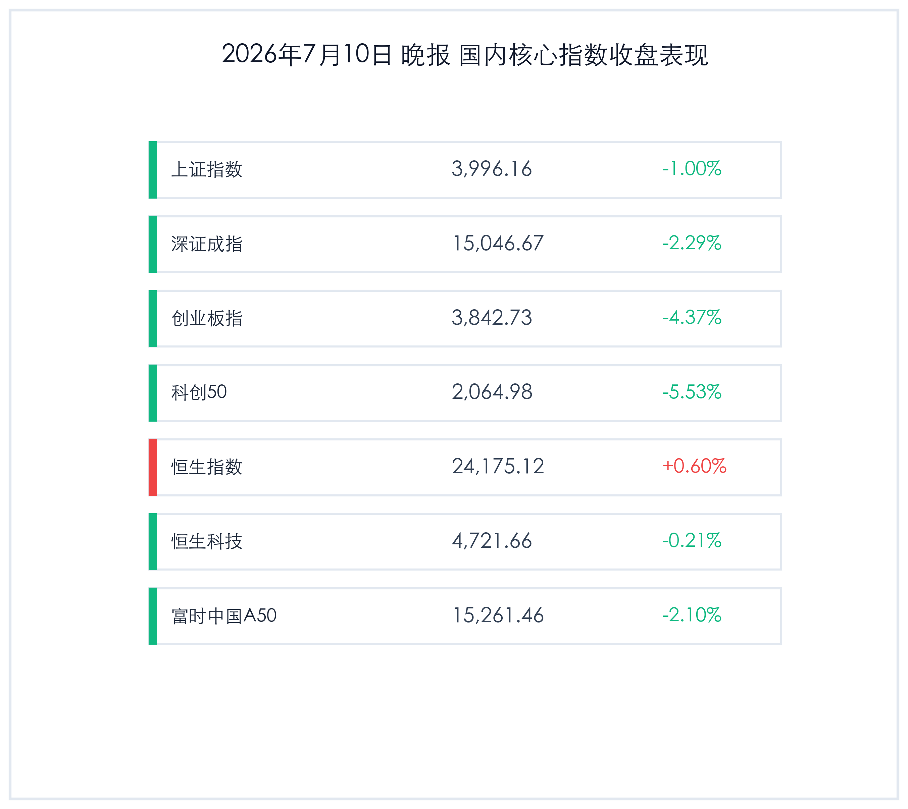

# 商业航天火箭回收突破创新药医保目录利好，A股放量大跌科技权重下挫，高低切换上演个股普涨

**日期：2026年07月10日 (星期五)** &nbsp; **时段：晚报 (常规交易日复盘)**

> **核心摘要**：今日（7月10日），国内金融市场呈现极其剧烈的结构分化。虽然大盘指数在半导体等前期高位科技权重股获利回吐打压下大幅下挫（科创50指数重挫5.53%），关主力指数深度回调，但全市场上涨个股数超3700只，呈现“权重杀跌、个股活跃”的罕见奇观。板块方面，长征十号乙运载火箭成功实现首次海上可控回收，引爆商业航天板块涨停潮；《国家基本药物目录（2026年版）》首次遴选创新药，推动医药板块全天大涨。两市成交额爆量放大至3.39万亿元，显示资金在天量震荡中进行剧烈的高低切换。

## 核心行情复盘

今日A股三大指数全天冲高回落、单边下挫，科技股权重尤其是半导体产业链遭遇剧烈回调。然而，由于非科技及传统行业个股大面积反弹，全市场个股呈现普涨态势。港股则相对具有韧性，恒生指数逆势收红。

*   **上证指数**：收报 **3996.16点**，下跌 **1.00%**。
*   **深证成指**：收报 **15046.67点**，下跌 **2.29%**。
*   **创业板指**：收报 **3842.73点**，下跌 **4.37%**。
*   **科创50指数**：收报 **2064.98点**，大跌 **5.53%**。
*   **恒生指数**：收报 **24175.12点**，上涨 **0.60%**。
*   **恒生科技指数**：收报 **4721.66点**，下跌 **0.21%**。
*   **富时中国 A50 期货**：收报 **15261.46点**，下跌 **2.10%**。
*   **全市场成交额**：沪深两市今日成交总额录得 **3.39万亿元**，较前一交易日放量 **4748亿元**，创下历史级天量。
*   **资金动向与个股比例**：全天主力资金明显从半导体设备、材料及算力硬件等高位科技板块撤离，高位龙头股获利回吐明显。存储芯片龙头兆易创新放量大跌 **7.76%**，全天成交额达 **593.81亿元**，刷新历史最高纪录。尽管指数跌幅明显，但全市场上涨个股数仍超 **3700只**，体现了极其强烈的结构性高低切换特征。

> **行业板块表现**：今日板块热点高度集中在有重磅消息催化的非科技赛道。**商业航天**板块全天飙升，海兰信、航天环宇、中国卫星等多股大面积涨停；**创新药及医药板块**受医保目录调整和出海高景气利好刺激表现极为强势，药明康德大涨超4%。相比之下，昨日暴涨的**半导体、芯片设计、光刻胶及算力设备**板块今日集体跳水，领跌全市场；**电力设备和储能**等新能源板块也跌幅居前。

## 核心解读与市场逻辑

> **商业航天迎来划时代“SpaceX时刻”，多重催化共振非科技成长主线**
> 
> 今日商业航天的历史性大涨是由长征十号乙运载火箭一子级海上可控回收圆满成功直接引爆的。这一技术突破标志着我国在低成本、可重复使用火箭发射领域取得了里程碑式进展，不仅大幅降低未来商业卫星发射的成本，更将极大加速我国千星、万星规模 of 低轨卫星互联网星座组网进度。相关设备制造、卫星载荷、天基互联等环节订单确定性大增，吸引了巨量踏空资金和成长股资金的疯狂涌入。与此同时，医药板块也迎来了卫健委基本药物目录首次将创新药纳入遴选范围的国策暖风，加上上半年近千亿美元的BD对外授权出海大订单表现，共同推高了非科技权重成长股的表现。

> **天量3.39万亿引发高低切换，“权重杀跌、个股普涨”折射主力资金调仓迹象**
> 
> 今日市场成交额飙升至3.39万亿元的历史天量，伴随着指数深跌却有3700只个股上涨的罕见背离。这种分化的核心原因在于前期半导体、AI芯片、算力等科技龙头在连续暴涨后交易拥挤度极高，资金积累了巨大的获利盘。在中报业绩预告与验证的窗口期，主力资金选择在高位获利了结，流出资金在天量震荡中迅速流向前期跌幅深、估值低的微盘股、传统消费、房地产以及有消息刺激的医药和商业航天板块。这种天量“大洗牌”不仅释放了科技股局部的拥挤风险，也反映了市场交投情绪依然极度亢奋，并非熊市式的大跌，而是健康的筹码高低切换。

## 政策脉动

*   **国家基本药物目录调整，创新药获得政策绿色通道**：国家卫健委发布《国家基本药物目录（2026年版）》，明确将符合临床需求的国产创新药首次纳入遴选，进一步缩短了新药从获批到进入医院和医保报销的时间链条，有力推动了我国医药研发的高端化转型。
*   **商业航天发射保障与商业化支持提速**：航天主管部门透露，针对重复使用火箭回收成功的成果，后续将加大对商业卫星星座建设的规划布局，出台更多旨在鼓励民间资本参与商业发射、卫星运营及终端应用的特许经营和税收支持政策。

## 最新机构观点

*   **华泰证券 (Huatai Securities)**：**“科技拥挤度短期调整，高低切换关注出海与政策强支撑板块”**。华泰证券指出，前期半导体等科技板块大涨后交易过于拥挤，今日获利盘集中涌出导致指数回调。短期应规避高拥挤题材，转向具有政策强力催化的创新药以及具备全球化逻辑的商业航天及出海高端制造龙头。
*   **博时基金 (Bosera Funds)**：**“三季度机会仍大于风险，天量换手重塑市场底座”**。博时基金认为，今日两市成交近3.4万亿元，创下天量。虽然指数大跌，但超3700只个股上涨，说明资金活跃度极高。本次调整是健康的筹码交换，有助于市场在4000点附近重塑底座，三季度整体科技主线与新质生产力方向依然向好。
*   **中金公司 (CICC)**：**“商业航天迎来‘SpaceX时刻’，重视航天硬科技长周期投资价值”**。中金公司点评称，长征十号乙的一子级回收成功，是中国商业航天发展史上具有划时代意义的事件。这将加速低轨卫星星座组网进程，标志着相关产业链进入订单验证与规模化量产阶段，强烈建议关注商业航天各细分领域的龙头标的。

## 今日市场情绪：天量分化，星药交辉

今日市场在天量换手中经历了一场非凡的“星药交辉”。一方面是承载了近期无限光芒的芯片半导体板块突遭重创，获利盘的涌出让指数显得有些黯淡；另一方面，太空中火箭回收的壮举与地面上生命科学的突破，又以极大的声势点燃了商业航天与医药板块的烽火。这不仅是一次资金的高低切换，更是市场对新质生产力广度的探索。在天量3.39万亿交投的热烈温度中，多头并没有退缩，而是选择在更宽广的硬科技与国策方向上，重新锚定中国资产的星辰大海。

> Prompt: Surrealism style, Subject: A sleek silver and blue space rocket ascends majestically into a dark starry sky, leaving a brilliant tail of glowing green light. Background: On the digital ground below, a forest of glowing red financial candlestick charts is swaying under a heavy digital storm. No humans. No text., masterpiece, high detail, intricate composition, cinematic lighting, 8k resolution

---

免责声明：内容仅供参考，不构成投资建议。
