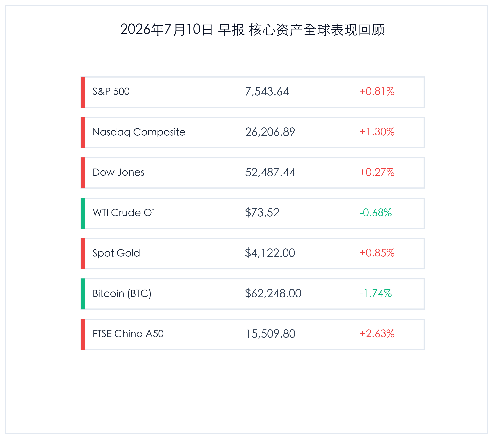

# A股狂飙半导体领涨，美股震荡走高纳指收红，黄金原油分化整理

**日期：2026年07月10日 (星期五)** &nbsp; **时段：早报 (常规交易日复盘)**

> **核心摘要**：昨日（7月9日），全球金融市场呈现多元分化格局。中国A股市场在全新交易规则优化与科技股国产化预期加持下迎来放量暴涨，两市成交额突破2.9万亿元，富时中国A50指数大涨2.63%。国际市场上，中东地缘军事对抗日内虽一度引发剧震，但随着油价尾盘小幅回落，通胀担忧暂退，在半导体和AI芯片巨头强力反弹推动下，美股全线收高，纳指上涨1.30%。避险资金小幅回流黄金使现货金价反弹0.85%，比特币则受流动性隐忧压制，震荡下跌1.74%。

## 核心行情复盘

昨日全球核心资产在剧烈消化地缘事件的同时，科技板块展现出强大的领涨势能。中国A股放量单边拉升，美股在探底后多头卷土重来，而原油、黄金与加密市场各行其道。

*   **标普500指数 (S&P 500)**：收报 **7,543.64点**，上涨 **0.81%**。
*   **纳斯达克综合指数 (Nasdaq)**：收报 **26,206.89点**，上涨 **1.30%**。
*   **道琼斯工业平均指数 (Dow Jones)**：收报 **52,487.44点**，上涨 **0.27%**。
*   **WTI原油期货**：收报 **73.52美元/桶**，下跌 **0.68%**。
*   **伦敦现货黄金**：收报 **4,122.00美元/盎司**，上涨 **0.85%**。
*   **比特币 (BTC)**：收报 **62,248.00**，下跌 **1.74%**。
*   **富时中国 A50 指数**：收报 **15,509.80点**，上涨 **2.63%**

> **行业板块表现**：昨日全球市场中，**半导体与计算硬件**板块成为绝对的暴涨引擎。受国内半导体自立自强预期和英伟达等全球AI芯片龙头反弹共振影响，中港美三地半导体全线飙升。相比之下，由于中东冲突在美股尾盘有所缓解，**能源及石油开采**板块在经历前一日大涨后出现小幅获利回吐，WTI原油微幅收跌。黄金等避险公用事业板块温和反弹，而加密货币相关板块以及受到大宗商品降温影响的材料板块表现落后。

## 核心解读与市场逻辑

> **交易规则改革红利与科技国产共振，中国A股掀起两万亿级暴涨浪潮**
> 
> 昨日中国A股市场的狂飙是政策红利与科技主线共振的集中爆发。自7月6日新交易制度实施以来（主板ST放宽涨跌幅、盘后固定价格交易等），市场结构优化初见成效，过度投机受到压制，转而吸引了大量中长期资本和海外避险资金入场。昨日两市成交额暴增至2.91万亿元的史诗级规模，科技板块（芯片、算力、软硬件）全线暴涨。在全球地缘冲突频发、波动加剧的背景下，估值处于低位、具备防御 and 多元化属性的中国资产，正成为全球资本的“避风港”。

> **地缘避险担忧稍解，美股尾盘回吐石油溢价，AI巨头力撑大盘收红**
> 
> 尽管美伊在霍尔木兹海峡的局势一度在日内引发避险情绪升温，但随着原油价格在尾盘自高位回落（WTI收跌0.68%），市场对“二次通胀”的恐慌被暂时压制。科技龙头及AI芯片股表现强劲，推动纳指与标普500指数大幅走高。美国经济数据的韧性与科技巨头稳固的现金流，在震荡市中提供了强有力的估值支撑。黄金昨日在经历了因高美债收益率引发的踩踏后，由于地缘风险持续，避险买盘卷土重来，温和反弹0.85%。而比特币在流动性偏紧预期下表现疲软，跌破63,000美元大关。

## 政策脉动

*   **中国交易制度改革成效显现**：沪深北交易所的新版交易规则落地首周，通过优化ST涨跌幅以及盘后交易，市场投机行为得到遏制，巨额中长期资金和海外资本加速流向芯片及高端制造等高含金量科技龙头。
*   **中东局势升级与外交斡旋并存**：美伊袭击事件发生后，双方均未表现出进一步全面扩大冲突的意愿。白宫宣布维持对伊朗原油出口的限制，而联合国等机构正开展紧急外交斡旋，以防止霍尔木兹海峡大动脉被长期切断。

## 最新机构观点

*   **中金公司 (CICC)**：**“A股成交逼近3万亿，新交易规则重塑生态，超配硬科技”**。中金认为，昨日两市2.91万亿元成交量反映出增量资金的迫切入场。新交易规则有利于提高主板定价效率，并在全球动荡期突显A股的避险多元化优势。当前位置应坚关超配代表核心生产力的半导体自主可控、AI硬件产业链。
*   **高盛 (Goldman Sachs)**：**“地缘博弈常态化，美股科技巨头仍是流动性蓄水池”**。高盛策略分析称，尽管中东局势的尾部风险依旧存在，但只要油价不发生长期失控的连环暴涨，美联储的政策节奏就难以被打乱。在这种环境下，拥有强大负债表和高自由现金流的美股AI和软件科技巨头仍然是应对全球波动最好的防御工具。
*   **贝莱德 (BlackRock)**：**“全球配置进入‘中国时间’，关注大盘Megacaps估值重组”**。贝莱德最新策略简报显示，随着全球科技板块估值出现局部拥挤，中国A股作为高性价比的“低估值、高流动性”避险资产，正在吸引主流多头基金回补仓位，尤其看好与全球半导体和绿色供应链相关的细分领域。

## 今日市场情绪：中东惊雨，科技涅槃

今日全球市场在经历了前一日中东地缘的暴雷洗礼后，迎来了科技资产的涅槃。中国A股以放量近3万亿的狂飙宣告了低估值资产的爆发力，而美股在通胀恐慌略微退潮后同样依靠AI芯片巨头收复失地。地缘冲突的警钟依然在耳边回荡，但在宏观政策支持与科技产业周期的驱动下，多头正用行动证明，核心科技与中国资产已成为乱局中最新、最坚实的避险堡垒。

> Prompt: Surrealism style, Subject: A majestic phoenix woven from glowing green laser light and intricate semiconductor paths rises triumphantly from a turbulent sea of dark red clouds. Background: In the background, a massive golden sun shaped like a clock and compass rises over a digital horizon, casting a warm light on columns of silver server towers. No humans. No text., masterpiece, high detail, intricate composition, cinematic lighting, 8k resolution

---

免责声明：内容仅供参考，不构成投资建议。
