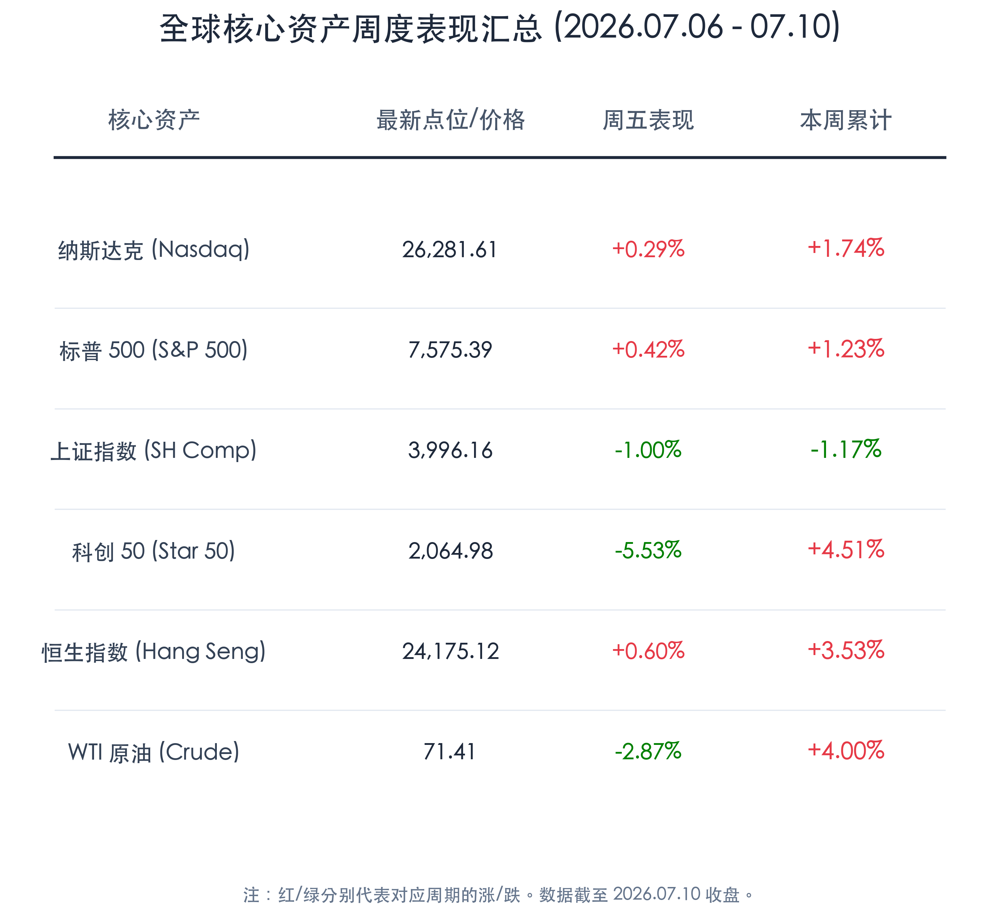
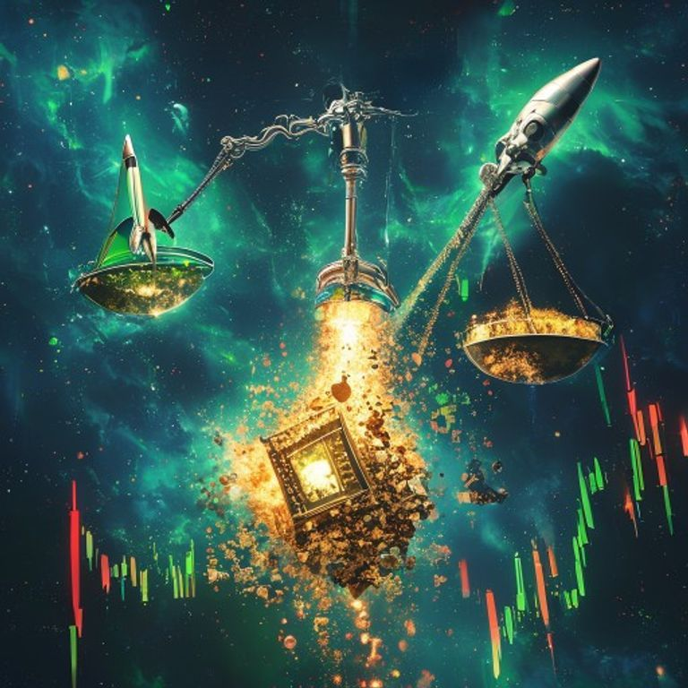

# 芯片星潮涌动美股收红，A股天量洗牌高低轮动，火箭海上回收开启商业航天新纪元

**日期：2026年07月11日 (星期六)** &nbsp; **时段：晚报 (周末复盘)**

> **核心摘要**：本周全球资本市场呈现出极具戏剧性的冷热交替与结构性大洗牌。美股市场在存储芯片巨头SK Hynix纳斯达克IPO首日大涨13%的提振下，科技龙头维持强势，三大指数全线周线收红。然而，国内资产在周五经历了历史级的剧烈“高低切换”，A股全天爆量成交达3.39万亿元，前期拥挤的芯片半导体等科技权重股在周五大幅下挫，资金转而疯狂涌入受火箭海上成功回收利好的商业航天板块，以及国家卫健委基本药物目录调整政策刺激的医药创新药板块。整体来看，全球主要股指本周依然录得温和上涨，A股在天量博弈中完成了健康的筹码交换，为下半年牛市的纵深发展重塑底部。

## 核心资产周度/日度表现回顾

本周全球主要权益市场及商品走势呈现震荡分化。美股三大指数全周稳步上扬，港股市场强势反弹领跑，而A股指数受周五半导体权重股大幅回调影响，呈现周度微跌，但全周成交量创下历史级天量。

*   **标普500指数 (S&P 500)**：收报 **7,575.39点**，周五上涨 **0.42%**，本周累计上涨 **1.23%**。
*   **纳斯达克综合指数 (Nasdaq)**：收报 **26,281.61点**，周五上涨 **0.29%**，本周累计上涨 **1.74%**。
*   **上证指数 (SH Comp)**：收报 **3,996.16点**，周五下跌 **1.00%**，本周累计下跌 **1.17%**。
*   **科创 50 指数 (Star 50)**：收报 **2,064.98点**，周五大跌 **5.53%**，本周累计上涨 **4.51%**。
*   **恒生指数 (Hang Seng)**：收报 **24,175.12点**，周五上涨 **0.60%**，本周累计上涨 **3.53%**。
*   **WTI 原油期货**：收报 **71.41美元/桶**，周五下跌 **2.87%**，本周累计上涨 **4.00%**。

> **行业板块表现**：本周全球半导体与AI硬件板块继续在美股领涨，核心驱动力为SK Hynix在美股IPO并大涨提振了全球供应链信心。而国内市场在周五上演了罕见的“权重杀跌、个股普涨”行情，高位半导体设备、AI算力以及电池新能源板块遭遇强烈的获利回吐；与此形成鲜明对比的是，**商业航天**板块在长征十号乙一子级海上可控回收成功的里程碑式催化下，掀起涨停狂潮；**创新药及医药板块**在医保基本药物目录调整绿色通道等政策利好共振下全天暴涨。商品市场方面，WTI原油在地缘局势缓和与增产博弈中周五显著走低，但周度依然录得4%的涨幅；黄金高位窄幅震荡，受美联储高利率预期压制，周跌幅达1.5%。

## 过去 48 小时重磅事件深度复盘

> **长征十号乙运载火箭成功海上回收，开启中国“SpaceX时刻”与商业航天组网新阶段**
> 
> 7月10日，我国自主研发的长征十号乙运载火箭一子级首次海上可控回收任务圆满成功。这不仅标志着我国在低成本、可重复使用火箭发射领域取得了划时代的技术突破，更将我国后续千星、万星规模的低轨卫星互联网星座组网成本拉低数倍。这一技术的成功商业化，直接推升了商业航天产业链在精密制造、卫星载荷、卫星通信终端等环节的订单能见度，吸引了市场大量“耐心资本”和踏空资金对该硬科技板块的疯狂扫货。

> **卫健委基药目录大调整，创新药首开遴选政策绿色通道，出海景气引多头回巢**
> 
> 国家卫健委发布《国家基本药物目录（2026年版）》，首次明确将符合临床需求的国产高端创新药纳入基药目录遴选范围，极大地缩短了创新药获批后进入医院与医保覆盖的时间周期。结合今年上半年国内药企对外授权（BD）出海订单金额破千亿美元的高景气表现，政策与产业暖风双管齐下，推动医药板块全天大涨，成为周五A股科技权重深蹲回调时主力资金的最佳避风港。

> **SK Hynix纳斯达克IPO首日大涨13%，再度验证全球AI算力硬件长周期景气**
> 
> 韩国半导体及高带宽内存（HBM）巨头SK Hynix于美东时间周五正式登陆纳斯达克，募资规模达265亿美元，上市首日暴涨13%。此举有力回击了市场此前对半导体上游资本开支可能见顶的疑虑，印证了全球智算集群对先进算力与存储芯片的绝对饥渴度，直接稳定了全球科技多头的做多底座。

## 下周全球宏观大事预警

1.  **美国6月CPI数据（7月14日）重磅来袭**：这是下周全球最瞩目的宏观催化剂。在原油价格高位回落、劳动力市场走软的背景下，若CPI能展现出超预期的回落，将为美联储在第四季度的降息路径提供极强的数据支撑，有望彻底引爆新兴市场权益资产。
2.  **美联储主席 Kevin Warsh 的听证会及密集官员讲话**：市场将密切关注其对当前金融体系抗压能力和高利率持续时间的评估，其偏鹰或偏鸽的措辞将直接导致全球债券收益率与汇率剧烈震荡。
3.  **国内二季度宏观数据与“十五五”产业配套政策落地**：国内将公布二季度GDP、工业增加值等多项关键数据，验证基本面复苏的成色。与此同时，发改委及各部委关于美丽中国、环保装备及空间基建的细化配套细则预计也将在下周渐次出炉，相关设备更新与新质生产力板块将持续获得政策红利支撑。

## 顶级机构周末策略内参摘要

*   **华泰证券 (Huatai Securities)**：**“科技拥挤度短期调整，高低切换关注出海与政策强支撑板块”**。华泰证券指出，前期半导体等科技板块大涨后交易过于拥挤，今日获利盘集中涌出导致指数回调。短期应规避高拥挤题材，转向具有政策强力催化的创新药以及具备全球化逻辑的商业航天及出海高端制造龙头。
*   **博时基金 (Bosera Funds)**：**“三季度机会仍大于风险，天量换手重塑市场底座”**。博时基金认为，今日两市成交近3.4万亿元，创下天量。虽然指数大跌，但超3700只个股上涨，说明资金活跃度极高。本次调整是健康的筹码交换，有助于市场在4000点附近重塑底座，三季度整体科技主线与新质生产力方向依然向好。
*   **中金公司 (CICC)**：**“商业航天迎来‘SpaceX时刻’，重视航天硬科技长周期投资价值”**。中金公司点评称，长征十号乙的一子级回收成功，是中国商业航天发展史上具有划时代意义的事件。这将加速低轨卫星星座组网进程，标志着相关产业链进入订单验证与规模化量产阶段，强烈建议关注商业航天各细分领域的龙头标的。

## 今日市场情绪：星火天量，天平倾斜

本周全球金融市场在史诗级的筹码大洗牌中，上演了一场以科技龙头为轴心的天平倾斜。一方面，美国纳斯达克迎来韩国存储巨头SK Hynix的IPO狂欢，AI算力星火依然在全球迈步前行；另一方面，国内A股在天量成交中释放高位拥挤盘，资金快速进行高低切换，向天上的火箭回收与地面的创新药物奔流而去。这种结构性巨震并非行情的终结，而是牛市换挡期力量的重新分配。在震荡的星河中，市场正以更宽广的硬科技视角，重塑中国优质资产与新质生产力的价值天平。

> Prompt: Surrealism style, A massive silver mechanical scale floating in space. One side of the scale holds a glowing green space rocket launching towards the stars, while the other side holds a giant golden microchip crumbling into glittering dust. Background: A deep blue cosmic nebula filled with swirling green and red financial candlestick charts. No humans. No text., masterpiece, high detail, intricate composition, cinematic lighting, 8k resolution

---

免责声明：内容仅供参考，不构成投资建议。
