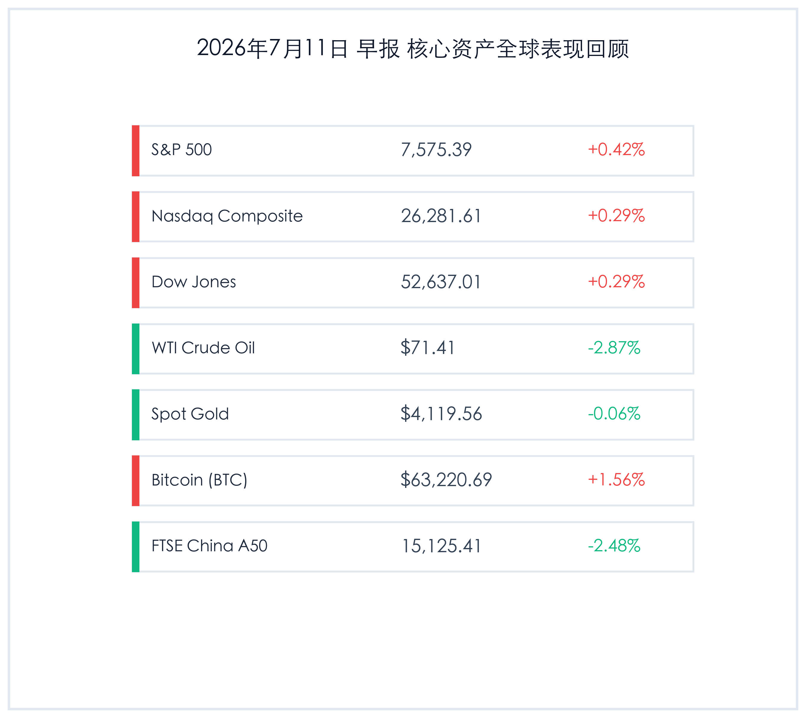

# SK Hynix史诗级IPO引爆芯片热潮，美股连涨纳指收红，A50高位回调大跌逾2%

**日期：2026年07月11日 (星期六)** &nbsp; **时段：早报 (常规交易日复盘)**

> **核心摘要**：昨日（7月10日），全球市场展现出剧烈的冷热交替。国际市场上，韩国存储芯片巨头SK Hynix在纳斯达克进行史诗级IPO，首日暴涨13%，有力提振了全球AI半导体产业链的做多情绪。受此及银行板块回暖提振，美股三大指数全线微涨收红。然而，国内资产遭遇剧烈的“高低切换”震荡，富时中国A50指数大跌2.48%，A股三大股指由于前期科技权重获利回吐而集体深跌，唯有商业航天与创新药逆势走强。大宗商品方面，WTI原油因中东地缘担忧缓解震荡大跌2.87%，现货金价窄幅震荡微跌0.06%，比特币则反弹1.56%重新逼近6.5万美元关口。

## 核心行情复盘

昨日全球核心资产走势分化。美股在科技巨头与银行板块支撑下稳健上行，而中国A50指数与A股受高位资金调仓影响大幅回调，原油由于中东局势的短期缓和显著走弱，加密资产则迎来超跌反弹。

*   **标普500指数 (S&P 500)**：收报 **7,575.39点**，上涨 **0.42%**。
*   **纳斯达克综合指数 (Nasdaq)**：收报 **26,281.61点**，上涨 **0.29%**。
*   **道琼斯工业平均指数 (Dow Jones)**：收报 **52,637.01点**，上涨 **0.29%**。
*   **WTI原油期货**：收报 **71.41美元/桶**，下跌 **2.87%**。
*   **伦敦现货黄金**：收报 **4,119.56美元/盎司**，下跌 **0.06%**。
*   **比特币 (BTC)**：收报 **63,220.69**，上涨 **1.56%**。
*   **富时中国 A50 指数**：收报 **15,125.41点**，下跌 **2.48%**。

> **行业板块表现**：昨日全球半导体行业因韩国芯片巨头SK Hynix在美股上市大涨而呈现极高的交投热度，AI硬件、高带宽内存（HBM）概念股继续在美股领跑。此外，随着第二季度财报披露在即，美股大型银行板块获得资金提前布局，支撑了大盘表现。而在商品端，原油相关能源板块受供需基本面博弈及中东海域局势缓和影响表现最差，领跌大宗市场。黄金等公用事业和贵金属板块保持横盘整理。国内A股板块则上演极端的“高低切换”，半导体等前期暴涨科技股大范围退潮，而医药、商业航天板块成为资金抱团的新高地。

## 核心解读与市场逻辑

> **SK Hynix史诗级上市引爆AI新动能，美股财报季前夜多头稳打稳扎**
> 
> 韩国存储巨头SK Hynix在纳斯达克的成功上市（首日上涨13%，筹资达265亿美元）是本交易日最瞩目的市场焦点。该股首日的强势表现再度向全球资本证明，AI服务器对高带宽内存（HBM）芯片的需求依然供不应求，进一步稳固了半导体与AI硬件板块的中期成长底座。伴随下周美国主要银行（如高盛、摩根大通等）财报的即将出炉，美股多头采取了相对谨慎但积极的防守姿态，资金在AI科技股与防御性大金融股之间保持了良好的配置平衡。中东局势在日内未见进一步失控，WTI原油的风险溢价显著消退（大跌2.87%），使得市场的“通胀隐忧”暂时舒缓，为美股大盘的微涨收红营造了适宜的宏观环境。

> **天量天价后迎来筹码大洗牌，A50与A股震荡调整释放局部拥挤度**
> 
> 与美股市场的温和上扬不同，富时中国A50指数与国内A股市场在昨日（7月10日）经历了极其强烈的震荡洗牌。虽然两市成交额爆量录得3.39万亿元的历史级天量，但大盘指数却出现了大幅回调（科创50大跌5.53%），高位半导体股遭到主力资金的获利出逃。这折射出在经历连续的史诗级拉升后，科技成长股的持仓拥挤度已达到临界点，部分长线多头 and 获利资金在半年报验证期到来前主动进行“高低切换”。资金迅速分流至政策利好的创新药板块与技术取得突破（运载火箭成功海上回收）的商业航天领域。这种高位换手并非行情终结，而是牛市震荡期健康的流动性再平衡，有助于释放筹码压力、重塑市场的中期底部。

## 政策脉动

*   **美联储偏鹰立场未改，市场静待CPI催化**：最新美联储纪要暗示在通胀彻底受控前，下半年降息空间或受限。下周（7月14日）公布的 June CPI 数据和美联储主席 Kevin Warsh 的货币政策听证会将成为评估下半年美联储降息幅度的关键“分水岭”。
*   **欧盟政策引导经济安全，英国财政警钟敲响**：欧盟理事会通过2026年国别建议，旨在引导欧洲资本加大在清洁能源和关键原材料供应链的财政投资。同时，英国预算责任办公室（OBR）警告债务轨迹已处“不可持续”路径，施压新一届内阁采取紧缩或增税政策。
*   **国内多重产业利好共振**：卫健委发布新版国家基本药物目录，创新药首次进入遴选；同时商业航天领域迎来长征十号乙海上回收成功的技术突破，国家在空间基建和低轨星座组网领域的顶层规划与财税政策支持正加速落地。

## 最新机构观点

*   **高盛 (Goldman Sachs)**：**“HBM存储供需缺口巨大，AI硬件周期仍在半山腰”**。高盛策略报告指出，SK Hynix在纳斯达克挂牌并大涨，表明全球资金对算力硬件的投资热情并未熄灭。考虑到AI服务器迭代对高带宽内存的倍增需求，半导体产业链的盈利周期依然处于扩张通道中，任何因地缘或宏观数据引发的震荡都是较好的买入契机。
*   **中信证券 (CITIC Securities)**：**“3.4万亿天量洗牌，高低切换后科技仍是成长主线”**。中信证券认为，昨日A股天量成交和指数调整是典型的机构获利调仓。科技拥挤度消化后，资金将在半年报业绩确定性最高的算力设备、通信光模块及自主可控芯片等核心领域重新集结。短期建议在医药、商业航天等催化主题中寻找防御避风港。
*   **摩根大通 (JPMorgan)**：**“油价下跌缓解二次通胀担忧，降息预期有望在CPI后重新定位”**。小摩大宗商品团队分析，昨日WTI原油跌破72美元，主因是美伊冲突日内未出现物理层面的运输中断，地缘溢价回吐。这极大地减轻了美联储在物价端的压力，若下周CPI数据符合预期，市场对四季度降息的信心将重新回升，利好黄金与新兴市场资产。

## 今日市场情绪：芯片星火，天量淘沙

今日全球市场在上演一场“芯片星火”与“天量淘沙”的交响乐。大洋彼岸，韩国半导体巨头的上市神话再度引爆了AI时代硬件王国的狂欢，推着美股多头在财报季前夜稳步前行；而在国内，3.39万亿的天量换手则像一柄大筛，将前期科技股的浮躁与获利盘尽数滤去。虽然指数在大洗牌中略显疲态，但商业航天的火箭升空与生命科学的政策暖风，证明多头的探索并未止步。在天量博弈与高低轮动的震荡期，全球资本正在为中国资产与AI浪潮，酝酿下一场更具深度的价值共振。

> Prompt: Surrealism style, Subject: A colossal, glowing silver bridge constructed from high-bandwidth memory chips and intricate fiber-optic cables spans between a digital skyline and a futuristic Wall Street monument. Background: In the background, rising green laser lines of ascending stock charts cut through a starry dark blue night sky, while massive silver pillars resembling bank vaults support the glowing bridge. No humans. No text., masterpiece, high detail, intricate composition, cinematic lighting, 8k resolution

---

免责声明：内容仅供参考，不构成投资建议。
