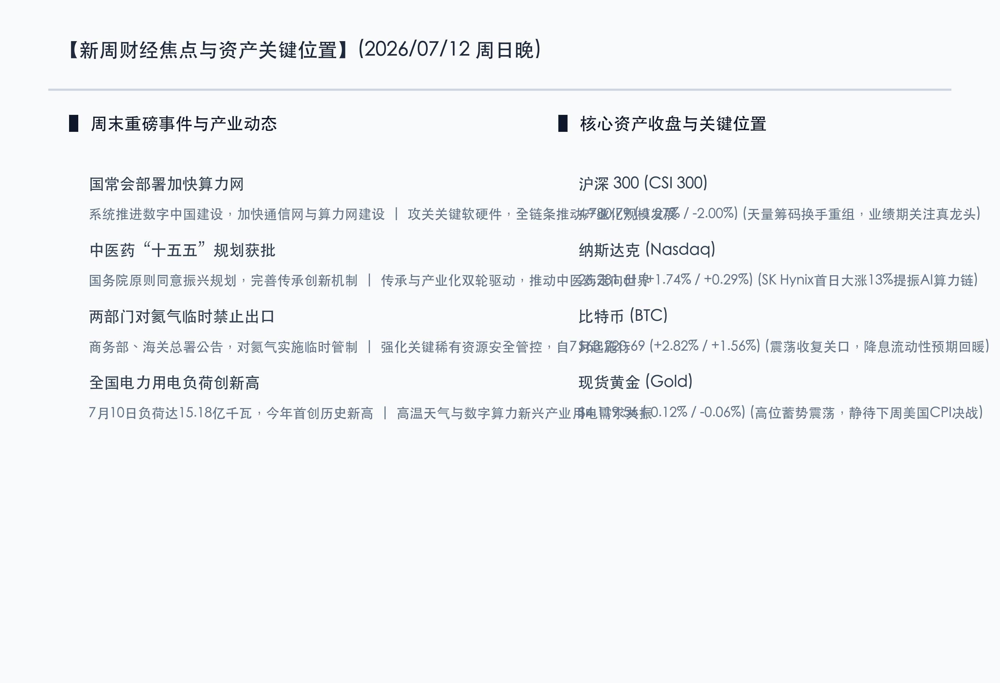

# 国常会系统部署算力网蓝图，中医药“十五五”规划出台，氦气禁运筑牢稀缺资源防线

**日期：2026年07月12日 (星期日)** &nbsp; **时段：晚报 (新周展望模式)**

> **核心摘要**：本周末国内迎来多项重磅政策落地与宏观数据前瞻。国务院常务会议系统部署数字中国建设，强调加快新一代通信网与算力网基础设施攻关，为数字经济底座注入强心剂；国务院原则同意中医药振兴发展“十五五”规划，以传承与产业化双轮驱动板块估值重塑；商务部等两部门公告对氦气实施临时出口管制，强化国家稀缺战略资源安全。同时，7月10日全国用电负荷首次创历史新高，映射出数字算力爆发与高温用电的共振。展望新一周，市场处于中报“真业绩验证”窗口与国内二季度GDP等核心经济数据落地的交汇期，多空博弈将围绕“真成长”与“红利防御”展开。

## 周末财经要闻终极汇总

周末期间，国内宏观政策、行业规划与前沿需求端均发生重大边际变化，为新一周的市场博弈定下了积极基调。

### 1. 国常会系统部署数字中国，加快算力网与关键软硬件攻关
> **事件原因与核心解读**：国务院常务会议听取数字中国建设情况汇报，明确提出要系统推进数字中国建设，加快新一代通信网、算力网建设。在当前全球智算集群高速扩张、国产替代步入深水区的背景下，管理层将算力网络与通信网并列，上升至国家战略高度，旨在通过政策引导和资金扶持，打通国内算力“供需阻碍”。这不仅直接利好国产算力硬件（光模块、服务器、液冷）及算力调度平台，更对基础操作系统、数据库等关键软硬件“卡挂子”环节的自主化进程提供强力支持。

### 2. 中医药“十五五”规划获批，推动传承创新与产业化出海
> **核心解读与市场洞察**：国务院原则同意《中医药振兴发展“十五五”规划》，强调要完善中医药传承创新发展机制。这是未来五年引领我国传统医药走向现代化、产业化和国际化的纲领性文件。在当前医保控费常态化与基本药物目录调整绿色通道开启的背景下，符合高临床价值、具备独特壁垒的品牌中药与创新中药企业，将迎来政策与市场共振。市场洞察表明，政策面从单纯的“保护传承”转向“传承与产业化双轮驱动”，将加速中医药出海与高端消费中药的价值重塑。

### 3. 两部门对氦气实施临时禁止出口，构筑稀有资源国家防线
> **事件原因与市场洞察**：商务部、海关总署发布公告，为维护国家安全和利益，决定对氦气实施临时禁止出口管理。氦气作为极具战略价值的非再生稀缺气体，在半导体制造、超导、核磁共振及航空航天等前沿硬科技领域具有不可替代的用途。我国氦气长期依赖进口，此番对氦气出口实施临时管制，标志着我国对关键战略稀缺资源的管控力度进一步升级，有利于保障国内关键产业链在极端外部环境下的资源供给安全，相关特种气体企业及半导体材料板块将获得估值溢价。

### 4. 高温与数字产业共振，全国电力用电负荷首创历史新高
> **事件原因与核心解读**：受高温天气和新兴产业（尤其是大型AI智算中心、先进制造）用电需求拉动，7月10日全国用电负荷达到15.18亿千瓦，今年以来首次创下历史新高。这反映出国内经济结构转型中“电能化”的加速演进。AI算力是典型的“吞电怪兽”，算力网的建设与全国电力的负荷爬升呈正相关关系。随着三季度用电高峰期的全面到来，电网调峰、虚拟电厂、绿色电力交易以及高效率输配电装备的需求将被集中释放，电力公用事业与绿电板块景气度将迎来季节性与结构性的双重抬升。

## 新一周市场核心博弈逻辑

> **博弈点 A：国常会重磅吹风下，国产算力与数字底座能否重回反弹主线？**
>
> 随着上周五A股科技权重股因交易过于拥挤而遭遇获利回吐，本次国常会对“算力网与关键软硬件”的系统部署，无疑为市场多头送来了及时雨。在新一周，资金的博弈焦点在于：是继续抱团在具有政策预期和事件催化（如7月17日WAIC世界人工智能大会）的算力硬件、国产软件板块，还是在半年报“业绩验证”的强监管下转向保守。机构普遍认为，具备真实订单和中报利润兑现能力的算力龙头，将在短暂调整后再度跑赢大盘。

> **博弈点 B：氦气出口限制落地，战略小金属与特种气体能否掀起估值风暴？**
>
> 商务部两部门对氦气等关键气体的出口限制，将引起全球供应链对战略稀缺气体的重视。我国是氦气的主要消费国之一，本次临时管制有利于强化产业链自主安全可控预期。市场资金通常对此类战略出口限制政策反应迅速，可能在开盘后迅速寻找国内特种气体（如气体分离、提纯、充装龙头）及战略资源板块的估值重估机会。关键博弈点在于相关个股是否具有实质性的氦气进口渠道替代、提纯技术以及产能落地的真实盈利贡献，避免跟风纯题材炒作。

> **博弈点 C：下周国内GDP大考与中报强预警来袭，红利低波与成长股天平如何倾斜？**
>
> 下周三（7月15日）国家统计局将公布国内二季度GDP、6月社零等多项重磅宏观数据，同时也是A股半年报业绩预告强制披露的截止日。这一时间窗口是市场风险偏好的重要“分水岭”。若宏观经济数据表现温和，且中报业绩雷声渐隐，资金可能继续向新质生产力与成长方向流入；若数据验证经济复苏动能仍偏弱，高分红、稳健现金流的红利低波资产（如银行、电力、运营商）作为底仓的防御价值将再次被放大，市场可能维持高低切换的均衡博弈。

## 本周重磅经济数据与会议前瞻

*   **周一（7月13日）**：
    *   **两部门对氦气实施临时禁止出口管理政策开始引发市场解读**（特种气体与稀缺资源题材活跃度测试）。
*   **周三（7月15日）**：
    *   **国家统计局公布中国二季度 GDP、6月社零及工业增加值等重磅数据**（决定A股中期风险偏好与景气度确认）。
    *   **中国 A 股中报业绩预告强制披露截止日**（检验“真业绩”的关键分水岭，防范垃圾股爆雷）。
*   **周四（7月16日）**：
    *   **长鑫科技等超级大盘股打新进程及市场流动性扰动**（关注资金分流效应）。
    *   **A 股 41 家公司解禁高峰期**（总市值约528亿元，关注局部筹码压力）。
*   **周五（7月17日）**：
    *   **世界人工智能大会 (WAIC 2026) 在上海正式开幕（至7月20日）**（聚焦AI大模型、具身智能及智算基础设施落地）。

## 头部券商/投行开盘策略点睛

*   **中信系统 (CITIC)**：**“把握政策底座与业绩大考，坚守数字基建与红利底盘”**。中信证券认为，国常会再次定调算力网络与关键软硬件，为下半年数字中国建设指明了方向。随着7月15日中报强制预警截止日和GDP数据的到来，市场即将迎来“验牌期”。建议以“业绩确定性”为核心抓手，一手紧抓中报有强支撑的国产算力链与智能硬件，一手稳配高现金流的红利资产以防御短期震荡。
*   **华泰证券 (Huatai Securities)**：**“高低切换未结束，战略资源与细分产业升级成突破口”**。华泰证券指出，上周五3.39万亿的天量震荡表明高位题材股拥挤度极高，资金在政策催化下正加速切换。氦气出口管制与中医药“十五五”规划是本周末的核心政策催化。预计短期资金将围绕特种气体、品牌中药等低位且有政策加加的板块展开防御性抱团。
*   **中金公司 (CICC)**：**“中报验证期重在业绩兑现度，公用事业与电网升级显防御弹性”**。中金公司点评称，全国电力负荷创历史新高折射出数字经济对能源基础的极高消耗。算力网与通信网的发展必须以电网的智能化、绿色化为支撑。在中报验证的关键阶段，建议超配具有业绩高确定性且受益于用电高峰及设备更新的电网装备、火电调峰及虚拟电厂龙头，构建安全边际。

## 今日市场情绪：青鼎生烟，数字连云

在本周全球市场史诗级巨震、A股天量洗牌的沉降期，周末的政策暖风如同青玉鼎中升腾的袅袅青烟，不仅带来源远流长、传承创新的中医药希望，更在宏观夜空中交织成一张通往未来的庞大数字算力网。面临即将到来的二季度GDP大考与中报财报强制验证，市场在短期的浮躁退潮后，天平正坚定地向有国家政策保驾护航、有战略安全资源托底的底座倾斜。在深邃的夜空中，战略氦气构筑的安全气泡与闪烁的晶圆明月风雨同行，引导着新质生产力的资本潮水在理性的防线中，重塑中国核心资产的价值天平。

> Prompt: Surrealism style, Subject: A massive traditional incense burner made of green jade, with steam rising from it that morphs into glowing golden circuits and green light networks. Background: A deep night sky filled with swirling neon green power lines and floaty helium bubble clusters, a large glowing digital wafer moon shining in the background. No humans. No text., masterpiece, high detail, intricate composition, cinematic lighting, 8k resolution

---

免责声明：内容仅供参考，不构成投资建议。
