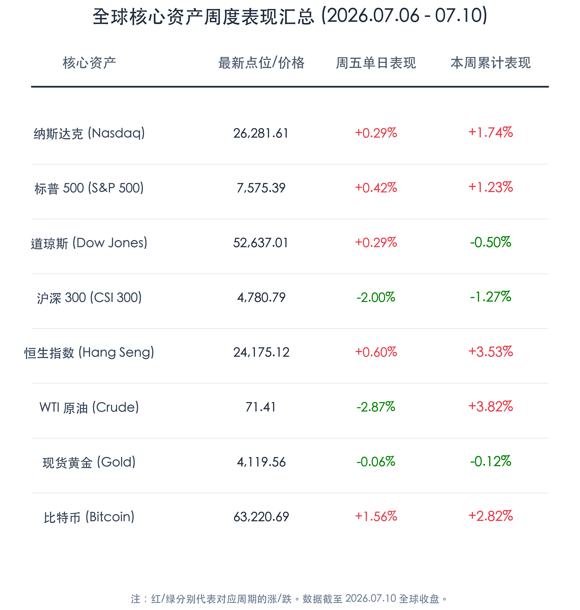

# SK Hynix史诗级上市点燃半导体狂潮，全球股市冷热分化，多空交织静待宏观大考

**日期：2026年07月12日 (星期日)** &nbsp; **时段：周末复盘**

> **核心摘要**：本周全球市场呈现显著的结构性温差。韩国半导体巨头 SK Hynix 成功登陆纳斯达克并暴涨近 13%，创下美国历史上最大外资 IPO 纪录，强力重振了全球 AI 产业链的信心，推动纳指与标普 500 全周震荡收红。然而，中国 A 股及富时 A50 指数在前期科技板块高度拥挤后迎来剧烈回调，沪深 300 单周下跌 1.27%，呈现典型的“高低切换”洗牌。大宗商品方面，中东局势的博弈与美国 CPI 公布前的谨慎观望令市场保持震荡，WTI 原油全周收涨 3.82%，而现货金价窄幅波动微跌 0.12%。

## 核心资产周度/日度表现回顾

本周全球核心资产表现分化明显。美股和港股在科技与大金融板块的合力拉升下录得全周净增长；受高位芯片股获利了结影响，国内 A 股市场在周五爆量大跌，拖累了全周表现；受能源供求预期与宏观通胀形势影响，原油和黄金表现相对平稳，而加密资产则实现超跌反弹。

*   **纳斯达克综合指数 (Nasdaq)**：收报 **26,281.61点**，周五上涨 **0.29%**，全周累计上涨 **+1.74%**。
*   **标普 500 指数 (S&P 500)**：收报 **7,575.39点**，周五上涨 **0.42%**，全周累计上涨 **+1.23%**。
*   **道琼斯工业平均指数 (Dow Jones)**：收报 **52,637.01点**，周五上涨 **0.29%**，全周累计下跌 **-0.50%**。
*   **沪深 300 指数 (CSI 300)**：收报 **4,780.79点**，周五下跌 **2.00%**，全周累计下跌 **-1.27%**。
*   **恒生指数 (Hang Seng)**：收报 **24,175.12点**，周五上涨 **0.60%**，全周累计上涨 **+3.53%**。
*   **WTI 原油期货 (Crude Oil)**：收报 **71.41美元/桶**，周五下跌 **2.87%**，全周累计上涨 **+3.82%**。
*   **现货黄金 (Gold Spot)**：收报 **4,119.56美元/盎司**，周五下跌 **0.06%**，全周累计下跌 **-0.12%**。
*   **比特币 (Bitcoin)**：收报 **63,220.69点**，周五上涨 **1.56%**，全周累计上涨 **+2.82%**。

## 过去 48 小时重磅事件深度复盘

1.  **SK Hynix 史诗级赴美 IPO 首战告捷**：
    > 韩国存储芯片巨头 SK Hynix 于 7 月 10 日成功在纳斯达克完成 IPO（交易代码 SKHYV，周一开始正式切换为 SKHY），募资总额高达 265 亿美元，一举超越阿里巴巴成为美国历史上最大规模的外国企业 IPO。首日开盘报 170 美元，收报 168.01 美元，较发行价大涨 12.8%。这向全球资本市场发出了清晰的信号：AI 基础设施建设对高带宽内存（HBM）芯片的需求依然极度旺盛，AI 产业周期的中期扩张逻辑完好，成功提振了全球算力硬件与芯片产业链的配置意愿。

2.  **IMF 下调 2026 年全球经济增长预测至 3.0%**：
    > 国际货币基金组织（IMF）在最新发布的 7 月《世界经济展望》更新中，将 2026 年全球 GDP 增速预测从 4 月的 3.1% 下调至 3.0%。报告指出，由于年初霍尔木兹海峡地缘封锁引发的供应链余波，中东和中亚等地区的增长遭到显著拖累。不过，IMF 强调，AI 产业带来的生产力革命以及主要国家科技板块的蓬勃发展，在一定程度上缓冲了全球经济的硬着陆风险。

3.  **A 股天量洗牌，上演“高低切换”极端行情**：
    > 中国 A 股及富时中国 A50 指数在周五遭遇剧烈波折，沪深 300 指数大跌 2%，富时 A50 下跌 2.48%。此前两市交易额突破 3.39 万亿人民币的天量，表明资金换手极度剧烈。前期获利极丰的半导体与算力权重板块遭到主力资金主动了结以规避半年报业绩验证期的不确定性，而政策导向明确的创新药、生物医药以及刚刚取得长征十号乙海上回收技术突破的商业航天板块则逆势走强，成为防御资金的新避风港。

4.  **超强台风逼近，华东多地防汛应急响应升级**：
    > 超强台风“巴威”近期在华东沿海登陆，浙江紧急转移超过 170 万人，上海、江苏等枢纽也相继启动最高级别应急响应，部分港口暂停集装箱装卸。这在周末引发了市场对于长三角半导体与高端制造产业链短期物流停滞与供应链扰动的担忧，本周需密切关注受灾区域工业生产的修复进展。

## 下周全球宏观大事预警

*   **中美核心经济数据“超级周”**：
    *   **美国 6 月 CPI/PPI 通胀数据**（7 月 14 日 - 15 日）：这将是决定美联储第三季度货币政策基调以及降息概率的最核心指标，市场目前维持对四季度可能降息的预测。
    *   **中国第二季度 GDP 及 6 月经济数据表**（下周一/二）：国家统计局下周将公布中国 Q2 GDP 增速、规模以上工业增加值、社会消费品零售总额等关键指标，将检验二季度宏观政策的落地成效。
*   **美股第二季度财报季深度开启**：以高盛、摩根大通为代表的大型华尔街金融机构将密集发布业绩，市场的焦点将逐步从估值扩张转移至微观企业的实际盈利兑现能力。
*   **多国央行利率决议**：韩国央行和加拿大央行将公布最新利率决定，在新一轮汇率震荡周期中，主要经济体的跟进姿态将对资本流动产生较大影响。

## 顶级机构周末策略内参摘要

*   **高盛 (Goldman Sachs)**：**“算力溢价依然合理，硬科技是全球配置核心”**。高盛策略团队指出，SK Hynix 创纪录的 IPO 首日大涨证明了全球流动性对“AI 长期确定性”的极度认可。由于 HBM 供需缺口依然无法被填平，半导体的景气度至少能维持至 2027 年。尽管国内资产存在短期波动，但任何由于宏观数据担忧带来的大盘回调，都是加仓 AI 硬件与算力芯片的黄金时间。
*   **中信证券 (CITIC Securities)**：**“天量换手释放拥挤度，高低切换后静待二次筑底”**。中信证券分析，A 股本周的成交额创历史新高后伴随指数深调，是机构投资者在半年报窗口期的避险防守行为。科技板块的前期暴涨导致持仓过于拥挤，高位筹码松动属于健康的获利了结。后市资金将在创新药、商业航天等利好频出的主题中继续抱团，科技主线在拥挤度消化完毕后仍将在三季度迎来新一轮布局契机。
*   **摩根大通 (JPMorgan)**：**“IMF 下调预测敲响地缘警钟，流动性防御仍是首选”**。摩根大通认为，IMF 下调增长预测反映了全球地缘供应链的不稳定性。随着美股进入财报验证期，估值过高的资产可能面临波动性上升的考验。建议投资者在配置中维持一定的现金比例，并超配防御型大金融以及有强劲现金流支撑的科技巨头，防范三季度初的季节性回调。

## 今日市场情绪：芯片狂潮下的全球温差与风雨同行

今日全球市场展现了一幅“芯片狂潮与冷热温差”交织的超现实主义图卷。大洋彼岸，韩国半导体巨头的上市神话再度引爆了 AI 黄金时代的狂欢之火，庞大的资金犹如潮水般涌入硬件帝国的基石，推着纳指在阴云中奋力爬升；而在国内，3.4万亿天量洗牌后余温未消，台风巴威带来的风雨交加与 A 股高位退潮的寒意相互重叠，令市场多头在创新药的温暖 and 科技股的回落间徘徊。在这一场全球化的价值重塑与区域温差中，全球资本正冒着宏观风雨，在 AI 浪潮的坚实彼岸与地缘防线的震荡中，寻找下一个价值平衡点。

> Prompt: Surrealism style, Subject: A colossal lighthouse constructed from glowing gold and emerald high-bandwidth memory (HBM) microchips stands on a rocky silicon cliff. A brilliant beam of green and golden light shoots from the lighthouse, cutting through dark storm clouds and heavy monsoon rain. Background: In the background, the sea below is divided: the left side is calm with rising green laser charts, while the right side is turbulent with red waves. No humans. No text., masterpiece, high detail, intricate composition, cinematic lighting, 8k resolution

---

免责声明：内容仅供参考，不构成投资建议。
