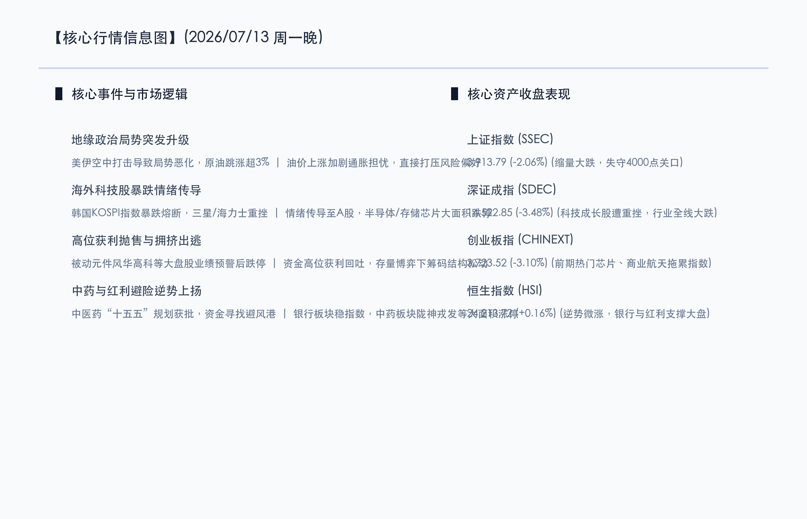

# 国产芯片遇海外风暴急跌，中药振兴规划引领避险，美伊博弈油价跳涨压制偏好

**日期：2026年07月13日 (星期一)** &nbsp; **时段：晚报 (常规交易日模式)**

> **核心摘要**：今日A股三大指数放量大跌，上证指数收盘失守4000点关口，创业板指重挫逾3.1%。地缘政治层面美伊空中冲突升级导致原油暴涨，加剧了市场对通胀和企业成本的担忧；同时韩国芯片巨头大跌引发情绪海啸传导，重创国内高拥挤度的存储芯片及算力板块。在此背景下，中医药“十五五”规划获批的利好继续发酵，中药板块逆势大涨，与红利避险的银行板块共同成为资金避风港。短期市场在半年报业绩预警大考前夕维持震荡分化，中长期向好格局未变。

## 核心行情复盘

今日A股市场呈现缩量下跌态势，三大指数低开低走，午后跌幅进一步扩大。全市场超4200只个股下跌，恐慌情绪有所蔓延。

*   **上证指数**：收盘报 **3913.79点**，下跌 **2.06%**。
*   **深证成指**：收盘报 **14,522.85点**，下跌 **3.48%**。
*   **创业板指**：收盘报 **3,723.52点**，下跌 **3.10%**。
*   **恒生指数**：收盘报 **24,213.72点**，微涨 **0.16%**。
*   **成交额**：沪深京三市合计成交额为 **2.8349万亿元**，较前一交易日缩量 **5760亿元**。

在板块表现上，呈现极端的防御与进攻切换：
*   **领涨行业**：中药板块全天强势，陇神戎发、天目药业、九芝堂等多只个股逆势涨停，成为全场瞩目的“避险圣地”；银行板块及煤炭等红利资产表现稳健，在普跌中起到了关键的护盘作用。
*   **领跌行业**：半导体、存储芯片及CPO等前期热门科技赛道跌幅居前，兆易创新、德明利等龙头股封死跌停；国防军工、商业航天等板块也遭遇大额资金净流出。

## 核心解读与市场逻辑

> **逻辑一：美伊冲突升温，油价暴涨压制成长股估值**
> 
> 周末至今日晨间，美伊空中军事冲突急剧升温，市场对中东能源通道（霍尔木兹海峡）的安全担忧重燃。WTI原油及布伦特原油在盘中跳涨超3%。能源成本走高加剧了全球通胀担忧，直接制约了主要央行的降息空间，导致全球权益市场特别是高成长、高估值板块的风险偏好受到明显压制。

> **逻辑二：韩国科技股巨震，存储与半导体高位筹码松动**
> 
> 今日韩国股市KOSPI指数在芯片龙头股大跌的影响下出现恐慌性重挫，三星电子与SK海力士股价大跌。这一半导体行业风向标的情绪波动，通过产业链联动迅速传导至A股。国内半导体和存储芯片板块前期涨幅较大，资金获利回吐需求强烈。在存量博弈的环境下，科技赛道遭遇了局部性的失血和拥挤踩踏。

> **逻辑三：业绩期“利好兑现”，避险资金拥抱红利与政策催化板块**
> 
> 7月中旬是中报业绩预警的强制披露期，市场对于“真业绩”的校验极为严苛。风华高科等被动元件龙头在业绩预告后遭遇“利好出尽”的跌停，极大地打击了题材股的追高热情。与之相对，国务院原则同意《中医药振兴发展“十五五”规划》的利好持续发酵，中药板块具备高壁垒和独特的消费属性，加之估值处于相对低位，迅速吸引了从科技流出的避险资金。

## 政策脉动

*   **流动性呵护**：央行今日开展了大额逆回购操作，以呵护税期及中报季的资金面，但存量博弈特征依然十分明显，增量资金流入步伐有所放缓。
*   **中报业绩强校验**：7月15日是A股中报业绩预告的强制披露截止日。监管层对中报财务真实性的高压态势，迫使资金加速从概念炒作题材向绩优红利及政策确定性板块切换。
*   **稀缺资源管制效应**：自7月起我国对氦气实施的临时禁止出口管制已正式生效。氦气作为半导体与航空航天的核心稀缺原料，其自主安全管控效应正在促使特种气体及新材料板块形成估值重估预期。

## 最新机构观点

*   **中信证券 (CITIC)**：**“拥挤筹码良性消化，中报验证期以绩优为盾”**。中信证券认为，今日大跌并非由于国内经济基本面发生恶化，而是由海外地缘局势和科技链情绪传导诱发的高位筹码踩踏。在7月15日业绩中报披露大考前夕，建议以“中报验证”为最核心抓手，一手坚守具有红利防御特征的银行与公用事业，一手逢低分批布局有业绩确定性支撑的国产算力链核心资产。
*   **中金公司 (CICC)**：**“高低切换渐入深水区，关注用电负荷与设备更新的交叉点”**。中金公司指出，全国用电负荷首创历史新高折射出AI智算中心等新质生产力对电力基础设施的强劲消耗。在市场普跌和科技赛道拥挤度释放的进程中，电网智能化升级、虚拟电厂及火电调峰等细分公用事业板块，兼具稳健现金流红利属性和政策强催化，是本轮调整中极为难得的弹性防线。
*   **高盛 (Goldman Sachs)**：**“维持中国资产超配评级，短期波动不改长线科技自主逻辑”**。高盛发表评论指出，虽然韩国存储半导体巨震引发了亚洲科技板块的短期调整，但全球AI技术革新与国内科技自主可控大趋势不可逆转。高盛看好下半年中国股市在国家政策托底下的结构性机会，短期调整反而为半导体设备、核心材料等自主可控关键领域的龙头股提供了中长期的低吸机会。

## 今日市场情绪：惊涛拍岸，药香御风

在本轮由海外科技海啸与地缘政治战火引发的红盘退潮中，A股市场宛如经历了一场风雨交加的洗礼。然而，在科技狂飙短暂失速、芯片枯叶纷飞的深秋寒意中，中华传统药香的缕缕温情与银行红利的坚实臂膀，构筑了资金最温暖的避风港湾。在狂暴的数字风浪面前，政策暖风带来的“十五五”中药振兴规划如同一尊古朴的中药瓷鼎，不仅护佑着资本在巨震中求得安宁，更昭示着传承与创新双轮驱动的长远宏图。惊涛骇浪终将退去，在深邃的原油烈焰背景下，避险的资金正沿着这缕中药清香与红利堤坝，重塑理性的资本防线。

> Prompt: Surrealism style, Subject: A massive traditional Chinese medicine porcelain pot filled with glowing green herbs and golden coins, acting as a stable shield against a raging red storm of digital circuits and falling silicon wafers. Background: In the deep background, a massive oil barrel is engulfed in crimson flames, casting a dramatic glow on the scene. No humans. No text., masterpiece, high detail, intricate composition, cinematic lighting, 8k resolution

---

免责声明：内容仅供参考，不构成投资建议。
