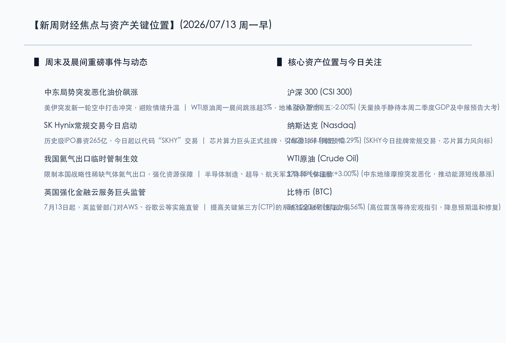

# 战火惊雷点燃地缘避险，芯片巨星挂牌闪耀算力，多空博弈静待宏观大考

**日期：2026年07月13日 (星期一)** &nbsp; **时段：早报 (新周展望模式)**

> **核心摘要**：周一晨间，全球市场在突发的宏观地缘大考与历史性科技挂牌的拉扯中开启新的一周。中东地区突发美伊空中冲突升级，地缘避险情绪闪电重燃，推动 WTI 原油晨间跳涨超 3% 突破 73 美元关口。与此同时，募资总额高达 265 亿美元的全球半导体巨头 SK Hynix 今日正式在纳斯达克启动常规交易（代码：SKHY），再度成为全球 AI 算力硬件产业链的信心标杆。在国内市场，周五 3.4 万亿天量洗牌后，本周将迎来二季度 GDP 与中报预告强制披露的终极验证，市场多空博弈步入“真金白银”的价值厘清期。

## 周末财经要闻终极汇总

周末到今日晨间，全球宏观及行业层面出现一系列重大边际变化，将直接主导新一周市场的开盘走势。

### 1. 中东局势骤然恶化美伊空中冲突，原油晨间跳涨超 3%
> **事件原因与核心解读**：周一清晨，美军与伊朗军队突发新一轮空中袭击冲突，霍尔木兹海峡地缘安全风险再度爆表。大宗商品市场对此做出强烈反应，WTI 原油、布伦特原油在开盘后迅速跳涨逾 3%，短期内将地缘溢价拉满。原油作为工业之母，其价格的超预期暴涨不仅直接利好石油化工、油服开采等防守板块，亦可能通过能源端向全球传递通胀压力，进而对美联储的下半年降息节奏产生微调影响，促使全球资金短线涌向避险通道。

### 2. SK Hynix 今日挂牌常规交易，全球 AI 算力迎来超级风向标
> **核心解读与市场洞察**：作为美国历史上最大规模的外国企业 IPO，韩国存储芯片巨头 SK Hynix 募资高达 265 亿美元。在经历上周五“发行前交易”（SKHYV）暴涨 12.8% 并创下 168.01 美元收盘纪录后，今日（周一）将以代码 “SKHY” 开启常规交易。市场普遍将此次挂牌视为衡量全球 AI 硬件建设景气度是否延续的试金石。若常规首交易日表现强劲，将强力稳固全球半导体、服务器及光模块等硬科技资产的估值基座，对国内算力产业链同样构成情绪指引。

### 3. 两部门对氦气实施临时管制正式落地，战略稀缺资源重获定价
> **事件原因与市场洞察**：商务部及海关总署此前发布的对战略稀缺气体“氦气”实施临时禁止出口的政策于本月正式运行。由于氦气在半导体先进制程、超导磁体、航天军工领域是绝对不可替代的稀缺原料，且国内资源具备强依赖性，此番管制生效促使市场对特种气体与战略小金属国产化的景气预期达到顶峰。相关特种气体制造与提纯龙头、半导体核心材料股在新一周将获得极强的防御性溢价。

### 4. 英国实施金融云服务直管新规，加强关键第三方韧性
> **核心解读与事件背景**：7 月 13 日起，英国金融监管局（FCA）、英格兰银行等正式对 AWS、谷歌云、微软和甲骨文等“关键第三方（CTP）”实施直接监管。这一罕见举措旨在降低金融系统由于高度依赖单一云巨头而面临的系统性崩溃风险。此举意味着全球科技巨头在金融领域的服务将面临更加严苛的合规审计，短期内虽然提升了巨头的运营合规成本，但长远来看也加速了全球混合云与私有云防线建设，有利于数字基建安全的深层发展。

## 新一周市场核心博弈逻辑

> **博弈点 A：中东地缘冲突二次重燃，大宗商品与能源红利能否成为防守新主力？**
>
> 随着周一晨间美伊空中打击引发油价剧烈跳涨，地缘政治冲突从隐性压制变为了显性催化。在 A 股天量洗牌后，市场防御性资金将视油服、煤炭、电力等红利资产为天然的避难所。本周资金博弈在于：如果地缘紧张局势持续，资源主线是否会从题材性炒作演变为持续性的估值重构，从而压制成长股的短期表现。

> **博弈点 B：SK Hynix 常规交易开启，半导体硬科技是否能顶住中报验证大考？**
>
> SK Hynix 今日在美股常规挂牌表现，对于因上周五筹码拥挤而大幅调整的国内半导体芯片股具有关键的信心修复作用。目前处于中报业绩大考（7 月 15 日截止）前夕，博弈的核心在于资金能否基于 SK Hynix 的良好走势重新流入具备明确业绩预增支撑的国产芯片设计、算力设备龙头，从而推动科技主线展开“去粗取精”的二次反弹。

> **博弈点 C：超级数据周压境，国内 GDP 成绩单如何倾斜红利与成长的平衡？**
>
> 本周三（7月15日）中国第二季度 GDP、社零和工业数据将集中公布，同时也是中报预警强制披露截止日。这是一次真正意义上的宏观与微观“双重大考”。如果宏观数据展现韧性，资金或将重回新质生产力的成长方向；若数据偏温和，则高现金流、稳健收益的低波资产将继续担当仓位底盘，市场呈现高低切换的均衡博弈。

## 本周重磅经济数据与会议前瞻

*   **周一（7月13日）**：
    *   **SK Hynix 挂牌常规交易首日启动**（代码：SKHY，测试全球半导体板块买盘强度）。
    *   **我国氦气出口临时管制落地效应发酵**（战略特种气体等概念板块开盘测试）。
*   **周三（7月15日）**：
    *   **国家统计局公布中国二季度 GDP、6月社零及工业增加值等重磅数据**（决定国内资产中期风险偏好与估值确认）。
    *   **中国 A 股中报业绩预告强制披露截止日**（检验“真业绩”的关键分水岭，防范中报业绩爆雷）。
*   **周四（7月16日）**：
    *   **长鑫科技等超级大盘股打新进程及市场流动性扰动**（关注资金分流效应）。
    *   **A 股 41 家公司解禁高峰期**（总市值约 528 亿元，关注局部筹码压力）。
*   **周五（7月17日）**：
    *   **世界人工智能大会 (WAIC 2026) 在上海正式开幕（至7月20日）**（聚焦 AI 大模型、具身智能及智算基础设施落地）。

## 头部券商/投行开盘策略点睛

*   **中信证券 (CITIC)**：**“地缘阴雨扰动情绪，以业绩确定性守望真成长”**。中信证券分析，今日晨间的中东局势恶化增加了全球市场的波动率，资金回流红利避险的短期趋势明显。然而，在新的一周，中报业绩强制预告截止才是真正的分水岭。建议投资者将防线收缩至中报业绩明确超预期、且受益于国产自主化提速的国产算力硬件、芯片设备，以业绩确定性防御地缘大考。
*   **中金公司 (CICC)**：**“AI 景气底座稳固，关注稀缺资源管制的估值重塑”**。中金公司点评认为，SK Hynix 的常规交易挂牌是全球硬科技产业链的里程碑。即便国内市场经历短期剧烈洗牌，AI 的 Capex 景气度依然向上。此外，氦气限制出口和英国 CTP 新规强化了“产业链安全”主线。建议重点配置国产特种气体、混合云安全软硬件以及业绩具备强韧性的公用事业龙头。
*   **华泰证券 (Huatai Securities)**：**“高低切换中守卫能源与安全，防守反击聚焦低位红利”**。华泰证券指出，原油大涨给上周天量流出的资金指明了防守方向，油服和石油化工等能源资产开盘将迎资金拥抱。在二季度 GDP 落地前，操作上应保持理性，超配高分红、受外部扰动小的低位中药与公用事业板块，静待大考落地后再开启成长反攻。

## 今日市场情绪：战火惊雷，硅月腾空

今日全球市场呈现出“战火惊雷与硅月腾空”的魔幻共振。一边是中东骤然升起的硝烟，将沉睡的黑金推向波涛汹涌的高位，避险惊雷在金融夜空回荡；另一边，大洋彼岸的算力巨轮以无可比拟的体量正式扬帆，晶圆的微光宛如明月腾空，强力指引着全球AI硬件链的航向。伴随着国家对战略稀缺气体的安全管制落地，新一周的资本潮水在宏观风雨中踏上探寻真相的旅程，理性的堤坝与科技的星辰正并肩前行。

> Prompt: Surrealism style, Subject: A massive glowing silicon chip with intricate gold circuits floats stably above a turbulent sea of dark crude oil. Around the chip, floating transparent glass spheres enclosing glowing blue helium gas drift like protective beacons. Background: In the deep background, jagged red lightning strikes down from heavy storm clouds, illuminating the scene. No humans. No text., masterpiece, high detail, intricate composition, cinematic lighting, 8k resolution

---

免责声明：内容仅供参考，不构成投资建议。
