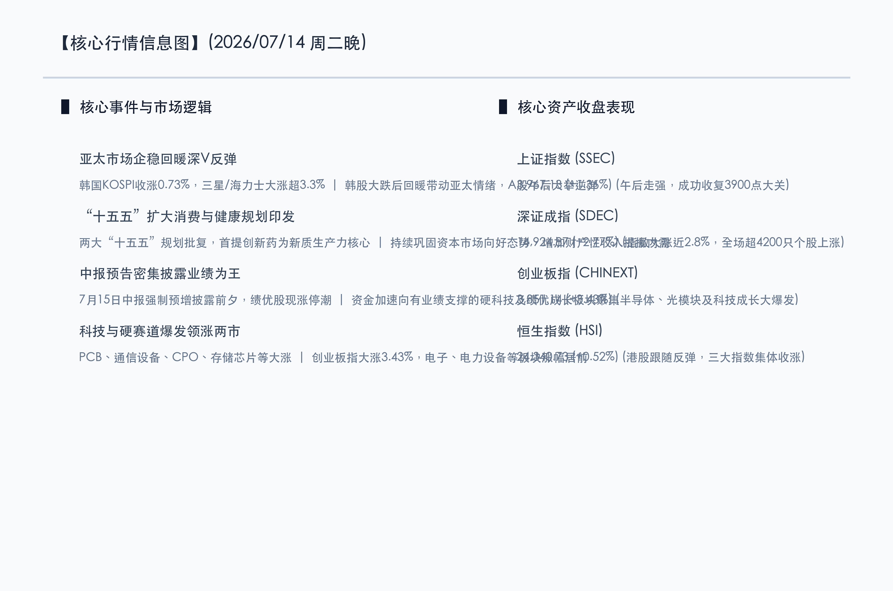

# 亚太回暖深V反弹力挽狂澜，双“十五五”规划强力提振，硬科技全面爆发信心重归

**日期：2026年07月14日 (星期二)** &nbsp; **时段：晚报 (常规交易日模式)**

> **核心摘要**：今日A股市场探底回升，午后在亚太市场企稳、尤其是韩国股市强劲反弹带动下走出气势如虹的“深V”大反转行情，三大指数集体大涨，上证指数收复3900点，创业板指飙升逾3.4%。宏观层面上，国务院同日批复《扩大消费“十五五”规划》与印发《国民健康“十五五”规划》，双重政策红利强力提振市场信心，首次将创新药提升至新质生产力核心地位。资金面加速流向有业绩支撑的硬科技及绩优成长板块，全市场超4200只个股红盘，市场恐慌情绪得到彻底清洗，信心强势收复。

## 核心行情复盘

今日国内市场呈现极具爆发力的“深V”大反弹态势。早盘受海外科技走弱阴影笼罩，指数一度探底，但午后做多动能汹涌喷薄，多头展开猛烈反攻。全市场个股呈现普涨格局，超4200只个股收红，市场人气急剧凝聚。

*   **上证指数**：收盘报 **3967.13点**，上涨 **1.36%**。
*   **深证成指**：收盘报 **14924.87点**，上涨 **2.77%**。
*   **创业板指**：收盘报 **3851.14点**，暴涨 **3.43%**。
*   **恒生指数**：收盘报 **24340.73点**，上涨 **0.52%**。
*   **成交额**：沪深京三地合计成交额约为 **2.72万亿元**，较前一交易日微幅缩量 **1149亿元**，但在反弹中承接力度极强。

*   **领涨行业**：科技成长与先进制造板块气势如虹。中报业绩大幅预增的PCB（印制电路板）、通信设备、CPO（光模块）及存储芯片板块大掀涨停潮；有色金属、稀土永磁及电力设备板块也表现强劲，吸引主力资金大举回流。
*   **领跌行业**：仅航天军工、互联网、游戏、影视院线及软件板块表现低迷，跌幅居前。

## 核心解读与市场逻辑

> **逻辑一：亚太市场情绪回暖，半导体巨头暴力反弹吹响集结号**
> 
> 韩国股市KOSPI指数在历经昨日深度大跌的“黑色星期一”恐慌后，今日早盘一度跌超5%并触发KOSDAQ熔断，但午后在三星电子（+3.34%）与SK海力士（+3.69%）等芯片权重股强劲买盘涌入下直线拉升，收涨0.73%。亚太半导体的深V企稳极大地回暖了亚太市场情绪，并迅速传导至A股，成为午后硬科技板块大爆发的强力引信。

> **逻辑二：双“十五五”规划重磅落地，定调消费健康双轨增长**
> 
> 国务院同日批复《扩大消费“十五五”规划》与印发《国民健康“十五五”规划》，向市场注入强大的长期政策红利。消费规划明确提出“持续巩固资本市场稳中向好态势，多渠道增加城乡居民财产性收入”；健康规划则首次将“全链条支持创新药和医疗器械发展与应用”提升至新质生产力核心地位。这对于消费与医药板块形成了长效的估值支撑，重塑了长线资金的政策确定性信心。

> **逻辑三：中报业绩披露大考前夕，业绩预增个股提供核心“安全锚”**
> 
> 7月15日是中报业绩预警的强制披露截止日。在短线多空博弈白热化的阶段，大量发布业绩超预期（预增、扭亏）公告的绩优龙头股成为了市场的风向标，出现大面积涨停。这向市场传达了清晰的信号：资金正加速向有业绩支撑的硬科技及绩优成长板块聚集，业绩确定的“真成长”成为了大盘走出深V的核心基石。

## 政策脉动

*   **宏观政策定力**：高层强调要保持高质量发展战略定力，加大逆周期调节力度，用好存量政策并储备增量政策，以巩固经济稳中向好态势。
*   **健康产业重磅升级**：《国民健康“十五五”规划》将创新药和医疗器械研发应用提升至新质生产力核心地位，医药生物产业链迎来里程碑式估值重塑契机。
*   **促消费中长期目标明确**：《扩大消费“十五五”规划》设定了到2030年社会消费品零售总额达60万亿元左右的目标，并特意强调通过维护资本市场稳健运行来增厚居民财产性收入，体现出政策对资本市场与实体消费良性互动的深层次考量。

## 最新机构观点

*   **中金公司 (CICC)**：**“回调过度释放悲观，中报业绩期坚守高景气”**。中金公司认为，前期的剧烈调整主要受外部地缘政治冲突以及海外科技股波动的局部影响，属于过度反应。随着中报强制预告窗口即将结束，市场关注点将全面回归企业基本面。建议投资者坚守具有业绩确定性、政策强支持的细分方向，科技成长板块的中期慢牛逻辑并未改变。
*   **中信证券 (CITIC)**：**“风险偏好迎来修复，科技成长仍是中期主线”**。中信证券指出，今日的大幅反弹确立了市场由恐慌向理性的回归。在风险偏好修复与产业趋势共振的阶段，科技成长（如国产算力、PCB及先进半导体）仍是中报季后的核心资产配置方向，板块轮动活跃提供了良好的波段操作机会。
*   **高盛 (Goldman Sachs)**：**“中国资产超配评级未变，业绩溢价将进一步凸显”**。高盛发表评论指出，尽管亚太市场近期波动较大，但全球人工智能基建开支与国内半导体国产化大趋势并没有发生改变。随着A股半年报披露展开，拥有坚实利润支撑和关键技术突破的“绩优成长股”将享有更明显的估值溢价，短期波动反而是长线资金极好的配置良机。

## 今日市场情绪：惊蛰回温，凤舞九天

在经历了昨日科技退潮、芯片枯叶纷飞的萧瑟寒意后，今日的A股市场如同春雷乍惊，上演了一场酣畅淋漓的深V逆袭。海外科技海啸的恐慌余波在午后烟消云散，取而代之的是金色凤凰般涅槃崛起的做多热浪。在“十五五”规划的浩荡东风与中报业绩的坚实盾牌护航下，资金如潮水般涌回硬科技主战场。这不仅是点位上的强势收复，更是理性与信心的胜利回归。当深色的数字风暴退去，在璀璨的V型光芒映照下，机械凤凰振翅高飞，洒下璀璨的科技星芒，昭示着中国资本市场在传承与创新的双轨驱动中，正开启新一轮的破茧腾飞。

> Prompt: Subject: A colossal, glowing mechanical phoenix made of polished gold and green printed circuit boards, soaring upwards and scattering sparkling emerald dust. Background: In the background, a massive digital V-shaped light beam rises from a futuristic, high-tech cityscape, cutting through dark storm clouds to reveal a starry night sky. No humans. No text.

---

免责声明：内容仅供参考，不构成投资建议。
