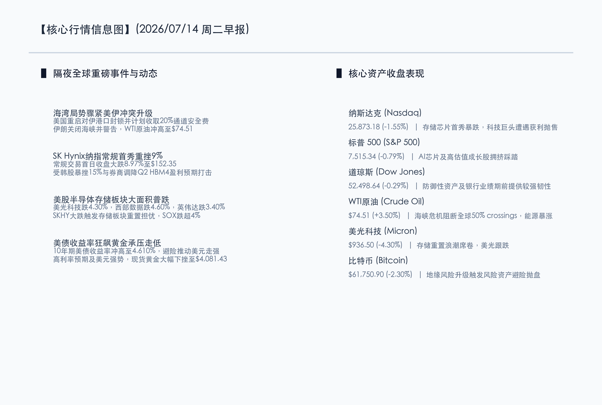

# 纳指失速存储板块遭遇寒潮，海湾狂飙油价冲高避险重燃，A股承压静待数据检验

**日期：2026年07月14日 (星期二)** &nbsp; **时段：早报 (常规交易日模式)**

> **核心摘要**：隔夜全球市场大震荡，美伊空中冲突导致霍尔木兹海域航运陷入危机，原油价格大涨3.5%突破74.5美元，推升全球通胀隐忧与美债收益率狂飙，从而对科技股的风险偏好构成压制。同时，SK海力士（SKHY）在美国纳斯达克常规交易首秀暴跌8.97%至$152.35，引发了半导体存储产业链的“估值重置”恐慌，美股半导体赛道全线重挫。在国内方面，A股在经历周一的大跌后，周二开盘将直面外部情绪寒冬与周三二季度GDP大考的双重检验，短期资金将进一步收缩战线，红利防御属性凸显。

## 核心行情复盘

隔夜海外市场全线收跌，芯片股大跌拖累纳斯达克指数，避险资金加速回流美元及大宗能源。

*   **纳斯达克指数**：收盘报 **25,873.18点**，下跌 **1.55%**。
*   **标普 500 指数**：收盘报 **7,515.34点**，下跌 **0.79%**。
*   **道琼斯指数**：收盘报 **52,498.64点**，下跌 **0.29%**。
*   **SK Hynix (SKHY)**：收盘报 **152.35美元**，大跌 **8.97%**。
*   **WTI原油**：收盘报 **74.51美元/桶**，上涨 **3.50%**。
*   **伦敦现货黄金**：收盘报 **4,081.43美元/盎司**，大跌约 **1.20%**，受美债收益率和美元走强双重压制。
*   **10年期美债收益率**：收盘报 **4.610%**，大幅走高。
*   **比特币 (BTC)**：收盘报 **61,750.90美元**，下跌约 **2.30%**。

在板块及核心个股方面：
*   **领跌板块（美股）**：半导体及存储器板块惨遭重创，费城半导体指数（SOX）大跌超 4%。美光科技（MU）下跌 4.30%，收于 $936.50；西部数据（WDC）下跌 4.60%，收于 $555.55；AI 龙头英伟达（NVDA）大跌 3.40%，收于 $203.40，反映出市场对 AI 基础设施建设资本支出的过度集中有所担忧。
*   **防守板块（美股）**：银行、传统公用事业等价值和高股息资产在美股财报季前表现出较强韧性，限制了道琼斯指数的下行空间。

以下为核心行情信息图：

## 核心解读与市场逻辑

> **逻辑一：美伊冲突与封锁危机升级，原油跳涨推升全球“再通胀”隐忧**
> 
> 隔夜中东局势再生巨变，美国宣布重启对伊朗港口的军事封锁，并威胁要对经霍尔木兹海峡的全部商船征收20%的安全通道费，伊朗随即发出强硬反制并宣布局部关闭海峡。受此影响，霍尔木兹海域航运 crossings 数量断崖式下跌52%，WTI原油价格冲高至$74.51。原油作为通胀的领先指标，其价格的非理性飙升将直接增加欧美企业的生产与运输成本，加剧全球通胀反复风险，从而推升美债收益率，制约美联储的政策转向空间，给全球成长股估值套上枷锁。

> **逻辑二：SK Hynix首秀惨遭“破发式”踩踏，存储板块触发景气度重估**
> 
> 韩国芯片巨头 SK海力士 在纳斯达克正规代码“SKHY”常规交易首日跌幅达 8.97%，其根源在于韩国本土市场先行崩盘 15% 的情绪映射。某韩系知名券商下调了海力士第二季度的盈利预期，认为其核心的 HBM4 芯片出货进度慢于市场此前极其乐观的预期。这直接引发了全球资本对“AI硬件与存储半导体景气度见顶”的担忧，高拥挤度的存储、算力芯片赛道出现明显的获利了结与筹码踩踏，并连带重创美光、西部数据等同行。

> **逻辑三：美债收益率与美元双升，黄金“避险买盘”被高利率压制**
> 
> 尽管地缘战火升级，但黄金隔夜却录得明显跌幅，收盘下挫至$4,081.43。这一反常现象的背后，是美债10年期收益率飙升至 4.610% 以及美联储鹰派加息预期的抬头。由于原油上涨推高了未来的通胀预期，市场被迫重新定价高息环境的持续时间。无息资产黄金在强势美元与高美债收益率的夹击下遭遇流动性挤压，显示出当前宏观逻辑中“利率走势”对黄金价格的主导权高于单纯的短期地缘避险。

## 政策脉动

*   **地缘能源安全博弈**：海湾局势骤紧，美国对伊制裁加码和霍尔木兹海峡被局部封锁不仅扰动油价，亦使得全球主要经济体更急迫地推进能源及战略材料的本土化保障。
*   **中国二季度 GDP 大考临近**：周三国家统计局将公布二季度 GDP、社零及工业增加值等重磅宏观数据。在此之前，A股市场昨日出现缩量大跌，属于典型的避险筹码提前离场，以应对周三经济数据与中报业绩预警双重大考的底线验证。

## 最新机构观点

*   **高盛 (Goldman Sachs)**：**“高估值赛道迎来集中度出清，短期防御首选价值蓝筹”**。高盛指出，SK Hynix 纳指首日大跌并非代表 AI 产业浪潮的终结，而是对前期极其拥挤且偏高的半导体估值的一次合理重置。在当前油价飙升、美债收益率破 4.6% 且通胀隐忧再起的宏观环境下，高盛建议投资者在第三季度财报季到来前，战略性降低对科技股的集中配置，将资金向具备坚实分红基础的公用事业与传统银行股等价值蓝筹进行防守型配置。
*   **摩根士丹利 (Morgan Stanley)**：**“海湾冲突重构供应链风险，通胀回潮压制成长股天花板”**。摩根士丹利认为，美伊冲突升级直接推升了原油的地缘溢价，使得大宗商品价格短期维持高位，这对三季度的全球降息预期带来了实质性的边际打击。在高利率将维持更长时间的基准假设下，成长股的估值天花板已被明显压低，建议在组合中超配传统能源（石油、煤炭）与低波红利资产，以抵御宏观流动性风险。
*   **中信证券 (CITIC)**：**“海外海啸冲击A股情绪，以真业绩与红利守卫底仓”**。中信证券表示，隔夜美股半导体及海力士的暴跌，势必会对今日A股开盘的芯片及算力板块带来承压。在周三 GDP 重磅宏观数据公布以及中报强制披露截止日前，市场面临微观与宏观的双重验证。建议投资者切勿盲目抄底高位成长股，应当以大盘红利蓝筹（如银行、电力、煤炭）和政策支持明确的防御性中药板块作为底仓，静待情绪释放完毕。

## 今日市场情绪：冰火交织，沙漏倾覆

今日市场展现出极端的“冰火交织与沙漏倾覆”格局。一边是中东霍尔木兹海峡上空盘旋的硝烟，正化作滚烫 of 黑金涌入大宗市场，引燃资产避险的熊熊烈火；另一边，则是代表科技之巅的纳指与芯片巨星，在一场关于业绩与估值的重置寒潮中高位陨落，微光的芯片在熔岩般的黑金洪流中渐显暗淡。宏观利率的高企与地缘摩擦的突发，正促使资本的沙漏加速倒流，从科技的星空撤回理性的深渊。

> Prompt: Surrealism style, Subject: A giant, cracked hourglass made of cold chrome and silicon. Instead of sand, thick dark crude oil is slowly flowing down, partially burying a falling, glowing digital chip. The oil forms turbulent waves on the ground. Background: In the deep background, jagged red and orange lightning strikes down from heavy storm clouds, illuminating a stormy horizon. No humans. No text., masterpiece, high detail, intricate composition, cinematic lighting, 8k resolution

---

免责声明：内容仅供参考，不构成投资建议。
