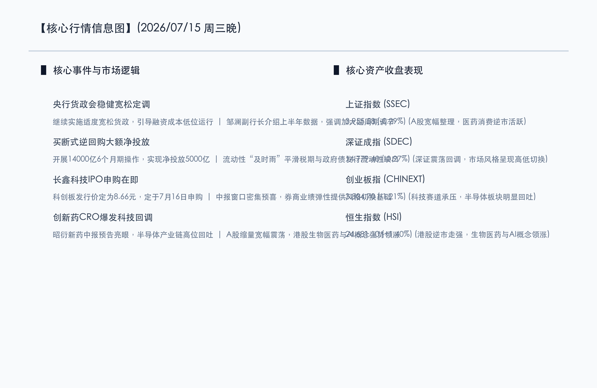

# 政策流动性“及时雨”呵护平稳，创新药CXO双击爆发，科技成长高位整固

**日期：2026年07月15日 (星期三)** &nbsp; **时段：晚报 (常规交易日模式)**

> **核心摘要**：今日A股市场震荡整固，三大指数均有所整理，但盘面结构性热点活跃。中国人民银行下午重磅定调继续实施适度宽松货币政策，并在公开市场净投放5000亿元流动性，对税期与政府债发行流动性形成“及时雨”式护航。盘面上，生物医药（创新药、CXO）板块在利好业绩预告和政策预期下迎来爆发，港股恒生指数逆势大涨1.40%；前期大涨的半导体产业链则出现高位获利回吐。市场在缩量整理中完成健康的高低切换。

## 核心行情复盘

今日国内市场呈现分化的整固态势。科技芯片等高位板块出现自然的回调，但医药消费等板块逆势大涨护盘，两市个股涨跌互现。

*   **上证指数**：收盘报 **3955.58点**，下跌 **0.29%**。
*   **深证成指**：收盘报 **14779.40点**，下跌 **0.97%**。
*   **创业板指**：收盘报 **3804.70点**，下跌 **1.21%**。
*   **恒生指数**：收盘报 **24681.10点**，大涨 **1.40%**。
*   **成交额**：沪深两市合计成交额约为 **2.59万亿元**，较前一交易日缩量约 **1300亿元**，市场在反弹高位呈现缩量盘整。

*   **领涨行业**：医药生物板块爆发，创新药、CXO（合同外包服务）、医疗服务等涨幅居前，昭衍新药中报预告超预期领涨。此外，白酒、游戏、影视院线及大金融（中资券商）板块表现活跃。
*   **领跌行业**：半导体产业链集体调整，存储芯片、先进封装及半导体设备跌幅较大，有色金属、油气开采、贵金属及培育钻石板块遭遇回调。

## 核心解读与市场逻辑

> **逻辑一：央行半年货政会定调宽松，流动性“及时雨”精准呵护**
> 
> 国务院新闻办公室下午举行新闻发布会，央行副行长邹澜介绍上半年金融统计数据，明确将继续实施适度宽松的货币政策。同日，央行在公开市场开展14000亿元的6个月期买断式逆回购操作，实现大额净投放5000亿元。这及时平滑了7月中旬税期及政府债发行带来的流动性缺口，对市场流动性起到了平稳护航作用，重塑了资金对宏观政策稳定性的信心。

> **逻辑二：生物医药与CXO板块共振爆发，业绩与政策红利迎来双击**
> 
> 中报业绩预告强制披露期，以昭衍新药等为首的CRO龙头股发布了强劲的业绩预喜。同时，随着《中医药振兴发展“十五五”规划》和《国民健康“十五五”规划》的利好效应发酵，创新药和全产业链支持政策持续落地，将生物医药估值推升至高位。主力资金大举流入医药医疗板块避险，推动了恒生科技和生物医药板块的全面大涨。

> **逻辑三：科技股面临高位回吐，长鑫科技科创板IPO提供长期国产化支撑**
> 
> 经历前期的高歌猛进，以德明利、佰维存储等为首的存储及先进封装个股今日面临获利了结压力。但芯片板块的中长期国产化逻辑并未动摇。国产存储巨头长鑫科技科创板IPO发行价格今日定为8.66元/股，定于7月16日（明日）进行线上申购，其大体量募资上市将进一步提振产业链的协同创新与国产替代信心。

## 政策脉动

*   **宏观政策定力**：央行强调实施适度宽松的货币政策，加大逆周期和跨周期调节力度，确保社会综合融资成本稳步低位运行。
*   **创新药产业链长效支持**：《国民健康“十五五”规划》将全链条支持创新药研发与应用定调为新质生产力的核心。配套的药品目录扩容和商业健康保险等地方政策正加速落地，为医药企业注入长效信心。
*   **维护资本市场信心**：管理层重申通过保持资本市场稳健运行以增厚居民财产性收入，并稳妥推进中资券商大合并重组，提升实体经济与资本市场的正向良性互动。

## 最新机构观点

*   **中金公司 (CICC)**：**“调整已入尾声，中报绩优成长仍是中长期慢牛主线”**。中金公司认为，今日A股的盘整属于对前期大涨后的健康消化，市场整体震荡上行的核心逻辑并未改变。随着货政会明确继续适度宽松，外部降息预期升温，A股中长期性价比凸显，建议中报期坚守高景气和高确定性业绩方向。
*   **中信证券 (CITIC)**：**“风格高低切换合理，国产算力与先进封装中期逻辑未改”**。中信证券分析，今日半导体的回调更多是资金高低切换的防御性举措。尽管短期医药消费走强，但以AI芯片、先进封装、存储配套为核心的国产算力大趋势仍是下半年最核心的主线，短线调整反而是长线资金极好的配置窗口。
*   **申万宏源 (SGW)**：**“波段调整趋于收尾，耐心等待产业新催化”**。申万宏源表示，本轮科技与红利方向的结构性调整已较为充分。虽然收尾不等于立刻全面普涨，但筹码交换和业绩大考使优质资产脱颖而出。投资者应避免盲目追涨跌，建议耐心布局有真实业绩支撑的科技和消费行业。

## 今日市场情绪：百草吐芳，碧落春华

今日的A股与港股上演了一场精彩的“高低切换”乐章。在连续科技狂欢、芯片巨震后，市场的风向悄然转入百草芳菲的医药原野。如同一尊由温润翠玉雕琢而成的药鼎，在央行流动性“金液”的浇灌下，正绽放出璀璨的绿色生命藤蔓，代表着中国生物制药和创新药在政策暖风中恢复生机。即使背景中庞大复杂的半导体芯片红色网格在经历狂奔后进入短暂的冷却与休整，但也正在向这股绿色的新质生产力输送着科技的能量。这种调整不是退潮，而是春华秋实的孕育。金色的流动之光在天空中静静流淌，呵护着中国资本市场在传承、创新与坚守中，开出一朵温润而坚韧的春华之花。

> Prompt: Subject: A glowing green crystal alchemy crucible with glowing leafy vines and double-helix DNA patterns growing out of it, representing bio-medicine. Background: In the background, a giant semiconductor microchip grid dims down with cool blue and red circuits, transferring its energy to the crucible. A stream of glowing liquid gold flows from a floating golden orb in the sky, representing liquidity. No humans. No text.

---

免责声明：内容仅供参考，不构成投资建议。
