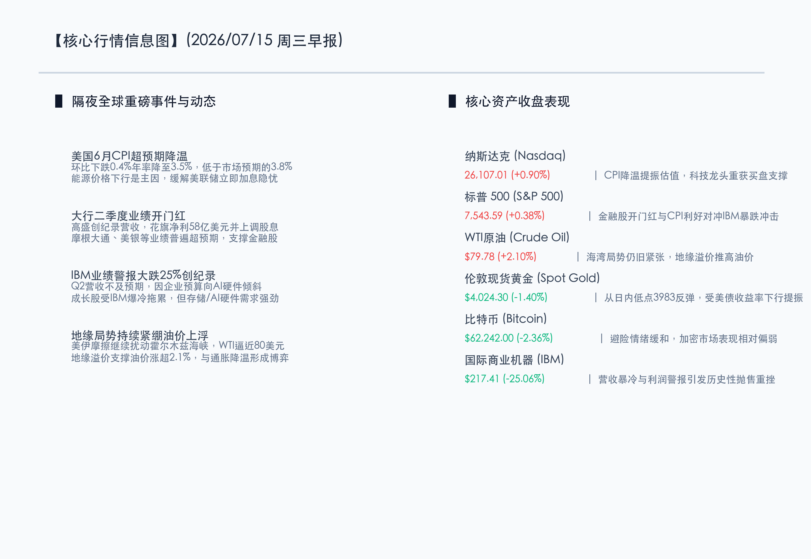
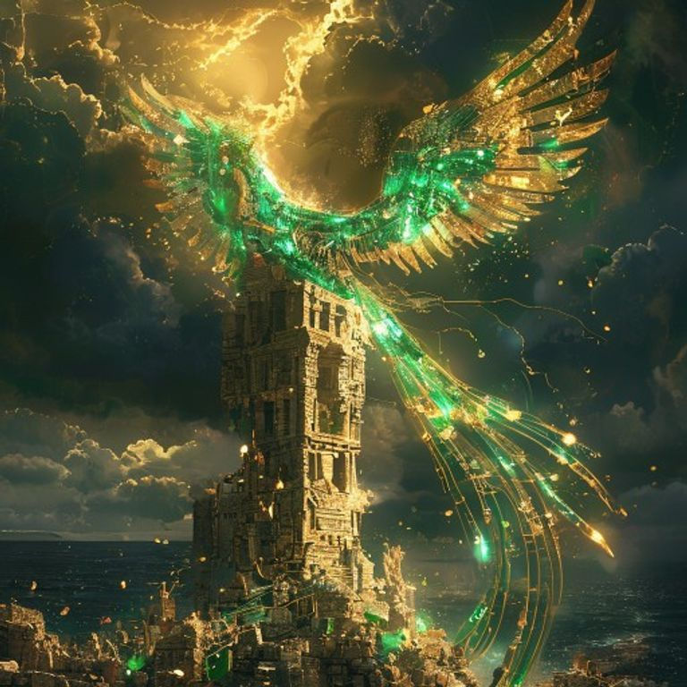

# 金羽重光AI硬件虹吸资金，温和CPI突围通胀阴霾，A股静待GDP大考检验

**日期：2026年07月15日 (星期三)** &nbsp; **时段：早报 (常规交易日模式)**

> **核心摘要**：隔夜全球市场在重磅利好与历史性爆冷的碰撞中震荡上行。美国6月CPI超预期回落至3.5%，环比下滑0.4%，显著缓解了美联储立即加息的宏观压力，推动美债收益率下行并刺激科技股走高。然而，传统科技巨头IBM因二季度业绩预警暴跌25.06%，创下历史性惨痛跌幅，揭示出企业预算正强力向AI服务器、存储和芯片等AI硬件领域倾斜的“虹吸效应”。与此同时，中东霍尔木兹海峡冲突持续紧绷，支撑WTI原油冲高至$79.78。国内方面，A股与港股在周二经历强劲反弹后，今日开盘将直面二季度GDP等核心经济数据的“期中大考”与海外IT支出的结构性变局。

## 核心行情复盘

隔夜美股三大股指涨跌互现，科技与金融板块合力托举，但IBM大跌拖累道指表现；大宗商品方面，黄金在美债收益率走低后筑底反弹，原油因地缘紧张情绪维持强势。

*   **纳斯达克指数**：收盘报 **26,107.01点**，上涨 **0.90%**。
*   **标普 500 指数**：收盘报 **7,543.59点**，上涨 **0.38%**。
*   **道琼斯指数**：收盘报 **52,508.27点**，上涨 **0.02%**。
*   **WTI原油**：收盘报 **79.78美元/桶**，上涨 **2.10%**。
*   **伦敦现货黄金**：收盘报 **4,024.30美元/盎司**，下跌 **1.40%**（受前一日高息压制，但已自日内低点$3,983显著回升）。
*   **10年期美债收益率**：收盘报 **4.580%**，下跌 **3.00个基点**。
*   **比特币 (BTC)**：收盘报 **62,242.00美元**，下跌 **2.36%**。
*   **国际商业机器 (IBM)**：收盘报 **217.41美元**，暴跌 **25.06%**。

在板块及核心个股方面：
*   **领涨板块（美股）**：半导体、AI硬件与算力基础设施板块表现强劲。得益于IBM财报中透露的“AI芯片与硬件支出暴增”逻辑，芯片股与服务器股获得资金重度加仓，前一日遭遇大跌的半导体存储与算力板块迅速修复。同时，高盛、花旗等大行由于Q2财报超预期大幅飘红，带动银行金融板块走强。
*   **领跌板块（美股）**：传统软件、IT基础设施服务和企业SaaS服务遭受重创。IBM的业绩暴冷引发了市场对传统IT咨询和非AI软件服务支出的担忧，导致多只传统科技股跟跌。

以下为核心行情信息图：

## 核心解读与市场逻辑

> **逻辑一：美国6月CPI超预期降温，估值“紧箍咒”阶段性松绑**
> 
> 美国6月CPI环比下降0.4%，年率回落至3.5%（前值4.2%），大幅低于市场预期的3.8%。通胀数据的大幅降温主要受前期能源价格走弱的滞后影响。该数据的出炉有力驳斥了市场的“恶性通胀飙升论”，美债10年期收益率应声回落至4.580%，从而给全球分母端（估值端）承压的科技成长股送来久违的及时雨。尽管短期原油再次冲高可能在中长期制造二次通胀风险，但至少在当下，美联储的偏鹰态度获得了阶段性缓和空间。

> **逻辑二：IBM爆冷暴跌25%与AI硬件虹吸效应的“硬道理”**
> 
> 传统蓝筹科技股IBM常规交易日暴跌25.06%，创下该公司历史上的单日最惨痛跌幅。其根本原因在于企业客户的IT资本支出结构发生了“剧烈且无情”的转变——企业在大力削减传统企业软件、系统集成及咨询预算，并将每一美分都砸向AI服务器、存储芯片（如SK海力士HBM）及AI算力芯片。这进一步证实了AI硬件对传统IT支出的“虹吸效应”依然极强。市场正快速剔除无法证明自己能从AI浪潮中兑现利润的传统科技股，转而将资金锁定在真正的AI底层硬件供应侧。

> **逻辑三：地缘政治紧绷与温和CPI的博弈，油价高位盘整**
> 
> 尽管6月通胀数据因为历史油价基数下行而降温，但隔夜WTI原油却在美伊霍尔木兹海峡局势的持续紧张中收涨2.10%至$79.78。霍尔木兹海域的运力受限制造了持续的“地缘溢价”，这与CPI降温所释放的宽松暖意形成博弈。高油价如果延续，将成为美联储抗通胀“下半场”的最大变数，也意味着虽然成长股估值获得喘息，但周期与抗通胀资产依然是高胜率的避险底仓。

## 政策脉动

*   **美联储降息预期重燃**：温和CPI出炉后，利率掉期市场对9月降息的概率定价重回60%以上。然而，多位Fed官员随后发声表态偏于谨慎，指出需观察地缘政治导致的能源波动是否会带来通胀反弹。
*   **中国二季度 GDP 今日出炉**：国家统计局将于今日公布二季度 GDP、社零和工业增加值等重磅数据。昨日（周二）A股与港股在科技与政策预期利好下走出强势深V反弹，上海综合指数收涨1.36%至3967.13点。今日市场将迎来核心宏观数据的硬核检验，数据强弱将直接决定昨日的“政策信心反弹”能否转化为新一轮的趋势性攻势。

## 最新机构观点

*   **高盛 (Goldman Sachs)**：**“IT支出面临结构性重置，超配AI核心硬件与强现金流金融”**。高盛指出，IBM的暴跌清晰指明了全球IT支出的风向。这并非科技行业的衰退，而是资金向AI硬件（芯片、AI服务器）集中配置的写照。在宏观利率因CPI降温而松绑的背景下，高盛建议精选AI硬件供应链中的龙头标的，同时超配在二季度财报季展现出强大盈利与派息能力的华尔街大行，进行均衡配置。
*   **摩根士丹利 (Morgan Stanley)**：**“温和通胀给多头以喘息，但不可低估油价高企的二次通胀威胁”**。摩根士丹利认为，3.5%的CPI是一个积极的信号，促使10年期美债收益率退守4.6%关口下方。但是，美伊在海峡的博弈使得油价极易冲破80美元关口，这将在未来数月传导至商品端。建议投资者借此轮反弹优化持仓，减配无利润支撑的高倍数软件股，超配高股息红利与传统能源资产，构建防守反击组合。
*   **中信证券 (CITIC)**：**“A股科技重回主线，静待GDP大考底线验证”**。中信证券表示，昨日A股在经历周一急跌后迎来强劲的深V修复，硬科技与双“十五五”规划利好板块全面爆发。今天A股将面临二季度GDP等重要数据的检验，同时海外IBM暴跌可能在情绪上对国内传统软件与应用SaaS板块构成波及。建议投资者在配置上紧扣“硬科技”（半导体、AI算力）与“防守红利”双主线，规避中报业绩可能不及预期的传统IT服务标的。

## 今日市场情绪：金羽重光，废墟余烬

今日市场情绪呈现出极具张力的“金羽重光与废墟余烬”画面。传统IT基础设施与软件巨头的倾覆如同一座古老而沉重的石塔在雷鸣中轰然崩塌，碎为瓦砾与余烬；而在那片由旧科技废墟升腾起的硝烟中，一只由黄金与翡翠般的电路构成的AI机械凤凰正扇动着耀眼的翅膀涅槃而起，它的光芒刺破了重重的阴霾。东方地平线上，随着CPI的降温，一轮灿烂的纯金朝阳正冉冉升起，驱散了暴风雨的雷电，预示着科技与资本正在完成痛苦而伟大的更迭。

> Prompt: Surrealism style, Subject: A magnificent, glowing mechanical phoenix made of polished gold and emerald-green circuits rises from the ruins of a cracked, crumbling stone tower. Background: In the sky, dark storm clouds part to reveal a brilliant golden sun that casts warm light. In the deep background, a stormy dark ocean is visible. No humans. No text., masterpiece, high detail, intricate composition, cinematic lighting, 8k resolution

---

免责声明：内容仅供参考，不构成投资建议。
