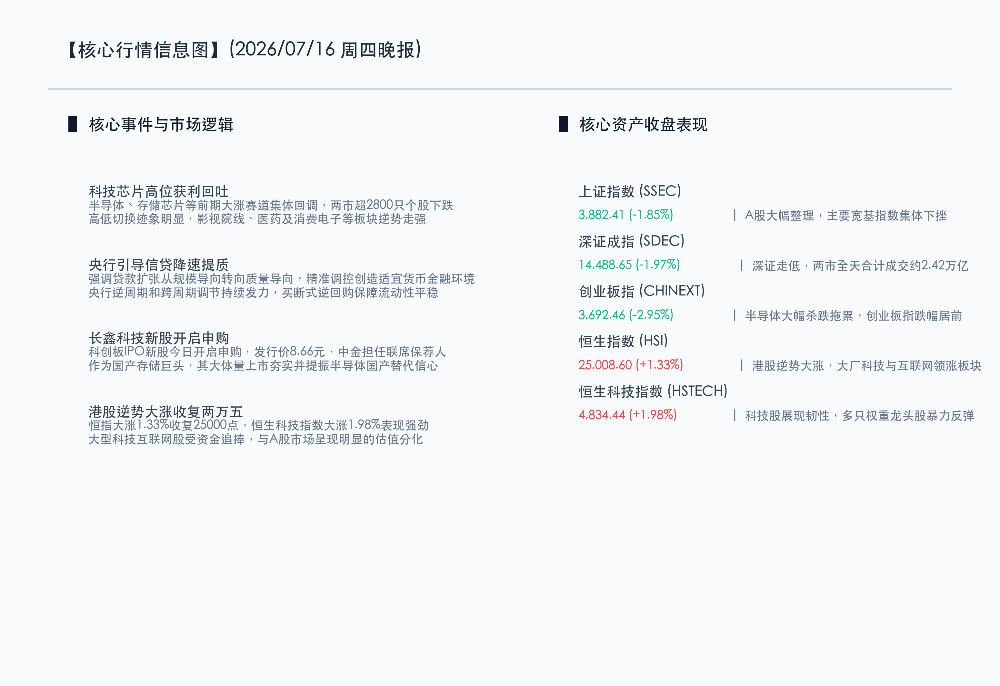

# A股科技巨震回吐两市大幅整理，港股逆势挺拔跨越二万五大关

**日期：2026年07月16日 (星期四)** &nbsp; **时段：晚报 (常规交易日模式)**

> **核心摘要**：今日国内A股市场迎来深幅回调，前期大涨的半导体及存储芯片等高位科技板块集体重挫，拖累大盘指数集体收跌，沪深两市成交总额缩量至约2.42万亿元。相反，港股展现极强韧性，恒生指数逆势大涨1.33%，收复25,000点整数关口。央行表态信贷降速提质为常态、高质量扩张成为主导，同时国产存储巨头长鑫科技今日正式申购，夯实了科技自强的中长期根基。

## 核心行情复盘

今日国内A股市场呈现较大幅度的震荡整理。前期领涨的科技芯片板块遭遇主力资金的高位获利回吐，导致指数全线下挫，但两市高低切换迹象显著，影视院线、医药及消费电子等低位板块逆势护盘。港股则大幅走高。

*   **上证指数**：收盘报 **3882.41点**，下跌 **1.85%**。
*   **深证成指**：收盘报 **14488.65点**，下跌 **1.97%**。
*   **创业板指**：收盘报 **3692.46点**，下跌 **2.95%**。
*   **恒生指数**：收盘报 **25008.60点**，大涨 **1.33%**。
*   **恒生科技指数**：收盘报 **4834.44点**，大涨 **1.98%**。
*   **成交额**：沪深京三市合计成交额约为 **2.42万亿元**，较前一交易日缩量约 **1700亿元**，显示资金在大幅回调中呈现一定的谨慎观望态度。

*   **领涨行业**：影视院线、医药、消费电子及AI应用等板块逆势走强，获得避险资金青睐。港股大厂科技股（如美团、腾讯、阿里等）强势反弹。
*   **领跌行业**：半导体产业链集体大跌，存储芯片、光刻机、先进封装及半导体设备跌幅居前。

## 核心解读与市场逻辑

> **逻辑一：科技高位大幅回吐引致A股深度整理，港股逆势收复两万五分化加剧**
> 
> 经历了前期连续大涨后，半导体及存储芯片等热门赛道在估值溢价背景下面临较强的获利回吐压力，叠加海外科技股调整情绪共振，促成今日A股的显著技术性盘整。与之相对，港股在前期调整更为充分，估值性价比突出，大厂科技股和互联网平台获得外资与南下资金的双重流入，推动恒生指数逆势跨越二万五重要关口，两地市场展现出精彩的估值分化与高低轮动。

> **逻辑二：央行重申信贷“降速提质”，流动性精细管理为高质量护航**
> 
> 针对宏观流动性，央行明确表态“贷款降速提质”正成为新常态，信贷扩张的重心从规模导向切换至质量和结构导向。在公开市场，央行通过买断式逆回购等创新型工具开展灵活调控，精准平抑税期流动性波动，在不搞大水漫灌的前提下，向市场注入稳定信心，确保实体融资成本处于合理低位。

> **逻辑三：存储巨头长鑫科技新股申购，科创板吸纳硬科技夯实产业长青**
> 
> 作为国产存储领域的标杆企业，长鑫科技于7月16日正式开启科创板申购，发行价8.66元，中金公司担任联席保荐。尽管今日半导体板块回调，但该标的的大体量资本化进程，有力彰显了“科创板八条”及大基金三期对核心“硬科技”领域的长期政策护航与资金供给，国产替代与供应链安全的长逻辑并未受到短期股价波动影响。

## 政策脉动

*   **防范金融风险与秩序重塑**：最高人民检察院7月16日通报，上半年共起诉职务犯罪1.4万人、金融诈骗及破坏金融管理秩序犯罪1.3万人，以法治力量坚决维护资本市场健康发展和居民财产性安全。
*   **信贷投放导向转变**：监管层引导银行金融机构淡化规模情结，促进贷款“降速提质”，把更多资源向高科技制造、绿色金融和中小微企业倾斜，推动社融与GDP名义增速智能匹配。
*   **硬科技上市绿色通道**：证监会持续推进“科创板八条”，对在国家关键核心技术领域取得突破的未盈利企业提供绿色通道，长鑫科技的顺利申购再次论证了这一导向。

## 最新机构观点

*   **中金公司 (CICC)**：**“科技获利回吐不改长牛底色，中报期优选高景气龙头”**。中金公司认为，今日A股半导体等科技赛道的回调属于健康性质的短期筹码出清，并不影响下半年自主可控和AI算力的大逻辑。在科创板重组改革提速、大基金三期落地的背景下，建议耐心等待中报绩优标的在盘整后的二次布局良机。
*   **中信证券 (CITIC)**：**“高低切换属于防御特征，恒指站上25000点标志着估值重构”**。中信证券表示，A股缩量整理而港股逆势走强，反映了全球资金对中国资产的高低切换配置。港股科技龙头极具性价比，是海外降息预期背景下出色的多头防线。短期内，A股以消费电子和医药进行避险是合理的，但科技制造的中期领头羊地位坚不可摧。
*   **国泰君安 (GTJA)**：**“信贷重质轻量大势所趋，红利绩优依然是安全边际”**。国泰君安指出，央行强调信贷“降速提质”标志着宽信用政策更注重定向支持，以往单纯靠贷款拉动规模的炒作已成过去。三季度行情仍以波段震荡为主，在科技波动期，建议聚焦中报超预期标的及低估值、高股息的电力、公用事业作为稳定防御。

## 今日市场情绪：金舟渡海，翠芯藏辉

今日的资本市场呈现出一幅宏大而富有禅意的“金舟渡海，翠芯藏辉”情绪画卷。一艘象征着香港股市的宏伟金色巨轮，风帆上流淌着璀璨 of 恒生指数网格，正乘风破浪在洒满月光的幽蓝数据之海中，昂首驶向远方，成功跨越了二万五千点的风波关口。而在天平的另一端，由翠绿电子线路编织的A股半导体芯片，在狂奔后静置于古铜色的天平之上，泛着静谧的微光，在降温中蓄积力量。天空上方，一轮巨大的银色满月静静悬挂，散洒下温柔而坚韧的流动性月华，呵护着整片数字海洋的平稳。这昭示着市场在冷热切换中实现精妙的平衡，静水流深，科技自强的基石正在沉淀，而价值的巨轮早已启航。

> Prompt: Surrealism style, Subject: A massive glowing golden scale. On one side of the scale, a cluster of green-glowing, cooling microchips is sinking down. On the other side, a majestic golden ship with glowing sails shaped like a digital HSI grid is rising, floating into a clear night sky. Background: In the background, a giant silver moon shines, illuminating a ocean of blue and gold data streams. No humans. No text., masterpiece, high detail, intricate composition, cinematic lighting, 8k resolution

---

免责声明：内容仅供参考，不构成投资建议。
